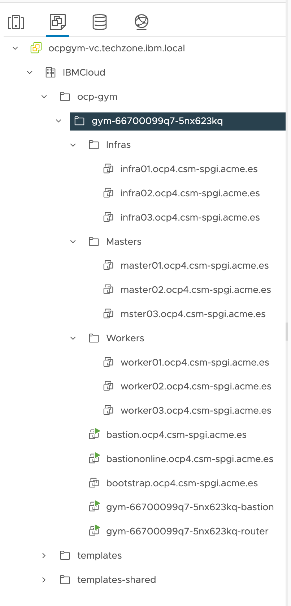

We need to create the following virtual machines in vCenter according to the following specs:

| **Type** | **Number of servers** | **vCPU** | **RAM Memory** | **Storage (system)** | **Storage (data)** |
|----------|-----------------------|----------|----------------|----------------------|--------------------|
|**Control Plane**         |3|8 vCPU|32 GB|300 GB|0 GB|
|**Infra**          |3|8 vCPU|32 GB|300 GB|0 GB|
|**Compute**    |3|16 vCPU|64 GB|300 GB|0 GB|
|**Storage**    |3|16 vCPU|64 GB|300 GB|500 GB|
|**Bootstrap**      |1|4 vCPU|16 GB|320 GB|0 GB|

And with the following nomenclature:

|**Type** |**FQDN hostname**|
|---------|-----------------|
|**Bootstrap**  |bootstrap.ocp4.platformengineers.xyz    |
|**Control Plane**     |controlplane01.ocp4.platformengineers.xyz     |
|               |controlplane02.ocp4.platformengineers.xyz     |
|               |controlplane03.ocp4.platformengineers.xyz     |
|**Infra**      |infra01.ocp4.platformengineers.xyz      |
|               |infra02.ocp4.platformengineers.xyz      |
|               |infra03.ocp4.platformengineers.xyz      |
|**Compute**    |compute01.ocp4.platformengineers.xyz     |
|               |compute02.ocp4.platformengineers.xyz     |
|               |compute03.ocp4.platformengineers.xyz     |
|**Storage**    |storage01.ocp4.platformengineers.xyz     |
|               |storage02.ocp4.platformengineers.xyz     |
|               |storage03.ocp4.platformengineers.xyz     |

You can create folders for the different type of VMs if you wish.

{: style="max-height:400px"}

You can review the process for creating the VMs in the section [Create the online bastion](#81-create-the-online-bastion-node).

{: style="max-height:600px"}

You need to configure the machines to boot from the ISO that was created in the previous chapter [Configure CoreOS ISO Maker in "online" bastion](#29-configure-coreos-iso-maker-in-online-bastion)

{: style="max-height:600px"}

{: style="max-height:600px"}

At the end, you should have the following VMs created in your vCenter

{: style="max-height:700px"}
