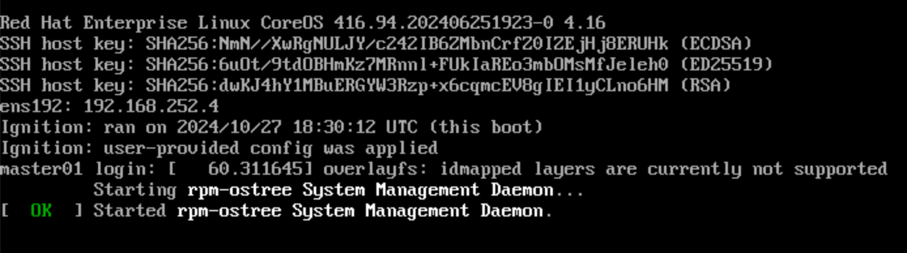
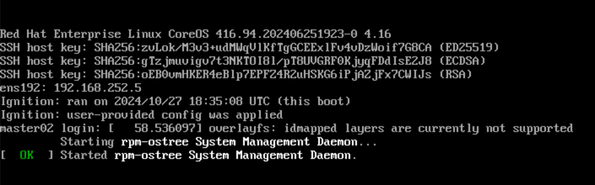

In order to get our OpenShift cluster deployed, we first need to start up the bootstrap node that will operate as a temporary control plane for the Control Plane nodes to join later.

### Control Plane Nodes

1. In your vCenter, start up the **bootstrap node**. Open the web console for this node in the vCenter so that you can interact with the ISO bootup menu. Remember, this is the bootup menu we have baked into the ISO with the ISO maker from the previous section. Select the bootstrap option from the bootup menu:

    {: style="max-height:250px"}
 
    Once the specific bootstrap configuration has been loaded on the machine, you should see the following login screen:

    {: style="max-height:250px"}

At this point, that temporary control plane node for the rest of the Contol Plane nodes to join has been created and started so that you can you can start the **control machines**.

!!! warning "Important"
    Remember to select the appropriate bootup option for the machine you will be starting up on the following steps.

1. Start the **controlplane01** machine:

    {: style="max-height:250px"}

    Make sure it starts up properly:

    {: style="max-height:200px"}
 
1. Start the **controlplane02** machine:

    {: style="max-height:250px"}

    Make sure it starts up properly:

    {: style="max-height:200px"}
 
1. Start the **controlplane03** machine:

    {: style="max-height:250px"}

    Make sure it starts up properly:

    {: style="max-height:200px"}

1. Access the offline bastion:

    ```{ .text .copy title="[root@bastion ~]"}
    ssh root@192.168.252.23
    ```

1. Go to `/root/registry/downloads/` to kick off the wait for the bootstrap to complete command:

    ```{ .text .copy title="[root@bastion ~]"}
    cd /root/registry/downloads/
    ```

1. Kick off the wait for the bootstrap to complete command:

    ```{ .text .copy title="[root@bastion downloads]"}
    openshift-install wait-for bootstrap-complete --dir=/root/registry/downloads/tools/ocp4 --log-level=debug
    ```

    If the bootstrap of the control plane nodes for your OpenShift cluster has completed correctly, you should see the following ouput:

    ```{ .text .no-copy title="Output" hl_lines="19 20"}
    DEBUG OpenShift Installer 4.16.9
    DEBUG Built from commit 194f806390b2b20668f5ac32d7918f9773b29a5e
    INFO Waiting up to 20m0s (until 9:53AM) for the Kubernetes API at https://api.ocp4.platformengineers.xyz:6443...
    DEBUG Loading Agent Config...
    INFO API v1.25.11+1485cc9 up
    DEBUG Loading Install Config...
    DEBUG   Loading SSH Key...
    DEBUG   Loading Base Domain...
    DEBUG     Loading Platform...
    DEBUG   Loading Cluster Name...
    DEBUG     Loading Base Domain...
    DEBUG     Loading Platform...
    DEBUG   Loading Networking...
    DEBUG     Loading Platform...
    DEBUG   Loading Pull Secret...
    DEBUG   Loading Platform...
    DEBUG Using Install Config loaded from state file
    INFO Waiting up to 30m0s (until 10:03AM) for bootstrapping to complete...
    DEBUG Bootstrap status: complete
    INFO It is now safe to remove the bootstrap resources
    DEBUG Time elapsed per stage:
    DEBUG Bootstrap Complete: 1m48s
    INFO Time elapsed: 1m48s
    ```

    !!! tip
        If the previous command **fails or takes too long**, you can do the following to troubleshoot/debug:
    
        ```{ .text .copy title="[root@bastion ~]"}
        ssh core@bootstrap.ocp4.platformengineers.xyz
        ```

        Once inside the bootstrap machine, execute the following command to see if there are any errors that ocurred during the installation.
    
        ```{ .text .copy title="[core@bootstrap ~]"}
        journalctl -f
        ```

1. At this point, we can stop the **bootstrap** machine and delete it from the vCenter as it will no longer be used during installation.

1. Execute the following command to be able to use oc commands as an administrator against the control plane of your OpenShift cluster:

    ```{ .text .copy title="[root@bastion downloads]"}
    export KUBECONFIG=/root/registry/downloads/tools/ocp4/auth/kubeconfig
    ```

1. Execute the following command that should output what user are you authenticated as by using the above `kubeconfig` credentials file.

    ```{ .text .copy title="[root@bastion downloads]"}
    oc whoami
    ```

    ```{ .text .no-copy title="Output"}
    system:admin
    ```

1. Get the nodes of your OpenShift cluster

    ```{ .text .copy title="[root@bastion downloads]"}
    oc get nodes
    ```

    ```{ .text .no-copy title="Output"}
    NAME                             STATUS   ROLES                  AGE     VERSION
    controlplane01.ocp4.platformengineers.xyz   Ready    control-plane,master   25m     v1.29.7+4510e9c
    controlplane02.ocp4.platformengineers.xyz   Ready    control-plane,master   19m     v1.29.7+4510e9c
    controlplane03.ocp4.platformengineers.xyz   Ready    control-plane,master   7m41s   v1.29.7+4510e9c
    ```

    !!! warning
        Control Plane nodes must appear in **Ready** state.

### Compute Nodes

Once the control plane nodes are ready, we can start all the compute machines, including the infra and storage machines, and to do this, again, make sure you select the appropriate option on the bootup menu:

1. Start the **compute01** machine:

    {: style="max-height:250px"}

1. Start the **compute02** machine:

    {: style="max-height:250px"}

1. Start the **compute03** machine:

    {: style="max-height:250px"}

1. Start the **infra01** machine:

    {: style="max-height:250px"}

1. Start the **infra02** machine:

    {: style="max-height:250px"}

1. Start the **infra03** machine:

    {: style="max-height:250px"}

1. Start the **storage01** machine:

    {: style="max-height:250px"}

1. Start the **storage02** machine:

    {: style="max-height:250px"}

1. Start the **storage03** machine:

    {: style="max-height:250px"}

Once the compute nodes have successfully started, we should see that the certificate signing request to join the OpenShift cluster should be pending. In order to authorize these workers to join the OpenShift cluster, we need to approve those certificate signing requests.

!!! tip
    Give around 10mins for the machines to start up so that you can see all the CSR at once. You should have one per machine and you will need to approve a CSR per machine twice.

1. Get the certificate signing requests (csr):
    
    ```{ .text .copy title="[root@bastion downloads]"}
    oc get csr
    ```

    ```{ .text .no-copy title="Output"}
    NAME        AGE   SIGNERNAME                                    REQUESTOR                                                                   REQUESTEDDURATION   CONDITION
    csr-dncq9   96s   kubernetes.io/kube-apiserver-client-kubelet   system:serviceaccount:openshift-machine-config-operator:node-bootstrapper   <none>              Pending
    csr-fxhxg   62s   kubernetes.io/kube-apiserver-client-kubelet   system:serviceaccount:openshift-machine-config-operator:node-bootstrapper   <none>              Pending
    csr-kgkgs   6s    kubernetes.io/kube-apiserver-client-kubelet   system:serviceaccount:openshift-machine-config-operator:node-bootstrapper   <none>              Pending
    csr-ntmtw   12s   kubernetes.io/kube-apiserver-client-kubelet   system:serviceaccount:openshift-machine-config-operator:node-bootstrapper   <none>              Pending
    csr-vzbgt   76s   kubernetes.io/kube-apiserver-client-kubelet   system:serviceaccount:openshift-machine-config-operator:node-bootstrapper   <none>              Pending
    csr-zrr6n   41s   kubernetes.io/kube-apiserver-client-kubelet   system:serviceaccount:openshift-machine-config-operator:node-bootstrapper   <none>              Pending
    ```

1. Approve any pending certificate signing request:

    ```{ .text .copy title="[root@bastion downloads]"}
    oc get csr -o go-template='{{range .items}}{{if not .status}}{{.metadata.name}}{{"\n"}}{{end}}{{end}}' | xargs oc adm certificate approve
    ```

    ```{ .text .no-copy title="Output"}
    certificatesigningrequest.certificates.k8s.io/csr-dncq9 approved
    certificatesigningrequest.certificates.k8s.io/csr-fxhxg approved
    certificatesigningrequest.certificates.k8s.io/csr-kgkgs approved
    certificatesigningrequest.certificates.k8s.io/csr-ntmtw approved
    certificatesigningrequest.certificates.k8s.io/csr-vzbgt approved
    certificatesigningrequest.certificates.k8s.io/csr-zrr6n approved
    ```

!!! tip
    You may need to get and approve all pending certificate signing request few times as these will appear as machines come up. Also, to get a node to join the OpenShift cluster, two cerficate signing requests must be approved. Therefore, repeat the previous two steps few times until there is no pending certificate signing request.

After a reasonable amount of time (15 minutes aprox), confirm that the cluster operators are available and there is none in degraded state if no pending certificate signing request is listed. 

1. Get the not ready cluster operators
    
    ```{ .text .copy title="[root@bastion downloads]"}
    oc get co | grep -e "4.16.9 False" -e "False True" -e "True          False" -e "NAME"
    ```

    ```{ .text .no-copy title="Output"}
    NAME                                       VERSION   AVAILABLE   PROGRESSING   DEGRADED   SINCE   MESSAGE
    authentication                             4.16.9    False       True          False      7h40m   WellKnownAvailable: The well-known endpoint is not yet available: kube-apiserver oauth endpoint https://192.168.252.5:6443/.well-known/oauth-authorization-server is not yet served and authentication operator keeps waiting (check kube-apiserver operator, and check that instances roll out successfully, which can take several minutes per instance)
    kube-apiserver                             4.16.9   True        True          False      7h36m   NodeInstallerProgressing: 2 nodes are at revision 6; 1 nodes are at revision 7
    ```

    !!! warning
        Repeat the command until there is no cluster operator listed. That will mean all cluster operators are healthy

1. Get all the cluster operators

    ```{ .text .copy title="[root@bastion downloads]"}
    oc get co
    ```

    ```{ .text .no-copy title="Output"}
    NAME                                       VERSION   AVAILABLE   PROGRESSING   DEGRADED   SINCE   MESSAGE
    authentication                             4.16.9    True        False         False	  2m22s
    baremetal                                  4.16.9    True        False         False	  47m
    cloud-controller-manager                   4.16.9    True        False         False	  50m
    cloud-credential                           4.16.9    True        False         False	  55m
    cluster-autoscaler                         4.16.9    True        False         False	  47m
    config-operator                            4.16.9    True        False         False	  48m
    console                                    4.16.9    True        False         False	  7m59s
    control-plane-machine-set                  4.16.9    True        False         False	  48m
    csi-snapshot-controller                    4.16.9    True        False         False	  48m
    dns                                        4.16.9    True        False         False	  47m
    etcd                                       4.16.9    True        False         False	  46m
    image-registry                             4.16.9    True        False         False	  23m
    ingress                                    4.16.9    True        False         False	  10m
    insights                                   4.16.9    True        False         False	  35m
    kube-apiserver                             4.16.9    True        False         False	  34m
    kube-controller-manager                    4.16.9    True        False         False	  45m
    kube-scheduler                             4.16.9    True        False         False	  45m
    kube-storage-version-migrator              4.16.9    True        False         False	  48m
    machine-api                                4.16.9    True        False         False	  47m
    machine-approver                           4.16.9    True        False         False	  47m
    machine-config                             4.16.9    True        False         False	  47m
    marketplace                                4.16.9    True        False         False	  47m
    monitoring                                 4.16.9    True        False         False	  9m37s
    network                                    4.16.9    True        False         False	  40m
    node-tuning                                4.16.9    True        False         False	  13m
    openshift-apiserver                        4.16.9    True        False         False	  30m
    openshift-controller-manager               4.16.9    True        False         False	  40m
    openshift-samples                          4.16.9    True        False         False	  25m
    operator-lifecycle-manager                 4.16.9    True        False         False	  47m
    operator-lifecycle-manager-catalog         4.16.9    True        False         False	  47m
    operator-lifecycle-manager-packageserver   4.16.9    True        False         False	  33m
    service-ca                                 4.16.9    True        False         False	  48m
    storage                                    4.16.9    True        False         False	  48m
    ```

1. Execute the wait for install to complete command

    ```{ .text .copy title="[root@bastion downloads]"}
    cd /root/registry/downloads/tools/ocp4
    ```

    ```{ .text .copy title="[root@bastion ocp4]"}
    openshift-install wait-for install-complete
    ```

    ```{ .text .no-copy title="Output" hl_lines="3-6"}
    INFO Waiting up to 40m0s (until 4:28PM) for the cluster at https://api.ocp4.platformengineers.xyz:6443 to initialize...
    INFO Checking to see if there is a route at openshift-console/console...
    INFO Install complete!
    INFO To access the cluster as the system:admin user when using 'oc', run 'export KUBECONFIG=/root/registry/downloads/tools/ocp4/auth/kubeconfig'
    INFO Access the OpenShift web-console here: https://console-openshift-console.apps.ocp4.platformengineers.xyz
    INFO Login to the console with user: "kubeadmin", and password: "o8o6u-zgz8h-CobwL-pWb9i"
    INFO Time elapsed: 0s
    ```

    !!! tip
        Alternatively, the same credentials can be found at `/root/registry/downloads/tools/ocp4/auth`

Let's now open up our OpenShift cluster web console in our laptop's web browser.

1.  Add the following urls to your laptop hosts file with the IP address of the load balancer so that you can access them.

    ```{ .text .copy title="[student laptop]"}
    vi /etc/hosts
    ```

    Add the following entry to your hosts file:

    ```{ .text .copy title="/etc/hosts"}
    192.168.252.24 console-openshift-console.apps.ocp4.platformengineers.xyz oauth-openshift.apps.ocp4.platformengineers.xyz
    ```

1. Now, you can connect via a web browser to the OpenShift web console using the credentials and url from the OpenShift wait for install to complete command:

    https://console-openshift-console.apps.ocp4.platformengineers.xyz

    {: style="max-height:800px"}
