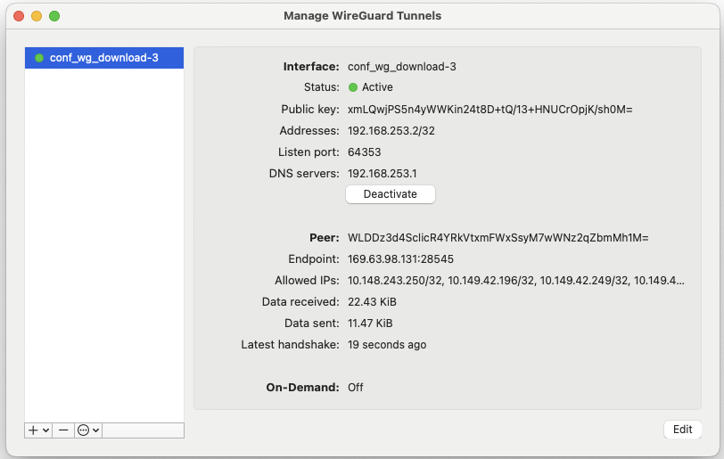

In order to connect via ssh to the machines created during the OpenShift installation, which are placed in the `192.168.252.0/24` private network, and to the VMware vSphere vCenter we need to complete the following steps:

  1. Download and install the VPN manager **Wireguard** (available in the App Store).

    {: style="max-height:50px"}

  1. Download the VPN config file from the IBM Tech Zone using the following button:

    {: style="max-height:50px"}

  1. Open Wireguard and import the downloaded file as a new VPN tunel.
  
  1. Active the VPN.

    {: style="max-height:600px"}
