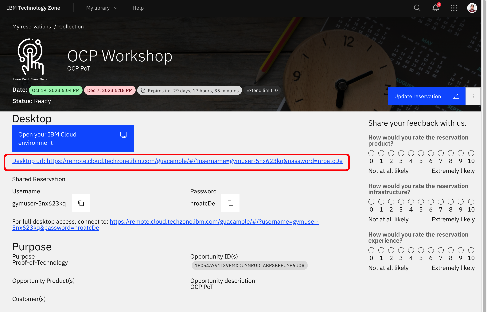

Once we have configured and activated the VPN, we need to navigate to our VMware vSphere vCenter home page using the URL at the bottom of our IBM Tech Zone reservation. VMware vSphere vCenter login credentials can also be found on the same reservation.

{: style="max-height:300px"}

Once we have successfully logged into our VMware vSphere vCenter, we should see the following screen:

{: style="max-height:900px"}

In our VMware vSphere vCenter environment, there exists a unique Virtual Machine (VM), referred to as the **Guacamole VM**. This term does not pertain to OpenShift bastion nodes but rather denotes a specific VM managed by the IBM TechZone infrastructure team.

The purpose of this Guacamole VM is to facilitate tasks requiring substantial internet bandwidth within the VMware vSphere vCenter network environment. By doing so, it avoids potential lag or slowdowns associated with VPN tunnel connections. Essentially, placing this VM on the vCenter network allows for rapid access to heavy components necessary for OpenShift installations directly from within the internal network.

This setup significantly enhances efficiency when downloading large files or elements crucial for the OpenShift installation process at the VMware vSphere vCenter level. It ensures smoother and quicker data transfers compared to relying on VPN tunnel connections, which could otherwise lead to slower speeds and potential connectivity issues.

{: style="max-height:300px"}

In order to create the bastion machines, we first must upload a RHEL 8.7 OS ISO file to the vCenter datastore. As previously explained, for this heavy task (~11GB), we will utilize the Guacamole VM.

!!! warning "Important"
    Due to potential issues, accessing the Guacamole VM through these three steps can be problematic. Persistence and multiple attempts are often necessary to successfully gain entry.

1. Open the Guacamole VM from your IBM TechZone reservation page:

    {: style="max-height:600px"}

1. This will open the following web app. Expand the All Connections section to see the two options for accessing the Guacamole VM. Use the Remote Desktop option:

    {: style="max-height:600px"}

1. Once you have gained access to the Guacamole VM, you should see a RHEL regular desktop.

    {: style="max-height:800px"}

1. Click on Activities at the top left corner of the desktop and click on Firefox to open the web browser.

1. Download the full install image ISO from Red Hat portal (You will need a Red Hat Account to access):

    - [**Link to RH 8.7 SO ISO file**](https://access.redhat.com/downloads/content/479/ver=/rhel---8/8.7/x86_64/product-software){:target="_blank"}

1. Point the browser to the link in order to download the files.

1. Once we have downloaded the ISO file, open the vCenter using the bookmark located at the bookmarks toolbar. You can find the credentials for the vCenter in your IBM TechZone reservation.

    {: style="max-height:300px"}

1. Upload the downloaded ISO file to the vCenter datastore to make it available for the bastion VMs we will create in later sections.

    {: style="max-height:600px"}

    !!! info
        Name the folder created in step 3 as ISOs folder

1. Once the ISO image have been fully uploaded to the DataStore, you will be able to see it listed.

    {: style="max-height:400px"}

!!! tip
    We can continue to work with vCenter from our laptop's web browser. We should not need to work with the Guacamole VM anymore.
