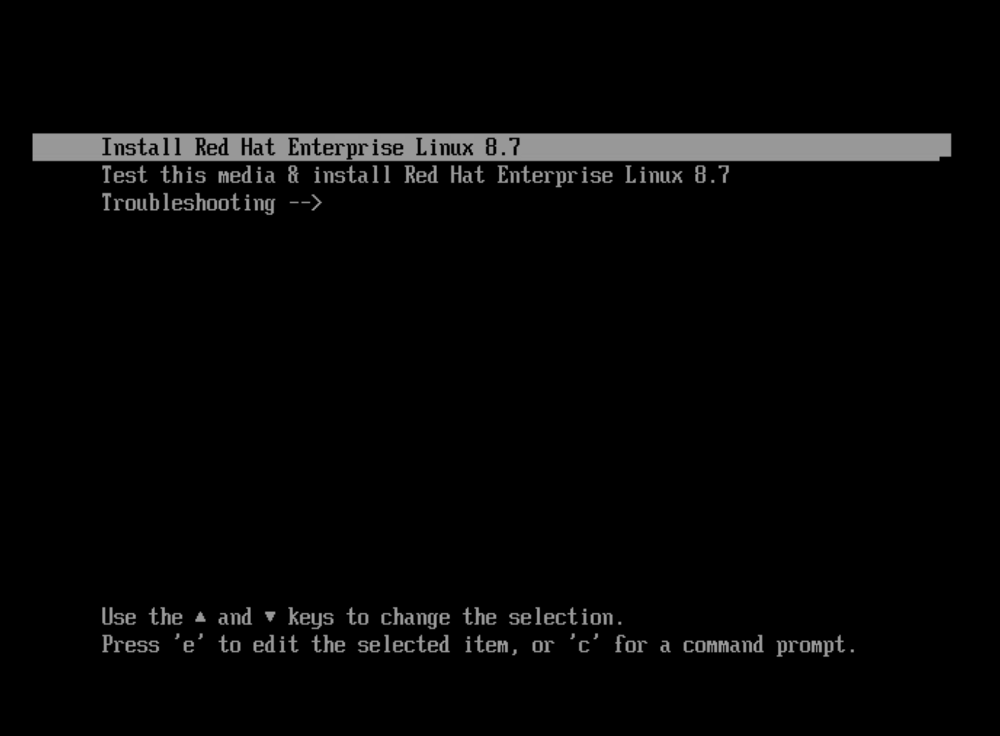
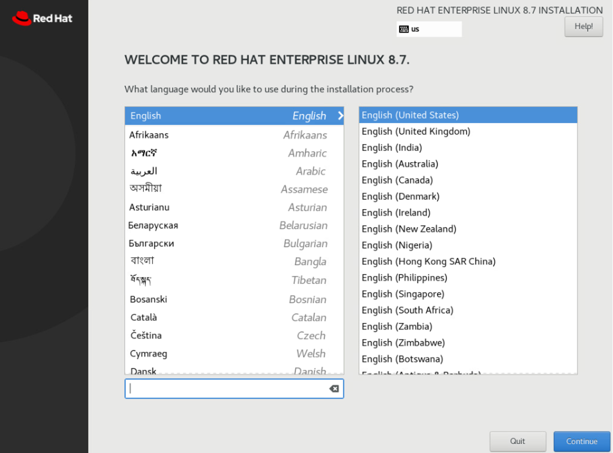
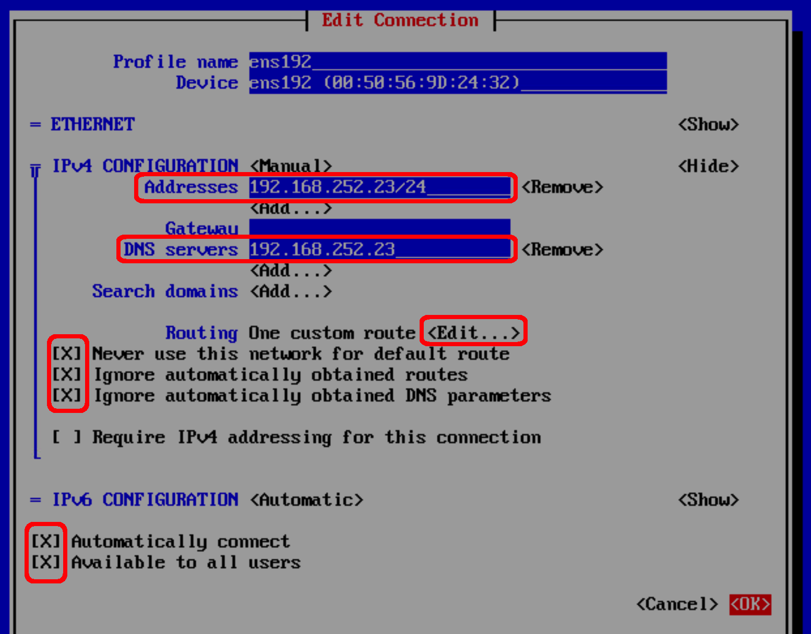

For this OpenShift installation, we'll employ two bastion nodes: an **online bastion** with internet access for downloading necessary components (images, executables, installation programs), and an **offline bastion** within our internal network without direct internet connectivity for transferring these components and executing the installation.

First on our agenda is to establish both online and offline bastion nodes.

### Create the online bastion node

Now, we shall proceed to create the virtual machine designated as the online bastion, which will operate using RHEL 8.7 and feature internet connectivity.

| **Option** | **Configuration** |
|------------|-------------------|
|**FQDN hostname** |bastiononline.ocp4.platformengineers.xyz|
|**Static IP Address** |192.168.252.22|
|**Operating System** |Red Hat Enterprise Linux|
|**OS Version** |8.7|
|**OS Language** |English-US|

1. Click on the VMs tab. Then, right click on the folder assigned to our vCenter user and select "New Virtual Machine".

    {: style="max-height:500px"}

1. Click next on the first page to go to the page where we will assign a name to the bastion online virtual machine. In our case we will use `bastiononline.ocp4.platformengineers.xyz` for the name of the VM we are creating.

1. Skip step 3.

1. On the step 4, select datastore started with `gym-` and click next:

    {: style="max-height:300px"}

1. Skip the step 5.

1. On the step 6, select the "Guest OS Family" as `Linux` and "Guest OS Version" as `Red Hat Enterprise Linux 8 (64-bit)` and click next.

    {: style="max-height:300px"}

1. On the step 7, specify the details of the virtual machine according to the table below

    | **Type** | **vCPU** | **RAM Memory** | **Storage (system)** | **Storage (data)** |
    |------|------|------------|------------------|----------------|
    |Bastion    |4 vCPU|16 GB|700 GB|0 GB|

    {: style="max-height:600px"}

    On "New CD/DVD Drive" select `Datastore ISO File` and then navigate to the ISO folder where we uploaded the RH 8.7 OS ISO file in the previous section and select such ISO file.

    {: style="max-height:500px"}

    Make sure "New CD/DVD Drive" connect is **checked** and click next.

    {: style="max-height:70px"}

1. Finish the creation of the VM.

!!! tip
    We might need to click on the refresh arrow icon at the top center of the vCenter web application in order to see our newly created VM.

Once the VM has been created successfully we must start the machine and proceed with the OS installation.

1. Select our newly created VM and click on the play button to start the VM.

    {: style="max-height:300px"}

1. Click on launch web console to proceed with the OS installation.

    {: style="max-height:300px"}

1. Click on the screen that will pop up and select install Red Hat OS.

    {: style="max-height:500px"}

1. Click Continue

    {: style="max-height:600px"}

1. Add disk.

    {: style="max-height:600px"}

1. Select `Custom` for the "Storage Configuration" and click done.

    {: style="max-height:600px"}

1. Click on the `Click here to create them automatically` link so that a default mount point and partition are created.

    {: style="max-height:600px"}

1. Set the amount of disk for the `/home` and `/` mount points as described in the picture below. This will allow us to have the required space for the things to be installed at the root mount point which is where the `root` user will inherit from.

    {: style="max-height:600px"}

    !!! tip
        When we set the disk space for a mount point in the text box, we need to click on the `Update Settings` button that will get enabled to take effect.

1. Click Done and Accept Changes on the message with the changes to be applied that will pop up.

    {: style="max-height:400px"}

1. On the main menu, click now on the Software Selection option at the bottom of the center options colunm. Then, select the "Minimal install", and "Headless Management" and click done.

    {: style="max-height:600px"}

1. Create the root credentials, for example `passw0rd` and click done.

1. Click Begin Installation.

1. When the installation finishes, click on Reboot System.

After the OS is installed and we restarted the server, login with root credentials (`root/passw0rd`). We will be able to connect using the web console link which will open a new tab in our browser. 

1. Use Network Manager Tool UI (nmtui) for configuring the network properties.

    ```{ .bash .copy title="[root@localhost ~]#"}
    nmtui
    ```

1. Click on Edit a connection

    {: style="max-height:300px"}
 
1. Select "ens192".
1. Use the arrows and intro to change the IPv4 CONFIGURATION from `<Automatic>` to `<Manual>`
1. Then, use the arrows and intro to `<Show>` details.
1. Fill the properties as shown in the pictures below

    {: style="max-height:600px"}

1. Use the arrows and space bar to select the `Automatically connect` option at the bottom.

    {: style="max-height:260px"}

1. Click `<OK>`
1. Click `<Back>`
1. Click `<OK>`

### Create the offline bastion node

Follow the same steps from the previous section in order to create the offline bastion with the following specs:

| **Option** | **Configuration** |
|------------|-------------------|
|**FQDN hostname** |bastion.ocp4.platformengineers.xyz|
|**Static IP Addresses** |192.168.252.23, 192.168.252.24, 192.168.252.25|
|**Operating System** |Red Hat Enterprise Linux|
|**OS Version** |8.7|
|**OS Language** |English-US|

We also need to edit the network configuration but this time we need to configure it so that the offline bastion does not have internet access but we can still connect to it via ssh. 

1. We will use Network Manager Tool UI (nmtui) for configuring the network properties.

    ```{ .bash .copy title="[root@bastion ~]"}
    nmtui
    ```

1. Click on Edit a connection

    {: style="max-height:300px"}
 
1. Select "ens192".
1. Use the arrows and intro to change the IPv4 CONFIGURATION from `<Automatic>` to `<Manual>`
1. Then, use the arrows and intro to `<Show>` details.
1. Fill the properties as shown in the pictures below

    {: style="max-height:600px"}

1. Click '<Add...>' under the addresses field to add the additional IP addresses listed in the table above.

1. Configure the routing so that we simulate no internet connection:

    {: style="max-height:600px"}

2. Use the arrows and space bar to select the `Automatically connect` option at the bottom.

    {: style="max-height:260px"}

3. Click `<OK>`
4. Click `<OK>`
5. Click `<Back>`
6. Click `<OK>`

After doing this configuration, try the following commands from the offline bastion terminal to check the connection to internet:

```{: .text .copy title="[root@localhost ~]"}
ping 192.168.252.1
```

```{ .text .no-copy title="Output"}
PING 192.168.252.1 (192.168.252.1) 56(84) bytes of data.
64 bytes from 192.168.252.1: icmp_seq=1 ttl=64 time=0.398 ms
^C
--- 192.168.252.1 ping statistics ---
1 packets transmitted, 1 received, 0% packet loss, time 0ms
rtt min/avg/max/mdev = 0.398/0.398/0.398/0.000 ms
```

```{ .text .copy title="[root@localhost ~]"}
ping 8.8.8.8
```

```{ .text .no-copy title="Output"}
connect: Network is unreachable
```

```{ .text .copy title="[root@localhost ~]"}
ping www.google.com
```

```{ .text .no-copy title="Output"}
ping: www.google.com: Name or service not known
```

!!! tip "Important"

    From now on, we can use our own laptop's terminal to ssh into the different VMs and carry on with the OpenShift installation. We should not need to use the web console of the bastions from the vCenter UI.

From your laptop's terminal, make sure you can ssh into the online bastion and offline bastion:

```{ .text .copy title="[student laptop]"}
ssh root@192.168.252.22
```

```{ .text .copy title="[student laptop]"}
ssh root@192.168.253.22
```
