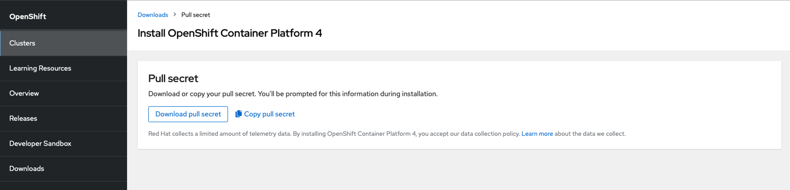

## Disable SELINUX in the online bastion

In order to perform the correct configuration of the bastion node, it is recommended that the `SELINUX` is deactivated first.

!!! note
    It is not strictly necessary that Linux Security is deactivated in order to install OpenShift. However, it is recommended as it eases the installation. Otherwise, you would need to open several specific ports and add rules to the firewall so that the needed communication is allowed.

1. Access the online bastion:

    ```{ .text .copy title="[student laptop]"}
    ssh root@192.168.252.22
    ```

1. Open the `/etc/selinux/config` to disable the `SELINUX`

    ```{ .bash .copy title="[root@localhost ~]"}
    vi /etc/selinux/config
    ```

1. Make sure your file looks like below, where the highlighted line has been modified:

    ```{ .properties .no-copy title="/etc/selinux/config" hl_lines="6"}
    # This file controls the state of SELinux on the system.
    # SELINUX= can take one of these three values:
    # enforcing - SELinux security policy is enforced.
    # permissive - SELinux prints warnings instead of enforcing.
    # disabled - No SELinux policy is loaded.
    SELINUX=disabled
    # SELINUXTYPE= can take one of these three values:
    # targeted - Targeted processes are protected,
    # minimum - Modification of targeted policy. Only selected processes are protected.
    # mls - Multi Level Security protection. SELINUXTYPE=targeted
    ```

    Once the change is made, save and exit the file (`esc` and `:wq`) 
    
1. Restart the server for the changes to take effect.

    ```{ .text .copy title="[root@localhost ~]"}
    init 6
    ```

## Disable firewall in the online bastion

Also, and since it is an internal network, the firewall of the machine is deactivated

1. Access the online bastion:

    ```{ .text .copy title="[student laptop]"}
    ssh root@192.168.252.22
    ```

1. Stop the firewall:

    ```{ .text .copy title="[root@localhost ~]"}
    systemctl stop firewalld
    systemctl disable firewalld
    ```

    ```{ .text .no-copy title="Output"}
    Removed /etc/systemd/system/multi-user.target.wants/firewalld.service. 
    Removed /etc/systemd/system/dbus-org.fedoraproject.FirewallD1.service.
    ```

## Configure the hostname for the online bastion

We need to change the online bastion machine's default hostname as we will be referring to this machine from the DNS, load balancer, etc using a different hostname.

1. Edit the hostname of the machine

    ```{ .text .copy title="[root@localhost ~]"}
    vi /etc/hostname
    ```

    set the hostname to `bastiononline.ocp4.platformengineers.xyz`

1. Once the change has been made, restart the server for it to take effect.

    ```{ .text .copy title="[root@localhost ~]"}
    init 6
    ```

1. Access the online bastion again:

    ```{ .text .copy title="[student laptop]"}
    ssh root@192.168.252.22
    ```

1. Check the hostname was successfully modified:

    ```{ .text .copy title="[root@bastiononline ~]"}
    ping bastiononline.ocp4.platformengineers.xyz
    ```

    You should see similar output as below:

    ```{ .text .no-copy title="Output"}
    PING bastiononline.ocp4.platformengineers.xyz(bastiononline.ocp4.platformengineers.xyz (fe80::250:56ff:fe8a:3e00%ens192)) 56 data bytes
    64 bytes from bastiononline.ocp4.platformengineers.xyz (fe80::250:56ff:fe8a:3e00%ens192): icmp_seq=1 ttl=64 time=0.036 ms
    64 bytes from bastiononline.ocp4.platformengineers.xyz (fe80::250:56ff:fe8a:3e00%ens192): icmp_seq=2 ttl=64 time=0.040 ms
    64 bytes from bastiononline.ocp4.platformengineers.xyz (fe80::250:56ff:fe8a:3e00%ens192): icmp_seq=3 ttl=64 time=0.042 ms
    ```

1. Finish the ping command with `ctrl+c`

## Install required Red Hat packages in the online bastion

For the installation of rpm packages on the online machine, the RHEL 8.7 OS ISO file that we created the VM from will help us.

!!! info "Note"
    We can skip this step if we register the machine with a Red Hat subscription, which falls outside this workshop.

1. Make sure that, in the vCenter, the online bastion has the CD/DVD drive as connected:

    {: style="max-height:100px"}

2. The purpose of having the CD/DVD drive connected is that we can now mount this drive in the file system:

    ```{ .text .copy title="[root@bastiononline ~]"}
    mkdir /mnt/disc
    mount /dev/sr0 /mnt/disc
    ```

    ```{ .text .no-copy title="Output"}
    mount: /mnt/disc: WARNING: device write-protected, mounted read-only.
    ```

3. Create the following following `rhel87dvd.repo` file that will define our RHEL OS repos:

    ```{ .text .copy title="[root@bastiononline ~]"}
    vi /etc/yum.repos.d/rhel87dvd.repo
    ```

    ```{ .properties .copy title="rhel87dvd.repo"}
    [InstallMediaBase]
    name=Red Hat Enterprise Linux 8.7.0 Base
    mediaid=None
    metadata_expire=-1
    gpgcheck=0
    cost=500
    enabled=1
    baseurl=file:///mnt/disc/BaseOS

    [InstallMediaApps]
    name=Red Hat Enterprise Linux 8.7.0 App
    mediaid=None
    metadata_expire=-1
    gpgcheck=0
    cost=500
    enabled=1
    baseurl=file:///mnt/disc/AppStream
    [InstallMediaParches]
    name=Red Hat Enterprise Linux KErnel
    mediaid=None
    metadata_expire=-1
    gpgcheck=0
    cost=500
    enabled=0
    baseurl=file:///mnt/parches
    ```

4. Make sure the cache is cleaned:

    ```{ .text .copy title="[root@bastiononline ~]"}
    yum clean all
    ```

    ```{ .text .no-copy title="Output"}
    Updating Subscription Management repositories.
    Unable to read consumer identity

    This system is not registered with an entitlement server. You can use subscription-manager to register.

    0 files removed
    ```

5. Make sure the new repositories are enabled:

    ```{ .text .copy title="[root@bastiononline ~]"}
    yum repolist enabled
    ```

    ```{ .text .no-copy title="Output" hl_lines="7 8"}
    Updating Subscription Management repositories.
    Unable to read consumer identity

    This system is not registered with an entitlement server. You can use subscription-manager to register.

    repo id                                   repo name
    InstallMediaApps                          Red Hat Enterprise Linux 8.7.0 App
    InstallMediaBase                          Red Hat Enterprise Linux 8.7.0 Base
    ```

Once you have created the offline repository and confirmed it is enabled, the required packages can be installed with the **yum** utility.

The following packages have been installed on the online bastion server. Some packages may not be used during the execution of online commands, but they are installed so that the "online" and "offline" bastion settings are as identical as possible.

```{ .text .copy title="[root@bastiononline ~]"}
yum install -y  podman \
                jq openssl httpd-tools curl wget telnet nfs-utils \
                httpd.x86_64 \
                bind bind-utils rsync mkisofs
```

```{ .text .no-copy title="Output"}
Updating Subscription Management repositories.
Unable to read consumer identity

This system is not registered with an entitlement server. You can use subscription-manager to register.

Red Hat Enterprise Linux 8.7.0 Base                                                                                          40 MB/s | 2.4 MB     00:00    
Red Hat Enterprise Linux 8.7.0 App                                                                                           53 MB/s | 7.8 MB     00:00    
Package openssl-1:1.1.1k-7.el8_6.x86_64 is already installed.
Package curl-7.61.1-25.el8.x86_64 is already installed.
Dependencies resolved.
============================================================================================================================================================
 Package                                   Architecture        Version                                                  Repository                     Size
============================================================================================================================================================
Installing:
 bind                                      x86_64              32:9.11.36-5.el8                                         InstallMediaApps              2.1 M
 bind-utils                                x86_64              32:9.11.36-5.el8                                         InstallMediaApps              452 k
 genisoimage                               x86_64              1.1.11-39.el8                                            InstallMediaApps              316 k
 httpd                                     x86_64              2.4.37-51.module+el8.7.0+16050+02173b8e                  InstallMediaApps              1.4 M
 httpd-tools                               x86_64              2.4.37-51.module+el8.7.0+16050+02173b8e                  InstallMediaApps              109 k
 jq                                        x86_64              1.6-3.el8                                                InstallMediaApps              202 k
 nfs-utils                                 x86_64              1:2.3.3-57.el8                                           InstallMediaBase              515 k
 podman                                    x86_64              3:4.2.0-1.module+el8.7.0+16772+33343656                  InstallMediaApps               12 M
 rsync                                     x86_64              3.1.3-19.el8                                             InstallMediaBase              410 k
 telnet                                    x86_64              1:0.17-76.el8                                            InstallMediaApps               72 k
 wget                                      x86_64              1.19.5-10.el8                                            InstallMediaApps              734 k
...
...
Complete!
```

Finally, we need to install Ansible on the system. However, this package is not included in the RHEL repositories configured previously. As a result, we will need to install it manually.

1. Download the Ansible RPM package to your laptop from the Red Hat portal.

    - [**Link to Ansible rpm**](https://access.redhat.com/downloads/content/ansible/2.9.27-1.el8ap/noarch/fd431d51/package){:target="_blank"}

1. Source copy the rpm package to the online bastion

    ```{ .text .copy title="[student laptop]"}
    scp ansible-2.9.27-1.el8ap.noarch.rpm root@192.168.252.22:/root
    ```

1. Install it:

    ```{ .text .copy title="[root@bastiononline ~]"}
    yum localinstall -y ansible-2.9.27-1.el8ap.noarch.rpm
    ```

    ```{ .text .no-copy title="Output"}
    Updating Subscription Management repositories.
    Unable to read consumer identity

    This system is not registered with an entitlement server. You can use subscription-manager to register.

    Last metadata expiration check: 0:09:27 ago on Mon 06 Nov 2023 05:40:03 PM CET.
    Dependencies resolved.
    ============================================================================================================================================================
    Package                                  Architecture          Version                                               Repository                       Size
    ============================================================================================================================================================
    Installing:
    ansible                                  noarch                2.9.27-1.el8ap                                        @commandline                     17 M
    ...
    ...
    Complete!
    ```

## Download OpenShift utilities to the online bastion

A directory structure is created to accommodate the different binaries that are downloaded.

- Create a directory for the registry and create the necessary directories for the registry.

    ```{ .text .copy title="[root@bastiononline ~]"}
    mkdir /root/registry
    cd registry/
    ```

    ```{ .text .copy title="[root@bastiononline registry]"}
    mkdir auth certs data downloads
    ls -lart
    ```

    ```{ .sh .no-copy title="Output"}
    total 4
    dr-xr-x---. 7 root root 4096 Sep  8 07:43 ..
    drwxr-xr-x  2 root root    6 Sep  8 07:48 downloads
    drwxr-xr-x  2 root root    6 Sep  8 07:48 data
    drwxr-xr-x  2 root root    6 Sep  8 07:48 certs
    drwxr-xr-x  2 root root    6 Sep  8 07:48 auth
    drwxr-xr-x  6 root root   60 Sep  8 07:48 .
    ```

    ```{ .text .copy title="[root@bastiononline registry]"}
    cd downloads/
    ```

    ```{ .text .copy title="[root@bastiononline downloads]"}
    mkdir images tools secrets
    ls -lart
    ```

    ```{ .sh .no-copy title="Output"}
    total 0
    drwxr-xr-x 6 root root 60 Sep  8 07:48 ..
    drwxr-xr-x 2 root root  6 Sep  8 07:59 tools
    drwxr-xr-x 2 root root  6 Sep  8 07:59 secrets
    drwxr-xr-x 2 root root  6 Sep  8 07:59 images
    drwxr-xr-x 5 root root 48 Sep  8 07:59 .
    ```

The folder structure that should have got created should look like this:

```{ .test .no-copy title="Directory structure"}
/root
`-- registry
    |-- auth
    |-- certs
    |-- data
    `-- downloads
        |-- images
        |-- secrets
        `-- tools
```

For the OpenShift client, the following steps have been followed:

- OpenShift client download:

    ```{ .text .copy title="[root@bastiononline downloads]"}
    cd tools/
    ```

    ```{ .text .copy title="[root@bastiononline tools]"}
    wget https://mirror.openshift.com/pub/openshift-v4/clients/ocp/4.16.9/openshift-client-linux-amd64-rhel8-4.16.9.tar.gz
    ```

- Extracting the contents of the downloaded file:

    ```{ .text .copy title="[root@bastiononline tools]"}
    tar -xvf openshift-client-linux-amd64-rhel8-4.16.9.tar.gz
    ```

    ```{ .text .no-copy title="Output"}
    README.md
    oc
    kubectl
    ```

    ```{ .text .copy title="[root@bastiononline tools]"}
    ls -lart
    ```

    ```{ .sh .no-copy title="Output"}
    total 1156008
    -rwxr-xr-x 2 root root  159905720 Aug 21 01:54 oc
    -rwxr-xr-x 2 root root  159905720 Aug 21 01:54 kubectl
    -rw-r--r-- 1 root root        950 Aug 21 01:54 README.md
    -rw-r--r-- 1 root root   66705673 Aug 22 22:05 openshift-client-linux-amd64-rhel8-4.16.9.tar.gz
    drwxr-xr-x 5 root root         48 Sep 21 07:55 ..
    drwxr-xr-x 2 root root        164 Sep 21 11:19 .
    ```

- Copy to a location accessible from your $PATH (e.g. /usr/bin):

    ```{ .text .copy title="[root@bastiononline tools]"}
    cp /root/registry/downloads/tools/oc /usr/bin/oc
    ```

For the OpenShift installer, the following steps should be followed:

- Downloading the OpenShift Installer

    ```{ .text .copy title="[root@bastiononline tools]"}
    wget https://mirror.openshift.com/pub/openshift-v4/clients/ocp/4.16.9/openshift-install-linux-4.16.9.tar.gz
    ```

- Extract the contents of the downloaded file:

    ```{ .text .copy title="[root@bastiononline tools]"}
    tar -xvf openshift-install-linux-4.16.9.tar.gz
    ```

    ```{ .text .no-copy title="Output"}
    README.md
    openshift-install
    ```

    ```{ .text .copy title="[root@bastiononline tools]"}
    ls -lart
    ```

    ```{ .sh .no-copy title="Output"}
    total 1156008
    -rwxr-xr-x 2 root root  159905720 Aug 21 01:54 oc
    -rwxr-xr-x 2 root root  159905720 Aug 21 01:54 kubectl
    -rwxr-xr-x 1 root root  707731456 Aug 21 03:44 openshift-install
    -rw-r--r-- 1 root root        706 Aug 21 03:44 README.md
    -rw-r--r-- 1 root root   66705673 Aug 22 22:05 openshift-client-linux-amd64-rhel8-4.16.9.tar.gz
    -rw-r--r-- 1 root root  510253136 Aug 22 22:05 openshift-install-linux-4.16.9.tar.gz
    drwxr-xr-x 5 root root         48 Sep 21 07:55 ..
    drwxr-xr-x 2 root root        164 Sep 21 11:19 .
    ```

- Copy to a location accessible from your $PATH (e.g. /usr/bin):

    ```{ .text .copy title="[root@bastiononline tools]"}
    cp /root/registry/downloads/tools/openshift-install /usr/bin/openshift-install
    ```

For the Mirror registry, the following steps should be followed:

- Download the mirror-registry

    ```{ .text .copy title="[root@bastiononline tools]"}
    wget https://mirror.openshift.com/pub/cgw/mirror-registry/latest/mirror-registry-amd64.tar.gz
    ```

- Extracting the contents of the downloaded file:

    ```{ .text .copy title="[root@bastiononline tools]"}
    tar -xvf mirror-registry-amd64.tar.gz
    ```

    ```{ .text .no-copy title="Output"}
    image-archive.tar
    execution-environment.tar
    mirror-registry
    ```

    ```{ .text .copy title="[root@bastiononline tools]"}
    ls -lart
    ```

    ```{ .sh .no-copy title="Output"}
    total 4019476
    -rwxr-xr-x 2 root root  160465008 Aug 21 00:49 oc
    -rwxr-xr-x 2 root root  160465008 Aug 21 00:49 kubectl
    -rwxr-xr-x 1 root root  707731456 Aug 21 03:44 openshift-install
    -rw-r--r-- 1 root root        706 Aug 21 03:44 README.md
    -rw-r--r-- 1 root root   66941882 Aug 22 22:05 openshift-client-linux-4.16.9.tar.gz
    -rw-r--r-- 1 root root  510253136 Aug 22 22:05 openshift-install-linux-4.16.9.tar.gz
    -rwxr-xr-x 1 root root    9824888 Sep 23 18:46 mirror-registry
    -rw-r--r-- 1 root root  113418240 Sep 23 18:47 sqlite3.tar
    -rw-r--r-- 1 root root  316753920 Sep 23 18:50 execution-environment.tar
    -rw-r--r-- 1 root root 1454929920 Sep 23 18:50 image-archive.tar
    -rw-r--r-- 1 root root  607056480 Sep 26 11:44 mirror-registry-amd64.tar.gz
    drwxr-xr-x 5 root root         48 Oct 24 19:16 ..
    drwxr-xr-x 2 root root       4096 Oct 24 19:41 .
    ```

For the oc-mirror plugin, the following steps should be followed:

- Download the oc mirror program to make mirror of OCP and its operators

    ```{ .text .copy title="[root@bastiononline tools]"}
    wget https://mirror.openshift.com/pub/openshift-v4/x86_64/clients/ocp/4.16.19/oc-mirror.tar.gz
    ```

- Extracting the contents of the downloaded file:

    ```{ .text .copy title="[root@bastiononline tools]"}
    tar xvfz oc-mirror.tar.gz
    ```

    ```{ .text .no-copy title="Output"}
    oc-mirror
    ```

    ```{ .text .copy title="[root@bastiononline tools]"}
    ls -lart
    ```

    ```{ .sh .no-copy title="Output"}
    total 4245772
    -rwxr-xr-x 2 root root  159905720 Aug 21 01:54 oc
    -rwxr-xr-x 2 root root  159905720 Aug 21 01:54 kubectl
    -rwxr-xr-x 1 root root  707731456 Aug 21 03:44 openshift-install
    -rw-r--r-- 1 root root        706 Aug 21 03:44 README.md
    -rw-r--r-- 1 root root   66705673 Aug 22 22:05 openshift-client-linux-amd64-rhel8-4.16.9.tar.gz
    -rw-r--r-- 1 root root  510253136 Aug 22 22:05 openshift-install-linux-4.16.9.tar.gz
    -rwxr-xr-x 1 root root    9824888 Sep 23 18:46 mirror-registry
    -rw-r--r-- 1 root root  113418240 Sep 23 18:47 sqlite3.tar
    -rw-r--r-- 1 root root  316753920 Sep 23 18:50 execution-environment.tar
    -rw-r--r-- 1 root root 1454929920 Sep 23 18:50 image-archive.tar
    -rw-r--r-- 1 root root  607056480 Sep 26 11:44 mirror-registry-amd64.tar.gz
    -rw-r----- 1  984  984  165699280 Oct 18 02:15 oc-mirror
    -rw-r--r-- 1 root root   67385243 Oct 25 03:02 oc-mirror.tar.gz
    drwxr-xr-x 5 root root         48 Oct 24 19:16 ..
    drwxr-xr-x 2 root root       4096 Oct 25 09:22 .
    ```

- Copy to a location accessible from your $PATH (e.g. /usr/local/bin):

    ```{ .text .copy title="[root@bastiononline tools]"}
    chmod +x /root/registry/downloads/tools/oc-mirror
    cp /root/registry/downloads/tools/oc-mirror /usr/local/bin/
    oc-mirror help
    ```

For the Butane tool, the following steps should be followed:

- Download butane

    ```{ .text .copy title="[root@bastiononline tools]"}
    curl https://mirror.openshift.com/pub/openshift-v4/clients/butane/latest/butane-amd64 --output butane
    ```

    ```{ .text .copy title="[root@bastiononline tools]"}
    ls -lart
    ```

    ```{ .sh .no-copy title="Output"}
    total 4019476
    -rwxr-xr-x 2 root root  160465008 Aug 21 00:49 oc
    -rwxr-xr-x 2 root root  160465008 Aug 21 00:49 kubectl
    -rwxr-xr-x 1 root root  707731456 Aug 21 03:44 openshift-install
    -rw-r--r-- 1 root root        706 Aug 21 03:44 README.md
    -rw-r--r-- 1 root root   66941882 Aug 22 22:05 openshift-client-linux-4.16.9.tar.gz
    -rw-r--r-- 1 root root  510253136 Aug 22 22:05 openshift-install-linux-4.16.9.tar.gz
    -rwxr-xr-x 1 root root    9824888 Sep 23 18:46 mirror-registry
    -rw-r--r-- 1 root root  113418240 Sep 23 18:47 sqlite3.tar
    -rw-r--r-- 1 root root  316753920 Sep 23 18:50 execution-environment.tar
    -rw-r--r-- 1 root root 1454929920 Sep 23 18:50 image-archive.tar
    -rw-r--r-- 1 root root  607056480 Sep 26 11:44 mirror-registry-amd64.tar.gz
    drwxr-xr-x 5 root root         48 Oct 24 19:16 ..
    drwxr-xr-x 2 root root       4096 Oct 24 19:41 .
    -rw-r--r-- 1 root root    8070568 Oct 24 19:41 butane
    ```

For the ISO Maker tool, the following steps should be followed:

- Download the ISO Maker

    ```{ .text .copy title="[root@bastiononline ~]"}
    cd /root/
    mkdir Coreos-iso-maker
    cd Coreos-iso-maker/
    ```

    ```{ .text .copy title="[root@bastiononline Coreos-iso-maker]"}
    yum install -y git
    ```

    ```{ .text .no-copy title="Output"}
    Updating Subscription Management repositories.
    Unable to read consumer identity

    This system is not registered with an entitlement server. You can use subscription-manager to register.

    Last metadata expiration check: 0:30:40 ago on Mon 06 Nov 2023 05:40:03 PM CET.
    Dependencies resolved.
    ============================================================================================================================================================
    Package                               Architecture          Version                                                  Repository                       Size
    ============================================================================================================================================================
    Installing:
     git                                   x86_64                2.31.1-2.el8                                             InstallMediaApps                161 k
    ...
    ...
    Complete!
    ```

    ```{ .text .copy title="[root@bastiononline Coreos-iso-maker]"}
    git clone https://github.com/chuckersjp/coreos-iso-maker
    ```

    ```{ .text .no-copy title="Output"}
    Cloning into 'coreos-iso-maker'...
    remote: Enumerating objects: 391, done.
    remote: Counting objects: 100% (129/129), done.
    remote: Compressing objects: 100% (37/37), done.
    remote: Total 391 (delta 116), reused 93 (delta 92), pack-reused 262
    Receiving objects: 100% (391/391), 70.81 KiB | 1.16 MiB/s, done.
    Resolving deltas: 100% (246/246), done.
    ```

    ```{ .text .copy title="[root@bastiononline Coreos-iso-maker]"}
    ls -lart
    ```

    ```{ .sh .no-copy title="Output"}
    total 8
    dr-xr-x---. 8 root root 4096 Sep  8 11:40 ..
    drwxr-xr-x  3 root root   30 Sep  8 11:42 .
    drwxr-xr-x  4 root root 4096 Sep  8 11:42 coreos-iso-maker
    ```


## (Optional) Expand bastion boot disk 

!!! info
    You dont need to complete this section. It is only for reference to understand what you would need to do should you require to increase disk space on any of your bastion machines.

In case you need to increase the bastion online’s disk size because at the creation moment you didn’t set the correct amount of storage, you must follow the next steps in vCenter with the vm machine stopped:
 
{: style="max-height:700px"}

Set the correct space you need on the disk and then start the machine and follow these commands to create a new partition:

1. Access the online bastion:

    ```{ .text .copy title="[student laptop]"}
    ssh root@192.168.252.22
    ```

1. Check the actual partitions size

    ```{ .text .copy title="[root@bastiononline ~]"}
    df -h
    ```

    ```{ .text .no-copy title="Output" hl_lines="6"}
    Filesystem             Size  Used Avail Use% Mounted on
    devtmpfs                16G     0   16G   0% /dev
    tmpfs                   16G     0   16G   0% /dev/shm
    tmpfs                   16G  8.7M   16G   1% /run
    tmpfs                   16G     0   16G   0% /sys/fs/cgroup
    /dev/mapper/rhel-root  621G   12G  610G   2% /
    /dev/sda2             1014M  211M  804M  21% /boot
    /dev/sda1              599M  5.8M  594M   1% /boot/efi
    /dev/mapper/rhel-home   62G  473M   62G   1% /home
    tmpfs                  3.2G     0  3.2G   0% /run/user/0
    ```

1. List the partition tables

    ```{ .text .copy title="[root@bastiononline ~]"}
    fdisk -l
    ```

    ```{ .text .no-copy title="Output" hl_lines="16"}
    Register this system with Red Hat Insights: insights-client --register
    Create an account or view all your systems at https://red.ht/insights-dashboard
    Last login: Mon Nov  6 18:32:23 2023 from 192.168.253.2
    [root@bastiononline ~]# fdisk -l
    Disk /dev/sda: 1 TiB, 1099511627776 bytes, 2147483648 sectors
    Units: sectors of 1 * 512 = 512 bytes
    Sector size (logical/physical): 512 bytes / 512 bytes
    I/O size (minimum/optimal): 512 bytes / 512 bytes
    Disklabel type: gpt
    Disk identifier: 68D049D0-0D01-44BA-AF0F-9371047971AE

    Device          Start        End    Sectors   Size Type
    /dev/sda1        2048    1230847    1228800   600M EFI System
    /dev/sda2     1230848    3327999    2097152     1G Linux filesystem
    /dev/sda3     3328000 1468004351 1464676352 698.4G Linux LVM
    /dev/sda4  1468004352 2147483614  679479263   324G Linux filesystem


    Disk /dev/mapper/rhel-root: 621 GiB, 666793672704 bytes, 1302331392 sectors
    Units: sectors of 1 * 512 = 512 bytes
    Sector size (logical/physical): 512 bytes / 512 bytes
    I/O size (minimum/optimal): 512 bytes / 512 bytes


    Disk /dev/mapper/rhel-swap: 15.8 GiB, 16924016640 bytes, 33054720 sectors
    Units: sectors of 1 * 512 = 512 bytes
    Sector size (logical/physical): 512 bytes / 512 bytes
    I/O size (minimum/optimal): 512 bytes / 512 bytes


    Disk /dev/mapper/rhel-home: 61.7 GiB, 66194505728 bytes, 129286144 sectors
    Units: sectors of 1 * 512 = 512 bytes
    Sector size (logical/physical): 512 bytes / 512 bytes
    I/O size (minimum/optimal): 512 bytes / 512 bytes
    ```

1. Start the disk partition table tool for `/dev/sda`

    ```{ .text .copy title="[root@bastiononline ~]"}
    fdisk /dev/sda
    ```

    !!! note
        We select `n` in the first command. Then, we press enter to leave the defaults. Finally, for the second command, we select `w` (to write the partitions)

    ```{ .text .no-copy title="Output"}
    Welcome to fdisk (util-linux 2.32.1).
    Changes will remain in memory only, until you decide to write them.
    Be careful before using the write command.


    Command (m for help): n
    Partition number (4-128, default 4): 
    First sector (1468004352-2147483614, default 1468004352): 
    Last sector, +sectors or +size{K,M,G,T,P} (1468004352-2147483614, default 2147483614): 

    Created a new partition 4 of type 'Linux filesystem' and of size 324 GiB.

    Command (m for help): w
    The partition table has been altered.
    Syncing disks.
    ```

1. Expand the logical volume that has the operating system boot with the following commands
   
    ```{ .text .copy title="[root@bastiononline ~]"}
    pvcreate /dev/sda4
    ```

    ```{ .text .no-copy title="Output"}
    Physical volume "/dev/sda4" successfully created.
    ```

    ```{ .text .copy title="[root@bastiononline ~]"}
    vgs
    ```

    ```{ .text .no-copy title="Output"}
    VG   #PV #LV #SN Attr   VSize   VFree
    rhel   1   3   0 wz--n- 698.41g    0
    ```

    ```{ .text .copy title="[root@bastiononline ~]"}
    vgextend rhel /dev/sda4
    ```

    ```{ .text .no-copy title="Output"}
    Volume group "rhel" successfully extended
    ```

    ```{ .text .copy title="[root@bastiononline ~]"}
    lvs
    ```

    ```{ .text .no-copy title="Output"}
    LV   VG   Attr       LSize   Pool Origin Data%  Meta%  Move Log Cpy%Sync Convert
    home rhel -wi-ao---- <61.65g                                                    
    root rhel -wi-ao---- 621.00g                                                    
    swap rhel -wi-ao----  15.76g
    ```

    ```{ .text .copy title="[root@bastiononline ~]"}
    lvextend -l +100%FREE /dev/rhel/root
    ```

    ```{ .text .no-copy title="Output"}
    Size of logical volume rhel/root changed from 621.00 GiB (158976 extents) to <945.00 GiB (241919 extents).
    Logical volume rhel/root successfully resized.
    ```

    ```{ .text .copy title="[root@bastiononline ~]"}
    lsblk -f
    ```

    ```{ .text .no-copy title="Output" hl_lines="10"}
    NAME          FSTYPE      LABEL                    UUID                                   MOUNTPOINT
    sda                                                                                       
    |-sda1        vfat                                 6793-7237                              /boot/efi
    |-sda2        xfs                                  c43ee8e7-77b7-40af-8367-ba7ef90fcbb5   /boot
    |-sda3        LVM2_member                          kOrAn9-K2h6-RbB9-gINB-pWNL-dxVB-VkxYzZ 
    | |-rhel-root xfs                                  ba1bba3c-dea8-4e2e-9882-fd866f6d13e8   /
    | |-rhel-swap swap                                 868795de-6965-44bd-aee3-3181691531f7   [SWAP]
    | `-rhel-home xfs                                  2bb2a05b-9811-4c10-ba3b-f1ab8084460a   /home
    `-sda4        LVM2_member                          9apLnq-zxPM-HNZ3-ncc7-jgwZ-hhAg-T3GVk6 
      `-rhel-root xfs                                  ba1bba3c-dea8-4e2e-9882-fd866f6d13e8   /
    sr0           iso9660     RHEL-8-7-0-BaseOS-x86_64 2022-10-13-06-03-04-00
    ```

    ```{ .text .copy title="[root@bastiononline ~]"}
    xfs_growfs /dev/rhel/root
    ```

    ```{ .text .no-copy title="Output"}
    meta-data=/dev/mapper/rhel-root  isize=512    agcount=4, agsize=40697856 blks
            =                       sectsz=512   attr=2, projid32bit=1
            =                       crc=1        finobt=1, sparse=1, rmapbt=0
            =                       reflink=1    bigtime=0 inobtcount=0
    data     =                       bsize=4096   blocks=162791424, imaxpct=25
            =                       sunit=0      swidth=0 blks
    naming   =version 2              bsize=4096   ascii-ci=0, ftype=1
    log      =internal log           bsize=4096   blocks=79488, version=2
            =                       sectsz=512   sunit=0 blks, lazy-count=1
    realtime =none                   extsz=4096   blocks=0, rtextents=0
    data blocks changed from 162791424 to 247725056
    ```

    ```{ .text .copy title="[root@bastiononline ~]"}
    df -h
    ```

    ```{ .text .no-copy title="Output" hl_lines="6"}
    Filesystem             Size  Used Avail Use% Mounted on
    devtmpfs                16G     0   16G   0% /dev
    tmpfs                   16G     0   16G   0% /dev/shm
    tmpfs                   16G  8.7M   16G   1% /run
    tmpfs                   16G     0   16G   0% /sys/fs/cgroup
    /dev/mapper/rhel-root  945G   14G  932G   2% /
    /dev/sda2             1014M  211M  804M  21% /boot
    /dev/sda1              599M  5.8M  594M   1% /boot/efi
    /dev/mapper/rhel-home   62G  473M   62G   1% /home
    tmpfs                  3.2G     0  3.2G   0% /run/user/0
    ```

Repeat on the offline bastion if required.

## Download the Red Hat CoreOS images to the online bastion

We need to download the following CoreOS images for the installation of the different OpenShift nodes: 

```{ .text .copy title="[root@bastiononline ~]"}
cd /root/registry/downloads/images/
```

```{ .text .copy title="[root@bastiononline images]"}
wget https://mirror.openshift.com/pub/openshift-v4/x86_64/dependencies/rhcos/4.16/4.16.3/rhcos-4.16.3-x86_64-metal.x86_64.raw.gz
wget https://mirror.openshift.com/pub/openshift-v4/x86_64/dependencies/rhcos/4.16/4.16.3/rhcos-4.16.3-x86_64-live.x86_64.iso
```

```{ .text .copy title="[root@bastiononline images]"}
ls -lart
```

```{ .sh .no-copy title="Output"}
total 2363592
-rw-r--r-- 1 root root 1213202432 Apr  4  2023 rhcos-4.16.3-x86_64-live.x86_64.iso
-rw-r--r-- 1 root root 1207111745 Apr  4  2023 rhcos-4.16.3-x86_64-metal.x86_64.raw.gz
drwxr-xr-x 5 root root         48 Nov  6 17:57 ..
drwxr-xr-x 2 root root         98 Nov  6 20:40 .
```

## Mirror images on the online bastion

For accessing your Red Hat OpenShift pull secret – containing credentials that allow for downloading OpenShift and associated artifacts – please proceed as follows:

<https://cloud.redhat.com/openshift/install/pull-secret>

and download or copy the contents of the pull secret. 

{: style="max-height:300px"} 

1. Open the link above and copy the contents of the Red Hat OpenShift pull secret
1. Paste the contents of the Red Hat OpenShift pull secret into a file.

    ```{ .text .copy title="[root@bastiononline images]"}
    cd /root/registry/downloads/secrets/
    ```

    ```{ .text .copy title="[root@bastiononline secrets]"}
    vi pull-secret.txt
    ```

    ```{ .json .no-copy title="Output"}
    {"auths":{"cloud.openshift.com":{"auth":"<auth_secret>","email":"Miguel.Ariza.Colmenares2@ibm.com"},"quay.io":{"auth":" [……………]TdUpHajdDRGJfUUNFUk9ncjJ4Qi01V0pUVUNWenpLcmJlZU5yWGo0Y2ZTTkYzVWU3NC05N3hQMVBvQjBCYmRiOEhMemgwc0NfYjdtNzlkVDVmVGRyY3M2ZENqZzV4dEZNWnhlTTFTWEg0UWJqeDJYb2xUQ2RmekRfNzRhOXRueGVLMnFHaFZPZVVnXzBSY2t5MXZQUzVFMjFvMA==","email":"Miguel.Ariza.Colmenares2@ibm.com"}}}
    ```

1. Make a copy of your pull secret in JSON format:

    ```{ .text .copy title="[root@bastiononline secrets]"}
    cat ./pull-secret.txt | jq . > ./pull-secret.json
    ```

    The contents of the file resemble the following example:

    ```{ .json .no-copy title="Output"}
    {
    "auths": {
        "cloud.openshift.com": {
        "auth": "b3BlbnNo...",
        "email": "you@example.com"
        },
        "quay.io": {
        "auth": "b3BlbnNo...",
        "email": "you@example.com"
        },
        "registry.connect.redhat.com": {
        "auth": "NTE3Njg5Nj...",
        "email": "you@example.com"
        },
        "registry.redhat.io": {
        "auth": "NTE3Njg5Nj...",
        "email": "you@example.com"
        }
    }
    }
    ```

We need to copy the contents of the file to the container runtime directory so that it is accessible by the image download procedure. Save the file either as 

* `~/.docker/config.json` or 
* `$XDG_RUNTIME_DIR/containers/auth.json`

```{ .text .copy title="[root@bastiononline secrets]"}
echo $XDG_RUNTIME_DIR
```

```{ .text .no-copy title="Output"}
/run/user/0
```

```{ .text .copy title="[root@bastiononline secrets]"}
mkdir /run/user/0/containers
cp /root/registry/downloads/secrets/pull-secret.json /run/user/0/containers/auth.json
ls -lart /run/user/0/containers/auth.json
```

```{ .sh .no-copy title="Output"}
-rw-r--r-- 1 root root 2943 Sep 21 12:31 /run/user/0/containers/auth.json
```

Change directory in order to mirror the images

```{ .text .copy title="[root@bastiononline secrets]"}
cd /root/registry/
```

<!--

NEW METHOD IN 4.16?? Below are the instructions to mirror the OpenShift images. However, still to be done how to mirror catalogs.
https://docs.openshift.com/container-platform/4.16/installing/disconnected_install/installing-mirroring-installation-images.html

Set the required environment variables

1. Export the release version

    ```{ .text .copy title="[root@bastiononline registry]"}
    OCP_RELEASE=4.16.17
    ```

1. Export the local registry name and host port

    ```{ .text .copy title="[root@bastiononline registry]"}
    LOCAL_REGISTRY=bastion.ocp4.csm-spgi.acme.es:8443
    ```

    !!! info
        `bastion.ocp4.csm-spgi.acme.es:8443` will be the hostname and port of our container image private registry that will get installed on the offline bastion.

1. Export the local repository name

    ```{ .text .copy title="[root@bastiononline registry]"}
    LOCAL_REPOSITORY=ocp4/openshift4
    ```

1. Export the name of the repository to mirror

    ```{ .text .copy title="[root@bastiononline registry]"}
    PRODUCT_REPO=openshift-release-dev
    ```

1. Export the path to your registry pull secret

    ```{ .text .copy title="[root@bastiononline registry]"}
    LOCAL_SECRET_JSON=/run/user/0/containers/auth.json
    ```

1. Export the release mirror

    ```{ .text .copy title="[root@bastiononline registry]"}
    RELEASE_NAME=ocp-release
    ```

1. Export the type of architecture for your cluster

    ```{ .text .copy title="[root@bastiononline registry]"}
    ARCHITECTURE=x86_64
    ```

1. Export the path to the directory to host the mirrored images

    ```{ .text .copy title="[root@bastiononline registry]"}
    REMOVABLE_MEDIA_PATH=/root/registry/data
    ```

Check the actual disk space before mirroring the images

```{ .text .copy title="[root@bastiononline registry]"}
du -h
0	./auth
0	./certs
0	./data
2.4G	./downloads/images
3.7G	./downloads/tools
8.0K	./downloads/secrets
6.1G	./downloads
6.1G	.
```

Mirror the version images to the mirror registry

1. Change directory to `/root/registry/data`

    ```{ .text .copy title="[root@bastiononline registry]"}
    cd data
    ```

1. Review the images and configuration manifests to mirror

    ```{ .text .copy title="[root@bastiononline data]"}
    oc adm release mirror -a ${LOCAL_SECRET_JSON} --from=quay.io/${PRODUCT_REPO}/${RELEASE_NAME}:${OCP_RELEASE}-${ARCHITECTURE} --to=${LOCAL_REGISTRY}/${LOCAL_REPOSITORY} --to-release-image=${LOCAL_REGISTRY}/${LOCAL_REPOSITORY}:${OCP_RELEASE}-${ARCHITECTURE} --dry-run
    ```

    !!! info
        The above dry run will display a list of images that will be downloaded in order to be able to install OpenShift as well as two important sections, `imageContentSources` and `ImageContentSourcePolicy`.

1. Copy to a notepad the entire **imageContentSources** section from the output of the previous command. The information about your mirrors is unique to your mirrored repository, and you must add the `imageContentSources` section to the `install-config.yaml` file during installation.

    ```{ .yaml .copy title="[root@bastiononline data]"}
    imageContentSources:
    - mirrors:
    - bastion.ocp4.csm-spgi.acme.es:8443/ocp4/openshift4
    source: quay.io/openshift-release-dev/ocp-release
    - mirrors:
    - bastion.ocp4.csm-spgi.acme.es:8443/ocp4/openshift4
    source: quay.io/openshift-release-dev/ocp-v4.0-art-dev
    ```

1. Copy to a notepad the the entire **ImageContentSourcePolicy** custom resource section from the output of the previous command. This custom resource will be needed by OpenShift, once installed, to know where to go to get its own OpenShift images, in case it needs them, which is to our container image private registry that will be deployed on the offline bastion.

    ```{ .yaml .copy title="[root@bastiononline data]"}
    apiVersion: operator.openshift.io/v1alpha1
    kind: ImageContentSourcePolicy
    metadata:
    name: example
    spec:
    repositoryDigestMirrors:
    - mirrors:
        - bastion.ocp4.csm-spgi.acme.es:8443/ocp4/openshift4
        source: quay.io/openshift-release-dev/ocp-release
    - mirrors:
        - bastion.ocp4.csm-spgi.acme.es:8443/ocp4/openshift4
        source: quay.io/openshift-release-dev/ocp-v4.0-art-dev
    ```

1. Mirror the images to the directory specified earlier

    ```{ .text .copy title="[root@bastiononline data]"}
    oc adm release mirror -a ${LOCAL_SECRET_JSON} --to-dir=${REMOVABLE_MEDIA_PATH}/mirror quay.io/${PRODUCT_REPO}/${RELEASE_NAME}:${OCP_RELEASE}-${ARCHITECTURE}
    ```

1. Make sure the mirroring process has finished successfully

    ```{ .text .no-copy title="Output"}
    info: Mirroring completed in 1m29.32s (225.1MB/s)

    Success
    Update image:  openshift/release:4.16.17-x86_64

    To upload local images to a registry, run:

        oc image mirror --from-dir=/root/registry/data/mirror 'file://openshift/release:4.16.17-x86_64*' REGISTRY/REPOSITORY

    Configmap signature file /root/registry/data/mirror/config/signature-sha256-a5bfe05de4c9a5cf.json created
    ```

1. Check the actual disk space after mirroring the images

    ```{ .text .no-copy title="[root@bastiononline data]" hl_lines="11 16"}
    [root@bastiononline registry]# du -h /root/registry/
    0	/root/registry/auth
    0	/root/registry/certs
    19G	/root/registry/data/mirror/v2/openshift/release/blobs
    36K	/root/registry/data/mirror/v2/openshift/release/manifests
    19G	/root/registry/data/mirror/v2/openshift/release
    19G	/root/registry/data/mirror/v2/openshift
    19G	/root/registry/data/mirror/v2
    4.0K	/root/registry/data/mirror/config
    19G	/root/registry/data/mirror
    19G	/root/registry/data
    2.4G	/root/registry/downloads/images
    3.7G	/root/registry/downloads/tools
    8.0K	/root/registry/downloads/secrets
    6.0G	/root/registry/downloads
    25G	/root/registry/
    ``` 
-->

Use the `oc mirror init` command to create a template for the image set configuration and save it to a file called `imageset-config.yaml`:

```{ .text .copy title="[root@bastiononline secrets]"}
cd /root/registry/
```

```{ .text .copy title="[root@bastiononline registry]"}
oc mirror init  > imageset-config.yaml
ls -lart
```

```{ .sh .no-copy title="Output"}
total 12
drwxr-xr-x  2 root root    6 Sep  8 07:48 data
drwxr-xr-x  2 root root    6 Sep  8 07:48 certs
drwxr-xr-x  2 root root    6 Sep  8 07:48 auth
drwxr-xr-x  5 root root   48 Sep  8 07:59 downloads
dr-xr-x---. 8 root root 4096 Sep  8 14:07 ..
drwxr-xr-x  6 root root  110 Sep  8 16:49 .
-rw-------  1 root root  419 Sep  8 16:50 .oc-mirror.log
-rw-r--r--  1 root root  419 Sep  8 16:50 imageset-config.yaml
```


We edit the file to look exactly as shown below:

```{ .text .copy title="[root@bastiononline registry]"}
vi imageset-config.yaml
```

```{ .yaml .copy title="imageset-config.yaml"}
kind: ImageSetConfiguration
apiVersion: mirror.openshift.io/v1alpha2
archiveSize: 4
storageConfig:
  local:
    path: /root/registry/data
mirror:
  platform:
    architectures:
      - "amd64"
    channels:
    - name: stable-4.16
      type: ocp
      minVersion: 4.16.9
      maxVersion: 4.16.9
      shortestPath: true
  operators:
  - catalog: registry.redhat.io/redhat/redhat-operator-index:v4.16
    packages:
    - name: openshift-pipelines-operator-rh
      defaultChannel: latest
      channels:
      - name: latest
    - name: local-storage-operator
      channels:
      - name: stable
    - name: odf-operator
      channels:
      - name: stable-4.16
      minVersion: '4.16.0-rhodf'
    - name: ocs-operator
      channels:
      - name: stable-4.16
      minVersion: '4.16.0-rhodf'
    - name: odf-csi-addons-operator
      channels:
      - name: stable-4.16
      minVersion: '4.16.0-rhodf'
    - name: mcg-operator
      channels: 
      - name: stable-4.16
      minVersion: '4.16.0-rhodf'
  additionalImages:
  - name: registry.redhat.io/ubi8/ubi:latest
  helm: {}
```

Execute the platform and operators mirror process.

!!! info "Time"
    Bear in mind that the mirror process can take around 10 mins to complete. Be patient.

```{ .text .copy title="[root@bastiononline registry]"}
oc mirror --config=./imageset-config.yaml file:///root/registry/data
```

```{ .text .no-copy title="Output"}
[...]
info: Mirroring completed in 7m53.51s (134.2MB/s)
Creating archive /root/registry/data/mirror_seq1_000000.tar
Creating archive /root/registry/data/mirror_seq1_000001.tar
Creating archive /root/registry/data/mirror_seq1_000002.tar
Creating archive /root/registry/data/mirror_seq1_000003.tar
Creating archive /root/registry/data/mirror_seq1_000004.tar
Creating archive /root/registry/data/mirror_seq1_000005.tar
Creating archive /root/registry/data/mirror_seq1_000006.tar
Creating archive /root/registry/data/mirror_seq1_000007.tar
Creating archive /root/registry/data/mirror_seq1_000008.tar
Creating archive /root/registry/data/mirror_seq1_000009.tar
Creating archive /root/registry/data/mirror_seq1_000010.tar
Creating archive /root/registry/data/mirror_seq1_000011.tar
Creating archive /root/registry/data/mirror_seq1_000012.tar
Creating archive /root/registry/data/mirror_seq1_000013.tar
Creating archive /root/registry/data/mirror_seq1_000014.tar
Creating archive /root/registry/data/mirror_seq1_000015.tar
```

!!! tip
    You can find the default channel by running the following command:
    
    ```{ .text .no-copy}
    oc mirror list operators --catalog=<catalog_name> --package=<package_name>
    ```
    
    Examples:

    ```{ .text .no-copy}
    oc-mirror list operators --catalog registry.redhat.io/redhat/redhat-operator-index:v4.16
    oc-mirror list operators --catalog registry.redhat.io/redhat/redhat-operator-index:v4.16 --package openshift-pipelines-operator-rh
    oc mirror list releases --channels --version 4.16
    oc mirror list releases --channel stable-4.16
    ``` 
    