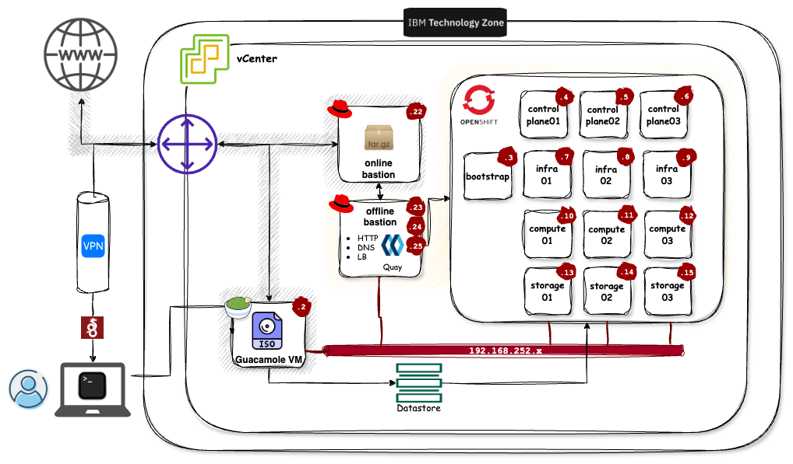

!!! tip "Shout-out :loudspeaker:"
    Big shout-out to the [SPGI CSM Team](https://pages.github.ibm.com/CSM-SPGI/training/openshift/airgap-4-16/) for creating the majority of this workshop. A huge thank you to them.

!!! danger "Disclaimer"
    This material has been created for training and learning purposes. It is not, by any means, official documentation supported by either IBM or Red Hat.

The following diagram illustrates the architecture of the OpenShift cluster air-gapped installation we are conducting in this training course. The servers within the cluster operate in an air-gapped environment, completely isolated from the Internet, with no inbound or outbound access. To facilitate the installation, a specialized machine external to the cluster and connected to the Internet is employed. This machine, designated as the **online bastion**, downloads all necessary packages and binaries required for the installation, mirroring real-world client scenarios.

Packages and binaries are then transferred from the online bastion to a machine situated within the internal network of the cluster, which has no Internet connectivity whatsoever. This internal machine is referred to as the **offline bastion**. The OpenShift installation will be initiated from this offline bastion, as it holds exclusive access to the internal network where the cluster resides.

{: style="max-height:700px"}

During the air-gapped OpenShift installation conducted in this training course, we will create and configure 3 control plane nodes (aka master nodes), 3 infrastructure nodes (aka infra nodes), 3 storage nodes and 3 compute nodes (aka worker nodes), along with both 'offline' and 'online' bastion nodes. Should the need arise, additional compute nodes can be added at a later stage.

The version of the OpenShift Container Platform (OCP) to be installed is 4.16. Correspondingly, an OpenShift (oc) client of this same version, 4.16, will be downloaded and installed on the bastion machines for subsequent operations against the OpenShift cluster.

Servers specifications:

| **Type** | **Number of servers** | **vCPU** | **RAM Memory** | **Storage (system)** | **Storage (data)** |
|------|-------------------|------|------------|------------------|----------------|
|Bastion    |2|4 vCPU|16 GB|700 GB|0 GB|
|Control Plane     |3|4 vCPU|16 GB|120 GB|0 GB|
|Compute    |3|4 vCPU|16 GB|120 GB|0 GB|
|Infra      |3|4 vCPU|16 GB|120 GB|0 GB|
|Storage    |3|16 vCPU|64 GB|120 GB|512 GB|
|Bootstrap  |1|4 vCPU|16 GB|120 GB|0 GB|

!!! example "Lab environment"
    Use this [:fontawesome-solid-play: **link**](https://techzone.ibm.com/my/reservations/create/65ec3d59d539d900110128a1){ .md-button } to the IBM Technology Zone to request an environment to carry out this tutorial. Make sure you select at least 3TB for the DataStore and VPN is enabled:

    {: style="max-height:200px"}

    !!! important "Important"
    While utilizing a VMware vSphere IBM Technology Zone environment, we will not leverage any of the VMware features integrated within the OpenShift Installer for deployment purposes. Instead, we are considering this setup as an elevated "bare-metal" environment, where virtual machines emulate bare-metal servers closely.
