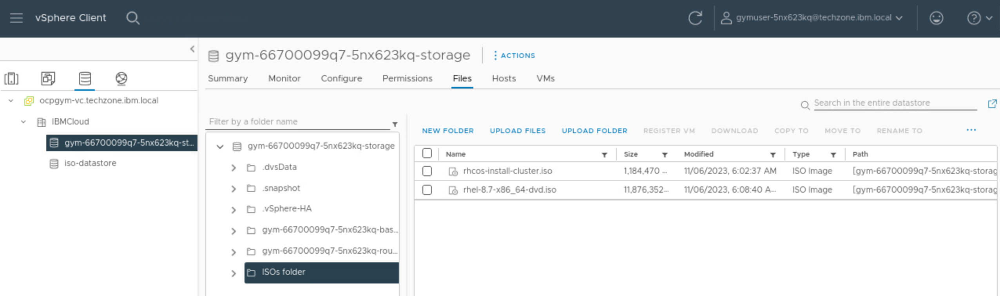
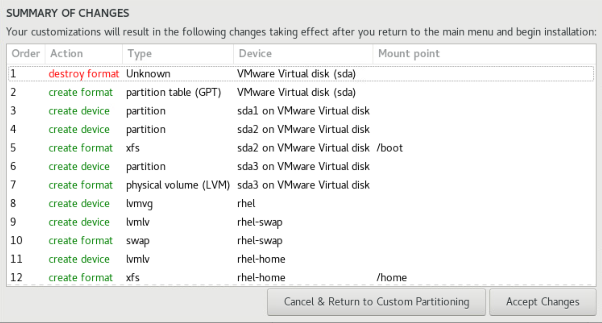
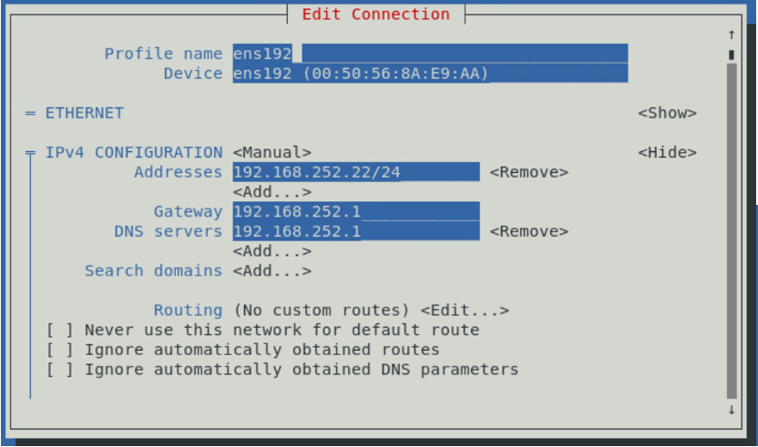

!!! tip "Shout-out :loudspeaker:"
    Big shout-out to the [SPGI CSM Team](https://pages.github.ibm.com/CSM-SPGI/training/openshift/airgap-4-16/) for creating the majority of this workshop. A huge thank you to them.

!!! danger "Disclaimer"
    This material has been created for training and learning purposes. It is not, by any means, official documentation supported by either IBM or Red Hat.

## 1. Solution Architecture

The following diagram illustrates the architecture of the OpenShift cluster air-gapped installation we are conducting in this training course. The servers within the cluster operate in an air-gapped environment, completely isolated from the Internet, with no inbound or outbound access. To facilitate the installation, a specialized machine external to the cluster and connected to the Internet is employed. This machine, designated as the **online bastion**, downloads all necessary packages and binaries required for the installation, mirroring real-world client scenarios.

Packages and binaries are then transferred from the online bastion to a machine situated within the internal network of the cluster, which has no Internet connectivity whatsoever. This internal machine is referred to as the **offline bastion**. The OpenShift installation will be initiated from this offline bastion, as it holds exclusive access to the internal network where the cluster resides.

{: style="max-height:700px"}

During the air-gapped OpenShift installation conducted in this training course, we will create and configure 3 control plane nodes (aka master nodes), 3 infrastructure nodes (aka infra nodes), 3 storage nodes and 3 compute nodes (aka worker nodes), along with both 'offline' and 'online' bastion nodes. Should the need arise, additional compute nodes can be added at a later stage.

The version of the OpenShift Container Platform (OCP) to be installed is 4.16. Correspondingly, an OpenShift (oc) client of this same version, 4.16, will be downloaded and installed on the bastion machines for subsequent operations against the OpenShift cluster.

Servers specifications:

| **Type** | **Number of servers** | **vCPU** | **RAM Memory** | **Storage (system)** | **Storage (data)** |
|------|-------------------|------|------------|------------------|----------------|
|Bastion    |2|4 vCPU|16 GB|700 GB|0 GB|
|Control Plane     |3|4 vCPU|16 GB|120 GB|0 GB|
|Compute    |3|8 vCPU|32 GB|300 GB|0 GB|
|Infra      |3|8 vCPU|32 GB|120 GB|0 GB|
|Storage    |3|16 vCPU|64 GB|120 GB|512 GB|
|Bootstrap  |1|4 vCPU|16 GB|120 GB|0 GB|

!!! example "Lab environment"
    Use this [**link**](https://techzone.ibm.com/my/reservations/create/65ec3d59d539d900110128a1) to the IBM Technology Zone to request an environment to carry out this tutorial. Make sure you select at least 3TB for the DataStore and VPN is enabled:

    {: style="max-height:200px"}

    !!! important "Important"
    While utilizing a VMware vSphere IBM Technology Zone environment, we will not leverage any of the VMware features integrated within the OpenShift Installer for deployment purposes. Instead, we are considering this setup as an elevated "bare-metal" environment, where virtual machines emulate bare-metal servers closely.

## 2. Infrastructure Services

In the 'offline' bastion node, the HTTP server, load balancer, image registry, DNS, and OCP deployment utilities will all be configured.

Given that the network lacks a DHCP server and maintains static IP addresses for all machines, we are required to manually assign each machine's IP, DNS, and hostname details upon creation.

## 3. Network Configuration

The following table contains the network configuration where the cluster will be installed:

| **Configuration** | **Option** |
|---------------|--------|
|**Subnet name**        |ocp4.platformengineers.xyz|
|**IP address space**   |**192.168.252.0/24**|

The following table contains the OCP network configuration:

| **Option**                        |                       |
|-----------------------------------|-----------------------|
|**Network: External**              ||
|IP address space                   |**192.168.252.0/24**|
|Assigned IP address range          |192.168.252.1-192.168.252.254|
|Number of available IP addresses   |254|
|**Network: Cluster**               ||
|IP address space                   |**9.248.0.0/14**|
|IP address range                   |9.248.0.1-9.248.255.254|
|Subnet prefix                      |24|
|Number of available IP addresses   |262.142|
|Number of IP addresses per node    |254|
|Maximum number of nodes            |1024|
|**Network: Service**               ||
|IP address space                   |**10.248.0.0/16**|
|IP address range                   |10.248.0.1-10.248.255.254|
|Number of available IP addresses   |65.534|

## 4. Entries in the DNS server

These are the DNS entries for the DNS servers:

|**Type** |**FQDN hostname**| **IP Address**|
|---------|-----------------|---------------|
|**Bastion**    |bastion.ocp4.platformengineers.xyz      |192.168.252.23|
|               |bastiononline.ocp4.platformengineers.xyz|192.168.252.22|
|**Bootstrap**  |bootstrap.ocp4.platformengineers.xyz    |192.168.252.3|
|**Control Plane**     |controlplane01.ocp4.platformengineers.xyz     |192.168.252.4|
|               |controlplane02.ocp4.platformengineers.xyz     |192.168.252.5|
|               |controlplane03.ocp4.platformengineers.xyz     |192.168.252.6|
|**Infra**      |infra01.ocp4.platformengineers.xyz      |192.168.252.7|
|               |infra02.ocp4.platformengineers.xyz      |192.168.252.8|
|               |infra03.ocp4.platformengineers.xyz      |192.168.252.9|
|**Compute**     |compute01.ocp4.platformengineers.xyz     |192.168.252.10|
|               |compute02.ocp4.platformengineers.xyz     |192.168.252.11|
|               |compute03.ocp4.platformengineers.xyz     |192.168.252.12|
|**Storage**     |storage01.ocp4.platformengineers.xyz     |192.168.252.13|
|               |storage02.ocp4.platformengineers.xyz     |192.168.252.14|
|               |storage03.ocp4.platformengineers.xyz     |192.168.252.15|

And these are the service names:

|**Name** |**FQDN hostname** |**Type** |**IP**|
|---------|------------------|---------|------|
|**VIP API**        |api.ocp4.platformengineers.xyz|A/AAA or CNAME|192.168.252.24|
|**VIP API-INT**    |api-int.ocp4.platformengineers.xyz|A/AAA or CNAME|192.168.252.24|
|**VIP Ingress**       |*.apps.ocp4.platformengineers.xyz|A/AAA or CNAME|192.168.252.25|

## 5. Load Balancer Configuration

We will configure the HAProxy load balancer within the "offline" Bastion node, as follows:

|**Front End** |**Targets** |**Port**|
|---------|------------------|---------|
|**\*.apps.ocp4.platformengineers.xyz**   |infra01.ocp4.platformengineers.xyz |80|
|                               |infra02.ocp4.platformengineers.xyz||
|                               |infra03.ocp4.platformengineers.xyz|| 
|                               |compute01.ocp4.platformengineers.xyz||
|                               |compute02.ocp4.platformengineers.xyz||
|                               |compute03.ocp4.platformengineers.xyz||
|                               |storage01.ocp4.platformengineers.xyz||
|                               |storage02.ocp4.platformengineers.xyz||
|                               |storage03.ocp4.platformengineers.xyz||
|**\*.apps.ocp4.platformengineers.xyz**   |infra01.ocp4.platformengineers.xyz|443|
|                               |infra02.ocp4.platformengineers.xyz||
|                               |infra03.ocp4.platformengineers.xyz||
|                               |compute01.ocp4.platformengineers.xyz||
|                               |compute02.ocp4.platformengineers.xyz||
|                               |compute03.ocp4.platformengineers.xyz||
|                               |storage01.ocp4.platformengineers.xyz||
|                               |storage02.ocp4.platformengineers.xyz||
|                               |storage03.ocp4.platformengineers.xyz||
|**api.ocp4.platformengineers.xyz**      |bootstrap.ocp4.platformengineers.xyz|6443|
|                               |controlplane01.ocp4.platformengineers.xyz||
|                               |controlplane02.ocp4.platformengineers.xyz||
|                               |controlplane03.ocp4.platformengineers.xyz||
|**api-int.ocp4.platformengineers.xyz**  |bootstrap.ocp4.platformengineers.xyz|22623|
|                               |controlplane01.ocp4.platformengineers.xyz||
|                               |controlplane02.ocp4.platformengineers.xyz||
|                               |controlplane03.ocp4.platformengineers.xyz||

## 6. VPN Configuration

In order to connect via ssh to the machines created during the OpenShift installation, which are placed in the `192.168.252.0/24` private network, and to the VMware vSphere vCenter we need to complete the following steps:

  1. Download and install the VPN manager **Wireguard** (available in the App Store).

    {: style="max-height:50px"}

  1. Download the VPN config file from the IBM Tech Zone using the following button:

    {: style="max-height:50px"}

  1. Open Wireguard and import the downloaded file as a new VPN tunel.
  
  1. Active the VPN.

    {: style="max-height:600px"}

## 7. Guacamole VM

Once we have configured and activated the VPN, we need to navigate to our VMware vSphere vCenter home page using the URL at the bottom of our IBM Tech Zone reservation. VMware vSphere vCenter login credentials can also be found on the same reservation.

{: style="max-height:300px"}

Once we have successfully logged into our VMware vSphere vCenter, we should see the following screen:

{: style="max-height:900px"}

In our VMware vSphere vCenter environment, there exists a unique Virtual Machine (VM), referred to as the **Guacamole VM**. This term does not pertain to OpenShift bastion nodes but rather denotes a specific VM managed by the IBM TechZone infrastructure team.

The purpose of this Guacamole VM is to facilitate tasks requiring substantial internet bandwidth within the VMware vSphere vCenter network environment. By doing so, it avoids potential lag or slowdowns associated with VPN tunnel connections. Essentially, placing this VM on the vCenter network allows for rapid access to heavy components necessary for OpenShift installations directly from within the internal network.

This setup significantly enhances efficiency when downloading large files or elements crucial for the OpenShift installation process at the VMware vSphere vCenter level. It ensures smoother and quicker data transfers compared to relying on VPN tunnel connections, which could otherwise lead to slower speeds and potential connectivity issues.

{: style="max-height:300px"}

In order to create the bastion machines, we first must upload a RHEL 8.7 OS ISO file to the vCenter datastore. As previously explained, for this heavy task (~11GB), we will utilize the Guacamole VM.

!!! warning "Important"
    Due to potential issues, accessing the Guacamole VM through these three steps can be problematic. Persistence and multiple attempts are often necessary to successfully gain entry.

1. Open the Guacamole VM from your IBM TechZone reservation page:

    {: style="max-height:600px"}

1. This will open the following web app. Expand the All Connections section to see the two options for accessing the Guacamole VM. Use the Remote Desktop option:

    {: style="max-height:600px"}

1. Once you have gained access to the Guacamole VM, you should see a RHEL regular desktop.

    {: style="max-height:800px"}

1. Click on Activities at the top left corner of the desktop and click on Firefox to open the web browser.

1. Download the ISO from Red Hat portal:
    
    - [**Link to RH 8.7 SO ISO file**](https://access.redhat.com/downloads/content/479/ver=/rhel---8/8.7/x86_64/product-software){:target="_blank"}

1. Point the browser to the link in order to download the files.

1. Once we have downloaded the ISO file, open the vCenter using the bookmark located at the bookmarks toolbar. You can find the credentials for the vCenter in your IBM TechZone reservation.

    {: style="max-height:300px"}

1. Upload the downloaded ISO file to the vCenter datastore to make it available for the bastion VMs we will create in later sections.

    {: style="max-height:600px"}

    !!! info
        Name the folder created in step 3 as ISOs folder

1. Once the ISO image have been fully uploaded to the DataStore, you will be able to see it listed.

    {: style="max-height:400px"}

!!! tip
    We can continue to work with vCenter from our laptop's web browser. We should not need to work with the Guacamole VM anymore. 

## 8. Bastion Nodes

For this OpenShift installation, we'll employ two bastion nodes: an **online bastion** with internet access for downloading necessary components (images, executables, installation programs), and an **offline bastion** within our internal network without direct internet connectivity for transferring these components and executing the installation.

First on our agenda is to establish both online and offline bastion nodes.

### 8.1. Create the online bastion node

Now, we shall proceed to create the virtual machine designated as the online bastion, which will operate using RHEL 8.7 and feature internet connectivity.

| **Option** | **Configuration** |
|------------|-------------------|
|**FQDN hostname** |bastiononline.ocp4.platformengineers.xyz|
|**Static IP Address** |192.168.252.22|
|**Operating System** |Red Hat Enterprise Linux|
|**OS Version** |8.7|
|**OS Language** |English-US|

1. Click on the VMs tab. Then, right click on the folder assigned to our vCenter user and select "New Virtual Machine".

    {: style="max-height:500px"}

1. Click next on the first page to go to the page where we will assign a name to the bastion online virtual machine. In our case we will use `bastiononline.ocp4.platformengineers.xyz` for the name of the VM we are creating.

1. Skip step 3.

1. On the step 4, select datastore started with `gym-` and click next:

    {: style="max-height:300px"}

1. Skip the step 5.

1. On the step 6, select the "Guest OS Family" as `Linux` and "Guest OS Version" as `Red Hat Enterprise Linux 8 (64-bit)` and click next.

    {: style="max-height:300px"}

1. On the step 7, specify the details of the virtual machine according to the table below

    | **Type** | **vCPU** | **RAM Memory** | **Storage (system)** | **Storage (data)** |
    |------|------|------------|------------------|----------------|
    |Bastion    |8 vCPU|32 GB|700 GB|0 GB|

    {: style="max-height:600px"}

    On "New CD/DVD Drive" select `Datastore ISO File` and then navigate to the ISO folder where we uploaded the RH 8.7 OS ISO file in the previous section and select such ISO file.

    {: style="max-height:500px"}

    Make sure "New CD/DVD Drive" connect is **checked** and click next.

    {: style="max-height:70px"}

1. Finish the creation of the VM.

!!! tip
    We might need to click on the refresh arrow icon at the top center of the vCenter web application in order to see our newly created VM.

Once the VM has been created successfully we must start the machine and proceed with the OS installation.

1. Select our newly created VM and click on the play button to start the VM.

    {: style="max-height:300px"}

1. Click on launch web console to proceed with the OS installation.

    {: style="max-height:300px"}

1. Click on the screen that will pop up and select install Red Hat OS.

    {: style="max-height:500px"}

1. Click Continue

    {: style="max-height:600px"}

1. Add disk.

    {: style="max-height:600px"}

1. Select `Custom` for the "Storage Configuration" and click done.

    {: style="max-height:600px"}

1. Click on the `Click here to create them automatically` link so that a default mount point and partition are created.

    {: style="max-height:600px"}

1. Set the amount of disk for the `/home` and `/` mount points as described in the picture below. This will allow us to have the required space for the things to be installed at the root mount point which is where the `root` user will inherit from.

    {: style="max-height:600px"}

    !!! tip
        When we set the disk space for a mount point in the text box, we need to click on the `Update Settings` button that will get enabled to take effect.

1. Click Done and Accept Changes on the message with the changes to be applied that will pop up.

    {: style="max-height:400px"}

1. On the main menu, click now on the Software Selection option at the bottom of the center options colunm. Then, select the "Minimal install" and click done.

    {: style="max-height:600px"}

1. Create the root credentials, for example `passw0rd` and click done.

1. Click Begin Installation.

1. When the installation finishes, click on Reboot System.

After the OS is installed and we restarted the server, login with root credentials (`root/passw0rd`). We will be able to connect using the web console link which will open a new tab in our browser. 

1. Use Network Manager Tool UI (nmtui) for configuring the network properties.

    ```{ .bash .copy title="[root@localhost ~]#"}
    nmtui
    ```

1. Click on Edit a connection

    {: style="max-height:300px"}
 
1. Select "ens192".
1. Use the arrows and intro to change the IPv4 CONFIGURATION from `<Automatic>` to `<Manual>`
1. Then, use the arrows and intro to `<Show>` details.
1. Fill the properties as shown in the pictures below

    {: style="max-height:600px"}

1. Use the arrows and space bar to select the `Automatically connect` option at the bottom.

    {: style="max-height:260px"}

1. Click `<OK>`
1. Click `<Back>`
1. Click `<OK>`

### 8.2. Create the offline bastion node

Follow the same steps from the previous section in order to create the offline bastion with the following specs:

| **Option** | **Configuration** |
|------------|-------------------|
|**FQDN hostname** |bastion.ocp4.platformengineers.xyz|
|**Static IP Address** |192.168.252.23|
|**Operating System** |Red Hat Enterprise Linux|
|**OS Version** |8.7|
|**OS Language** |English-US|

We also need to edit the network configuration but this time we need to configure it so that the offline bastion does not have internet access but we can still connect to it via ssh. 

1. We will use Network Manager Tool UI (nmtui) for configuring the network properties.

    ```{ .bash .copy title="[root@bastion ~]"}
    nmtui
    ```

1. Click on Edit a connection

    {: style="max-height:300px"}
 
1. Select "ens192".
1. Use the arrows and intro to change the IPv4 CONFIGURATION from `<Automatic>` to `<Manual>`
1. Then, use the arrows and intro to `<Show>` details.
1. Fill the properties as shown in the pictures below

    {: style="max-height:600px"}

1. Configure the routing so that we simulate no internet connection:

    {: style="max-height:600px"}

1. Use the arrows and space bar to select the `Automatically connect` option at the bottom.

    {: style="max-height:260px"}

1. Click `<OK>`
1. Click `<OK>`
1. Click `<Back>`
1. Click `<OK>`

After doing this configuration, try the following commands from the offline bastion terminal to check the connection to internet:

```{: .text .copy title="[root@localhost ~]"}
ping 192.168.252.1
```

```{ .text .no-copy title="Output"}
PING 192.168.252.1 (192.168.252.1) 56(84) bytes of data.
64 bytes from 192.168.252.1: icmp_seq=1 ttl=64 time=0.398 ms
^C
--- 192.168.252.1 ping statistics ---
1 packets transmitted, 1 received, 0% packet loss, time 0ms
rtt min/avg/max/mdev = 0.398/0.398/0.398/0.000 ms
```

```{ .text .copy title="[root@localhost ~]"}
ping 8.8.8.8
```

```{ .text .no-copy title="Output"}
connect: Network is unreachable
```

```{ .text .copy title="[root@localhost ~]"}
ping www.google.com
```

```{ .text .no-copy title="Output"}
ping: www.google.com: Name or service not known
```

!!! tip "Important"

    From now on, we can use our own laptop's terminal to ssh into the different VMs and carry on with the OpenShift installation. We should not need to use the web console of the bastions from the vCenter UI.

From your laptop's terminal, make sure you can ssh into the online bastion and offline bastion:

```{ .text .copy title="[student laptop]"}
ssh root@192.168.252.22
```

```{ .text .copy title="[student laptop]"}
ssh root@192.168.253.22
```

## 9. Disable SELINUX in the online bastion

In order to perform the correct configuration of the bastion node, it is recommended that the `SELINUX` is deactivated first.

!!! note
    It is not strictly necessary that Linux Security is deactivated in order to install OpenShift. However, it is recommended as it eases the installation. Otherwise, you would need to open several specific ports and add rules to the firewall so that the needed communication is allowed.

1. Access the online bastion:

    ```{ .text .copy title="[student laptop]"}
    ssh root@192.168.252.22
    ```

1. Open the `/etc/selinux/config` to disable the `SELINUX`

    ```{ .bash .copy title="[root@localhost ~]"}
    vi /etc/selinux/config
    ```

1. Make sure your file looks like below, where the highlighted line has been modified:

    ```{ .properties .no-copy title="/etc/selinux/config" hl_lines="6"}
    # This file controls the state of SELinux on the system.
    # SELINUX= can take one of these three values:
    # enforcing - SELinux security policy is enforced.
    # permissive - SELinux prints warnings instead of enforcing.
    # disabled - No SELinux policy is loaded.
    SELINUX=disabled
    # SELINUXTYPE= can take one of these three values:
    # targeted - Targeted processes are protected,
    # minimum - Modification of targeted policy. Only selected processes are protected.
    # mls - Multi Level Security protection. SELINUXTYPE=targeted
    ```

    Once the change is made, save and exit the file (`esc` and `:wq`) 
    
1. Restart the server for the changes to take effect.

    ```{ .text .copy title="[root@localhost ~]"}
    init 6
    ```

## 10. Disable firewall in the online bastion

Also, and since it is an internal network, the firewall of the machine is deactivated

1. Access the online bastion:

    ```{ .text .copy title="[student laptop]"}
    ssh root@192.168.252.22
    ```

1. Stop the firewall:

    ```{ .text .copy title="[root@localhost ~]"}
    systemctl stop firewalld
    systemctl disable firewalld
    ```

    ```{ .text .no-copy title="Output"}
    Removed /etc/systemd/system/multi-user.target.wants/firewalld.service. 
    Removed /etc/systemd/system/dbus-org.fedoraproject.FirewallD1.service.
    ```

## 11. Configure the hostname for the online bastion

We need to change the online bastion machine's default hostname as we will be referring to this machine from the DNS, load balancer, etc using a different hostname.

1. Edit the hostname of the machine

    ```{ .text .copy title="[root@localhost ~]"}
    vi /etc/hostname
    ```

    set the hostname to `bastiononline.ocp4.platformengineers.xyz`

1. Once the change has been made, restart the server for it to take effect.

    ```{ .text .copy title="[root@localhost ~]"}
    init 6
    ```

1. Access the online bastion again:

    ```{ .text .copy title="[student laptop]"}
    ssh root@192.168.252.22
    ```

1. Check the hostname was successfully modified:

    ```{ .text .copy title="[root@bastiononline ~]"}
    ping bastiononline.ocp4.platformengineers.xyz
    ```

    You should see similar output as below:

    ```{ .text .no-copy title="Output"}
    PING bastiononline.ocp4.platformengineers.xyz(bastiononline.ocp4.platformengineers.xyz (fe80::250:56ff:fe8a:3e00%ens192)) 56 data bytes
    64 bytes from bastiononline.ocp4.platformengineers.xyz (fe80::250:56ff:fe8a:3e00%ens192): icmp_seq=1 ttl=64 time=0.036 ms
    64 bytes from bastiononline.ocp4.platformengineers.xyz (fe80::250:56ff:fe8a:3e00%ens192): icmp_seq=2 ttl=64 time=0.040 ms
    64 bytes from bastiononline.ocp4.platformengineers.xyz (fe80::250:56ff:fe8a:3e00%ens192): icmp_seq=3 ttl=64 time=0.042 ms
    ```

1. Finish the ping command with `ctrl+c`

## 12. Install required RedHat packages in the online bastion

For the installation of rpm packages on the online machine, the RHEL 8.7 OS ISO file that we created the VM from will help us.

!!! info "Note"
    We can skip this step if we register the machine with a Red Hat subscription, which falls outside this workshop.

1. Make sure that, in the vCenter, the online bastion has the CD/DVD drive as connected:

    {: style="max-height:100px"}

2. The purpose of having the CD/DVD drive connected is that we can now mount this drive in the file system:

    ```{ .text .copy title="[root@bastiononline ~]"}
    mkdir /mnt/disc
    mount /dev/sr0 /mnt/disc
    ```

    ```{ .text .no-copy title="Output"}
    mount: /mnt/disc: WARNING: device write-protected, mounted read-only.
    ```

3. Create the following following `rhel87dvd.repo` file that will define our RHEL OS repos:

    ```{ .text .copy title="[root@bastiononline ~]"}
    vi /etc/yum.repos.d/rhel87dvd.repo
    ```

    ```{ .properties .copy title="rhel87dvd.repo"}
    [InstallMediaBase]
    name=Red Hat Enterprise Linux 8.7.0 Base
    mediaid=None
    metadata_expire=-1
    gpgcheck=0
    cost=500
    enabled=1
    baseurl=file:///mnt/disc/BaseOS

    [InstallMediaApps]
    name=Red Hat Enterprise Linux 8.7.0 App
    mediaid=None
    metadata_expire=-1
    gpgcheck=0
    cost=500
    enabled=1
    baseurl=file:///mnt/disc/AppStream
    [InstallMediaParches]
    name=Red Hat Enterprise Linux KErnel
    mediaid=None
    metadata_expire=-1
    gpgcheck=0
    cost=500
    enabled=0
    baseurl=file:///mnt/parches
    ```

4. Make sure the cache is cleaned:

    ```{ .text .copy title="[root@bastiononline ~]"}
    yum clean all
    ```

    ```{ .text .no-copy title="Output"}
    Updating Subscription Management repositories.
    Unable to read consumer identity

    This system is not registered with an entitlement server. You can use subscription-manager to register.

    0 files removed
    ```

5. Make sure the new repositories are enabled:

    ```{ .text .copy title="[root@bastiononline ~]"}
    yum repolist enabled
    ```

    ```{ .text .no-copy title="Output" hl_lines="7 8"}
    Updating Subscription Management repositories.
    Unable to read consumer identity

    This system is not registered with an entitlement server. You can use subscription-manager to register.

    repo id                                   repo name
    InstallMediaApps                          Red Hat Enterprise Linux 8.7.0 App
    InstallMediaBase                          Red Hat Enterprise Linux 8.7.0 Base
    ```

Once you have created the offline repository and confirmed it is enabled, the required packages can be installed with the **yum** utility.

The following packages have been installed on the online bastion server. Some packages may not be used during the execution of online commands, but they are installed so that the "online" and "offline" bastion settings are as identical as possible.

```{ .text .copy title="[root@bastiononline ~]"}
yum install -y  podman \
                jq openssl httpd-tools curl wget telnet nfs-utils \
                httpd.x86_64 \
                bind bind-utils rsync mkisofs
```

```{ .text .no-copy title="Output"}
Updating Subscription Management repositories.
Unable to read consumer identity

This system is not registered with an entitlement server. You can use subscription-manager to register.

Red Hat Enterprise Linux 8.7.0 Base                                                                                          40 MB/s | 2.4 MB     00:00    
Red Hat Enterprise Linux 8.7.0 App                                                                                           53 MB/s | 7.8 MB     00:00    
Package openssl-1:1.1.1k-7.el8_6.x86_64 is already installed.
Package curl-7.61.1-25.el8.x86_64 is already installed.
Dependencies resolved.
============================================================================================================================================================
 Package                                   Architecture        Version                                                  Repository                     Size
============================================================================================================================================================
Installing:
 bind                                      x86_64              32:9.11.36-5.el8                                         InstallMediaApps              2.1 M
 bind-utils                                x86_64              32:9.11.36-5.el8                                         InstallMediaApps              452 k
 genisoimage                               x86_64              1.1.11-39.el8                                            InstallMediaApps              316 k
 httpd                                     x86_64              2.4.37-51.module+el8.7.0+16050+02173b8e                  InstallMediaApps              1.4 M
 httpd-tools                               x86_64              2.4.37-51.module+el8.7.0+16050+02173b8e                  InstallMediaApps              109 k
 jq                                        x86_64              1.6-3.el8                                                InstallMediaApps              202 k
 nfs-utils                                 x86_64              1:2.3.3-57.el8                                           InstallMediaBase              515 k
 podman                                    x86_64              3:4.2.0-1.module+el8.7.0+16772+33343656                  InstallMediaApps               12 M
 rsync                                     x86_64              3.1.3-19.el8                                             InstallMediaBase              410 k
 telnet                                    x86_64              1:0.17-76.el8                                            InstallMediaApps               72 k
 wget                                      x86_64              1.19.5-10.el8                                            InstallMediaApps              734 k
...
...
Complete!
```

Finally, we need to install Ansible on the system. However, this package is not included in the RHEL repositories configured previously. As a result, we will need to install it manually.

1. Download the Ansible RPM package to your laptop from the Red Hat portal.

    - [**Link to Ansible rpm**](https://access.redhat.com/downloads/content/ansible/2.9.27-1.el8ap/noarch/fd431d51/package){:target="_blank"}

1. Source copy the rpm package to the online bastion

    ```{ .text .copy title="[student laptop]"}
    scp ansible-2.9.27-1.el8ap.noarch.rpm root@192.168.252.22:/root
    ```

1. Install it:

    ```{ .text .copy title="[root@bastiononline ~]"}
    yum localinstall -y ansible-2.9.27-1.el8ap.noarch.rpm
    ```

    ```{ .text .no-copy title="Output"}
    Updating Subscription Management repositories.
    Unable to read consumer identity

    This system is not registered with an entitlement server. You can use subscription-manager to register.

    Last metadata expiration check: 0:09:27 ago on Mon 06 Nov 2023 05:40:03 PM CET.
    Dependencies resolved.
    ============================================================================================================================================================
    Package                                  Architecture          Version                                               Repository                       Size
    ============================================================================================================================================================
    Installing:
    ansible                                  noarch                2.9.27-1.el8ap                                        @commandline                     17 M
    ...
    ...
    Complete!
    ```

## 13. Download OpenShift utilities to the online bastion

A directory structure is created to accommodate the different binaries that are downloaded.

- Create a directory for the registry and create the necessary directories for the registry.

    ```{ .text .copy title="[root@bastiononline ~]"}
    mkdir /root/registry
    cd registry/
    ```

    ```{ .text .copy title="[root@bastiononline registry]"}
    mkdir auth certs data downloads
    ls -lart
    ```

    ```{ .sh .no-copy title="Output"}
    total 4
    dr-xr-x---. 7 root root 4096 Sep  8 07:43 ..
    drwxr-xr-x  2 root root    6 Sep  8 07:48 downloads
    drwxr-xr-x  2 root root    6 Sep  8 07:48 data
    drwxr-xr-x  2 root root    6 Sep  8 07:48 certs
    drwxr-xr-x  2 root root    6 Sep  8 07:48 auth
    drwxr-xr-x  6 root root   60 Sep  8 07:48 .
    ```

    ```{ .text .copy title="[root@bastiononline registry]"}
    cd downloads/
    ```

    ```{ .text .copy title="[root@bastiononline downloads]"}
    mkdir images tools secrets
    ls -lart
    ```

    ```{ .sh .no-copy title="Output"}
    total 0
    drwxr-xr-x 6 root root 60 Sep  8 07:48 ..
    drwxr-xr-x 2 root root  6 Sep  8 07:59 tools
    drwxr-xr-x 2 root root  6 Sep  8 07:59 secrets
    drwxr-xr-x 2 root root  6 Sep  8 07:59 images
    drwxr-xr-x 5 root root 48 Sep  8 07:59 .
    ```

The folder structure that should have got created should look like this:

```{ .test .no-copy title="Directory structure"}
/root
`-- registry
    |-- auth
    |-- certs
    |-- data
    `-- downloads
        |-- images
        |-- secrets
        `-- tools
```

For the OpenShift client, the following steps have been followed:

- OpenShift client download:

    ```{ .text .copy title="[root@bastiononline downloads]"}
    cd tools/
    ```

    ```{ .text .copy title="[root@bastiononline tools]"}
    wget https://mirror.openshift.com/pub/openshift-v4/clients/ocp/4.16.9/openshift-client-linux-amd64-rhel8-4.16.9.tar.gz
    ```

- Extracting the contents of the downloaded file:

    ```{ .text .copy title="[root@bastiononline tools]"}
    tar -xvf openshift-client-linux-amd64-rhel8-4.16.9.tar.gz
    ```

    ```{ .text .no-copy title="Output"}
    README.md
    oc
    kubectl
    ```

    ```{ .text .copy title="[root@bastiononline tools]"}
    ls -lart
    ```

    ```{ .sh .no-copy title="Output"}
    total 1156008
    -rwxr-xr-x 2 root root  159905720 Aug 21 01:54 oc
    -rwxr-xr-x 2 root root  159905720 Aug 21 01:54 kubectl
    -rw-r--r-- 1 root root        950 Aug 21 01:54 README.md
    -rw-r--r-- 1 root root   66705673 Aug 22 22:05 openshift-client-linux-amd64-rhel8-4.16.9.tar.gz
    drwxr-xr-x 5 root root         48 Sep 21 07:55 ..
    drwxr-xr-x 2 root root        164 Sep 21 11:19 .
    ```

- Copy to a location accessible from your $PATH (e.g. /usr/bin):

    ```{ .text .copy title="[root@bastiononline tools]"}
    cp /root/registry/downloads/tools/oc /usr/bin/oc
    ```

For the OpenShift installer, the following steps should be followed:

- Downloading the OpenShift Installer

    ```{ .text .copy title="[root@bastiononline tools]"}
    wget https://mirror.openshift.com/pub/openshift-v4/clients/ocp/4.16.9/openshift-install-linux-4.16.9.tar.gz
    ```

- Extract the contents of the downloaded file:

    ```{ .text .copy title="[root@bastiononline tools]"}
    tar -xvf openshift-install-linux-4.16.9.tar.gz
    ```

    ```{ .text .no-copy title="Output"}
    README.md
    openshift-install
    ```

    ```{ .text .copy title="[root@bastiononline tools]"}
    ls -lart
    ```

    ```{ .sh .no-copy title="Output"}
    total 1156008
    -rwxr-xr-x 2 root root  159905720 Aug 21 01:54 oc
    -rwxr-xr-x 2 root root  159905720 Aug 21 01:54 kubectl
    -rwxr-xr-x 1 root root  707731456 Aug 21 03:44 openshift-install
    -rw-r--r-- 1 root root        706 Aug 21 03:44 README.md
    -rw-r--r-- 1 root root   66705673 Aug 22 22:05 openshift-client-linux-amd64-rhel8-4.16.9.tar.gz
    -rw-r--r-- 1 root root  510253136 Aug 22 22:05 openshift-install-linux-4.16.9.tar.gz
    drwxr-xr-x 5 root root         48 Sep 21 07:55 ..
    drwxr-xr-x 2 root root        164 Sep 21 11:19 .
    ```

- Copy to a location accessible from your $PATH (e.g. /usr/bin):

    ```{ .text .copy title="[root@bastiononline tools]"}
    cp /root/registry/downloads/tools/openshift-install /usr/bin/openshift-install
    ```

For the Mirror registry, the following steps should be followed:

- Download the mirror-registry

    ```{ .text .copy title="[root@bastiononline tools]"}
    wget https://mirror.openshift.com/pub/cgw/mirror-registry/latest/mirror-registry-amd64.tar.gz
    ```

- Extracting the contents of the downloaded file:

    ```{ .text .copy title="[root@bastiononline tools]"}
    tar -xvf mirror-registry-amd64.tar.gz
    ```

    ```{ .text .no-copy title="Output"}
    image-archive.tar
    execution-environment.tar
    mirror-registry
    ```

    ```{ .text .copy title="[root@bastiononline tools]"}
    ls -lart
    ```

    ```{ .sh .no-copy title="Output"}
    total 4019476
    -rwxr-xr-x 2 root root  160465008 Aug 21 00:49 oc
    -rwxr-xr-x 2 root root  160465008 Aug 21 00:49 kubectl
    -rwxr-xr-x 1 root root  707731456 Aug 21 03:44 openshift-install
    -rw-r--r-- 1 root root        706 Aug 21 03:44 README.md
    -rw-r--r-- 1 root root   66941882 Aug 22 22:05 openshift-client-linux-4.16.9.tar.gz
    -rw-r--r-- 1 root root  510253136 Aug 22 22:05 openshift-install-linux-4.16.9.tar.gz
    -rwxr-xr-x 1 root root    9824888 Sep 23 18:46 mirror-registry
    -rw-r--r-- 1 root root  113418240 Sep 23 18:47 sqlite3.tar
    -rw-r--r-- 1 root root  316753920 Sep 23 18:50 execution-environment.tar
    -rw-r--r-- 1 root root 1454929920 Sep 23 18:50 image-archive.tar
    -rw-r--r-- 1 root root  607056480 Sep 26 11:44 mirror-registry-amd64.tar.gz
    drwxr-xr-x 5 root root         48 Oct 24 19:16 ..
    drwxr-xr-x 2 root root       4096 Oct 24 19:41 .
    ```

For the oc-mirror plugin, the following steps should be followed:

- Download the oc mirror program to make mirror of OCP and its operators

    ```{ .text .copy title="[root@bastiononline tools]"}
    wget https://mirror.openshift.com/pub/openshift-v4/x86_64/clients/ocp/4.16.19/oc-mirror.tar.gz
    ```

- Extracting the contents of the downloaded file:

    ```{ .text .copy title="[root@bastiononline tools]"}
    tar xvfz oc-mirror.tar.gz
    ```

    ```{ .text .no-copy title="Output"}
    oc-mirror
    ```

    ```{ .text .copy title="[root@bastiononline tools]"}
    ls -lart
    ```

    ```{ .sh .no-copy title="Output"}
    total 4245772
    -rwxr-xr-x 2 root root  159905720 Aug 21 01:54 oc
    -rwxr-xr-x 2 root root  159905720 Aug 21 01:54 kubectl
    -rwxr-xr-x 1 root root  707731456 Aug 21 03:44 openshift-install
    -rw-r--r-- 1 root root        706 Aug 21 03:44 README.md
    -rw-r--r-- 1 root root   66705673 Aug 22 22:05 openshift-client-linux-amd64-rhel8-4.16.9.tar.gz
    -rw-r--r-- 1 root root  510253136 Aug 22 22:05 openshift-install-linux-4.16.9.tar.gz
    -rwxr-xr-x 1 root root    9824888 Sep 23 18:46 mirror-registry
    -rw-r--r-- 1 root root  113418240 Sep 23 18:47 sqlite3.tar
    -rw-r--r-- 1 root root  316753920 Sep 23 18:50 execution-environment.tar
    -rw-r--r-- 1 root root 1454929920 Sep 23 18:50 image-archive.tar
    -rw-r--r-- 1 root root  607056480 Sep 26 11:44 mirror-registry-amd64.tar.gz
    -rw-r----- 1  984  984  165699280 Oct 18 02:15 oc-mirror
    -rw-r--r-- 1 root root   67385243 Oct 25 03:02 oc-mirror.tar.gz
    drwxr-xr-x 5 root root         48 Oct 24 19:16 ..
    drwxr-xr-x 2 root root       4096 Oct 25 09:22 .
    ```

- Copy to a location accessible from your $PATH (e.g. /usr/local/bin):

    ```{ .text .copy title="[root@bastiononline tools]"}
    chmod +x /root/registry/downloads/tools/oc-mirror
    cp /root/registry/downloads/tools/oc-mirror /usr/local/bin/
    oc-mirror help
    ```

For the Butane tool, the following steps should be followed:

- Download butane

    ```{ .text .copy title="[root@bastiononline tools]"}
    curl https://mirror.openshift.com/pub/openshift-v4/clients/butane/latest/butane-amd64 --output butane
    ```

    ```{ .text .copy title="[root@bastiononline tools]"}
    ls -lart
    ```

    ```{ .sh .no-copy title="Output"}
    total 4019476
    -rwxr-xr-x 2 root root  160465008 Aug 21 00:49 oc
    -rwxr-xr-x 2 root root  160465008 Aug 21 00:49 kubectl
    -rwxr-xr-x 1 root root  707731456 Aug 21 03:44 openshift-install
    -rw-r--r-- 1 root root        706 Aug 21 03:44 README.md
    -rw-r--r-- 1 root root   66941882 Aug 22 22:05 openshift-client-linux-4.16.9.tar.gz
    -rw-r--r-- 1 root root  510253136 Aug 22 22:05 openshift-install-linux-4.16.9.tar.gz
    -rwxr-xr-x 1 root root    9824888 Sep 23 18:46 mirror-registry
    -rw-r--r-- 1 root root  113418240 Sep 23 18:47 sqlite3.tar
    -rw-r--r-- 1 root root  316753920 Sep 23 18:50 execution-environment.tar
    -rw-r--r-- 1 root root 1454929920 Sep 23 18:50 image-archive.tar
    -rw-r--r-- 1 root root  607056480 Sep 26 11:44 mirror-registry-amd64.tar.gz
    drwxr-xr-x 5 root root         48 Oct 24 19:16 ..
    drwxr-xr-x 2 root root       4096 Oct 24 19:41 .
    -rw-r--r-- 1 root root    8070568 Oct 24 19:41 butane
    ```

For the ISO Maker tool, the following steps should be followed:

- Download the ISO Maker

    ```{ .text .copy title="[root@bastiononline ~]"}
    cd /root/
    mkdir Coreos-iso-maker
    cd Coreos-iso-maker/
    ```

    ```{ .text .copy title="[root@bastiononline Coreos-iso-maker]"}
    yum install -y git
    ```

    ```{ .text .no-copy title="Output"}
    Updating Subscription Management repositories.
    Unable to read consumer identity

    This system is not registered with an entitlement server. You can use subscription-manager to register.

    Last metadata expiration check: 0:30:40 ago on Mon 06 Nov 2023 05:40:03 PM CET.
    Dependencies resolved.
    ============================================================================================================================================================
    Package                               Architecture          Version                                                  Repository                       Size
    ============================================================================================================================================================
    Installing:
     git                                   x86_64                2.31.1-2.el8                                             InstallMediaApps                161 k
    ...
    ...
    Complete!
    ```

    ```{ .text .copy title="[root@bastiononline Coreos-iso-maker]"}
    git clone https://github.com/chuckersjp/coreos-iso-maker
    ```

    ```{ .text .no-copy title="Output"}
    Cloning into 'coreos-iso-maker'...
    remote: Enumerating objects: 391, done.
    remote: Counting objects: 100% (129/129), done.
    remote: Compressing objects: 100% (37/37), done.
    remote: Total 391 (delta 116), reused 93 (delta 92), pack-reused 262
    Receiving objects: 100% (391/391), 70.81 KiB | 1.16 MiB/s, done.
    Resolving deltas: 100% (246/246), done.
    ```

    ```{ .text .copy title="[root@bastiononline Coreos-iso-maker]"}
    ls -lart
    ```

    ```{ .sh .no-copy title="Output"}
    total 8
    dr-xr-x---. 8 root root 4096 Sep  8 11:40 ..
    drwxr-xr-x  3 root root   30 Sep  8 11:42 .
    drwxr-xr-x  4 root root 4096 Sep  8 11:42 coreos-iso-maker
    ```


## 14. (optional) Expand bastion boot disk 

!!! info
    You dont need to complete this section. It is only for reference to understand what you would need to do should you require to increase disk space on any of your bastion machines.

In case you need to increase the bastion online’s disk size because at the creation moment you didn’t set the correct amount of storage, you must follow the next steps in vCenter with the vm machine stopped:
 
{: style="max-height:700px"}

Set the correct space you need on the disk and then start the machine and follow these commands to create a new partition:

1. Access the online bastion:

    ```{ .text .copy title="[student laptop]"}
    ssh root@192.168.252.22
    ```

1. Check the actual partitions size

    ```{ .text .copy title="[root@bastiononline ~]"}
    df -h
    ```

    ```{ .text .no-copy title="Output" hl_lines="6"}
    Filesystem             Size  Used Avail Use% Mounted on
    devtmpfs                16G     0   16G   0% /dev
    tmpfs                   16G     0   16G   0% /dev/shm
    tmpfs                   16G  8.7M   16G   1% /run
    tmpfs                   16G     0   16G   0% /sys/fs/cgroup
    /dev/mapper/rhel-root  621G   12G  610G   2% /
    /dev/sda2             1014M  211M  804M  21% /boot
    /dev/sda1              599M  5.8M  594M   1% /boot/efi
    /dev/mapper/rhel-home   62G  473M   62G   1% /home
    tmpfs                  3.2G     0  3.2G   0% /run/user/0
    ```

1. List the partition tables

    ```{ .text .copy title="[root@bastiononline ~]"}
    fdisk -l
    ```

    ```{ .text .no-copy title="Output" hl_lines="16"}
    Register this system with Red Hat Insights: insights-client --register
    Create an account or view all your systems at https://red.ht/insights-dashboard
    Last login: Mon Nov  6 18:32:23 2023 from 192.168.253.2
    [root@bastiononline ~]# fdisk -l
    Disk /dev/sda: 1 TiB, 1099511627776 bytes, 2147483648 sectors
    Units: sectors of 1 * 512 = 512 bytes
    Sector size (logical/physical): 512 bytes / 512 bytes
    I/O size (minimum/optimal): 512 bytes / 512 bytes
    Disklabel type: gpt
    Disk identifier: 68D049D0-0D01-44BA-AF0F-9371047971AE

    Device          Start        End    Sectors   Size Type
    /dev/sda1        2048    1230847    1228800   600M EFI System
    /dev/sda2     1230848    3327999    2097152     1G Linux filesystem
    /dev/sda3     3328000 1468004351 1464676352 698.4G Linux LVM
    /dev/sda4  1468004352 2147483614  679479263   324G Linux filesystem


    Disk /dev/mapper/rhel-root: 621 GiB, 666793672704 bytes, 1302331392 sectors
    Units: sectors of 1 * 512 = 512 bytes
    Sector size (logical/physical): 512 bytes / 512 bytes
    I/O size (minimum/optimal): 512 bytes / 512 bytes


    Disk /dev/mapper/rhel-swap: 15.8 GiB, 16924016640 bytes, 33054720 sectors
    Units: sectors of 1 * 512 = 512 bytes
    Sector size (logical/physical): 512 bytes / 512 bytes
    I/O size (minimum/optimal): 512 bytes / 512 bytes


    Disk /dev/mapper/rhel-home: 61.7 GiB, 66194505728 bytes, 129286144 sectors
    Units: sectors of 1 * 512 = 512 bytes
    Sector size (logical/physical): 512 bytes / 512 bytes
    I/O size (minimum/optimal): 512 bytes / 512 bytes
    ```

1. Start the disk partition table tool for `/dev/sda`

    ```{ .text .copy title="[root@bastiononline ~]"}
    fdisk /dev/sda
    ```

    !!! note
        We select `n` in the first command. Then, we press enter to leave the defaults. Finally, for the second command, we select `w` (to write the partitions)

    ```{ .text .no-copy title="Output"}
    Welcome to fdisk (util-linux 2.32.1).
    Changes will remain in memory only, until you decide to write them.
    Be careful before using the write command.


    Command (m for help): n
    Partition number (4-128, default 4): 
    First sector (1468004352-2147483614, default 1468004352): 
    Last sector, +sectors or +size{K,M,G,T,P} (1468004352-2147483614, default 2147483614): 

    Created a new partition 4 of type 'Linux filesystem' and of size 324 GiB.

    Command (m for help): w
    The partition table has been altered.
    Syncing disks.
    ```

1. Expand the logical volume that has the operating system boot with the following commands
   
    ```{ .text .copy title="[root@bastiononline ~]"}
    pvcreate /dev/sda4
    ```

    ```{ .text .no-copy title="Output"}
    Physical volume "/dev/sda4" successfully created.
    ```

    ```{ .text .copy title="[root@bastiononline ~]"}
    vgs
    ```

    ```{ .text .no-copy title="Output"}
    VG   #PV #LV #SN Attr   VSize   VFree
    rhel   1   3   0 wz--n- 698.41g    0
    ```

    ```{ .text .copy title="[root@bastiononline ~]"}
    vgextend rhel /dev/sda4
    ```

    ```{ .text .no-copy title="Output"}
    Volume group "rhel" successfully extended
    ```

    ```{ .text .copy title="[root@bastiononline ~]"}
    lvs
    ```

    ```{ .text .no-copy title="Output"}
    LV   VG   Attr       LSize   Pool Origin Data%  Meta%  Move Log Cpy%Sync Convert
    home rhel -wi-ao---- <61.65g                                                    
    root rhel -wi-ao---- 621.00g                                                    
    swap rhel -wi-ao----  15.76g
    ```

    ```{ .text .copy title="[root@bastiononline ~]"}
    lvextend -l +100%FREE /dev/rhel/root
    ```

    ```{ .text .no-copy title="Output"}
    Size of logical volume rhel/root changed from 621.00 GiB (158976 extents) to <945.00 GiB (241919 extents).
    Logical volume rhel/root successfully resized.
    ```

    ```{ .text .copy title="[root@bastiononline ~]"}
    lsblk -f
    ```

    ```{ .text .no-copy title="Output" hl_lines="10"}
    NAME          FSTYPE      LABEL                    UUID                                   MOUNTPOINT
    sda                                                                                       
    |-sda1        vfat                                 6793-7237                              /boot/efi
    |-sda2        xfs                                  c43ee8e7-77b7-40af-8367-ba7ef90fcbb5   /boot
    |-sda3        LVM2_member                          kOrAn9-K2h6-RbB9-gINB-pWNL-dxVB-VkxYzZ 
    | |-rhel-root xfs                                  ba1bba3c-dea8-4e2e-9882-fd866f6d13e8   /
    | |-rhel-swap swap                                 868795de-6965-44bd-aee3-3181691531f7   [SWAP]
    | `-rhel-home xfs                                  2bb2a05b-9811-4c10-ba3b-f1ab8084460a   /home
    `-sda4        LVM2_member                          9apLnq-zxPM-HNZ3-ncc7-jgwZ-hhAg-T3GVk6 
      `-rhel-root xfs                                  ba1bba3c-dea8-4e2e-9882-fd866f6d13e8   /
    sr0           iso9660     RHEL-8-7-0-BaseOS-x86_64 2022-10-13-06-03-04-00
    ```

    ```{ .text .copy title="[root@bastiononline ~]"}
    xfs_growfs /dev/rhel/root
    ```

    ```{ .text .no-copy title="Output"}
    meta-data=/dev/mapper/rhel-root  isize=512    agcount=4, agsize=40697856 blks
            =                       sectsz=512   attr=2, projid32bit=1
            =                       crc=1        finobt=1, sparse=1, rmapbt=0
            =                       reflink=1    bigtime=0 inobtcount=0
    data     =                       bsize=4096   blocks=162791424, imaxpct=25
            =                       sunit=0      swidth=0 blks
    naming   =version 2              bsize=4096   ascii-ci=0, ftype=1
    log      =internal log           bsize=4096   blocks=79488, version=2
            =                       sectsz=512   sunit=0 blks, lazy-count=1
    realtime =none                   extsz=4096   blocks=0, rtextents=0
    data blocks changed from 162791424 to 247725056
    ```

    ```{ .text .copy title="[root@bastiononline ~]"}
    df -h
    ```

    ```{ .text .no-copy title="Output" hl_lines="6"}
    Filesystem             Size  Used Avail Use% Mounted on
    devtmpfs                16G     0   16G   0% /dev
    tmpfs                   16G     0   16G   0% /dev/shm
    tmpfs                   16G  8.7M   16G   1% /run
    tmpfs                   16G     0   16G   0% /sys/fs/cgroup
    /dev/mapper/rhel-root  945G   14G  932G   2% /
    /dev/sda2             1014M  211M  804M  21% /boot
    /dev/sda1              599M  5.8M  594M   1% /boot/efi
    /dev/mapper/rhel-home   62G  473M   62G   1% /home
    tmpfs                  3.2G     0  3.2G   0% /run/user/0
    ```

Repeat on the offline bastion if required.

## 15. Download the Red Hat CoreOS images to the online bastion

We need to download the following CoreOS images for the installation of the different OpenShift nodes: 

```{ .text .copy title="[root@bastiononline ~]"}
cd /root/registry/downloads/images/
```

```{ .text .copy title="[root@bastiononline images]"}
wget https://mirror.openshift.com/pub/openshift-v4/x86_64/dependencies/rhcos/4.16/4.16.3/rhcos-4.16.3-x86_64-metal.x86_64.raw.gz
wget https://mirror.openshift.com/pub/openshift-v4/x86_64/dependencies/rhcos/4.16/4.16.3/rhcos-4.16.3-x86_64-live.x86_64.iso
```

```{ .text .copy title="[root@bastiononline images]"}
ls -lart
```

```{ .sh .no-copy title="Output"}
total 2363592
-rw-r--r-- 1 root root 1213202432 Apr  4  2023 rhcos-4.16.3-x86_64-live.x86_64.iso
-rw-r--r-- 1 root root 1207111745 Apr  4  2023 rhcos-4.16.3-x86_64-metal.x86_64.raw.gz
drwxr-xr-x 5 root root         48 Nov  6 17:57 ..
drwxr-xr-x 2 root root         98 Nov  6 20:40 .
```

## 16. Mirror images on the online bastion

For accessing your Red Hat OpenShift pull secret – containing credentials that allow for downloading OpenShift and associated artifacts – please proceed as follows:

<https://cloud.redhat.com/openshift/install/pull-secret>

and download or copy the contents of the pull secret. 

{: style="max-height:300px"} 

1. Open the link above and copy the contents of the Red Hat OpenShift pull secret
1. Paste the contents of the Red Hat OpenShift pull secret into a file.

    ```{ .text .copy title="[root@bastiononline images]"}
    cd /root/registry/downloads/secrets/
    ```

    ```{ .text .copy title="[root@bastiononline secrets]"}
    vi pull-secret.txt
    ```

    ```{ .json .no-copy title="Output"}
    {"auths":{"cloud.openshift.com":{"auth":"<auth_secret>","email":"Miguel.Ariza.Colmenares2@ibm.com"},"quay.io":{"auth":" [……………]TdUpHajdDRGJfUUNFUk9ncjJ4Qi01V0pUVUNWenpLcmJlZU5yWGo0Y2ZTTkYzVWU3NC05N3hQMVBvQjBCYmRiOEhMemgwc0NfYjdtNzlkVDVmVGRyY3M2ZENqZzV4dEZNWnhlTTFTWEg0UWJqeDJYb2xUQ2RmekRfNzRhOXRueGVLMnFHaFZPZVVnXzBSY2t5MXZQUzVFMjFvMA==","email":"Miguel.Ariza.Colmenares2@ibm.com"}}}
    ```

1. Make a copy of your pull secret in JSON format:

    ```{ .text .copy title="[root@bastiononline secrets]"}
    cat ./pull-secret.txt | jq . > ./pull-secret.json
    ```

    The contents of the file resemble the following example:

    ```{ .json .no-copy title="Output"}
    {
    "auths": {
        "cloud.openshift.com": {
        "auth": "b3BlbnNo...",
        "email": "you@example.com"
        },
        "quay.io": {
        "auth": "b3BlbnNo...",
        "email": "you@example.com"
        },
        "registry.connect.redhat.com": {
        "auth": "NTE3Njg5Nj...",
        "email": "you@example.com"
        },
        "registry.redhat.io": {
        "auth": "NTE3Njg5Nj...",
        "email": "you@example.com"
        }
    }
    }
    ```

We need to copy the contents of the file to the container runtime directory so that it is accessible by the image download procedure. Save the file either as 

* `~/.docker/config.json` or 
* `$XDG_RUNTIME_DIR/containers/auth.json`

```{ .text .copy title="[root@bastiononline secrets]"}
echo $XDG_RUNTIME_DIR
```

```{ .text .no-copy title="Output"}
/run/user/0
```

```{ .text .copy title="[root@bastiononline secrets]"}
mkdir /run/user/0/containers
cp /root/registry/downloads/secrets/pull-secret.json /run/user/0/containers/auth.json
ls -lart /run/user/0/containers/auth.json
```

```{ .sh .no-copy title="Output"}
-rw-r--r-- 1 root root 2943 Sep 21 12:31 /run/user/0/containers/auth.json
```

Change directory in order to mirror the images

```{ .text .copy title="[root@bastiononline secrets]"}
cd /root/registry/
```

<!--

NEW METHOD IN 4.16?? Below are the instructions to mirror the OpenShift images. However, still to be done how to mirror catalogs.
https://docs.openshift.com/container-platform/4.16/installing/disconnected_install/installing-mirroring-installation-images.html

Set the required environment variables

1. Export the release version

    ```{ .text .copy title="[root@bastiononline registry]"}
    OCP_RELEASE=4.16.17
    ```

1. Export the local registry name and host port

    ```{ .text .copy title="[root@bastiononline registry]"}
    LOCAL_REGISTRY=bastion.ocp4.csm-spgi.acme.es:8443
    ```

    !!! info
        `bastion.ocp4.csm-spgi.acme.es:8443` will be the hostname and port of our container image private registry that will get installed on the offline bastion.

1. Export the local repository name

    ```{ .text .copy title="[root@bastiononline registry]"}
    LOCAL_REPOSITORY=ocp4/openshift4
    ```

1. Export the name of the repository to mirror

    ```{ .text .copy title="[root@bastiononline registry]"}
    PRODUCT_REPO=openshift-release-dev
    ```

1. Export the path to your registry pull secret

    ```{ .text .copy title="[root@bastiononline registry]"}
    LOCAL_SECRET_JSON=/run/user/0/containers/auth.json
    ```

1. Export the release mirror

    ```{ .text .copy title="[root@bastiononline registry]"}
    RELEASE_NAME=ocp-release
    ```

1. Export the type of architecture for your cluster

    ```{ .text .copy title="[root@bastiononline registry]"}
    ARCHITECTURE=x86_64
    ```

1. Export the path to the directory to host the mirrored images

    ```{ .text .copy title="[root@bastiononline registry]"}
    REMOVABLE_MEDIA_PATH=/root/registry/data
    ```

Check the actual disk space before mirroring the images

```{ .text .copy title="[root@bastiononline registry]"}
du -h
0	./auth
0	./certs
0	./data
2.4G	./downloads/images
3.7G	./downloads/tools
8.0K	./downloads/secrets
6.1G	./downloads
6.1G	.
```

Mirror the version images to the mirror registry

1. Change directory to `/root/registry/data`

    ```{ .text .copy title="[root@bastiononline registry]"}
    cd data
    ```

1. Review the images and configuration manifests to mirror

    ```{ .text .copy title="[root@bastiononline data]"}
    oc adm release mirror -a ${LOCAL_SECRET_JSON} --from=quay.io/${PRODUCT_REPO}/${RELEASE_NAME}:${OCP_RELEASE}-${ARCHITECTURE} --to=${LOCAL_REGISTRY}/${LOCAL_REPOSITORY} --to-release-image=${LOCAL_REGISTRY}/${LOCAL_REPOSITORY}:${OCP_RELEASE}-${ARCHITECTURE} --dry-run
    ```

    !!! info
        The above dry run will display a list of images that will be downloaded in order to be able to install OpenShift as well as two important sections, `imageContentSources` and `ImageContentSourcePolicy`.

1. Copy to a notepad the entire **imageContentSources** section from the output of the previous command. The information about your mirrors is unique to your mirrored repository, and you must add the `imageContentSources` section to the `install-config.yaml` file during installation.

    ```{ .yaml .copy title="[root@bastiononline data]"}
    imageContentSources:
    - mirrors:
    - bastion.ocp4.csm-spgi.acme.es:8443/ocp4/openshift4
    source: quay.io/openshift-release-dev/ocp-release
    - mirrors:
    - bastion.ocp4.csm-spgi.acme.es:8443/ocp4/openshift4
    source: quay.io/openshift-release-dev/ocp-v4.0-art-dev
    ```

1. Copy to a notepad the the entire **ImageContentSourcePolicy** custom resource section from the output of the previous command. This custom resource will be needed by OpenShift, once installed, to know where to go to get its own OpenShift images, in case it needs them, which is to our container image private registry that will be deployed on the offline bastion.

    ```{ .yaml .copy title="[root@bastiononline data]"}
    apiVersion: operator.openshift.io/v1alpha1
    kind: ImageContentSourcePolicy
    metadata:
    name: example
    spec:
    repositoryDigestMirrors:
    - mirrors:
        - bastion.ocp4.csm-spgi.acme.es:8443/ocp4/openshift4
        source: quay.io/openshift-release-dev/ocp-release
    - mirrors:
        - bastion.ocp4.csm-spgi.acme.es:8443/ocp4/openshift4
        source: quay.io/openshift-release-dev/ocp-v4.0-art-dev
    ```

1. Mirror the images to the directory specified earlier

    ```{ .text .copy title="[root@bastiononline data]"}
    oc adm release mirror -a ${LOCAL_SECRET_JSON} --to-dir=${REMOVABLE_MEDIA_PATH}/mirror quay.io/${PRODUCT_REPO}/${RELEASE_NAME}:${OCP_RELEASE}-${ARCHITECTURE}
    ```

1. Make sure the mirroring process has finished successfully

    ```{ .text .no-copy title="Output"}
    info: Mirroring completed in 1m29.32s (225.1MB/s)

    Success
    Update image:  openshift/release:4.16.17-x86_64

    To upload local images to a registry, run:

        oc image mirror --from-dir=/root/registry/data/mirror 'file://openshift/release:4.16.17-x86_64*' REGISTRY/REPOSITORY

    Configmap signature file /root/registry/data/mirror/config/signature-sha256-a5bfe05de4c9a5cf.json created
    ```

1. Check the actual disk space after mirroring the images

    ```{ .text .no-copy title="[root@bastiononline data]" hl_lines="11 16"}
    [root@bastiononline registry]# du -h /root/registry/
    0	/root/registry/auth
    0	/root/registry/certs
    19G	/root/registry/data/mirror/v2/openshift/release/blobs
    36K	/root/registry/data/mirror/v2/openshift/release/manifests
    19G	/root/registry/data/mirror/v2/openshift/release
    19G	/root/registry/data/mirror/v2/openshift
    19G	/root/registry/data/mirror/v2
    4.0K	/root/registry/data/mirror/config
    19G	/root/registry/data/mirror
    19G	/root/registry/data
    2.4G	/root/registry/downloads/images
    3.7G	/root/registry/downloads/tools
    8.0K	/root/registry/downloads/secrets
    6.0G	/root/registry/downloads
    25G	/root/registry/
    ``` 
-->

Use the `oc mirror init` command to create a template for the image set configuration and save it to a file called `imageset-config.yaml`:

```{ .text .copy title="[root@bastiononline secrets]"}
cd /root/registry/
```

```{ .text .copy title="[root@bastiononline registry]"}
oc mirror init  > imageset-config.yaml
ls -lart
```

```{ .sh .no-copy title="Output"}
total 12
drwxr-xr-x  2 root root    6 Sep  8 07:48 data
drwxr-xr-x  2 root root    6 Sep  8 07:48 certs
drwxr-xr-x  2 root root    6 Sep  8 07:48 auth
drwxr-xr-x  5 root root   48 Sep  8 07:59 downloads
dr-xr-x---. 8 root root 4096 Sep  8 14:07 ..
drwxr-xr-x  6 root root  110 Sep  8 16:49 .
-rw-------  1 root root  419 Sep  8 16:50 .oc-mirror.log
-rw-r--r--  1 root root  419 Sep  8 16:50 imageset-config.yaml
```


We edit the file to look exactly as shown below:

```{ .text .copy title="[root@bastiononline registry]"}
vi imageset-config.yaml
```

```{ .yaml .copy title="imageset-config.yaml"}
kind: ImageSetConfiguration
apiVersion: mirror.openshift.io/v1alpha2
archiveSize: 4
storageConfig:
  local:
    path: /root/registry/data
mirror:
  platform:
    architectures:
      - "amd64"
    channels:
    - name: stable-4.16
      type: ocp
      minVersion: 4.16.9
      maxVersion: 4.16.9
      shortestPath: true
  operators:
  - catalog: registry.redhat.io/redhat/redhat-operator-index:v4.16
    packages:
    - name: openshift-pipelines-operator-rh
      defaultChannel: latest
      channels:
      - name: latest
  additionalImages:
  - name: registry.redhat.io/ubi8/ubi:latest
  helm: {}
```

Execute the platform and operators mirror process.

!!! info "Time"
    Bear in mind that the mirror process can take around 10 mins to complete. Be patient.

```{ .text .copy title="[root@bastiononline registry]"}
oc mirror --config=./imageset-config.yaml file:///root/registry/data
```

```{ .text .no-copy title="Output"}
[...]
info: Mirroring completed in 7m53.51s (134.2MB/s)
Creating archive /root/registry/data/mirror_seq1_000000.tar
Creating archive /root/registry/data/mirror_seq1_000001.tar
Creating archive /root/registry/data/mirror_seq1_000002.tar
Creating archive /root/registry/data/mirror_seq1_000003.tar
Creating archive /root/registry/data/mirror_seq1_000004.tar
Creating archive /root/registry/data/mirror_seq1_000005.tar
Creating archive /root/registry/data/mirror_seq1_000006.tar
Creating archive /root/registry/data/mirror_seq1_000007.tar
Creating archive /root/registry/data/mirror_seq1_000008.tar
Creating archive /root/registry/data/mirror_seq1_000009.tar
Creating archive /root/registry/data/mirror_seq1_000010.tar
Creating archive /root/registry/data/mirror_seq1_000011.tar
Creating archive /root/registry/data/mirror_seq1_000012.tar
Creating archive /root/registry/data/mirror_seq1_000013.tar
Creating archive /root/registry/data/mirror_seq1_000014.tar
Creating archive /root/registry/data/mirror_seq1_000015.tar
```

!!! tip
    You can find the default channel by running the following command:
    
    ```{ .text .no-copy}
    oc mirror list operators --catalog=<catalog_name> --package=<package_name>
    ```
    
    Examples:

    ```{ .text .no-copy}
    oc-mirror list operators --catalog registry.redhat.io/redhat/redhat-operator-index:v4.16
    oc-mirror list operators --catalog registry.redhat.io/redhat/redhat-operator-index:v4.16 --package openshift-pipelines-operator-rh
    oc mirror list releases --channels --version 4.16
    oc mirror list releases --channel stable-4.16
    ``` 

## 17. Disable SELINUX in the offline bastion

In order to perform the correct configuration of the Bastion node, it is recommended that the `SELINUX` is deactivated first.

!!! note
    It is not strictly necessary that Linux Security is deactivated in order to install OpenShift. However, it is recommended as it eases the installation. Otherwise, you would need to open several specific ports and add rules to the firewall so that the needed communication is allowed.

1. Access the offline bastion:

    ```{ .text .copy title="[student laptop]"}
    ssh root@192.168.252.23
    ```

1. Open the `/etc/selinux/config` to disable the `SELINUX`

    ```{ .bash .copy title="[root@localhost ~]"}
    vi /etc/selinux/config
    ```

1. Make sure your file looks like below, where the highlighted line has been modified:

    ```{ .properties .no-copy title="/etc/selinux/config" hl_lines="6"}
    # This file controls the state of SELinux on the system.
    # SELINUX= can take one of these three values:
    # enforcing - SELinux security policy is enforced.
    # permissive - SELinux prints warnings instead of enforcing.
    # disabled - No SELinux policy is loaded.
    SELINUX=disabled
    # SELINUXTYPE= can take one of these three values:
    # targeted - Targeted processes are protected,
    # minimum - Modification of targeted policy. Only selected processes are protected.
    # mls - Multi Level Security protection. SELINUXTYPE=targeted
    ```

    Once the change is made, save and exit the file (`esc` and `:wq`) 
    
1. Restart the server for the changes to take effect.

    ```{ .text .copy title="[root@localhost ~]"}
    init 6
    ```

## 18. Disable the firewall in the offline bastion

Also, and since it is an internal network, the firewall of the machine is deactivated

1. Access the offline bastion:

    ```{ .text .copy title="[student laptop]"}
    ssh root@192.168.252.23
    ```

1. Stop the firewall:

    ```{ .text .copy title="[root@localhost ~]"}
    systemctl stop firewalld
    systemctl disable firewalld
    ```

    ```{ .text .no-copy title="Output"}
    Removed /etc/systemd/system/multi-user.target.wants/firewalld.service. 
    Removed /etc/systemd/system/dbus-org.fedoraproject.FirewallD1.service.
    ```

## 19. Configure the hostname for the offline bastion

We need to change the online bastion machine's default hostname as we will be referring to this machine from the DNS, load balancer, etc using a different hostname.

1. Edit the hostname of the machine

    ```{ .text .copy title="[root@localhost ~]"}
    vi /etc/hostname
    ```

    set the hostname to `bastion.ocp4.platformengineers.xyz`

1. Once the change has been made, restart the server for it to take effect.

    ```{ .text .copy title="[root@localhost ~]"}
    init 6
    ```

1. Access the offline bastion again:

    ```{ .text .copy title="[student laptop]"}
    ssh root@192.168.252.23
    ```

1. Check the hostname was successfully modified:

    ```{ .text .copy title="[root@bastion ~]"}
    ping $HOSTNAME
    ```

    You should see similar output as below:

    ```{ .text .no-copy title="Output"}
    PING bastion.ocp4.platformengineers.xyz(bastion.ocp4.platformengineers.xyz (fe80::250:56ff:fe8a:23c2%ens192)) 56 data bytes
    64 bytes from bastion.ocp4.platformengineers.xyz (fe80::250:56ff:fe8a:23c2%ens192): icmp_seq=1 ttl=64 time=0.040 ms
    64 bytes from bastion.ocp4.platformengineers.xyz (fe80::250:56ff:fe8a:23c2%ens192): icmp_seq=2 ttl=64 time=0.055 ms
    64 bytes from bastion.ocp4.platformengineers.xyz (fe80::250:56ff:fe8a:23c2%ens192): icmp_seq=3 ttl=64 time=0.047 ms
    ```

1. Finish the ping command with `ctrl+c`

## 20. Install required RedHat packages in the offline bastion

For the installation of rpm packages on the offline machine, the RHEL 8.7 OS ISO file that created the VM from will help us. 

Repeat the steps taken on the onlinebastion for creating a offline repository from the RHEL 8.7 ISO

1. Make sure that, in the vCenter, the offline bastion has the CD/DVD drive as connected:

    {: style="max-height:100px"}

Once the offline repository is has been created and enabled, the required packages are installed with the **yum** utility.

The following packages have been installed on the online bastion server. Some packages may not be used during the execution of online commands, but they are installed so that the "online" and "offline" bastion settings are as identical as possible.

```{ .text .copy title="[root@bastion ~]"}
yum install -y podman \
                    jq openssl httpd-tools curl wget telnet nfs-utils \
                    httpd.x86_64 \
                    bind bind-utils rsync mkisofs haproxy
```

```{ .text .no-copy title="Output"}
Updating Subscription Management repositories.
Unable to read consumer identity

This system is not registered with an entitlement server. You can use subscription-manager to register.

Red Hat Enterprise Linux 8.7.0 Base                                                                                          40 MB/s | 2.4 MB     00:00    
Red Hat Enterprise Linux 8.7.0 App                                                                                           53 MB/s | 7.8 MB     00:00    
Package openssl-1:1.1.1k-7.el8_6.x86_64 is already installed.
Package curl-7.61.1-25.el8.x86_64 is already installed.
Dependencies resolved.
============================================================================================================================================================
 Package                                   Architecture        Version                                                  Repository                     Size
============================================================================================================================================================
Installing:
 bind                                      x86_64              32:9.11.36-5.el8                                         InstallMediaApps              2.1 M
 bind-utils                                x86_64              32:9.11.36-5.el8                                         InstallMediaApps              452 k
 genisoimage                               x86_64              1.1.11-39.el8                                            InstallMediaApps              316 k
 httpd                                     x86_64              2.4.37-51.module+el8.7.0+16050+02173b8e                  InstallMediaApps              1.4 M
 httpd-tools                               x86_64              2.4.37-51.module+el8.7.0+16050+02173b8e                  InstallMediaApps              109 k
 jq                                        x86_64              1.6-3.el8                                                InstallMediaApps              202 k
 nfs-utils                                 x86_64              1:2.3.3-57.el8                                           InstallMediaBase              515 k
 podman                                    x86_64              3:4.2.0-1.module+el8.7.0+16772+33343656                  InstallMediaApps               12 M
 rsync                                     x86_64              3.1.3-19.el8                                             InstallMediaBase              410 k
 telnet                                    x86_64              1:0.17-76.el8                                            InstallMediaApps               72 k
 wget                                      x86_64              1.19.5-10.el8                                            InstallMediaApps              734 k
...
...
Complete!
```

## 21. Copy downloaded artefacts from online bastion to offline bastion

1. Create a directory for the private image registry in the offline bastion

    ```{ .text .copy title="[root@bastion ~]"}
    mkdir /root/registry
    cd registry/
    ```

1. Create the necessary directories for such private image registry.

    ```{ .text .copy title="[root@bastion registry]"}
    mkdir auth certs data downloads
    cd downloads/
    ```

    ```{ .text .copy title="[root@bastion downloads]"}
    mkdir images tools secrets
    ```

    The folder structure that should have got created should look like this:

    ```{ .test .no-copy title="Directory structure"}
    /root
    `-- registry
        |-- auth
        |-- certs
        |-- data
        `-- downloads
            |-- images
            |-- secrets
            `-- tools
    ```

1. Exit the offline bastion

    ```{ .text .copy title="[root@bastion downloads]"}
    exit
    ```

1. Access the online bastion:

    ```{ .text .copy title="[student laptop]"}
    ssh root@192.168.252.22
    ```

1. Verify that the `.tar` files have been generated.

    ```{ .text .copy title="[root@bastiononline ~]"}
    cd /root/registry/data
    ```

    ```{ .text .copy title="[root@bastiononline data]"}
    ls -hla
    ```

    ```{ .sh .no-copy title="Output"}
    total 61G
    drwxr-xr-x 4 root root 4.0K Sep  8 17:28 .
    drwxr-xr-x 6 root root  110 Sep  8 17:08 ..
    -rw-r--r-- 1 root root 4.0G Sep  8 17:23 mirror_seq1_000000.tar
    -rw-r--r-- 1 root root 3.9G Sep  8 17:23 mirror_seq1_000001.tar
    -rw-r--r-- 1 root root 3.6G Sep  8 17:24 mirror_seq1_000002.tar
    -rw-r--r-- 1 root root 4.0G Sep  8 17:24 mirror_seq1_000003.tar
    -rw-r--r-- 1 root root 4.0G Sep  8 17:24 mirror_seq1_000004.tar
    -rw-r--r-- 1 root root 3.4G Sep  8 17:25 mirror_seq1_000005.tar
    -rw-r--r-- 1 root root 3.7G Sep  8 17:25 mirror_seq1_000006.tar
    -rw-r--r-- 1 root root 3.5G Sep  8 17:25 mirror_seq1_000007.tar
    -rw-r--r-- 1 root root 4.0G Sep  8 17:26 mirror_seq1_000008.tar
    -rw-r--r-- 1 root root 4.0G Sep  8 17:26 mirror_seq1_000009.tar
    -rw-r--r-- 1 root root 4.0G Sep  8 17:26 mirror_seq1_000010.tar
    -rw-r--r-- 1 root root 3.9G Sep  8 17:27 mirror_seq1_000011.tar
    -rw-r--r-- 1 root root 4.0G Sep  8 17:27 mirror_seq1_000012.tar
    -rw-r--r-- 1 root root 3.9G Sep  8 17:27 mirror_seq1_000013.tar
    -rw-r--r-- 1 root root 3.9G Sep  8 17:28 mirror_seq1_000014.tar
    -rw-r--r-- 1 root root 3.8G Sep  8 17:28 mirror_seq1_000015.tar
    drwxr-xr-x 2 root root    6 Sep  8 17:28 oc-mirror-workspace
    drwxr-x--- 2 root root   28 Sep  8 17:28 publish
    ```

2. Copy the tar files to the offline bastion using the scp command as there is currently network connectivity between the online bastion and the offline bastion.
   
    !!! note
    In a customer air-gapped environment, you would likely need to copy the data to the offline bastion via another method, a USB drive for example.

    ```{ .text .copy title="[root@bastiononline data]"}
    scp *.tar root@192.168.252.23:/root/registry/data
    ```

    ```{ .text .no-copy title="Output"}
    mirror_seq1_000000tar   100% 4090MB 167.6MB/s   00:24
    mirror_seq1_000001.tar  100% 3922MB 165.8MB/s   00:23
    mirror_seq1_000002.tar  100% 3673MB 167.1MB/s   00:21
    mirror_seq1_000003.tar  100% 4093MB 168.0MB/s   00:24
    mirror_seq1_000004.tar  100% 4061MB 169.4MB/s   00:23
    mirror_seq1_000005.tar  100% 3391MB 165.0MB/s   00:20
    mirror_seq1_000006.tar  100% 3698MB 128.1MB/s   00:28
    mirror_seq1_000007.tar  100% 3567MB 168.4MB/s   00:21
    mirror_seq1_000008.tar  100% 4083MB 124.5MB/s   00:32
    mirror_seq1_000009.tar  100% 3893MB 165.2MB/s   00:23
    mirror_seq1_000010.tar  100% 4086MB 158.6MB/s   00:25
    mirror_seq1_000011.tar  100% 3894MB 165.3MB/s   00:23
    mirror_seq1_000012.tar  100% 3871MB 137.9MB/s   00:28
    mirror_seq1_000013.tar  100% 3895MB 162.9MB/s   00:23
    mirror_seq1_000014.tar  100% 3913MB 156.7MB/s   00:24
    mirror_seq1_000015.tar  100% 4094MB 133.8MB/s   00:30
    mirror_seq1_000016.tar  100% 4094MB 133.8MB/s   00:30
    ```

3. Copy the remaining components downloaded in the online bastion (client oc, installer, images, image registry, butane...) to the offline bastion 

    ```{ .text .copy title="[root@bastiononline data]"}
    scp -r /root/registry/downloads/* root@192.168.252.23:/root/registry/downloads/
    ```

    ```{ .text .no-copy title="Output"}
    rhcos-4.16.3-x86_64-metal.x86_64.raw.gz                  100% 1208MB 391.3MB/s   00:03    
    rhcos-4.16.3-x86_64-live.x86_64.iso                      100% 1164MB 188.5MB/s   00:06    
    pull-secret.txt                                          100% 2759     1.3MB/s   00:00    
    pull-secret.json                                         100% 2875     1.4MB/s   00:00    
    mirror-registry-amd64.tar.gz                             100%  579MB 407.7MB/s   00:01    
    image-archive.tar                                        100% 1388MB 139.8MB/s   00:09    
    execution-environment.tar                                100%  302MB 383.2MB/s   00:00    
    mirror-registry                                          100% 9595KB 295.8MB/s   00:00    
    sqlite3.tar                                              100%  108MB 193.5MB/s   00:00    
    butane                                                   100% 7881KB 218.3MB/s   00:00    
    openshift-client-linux-amd64-rhel8-4.16.9.tar.gz         100%   64MB 497.5MB/s   00:00    
    oc                                                       100%  152MB 373.1MB/s   00:00    
    kubectl                                                  100%  152MB 665.6MB/s   00:00    
    openshift-install-linux-4.16.9.tar.gz                    100%  487MB 497.8MB/s   00:00    
    README.md                                                100%  706   395.9KB/s   00:00    
    openshift-install                                        100%  675MB 191.8MB/s   00:03    
    oc-mirror.tar.gz                                         100%   64MB 525.6MB/s   00:00    
    oc-mirror                                                100%  158MB 386.7MB/s   00:00    
    .oc-mirror.log                                           100%    0     0.0KB/s   00:00
    ```

4. Exit the online bastion

    ```{ .text .copy title="[root@bastiononline data]"}
    exit
    ```

5. Access the offline bastion:

    ```{ .text .copy title="[student laptop]"}
    ssh root@192.168.252.23
    ```

6. Copy the binaries into `/usr/bin` or `/usr/local/bin` in the same way as it was done for the online bastion

    ```{ .text .copy title="[root@bastion ~]"}
    cd /root/registry/downloads/tools
    ```

    ```{ .text .copy title="[root@bastion tools]"}
    ls -lart
    ```

    ```{ .sh .no-copy title="Output"}
    total 4245772
    drwxr-xr-x 5 root root         48 Oct 25 14:08 ..
    -rw-r--r-- 1 root root  607056480 Oct 25 15:43 mirror-registry-amd64.tar.gz
    -rw-r--r-- 1 root root 1454929920 Oct 25 15:44 image-archive.tar
    -rw-r--r-- 1 root root  316753920 Oct 25 15:44 execution-environment.tar
    -rwxr-xr-x 1 root root    9824888 Oct 25 15:44 mirror-registry
    -rw-r--r-- 1 root root  113418240 Oct 25 15:44 sqlite3.tar
    -rw-r--r-- 1 root root    8070568 Oct 25 15:44 butane
    -rw-r--r-- 1 root root   66705673 Oct 25 15:44 openshift-client-linux-amd64-rhel8-4.16.9.tar.gz
    -rwxr-xr-x 1 root root  159905720 Oct 25 15:44 oc
    -rwxr-xr-x 1 root root  159905720 Oct 25 15:44 kubectl
    -rw-r--r-- 1 root root  510253136 Oct 25 15:44 openshift-install-linux-4.16.9.tar.gz
    -rw-r--r-- 1 root root        706 Oct 25 15:44 README.md
    -rwxr-xr-x 1 root root  707731456 Oct 25 15:44 openshift-install
    -rw-r--r-- 1 root root   67385243 Oct 25 15:44 oc-mirror.tar.gz
    -rwxr-x--x 1 root root  165699280 Oct 25 15:44 oc-mirror
    -rw------- 1 root root          0 Oct 25 15:44 .oc-mirror.log
    drwxr-xr-x 2 root root       4096 Oct 25 15:44 .
    ```

    ```{ .text .copy title="[root@bastion tools]"}
    cp /root/registry/downloads/tools/oc /usr/bin/oc
    cp /root/registry/downloads/tools/openshift-install /usr/bin/openshift-install
    cp /root/registry/downloads/tools/oc-mirror /usr/local/bin/oc-mirror
    ```

## 22. Create the private image registry in the offline bastion

The images to be used during the installation of OpenShift are to be supplied from the bastion. To do this, a local registry must be configured as follows:

1. Run the `mirror-registry install` command

    ```{ .text .copy title="[root@bastion downloads]"}
    cd /root/registry/downloads/tools
    ```

    ```{ .text .copy title="[root@bastion tools]"}
    ./mirror-registry install --quayRoot /root/registry \
                              --quayHostname bastion.ocp4.platformengineers.xyz \
                              --initPassword passw0rd
    ```

    !!! warning "Important"
        On a client installation, please specify a different password in agreement with the client. If the `--initPassword` is not specified during the Quay private image registry install command, a random password is generated.
        
        **IMPORTANT:** If you let the install process generate a random password, please **DO WRITE IT DOWN** as it can not be retrieved again.

    ```{ .text .no-copy title="Output" hl_lines="18"}
    __   __
    /  \ /  \     ______   _    _     __   __   __
    / /\ / /\ \   /  __  \ | |  | |   /  \  \ \ / /
    / /  / /  \ \  | |  | | | |  | |  / /\ \  \   /
    \ \  \ \  / /  | |__| | | |__| | / ____ \  | |
    \ \/ \ \/ /   \_  ___/  \____/ /_/    \_\ |_|
    \__/ \__/      \ \__
                    \___\ by Red Hat
    Build, Store, and Distribute your Containers

    INFO[2023-11-06 17:01:33] Install has begun  
    ...
    ...
    PLAY RECAP *************************************************************************************************************************************************
    root@bastion.ocp4.platformengineers.xyz : ok=50   changed=30   unreachable=0    failed=0    skipped=17   rescued=0    ignored=0   

    INFO[2023-11-06 17:04:14] Quay installed successfully, config data is stored in /root/registry 
    INFO[2023-11-06 17:04:14] Quay is available at https://bastion.ocp4.platformengineers.xyz:8443 with credentials (init, passw0rd) 
    ```

1. If you let the Quay's private image registry install process generate a random password for the `init` user, log such password    

    ```{ .text .no-copy title="Output" hl_lines="2"}
    INFO[2023-09-11 18:31:13] Quay installed successfully, config data is stored in /root/registry
    INFO[2023-09-11 18:31:13] Quay is available at https://bastion.ocp4.platformengineers.xyz:8443 with credentials (init, cw9q3GC10aPQMiunkSZ6Ag7r52H8h4ve)
    ```

    !!! warning
        Take note of this user and password because you will need to use it when you create the `install-config.yaml` file on next steps.

1. Add the `init` user as a Quay super user on the following Quay private image registry configuration file within the `SUPER_USERS` section

    ```{ .text .copy title="[root@bastion tools]"}
    vi /root/registry/quay-config/config.yaml
    ```

    ```{ .yaml .no-copy title="Output" hl_lines="4"}
    ...
    SUPER_USERS:
    - admin
    - init
    ...
    ```

1. Restart the offline bastion node.

    ```{ .text .copy title="[root@bastion tools]"}
    init 6
    ```
!!! danger "Important"
    - The private image registry sets Quay to use the autogenerated TLS certificates to enable SSL connectivity by default. These certificates have a validity of **365 days** and **will expire after 1 year** after which they need to be rotated. The rotation procedure is not done automatically by Quay, it needs to be done manually, otherwise x509 errors will be present during pushes and pulls to/from the registry.
    
    - You can find the instructions to rotate the certificates [**here**](https://access.redhat.com/solutions/6980268).

    - Newly created certificate will need to be added to all OpenShift clusters that pull images from this private image registry instance. This will ensure certificate trust. You can find the link to add certficiates to OpenShift [**here**](https://docs.openshift.com/container-platform/4.15/cicd/builds/setting-up-trusted-ca.html)

## 23 Publish the downloaded images to the offline bastion Image Registry

The downloaded images must be published in the Quay private image registry installed on the previous section. 

1. Access the offline bastion again:

    ```{ .text .copy title="[student laptop]"}
    ssh root@192.168.252.23
    ```

1. Execute the following command to set the image registry certificate as a trusted certificate by the system:

    ```{ .text .copy title="[root@bastion ~]"}
    cp /root/registry/quay-rootCA/rootCA.pem /usr/share/pki/ca-trust-source/anchors/
    update-ca-trust
    ```

1. Log into the private image registry:

    !!! warning
        Remember to use the user (`init`) and password (`passw0rd` if you used the command outlined in this training material) you installed the Quay private image registry with during its installation proccess. 

    ```{ .text .copy title="[root@bastion ~]"}
    podman login bastion.ocp4.platformengineers.xyz:8443
    ```

    ```{ .text .no-copy title="Output"}
    Login Succeeded!
    ```

1. Launch the image mirror process to load the previously downloaded images, now in `.tar` files, into the Quay private image registry:

    !!! info
        This process can take around 30 mins

    !!! tip
        You should not need the `--dest-skip-tls` flag in the command below if you set your container image private registry CA as a trusted CA in the steps above. We've added it to avoid issues during workshops.

    ```{ .text .copy title="[root@bastion ~]"}
    oc mirror --from=/root/registry/data docker://bastion.ocp4.csm-spgi.acme.es:8443 --dest-skip-tls
    ```

    ```{ .text .no-copy title="Output"}
    [...]
    Wrote release signatures to oc-mirror-workspace/results-1694473158
    Rendering catalog image "bastion.ocp4.platformengineers.xyz:8443/redhat/redhat-operator-index:v4.12" with file-based catalog
    Writing image mapping to oc-mirror-workspace/results-1694473158/mapping.txt
    Writing CatalogSource manifests to oc-mirror-workspace/results-1694473158
    Writing ICSP manifests to oc-mirror-workspace/results-1694473158
    ```

1. You can check the result of the image mirror process by pointing your browser to:

    https://192.168.252.23:8443

    {: style="max-height:800px"}

1. Check that the `catalogSource-redhat-operator-index.yaml` and `imageContentSourcePolicy.yaml` files have been generated in the `/root/oc-mirror-workspace/results-XXXXXX` directory.

    ```{ .text .copy title="[root@bastion ~]"}
    ls -lart ~/oc-mirror-workspace/results-XXXXXX/
    ```

    ```{ .sh .no-copy title="Output"}
    total 96
    drwxr-xr-x 2 root root     6 Sep 11 18:59 charts
    drwxr-xr-x 2 root root    98 Sep 11 19:25 release-signatures
    drwxr-xr-x 4 root root    47 Sep 11 19:25 ..
    -rw-r--r-- 1 root root 87467 Sep 11 19:25 mapping.txt
    -rwxr-xr-x 1 root root   241 Sep 11 19:25 catalogSource-redhat-operator-index.yaml
    -rwxr-xr-x 1 root root  1741 Sep 11 19:25 imageContentSourcePolicy.yaml
    drwxr-xr-x 4 root root   150 Sep 11 19:25 .
    ```

!!! note
    The contents of the `imageContentSourcePolicy.yaml` must be written down for use when creating the `install-config.yaml` file later in the chapter [Create the install-config.yaml file](#30-create-the-install-configyaml-file).

    The contents of the `catalogSource-redhat-operator-index.yaml` file must be used when creating the RedHat Marketplace later in the chapter [Create the catalog sources to access RedHat Marketplace operators](#34-create-the-catalog-sources-to-access-the-redhat-marketplace-operators).

## 24. Configuring DNS service in offline bastion

1. The DNS service configuration file is located in the `/etc` directory. To start, copy `named.conf` to a backup file:

    ```{ .text .copy title="[root@bastion ~]"}
    cp /etc/named.conf /etc/named.conf.bak
    ```

1. Open the `named.conf` file.
    
    ```{ .text .copy title="[root@bastion ~]"}
    vi /etc/named.conf
    ```

1. Edit the file to look like the one shown below 

    ```{ .nginx .copy title="named.conf" hl_lines="61 66"}
    //
    // named.conf
    //
    // Provided by Red Hat bind package to configure the ISC BIND named(8) DNS
    // server as a caching only nameserver (as a localhost DNS resolver only).
    //
    // See /usr/share/doc/bind*/sample/ for example named configuration files.
    //

    options {
    #   listen-on port 53 { 127.0.0.1; };
    #   listen-on-v6 port 53 { ::1; };
        directory   "/var/named";
        dump-file   "/var/named/data/cache_dump.db";
        statistics-file "/var/named/data/named_stats.txt";
        memstatistics-file "/var/named/data/named_mem_stats.txt";
        secroots-file   "/var/named/data/named.secroots";
        recursing-file  "/var/named/data/named.recursing";
        allow-query     { any;};

        /*
        - If you are building an AUTHORITATIVE DNS server, do NOT enable recursion.
        - If you are building a RECURSIVE (caching) DNS server, you need to enable
        recursion.
        - If your recursive DNS server has a public IP address, you MUST enable access
        control to limit queries to your legitimate users. Failing to do so will
        cause your server to become part of large scale DNS amplification
        attacks. Implementing BCP38 within your network would greatly
        reduce such attack surface
        */
        recursion yes;

        dnssec-enable yes;
    #   dnssec-validation yes;

        managed-keys-directory "/var/named/dynamic";

        pid-file "/run/named/named.pid";
        session-keyfile "/run/named/session.key";
    #    forwarders { 192.168.252.1;};
        /* https://fedoraproject.org/wiki/Changes/CryptoPolicy */
        include "/etc/crypto-policies/back-ends/bind.config";
    };

    logging {
            channel default_debug {
                    file "data/named.run";
                    severity dynamic;
            };
    };

    zone "." IN {
        type hint;
        file "named.ca";
    };

    include "/etc/named.rfc1912.zones";
    include "/etc/named.root.key";
    zone "acme.es" {
        type master;
        file "platformengineers.xyz.db";
        allow-update { none; };
    };
    zone "252.168.192.in-addr.arpa" IN {
        type master;
        file "platformengineers.xyz.reverse.db";
        allow-update { none; };
    };
    ```

1. Create the `platformengineers.xyz.db` file in `/var/named` for name resolution.

    ```{ .text .copy title="[root@bastion ~]"}
    vi /var/named/platformengineers.xyz.db
    ```

    ```{ .zone .copy title="platformengineers.xyz.db"}
    $TTL 1D
    @ IN SOA bastion.ocp4.platformengineers.xyz. root.ocp4.platformengineers.xyz. (
    2019022409 ; serial
    3h ; refresh
    15 ; retry
    1w ; expire
    3h ; minimum
    )
           IN NS bastion.ocp4.platformengineers.xyz.
    api.ocp4.platformengineers.xyz. IN A 192.168.252.24
    api-int.ocp4.platformengineers.xyz. IN A 192.168.252.24
    *.apps.ocp4.platformengineers.xyz. IN A 192.168.252.25
    bootstrap.ocp4.platformengineers.xyz. IN A 192.168.252.3
    bastion.ocp4.platformengineers.xyz. IN A 192.168.252.23
    controlplane01.ocp4.platformengineers.xyz. IN A 192.168.252.4
    controlplane02.ocp4.platformengineers.xyz. IN A 192.168.252.5
    controlplane03.ocp4.platformengineers.xyz. IN A 192.168.252.6
    infra01.ocp4.platformengineers.xyz. IN A 192.168.252.7
    infra02.ocp4.platformengineers.xyz. IN A 192.168.252.8
    infra03.ocp4.platformengineers.xyz. IN A 192.168.252.9
    compute01.ocp4.platformengineers.xyz. IN A 192.168.252.10
    compute02.ocp4.platformengineers.xyz. IN A 192.168.252.11
    compute03.ocp4.platformengineers.xyz. IN A 192.168.252.12
    storage01.ocp4.platformengineers.xyz. IN A 192.168.252.13
    storage02.ocp4.platformengineers.xyz. IN A 192.168.252.14
    storage03.ocp4.platformengineers.xyz. IN A 192.168.252.15
    ```

1. Create `platformengineers.xyz.reverse.db` file in `/var/named` for reverse name resolution:

    ```{ .text .copy title="[root@bastion ~]"}
    vi /var/named/platformengineers.xyz.reverse.db
    ```

    ```{ .zone .copy title="platformengineers.xyz.reverse.db"}
    $TTL 1D
    @ IN SOA bastion.ocp4.platformengineers.xyz. root.ocp4.platformengineers.xyz. (
    2019022409 ; serial
    3h ; refresh
    15 ; retry
    1w ; expire
    3h ; minimum
    )
    252.168.192.in-addr.arpa. IN NS bastion.ocp4.platformengineers.xyz.
    23 IN PTR bastion.ocp4.platformengineers.xyz.
    3 IN PTR bootstrap.ocp4.platformengineers.xyz.
    4 IN PTR controlplane01.ocp4.platformengineers.xyz.
    5 IN PTR controlplane02.ocp4.platformengineers.xyz.
    6 IN PTR controlplane03.ocp4.platformengineers.xyz.
    7 IN PTR infra01.ocp4.platformengineers.xyz.
    8 IN PTR infra02.ocp4.platformengineers.xyz.
    9 IN PTR infra03.ocp4.platformengineers.xyz.
    10 IN PTR compute01.ocp4.platformengineers.xyz.
    11 IN PTR compute02.ocp4.platformengineers.xyz.
    12 IN PTR compute03.ocp4.platformengineers.xyz.
    13 IN PTR storage01.ocp4.platformengineers.xyz.
    14 IN PTR storage02.ocp4.platformengineers.xyz.
    15 IN PTR storage03.ocp4.platformengineers.xyz.
    ```

1. Enable the DNS service: 

    ```{ .text .copy title="[root@bastion ~]"}
    systemctl enable named
    ```

    ```{ .text .no-copy title="Output"}
    Created symlink /etc/systemd/system/multi-user.target.wants/named.service → /usr/lib/systemd/system/named.service.
    ```

1. Start the DNS service:

    ```{ .text .copy title="[root@bastion ~]"}
    systemctl start named
    ```

## 25. Set up HAProxy in the offline bastion

The following link provides an example of the HAProxy provided by RedHat as a reference:

https://access.redhat.com/articles/5127211 

1. Open the HAProxy configuration file:

    ```{ .text .copy title="[root@bastion ~]"}
    vi /etc/haproxy/haproxy.cfg
    ```

1. Make sure the HAProxy configuration file looks like below:

    ```{ .nginx .copy title="haproxy.cfg"}
    #---------------------------------------------------------------------
    # Global settings
    #---------------------------------------------------------------------
    global
    log 127.0.0.1 local2
    chroot /var/lib/haproxy
    pidfile /var/run/haproxy.pid
    maxconn 4000
    user haproxy
    group haproxy
    daemon
    # turn on stats unix socket
    stats socket /var/lib/haproxy/stats
    # utilize system-wide crypto-policies
    #ssl-default-bind-ciphers PROFILE=SYSTEM
    #ssl-default-server-ciphers PROFILE=SYSTEM
    #---------------------------------------------------------------------
    # common defaults that all the 'listen' and 'backend' sections will
    # use if not designated in their block
    #---------------------------------------------------------------------
    defaults
    mode tcp
    log global
    #option httplog
    option dontlognull
    option http-server-close
    option forwardfor except 127.0.0.0/8
    option redispatch
    retries 3
    timeout http-request 10s
    timeout queue 1m
    timeout connect 10s
    timeout client 5m
    timeout server 5m
    timeout http-keep-alive 10s
    timeout check 10s
    maxconn 3000
    #---------------------------------------------------------------------
    # balancing for RHOCP Kubernetes API Server
    #---------------------------------------------------------------------
    frontend k8s_api
    bind *:6443
    #mode tcp
    default_backend k8s_api_backend
    backend k8s_api_backend
    #balance roundrobin
    balance source
    #mode tcp
    server bootstrap.ocp4.platformengineers.xyz 192.168.252.3:6443 check
    server controlplane01.ocp4.platformengineers.xyz 192.168.252.4:6443 check
    server controlplane02.ocp4.platformengineers.xyz 192.168.252.5:6443 check
    server controlplane03.ocp4.platformengineers.xyz 192.168.252.6:6443 check
    # ---------------------------------------------------------------------
    # balancing for RHOCP Machine Config Server
    # ---------------------------------------------------------------------
    frontend machine_config
    bind *:22623
    #mode tcp
    default_backend machine_config_backend
    backend machine_config_backend
    #balance roundrobin
    balance source
    #mode tcp
    server bootstrap.ocp4.platformengineers.xyz 192.168.252.3:22623 check
    server controlplane01.ocp4.platformengineers.xyz 192.168.252.4:22623 check
    server controlplane02.ocp4.platformengineers.xyz 192.168.252.5:22623 check
    server controlplane03.ocp4.platformengineers.xyz 192.168.252.6:22623 check
    # --------------------------------------------------------------------
    # balancing for RHOCP Ingress Insecure Port
    # ---------------------------------------------------------------------
    frontend ingress_insecure
    bind *:80
    #mode tcp
    default_backend ingress_insecure_backend
    backend ingress_insecure_backend
    #balance roundrobin
    balance source
    #mode tcp
    server infra01.ocp4.platformengineers.xyz 192.168.252.7:80 check
    server infra02.ocp4.platformengineers.xyz 192.168.252.8:80 check
    server infra03.ocp4.platformengineers.xyz 192.168.252.9:80 check
    server compute01.ocp4.platformengineers.xyz 192.168.252.10:80 check
    server compute02.ocp4.platformengineers.xyz 192.168.252.11:80 check
    server compute03.ocp4.platformengineers.xyz 192.168.252.12:80 check
    server storage01.ocp4.platformengineers.xyz 192.168.252.13:80 check
    server storage02.ocp4.platformengineers.xyz 192.168.252.14:80 check
    server storage03.ocp4.platformengineers.xyz 192.168.252.15:80 check

    # ---------------------------------------------------------------------
    # balancing for RHOCP Ingress Secure Port
    # ---------------------------------------------------------------------
    frontend ingress_secure
    bind *:443
    #mode tcp
    default_backend ingress_secure_backend
    backend ingress_secure_backend
    #balance roundrobin
    balance source
    #mode tcp
    server infra01.ocp4.platformengineers.xyz 192.168.252.7:443 check
    server infra02.ocp4.platformengineers.xyz 192.168.252.8:443 check
    server infra03.ocp4.platformengineers.xyz 192.168.252.9:443 check
    server compute01.ocp4.platformengineers.xyz 192.168.252.10:443 check
    server compute02.ocp4.platformengineers.xyz 192.168.252.11:443 check
    server compute03.ocp4.platformengineers.xyz 192.168.252.12:443 check
    server storage01.ocp4.platformengineers.xyz 192.168.252.13:80 check
    server storage02.ocp4.platformengineers.xyz 192.168.252.14:80 check
    server storage03.ocp4.platformengineers.xyz 192.168.252.15:80 check
    

    # ---------------------------------------------------------------------
    # Exposing HAProxy Statistic Page
    # ---------------------------------------------------------------------
    #listen stats
    #bind :32700
    #stats enable
    #stats uri /
    #stats hide-version
    #stats auth admin:RedH@t322
    ```

1. Check the configuration file:

    ```{ .text .copy title="[root@bastion ~]"}
    haproxy -c -f /etc/haproxy/haproxy.cfg
    ```

    ```{ .text .no-copy title="Output"}
    Configuration file is valid
    ```

1. Enable the service:

    ```{ .text .copy title="[root@bastion ~]"}
    systemctl enable haproxy
    ```

    ```{ .text .no-copy title="Output"}
    Created symlink /etc/systemd/system/multi-user.target.wants/haproxy.service → /usr/lib/systemd/system/haproxy.service.
    ```

1. Start the service:

    ```{ .text .copy title="[root@bastion ~]"}
    systemctl start haproxy
    ```

## 26. Install the HTTP server in the offline bastion

For the provisioning of the ignition files to configure the OpenShift cluster nodes, an HTTP server is required. In this installation, that server resides in the offline bastion. In order to install an Apache HTTPD web server, follow the steps below.

1. Check the http package is installed:

    ```{ .text .copy title="[root@bastion ~]"}
    yum list installed | grep http
    ```

    ```{ .text .no-copy title="Output"}
    httpd.x86_64     2.4.37-56.module+el8.8.0+19808+379766d6.7     @rhel-8-for-x86_64-appstream-rpms
    ```

1. Configure the httpd server to boot on port `8080` by configuring the file in the path `/etc/httpd/conf/httpd.conf` and changing the default port `80` to `8080`.

    ```{ .text .copy title="[root@bastion ~]"}
    vi /etc/httpd/conf/httpd.conf
    ```

    ```{ .conf .no-copy title="Output" hl_lines="4"}
    [...]
    #
    #Listen 12.34.56.78:80
    Listen 8080

    #
    [...]
    ```

1. Start the service:

    ```{ .text .copy title="[root@bastion ~]"}
    systemctl enable httpd
    ```

    ```{ .text .no-copy title="Output"}
    Created symlink /etc/systemd/system/multi-user.target.wants/httpd.service → /usr/lib/systemd/system/httpd.service.
    ```

    ```{ .text .copy title="[root@bastion ~]"}
    systemctl start httpd
    ```

1. Create the following directory to host the images and the ignition files: 

    ```{ .text .copy title="[root@bastion ~]"}
    mkdir /var/www/html/ign
    ```

## 27. Generate an SSH key in the offline bastion

In order to be able to log on to the OpenShift cluster nodes from the bastion server using SSH after the installation has been done, a public ssh key needs to be added to the file `install-config.yaml`.

1. Generate an SSH key

    ```{ .text .copy title="[root@bastion ~]"}
    ssh-keygen -t ed25519 -N '' -f ~/.ssh/id_ed25519
    ```

    ```{ .text .no-copy title="Output"}
    Generating public/private ed25519 key pair.
    Your identification has been saved in /root/.ssh/id_ed25519.
    Your public key has been saved in /root/.ssh/id_ed25519.pub.
    The key fingerprint is:
    SHA256:bldGYez9jXDnXs+6luiy7dDnEFVIoKqVtJpTyaMg/wU root@bastion.ocp4.platformengineers.xyz
    The key's randomart image is:
    +--[ED25519 256]--+
    |           .+o...|
    |           o.... |
    |        . .....  |
    |       o = .o.o .|
    |  . . E S   +o =.|
    |   o . X . + .. =|
    |    . * + o o..+o|
    |     . + ..o.+o +|
    |      .   .=+.+o |
    +----[SHA256]-----+
    ```


1. Display the public key:

    ```{ .text .copy title="[root@bastion ~]"}
    cat /root/.ssh/id_ed25519.pub
    ```

    ```{ .text .no-copy title="Output"}
    ssh-ed25519 AAAAC3NzaC1lZDI1NTE5AAAAIET7OJRP4wD7ibIvcQxA9/9B80qUp0IPog0M9E7zofED root@bastion.ocp4.platformengineers.xyz
    ```

1. Start the SSH agent

    ```{ .text .copy title="[root@bastion ~]"}
    eval "$(ssh-agent -s)"
    ```

    ```{ .text .no-copy title="Output"}
    Agent pid 7233
    ```

1. Add the key to the SSH agent

    ```{ .text .copy title="[root@bastion ~]"}
    ssh-add ~/.ssh/id_ed25519
    ```

    ```{ .text .no-copy title="Output"}
    Identity added: /root/.ssh/id_ed25519 (root@bastion.ocp4.platformengineers.xyz)
    ```


## 28. Configure the CoreOS ISO Maker in the online bastion 

1. Exit the offline bastion:

    ```{ .text .copy title="[root@bastion ~]"}
    exit
    ```

1. Access the online bastion:

    ```{ .text .copy title="[student laptop]"}
    ssh root@192.168.252.22
    ```

1. Change to the route where the CoreOS ISO Maker is

    ```{ .text .copy title="[root@bastiononline ~]"}
    cd /root/Coreos-iso-maker/coreos-iso-maker/
    ```

In the file `group_vars/all.yml` the following configuration is defined:

|Variable	|Definition	|Value|
|-----------|-----------|-----|
|gateway	|default IP router	|192.168.252.1|
|netmask	|default netmask	|255.255.255.0|
|interface	|NIC device name	|ens192|
|dns	|dns server. This can be done as a list. Don't add more than 3	|192.168.252.23|
|webserver_url	|webserver that holds the Ignition file	|bastion.ocp4.platformengineers.xyz|
|webserver_port	|webserver port for the webserver above	|80|
|webserver_ignition_path	|Ignition subpath in http server	|ign|
|install_drive	|drive to install RHCOS on	|sda|
|ocp_version	|Full CoreOS version you are going for	|4.16.3|
|is_checksum	|sha256 checksum of the ISO. Got it from https://mirror.openshift.com/pub/openshift-v4/dependencies/rhcos/4.16/4.16.3/sha256sum.txt	|b4b2bbe4462258e9d30cab2f4a9d94b45960bc03ffa578be3400b9cbcac4912c|
|iso_name	|Name of the ISO to download. Makes certain assumptions that should be verified	|rhcos-{{ocp_version }}-x86_64-live.x86_64.iso|
|rhcos_bios	|Name of the BIOS image to boot from. This is how the file is named on your webserver. Make certain assumptions that should be verified	|rhcos-{{ocp_version }}-x86_64-metal.x86_64.raw.gz|
|arch	|The CPU Architecture type. Must be one of x86_64 (default) or ppc64le |x86_64|

1. Open the `group_vars/all.yml` file:

    ```{ .text .copy title="[root@bastiononline core-iso-maker]"}
    vi group_vars/all.yml
    ```

1. Make sure it looks like below:

    !!! tip
        Although you can read `ocp_version` in the file below, it refers to the RedHat CoreOS version you are getting installed (4.16.3). The OpenShift version that will eventually get installed remains 4.16.9 which is the OpentShift install binaries, CLI and container images version we have downloaded previously in this tutorial.

    ```{ .yaml .copy title="all.yml"}
    ---
    # If only one network interface
    gateway: 192.168.252.1
    netmask: 255.255.255.0
    # VMWare default ens192
    # KVM default ens3
    # Libvirt default enp1s0
    # Intel NUC default eno1
    interface: ens192

    dns:
    - 192.168.252.23

    webserver_url: bastion.ocp4.platformengineers.xyz
    webserver_port: 8080
    # Ignition subpath in http server (optionnal, defaults to nothing)
    webserver_ignition_path: /ign
    # Path to download master ignition file will be
    # http://192.168.1.20:8080/ignition/master.ign

    # Drive to install RHCOS
    # Libvirt - can be vda
    install_drive: sda

    # Timeout for selection menu during first boot
    # '-1' for infinite timeout. Default '10'
    boot_timeout: -1

    # Chose the binary architecture
    # x86_64 or ppc64le
    arch: "x86_64"

    ocp_version: 4.16.3
    #iso_checksum: d15bd7ae942573eece34ba9c59e110e360f15608f36e9b83ab9f2372d235bef2
    iso_checksum: b4b2bbe4462258e9d30cab2f4a9d94b45960bc03ffa578be3400b9cbcac4912c
    #iso_checksum_ppc64: ff3ef20a0c4c29022f52ad932278b9040739dc48f4062411b5a3255af863c95e
    iso_name: rhcos-{{ ocp_version }}-x86_64-live.x86_64.iso
    #iso_name_ppc64: rhcos-{{ ocp_version }}-ppc64le-installer.ppc64le.iso
    rhcos_bios: rhcos-{{ ocp_version }}-x86_64-metal.x86_64.raw.gz
    ...
    ```

    !!! tip
        Dont forget to set `boot_timeout: -1` so that you have no time limit when asked for the machine type at boot time

The machines of the OpenShift cluster are defined in the `inventory.yml` file.

1. Open the `inventory.yml` file:

    ```{ .text .copy title="[root@bastiononline core-iso-maker]"}
    vi inventory.yml
    ```

1. Make sure the file looks like below:

    ```{ .yaml .copy title="inventory.yml"}
    --- 
    all:
      children:
        bootstrap:
          hosts: 
            bootstrap.ocp4.platformengineers.xyz:
              dhcp: false
              ipv4: 192.168.252.3
        controlplane:
          hosts:
            controlplane01.ocp4.platformengineers.xyz: 
              dhcp: false
              ipv4: 192.168.252.4
            controlplane02.ocp4.platformengineers.xyz: 
              dhcp: false
              ipv4: 192.168.252.5
            controlplane03.ocp4.platformengineers.xyz: 
              dhcp: false
              ipv4: 192.168.252.6
        compute:
          hosts:
            infra01.ocp4.platformengineers.xyz: 
              dhcp: false
              ipv4: 192.168.252.7
            infra02.ocp4.platformengineers.xyz: 
              dhcp: false
              ipv4: 192.168.252.8
            infra03.ocp4.platformengineers.xyz: 
              dhcp: false
              ipv4: 192.168.252.9
            compute01.ocp4.platformengineers.xyz: 
              dhcp: false
              ipv4: 192.168.252.10                
            compute02.ocp4.platformengineers.xyz: 
              dhcp: false
              ipv4: 192.168.252.11
            compute03.ocp4.platformengineers.xyz: 
              dhcp: false
              ipv4: 192.168.252.12
            storage01.ocp4.platformengineers.xyz: 
              dhcp: false
              ipv4: 192.168.252.13                
            storage02.ocp4.platformengineers.xyz: 
              dhcp: false
              ipv4: 192.168.252.14
            storage03.ocp4.platformengineers.xyz: 
              dhcp: false
              ipv4: 192.168.252.15 
    ...
    ```

1. Copy the RHCOS ISO live image and the metal raw file for the OpenShift version we are going to install to the temporary directory:

    ```{ .text .copy title="[root@bastiononline core-iso-maker]"}
    cp /root/registry/downloads/images/rhcos-4.16.3-x86_64-live.x86_64.iso /tmp
    cp /root/registry/downloads/images/rhcos-4.16.3-x86_64-metal.x86_64.raw.gz /tmp
    ```

1. Run the following Ansible playbook to create the ISO image:

    ```{ .text .copy title="[root@bastiononline core-iso-maker]"}
    ansible-playbook playbook-single.yml
    ```

    ```{ .text .no-copy title="Output"}
    [...]
    PLAY RECAP *********************************************************************************************************************
    bootstrap.ocp4.platformengineers.xyz : ok=4    changed=2    unreachable=0    failed=0    skipped=2    rescued=0    ignored=0
    infra01.ocp4.platformengineers.xyz : ok=4    changed=1    unreachable=0    failed=0    skipped=2    rescued=0    ignored=0
    infra02.ocp4.platformengineers.xyz : ok=4    changed=1    unreachable=0    failed=0    skipped=2    rescued=0    ignored=0
    infra03.ocp4.platformengineers.xyz : ok=4    changed=1    unreachable=0    failed=0    skipped=2    rescued=0    ignored=0
    localhost                  : ok=7    changed=4    unreachable=0    failed=0    skipped=4    rescued=0    ignored=0
    controlplane01.ocp4.platformengineers.xyz : ok=4    changed=2    unreachable=0    failed=0    skipped=2    rescued=0    ignored=0
    controlplane02.ocp4.platformengineers.xyz : ok=4    changed=1    unreachable=0    failed=0    skipped=2    rescued=0    ignored=0
    controlplane03.ocp4.platformengineers.xyz : ok=4    changed=1    unreachable=0    failed=0    skipped=2    rescued=0    ignored=0
    compute01.ocp4.platformengineers.xyz : ok=4    changed=1    unreachable=0    failed=0    skipped=2    rescued=0    ignored=0
    compute02.ocp4.platformengineers.xyz : ok=4    changed=1    unreachable=0    failed=0    skipped=2    rescued=0    ignored=0
    compute03.ocp4.platformengineers.xyz : ok=4    changed=1    unreachable=0    failed=0    skipped=2    rescued=0    ignored=0
    storage01.ocp4.platformengineers.xyz : ok=4    changed=1    unreachable=0    failed=0    skipped=2    rescued=0    ignored=0
    storage02.ocp4.platformengineers.xyz : ok=4    changed=1    unreachable=0    failed=0    skipped=2    rescued=0    ignored=0
    storage03.ocp4.platformengineers.xyz : ok=4    changed=1    unreachable=0    failed=0    skipped=2    rescued=0    ignored=0
    ```

Copy the resulting ISO files to the image directory `/root/registry/downloads/images/` and upload the `rhcos-install-cluster.iso` file to the vCenter datastore to be used as an ISO to install the OpenShift cluster master and worker nodes.

1. List the ISO files in the `/tmp` folder

    ```{ .text .copy title="[root@bastiononline core-iso-maker]"}
    ls -lart /tmp/*iso
    ```

    ```{ .sh .no-copy title="Output"}
    -rw-r--r-- 1 root root 1220542464 Oct 27 11:58 /tmp/rhcos-4.16.3-x86_64-live.x86_64.iso
    -rw-r--r-- 1 root root 1220235264 Oct 27 11:59 /tmp/rhcos-install-cluster.iso
    ```

1. Move original ISO files to their own folder:

    ```{ .text .copy title="[root@bastiononline core-iso-maker]"}
    mkdir /root/registry/downloads/images/orig
    mv /root/registry/downloads/images/rhcos-4.16.3-x86_64-* /root/registry/downloads/images/orig/
    cp /tmp/*.iso /root/registry/downloads/images/
    chmod 777 /tmp/rhcos-install-cluster.iso
    ```

1. SCP the final ISO file into the Guacamole VM.

    !!! tip
        The following command is **executed from within the Guacamole VM**. That is, you need to connect to the vCenter, launch the web console for the Guacamole VM, open a terminal window in there and execute the command below. To upload ISO files, as we did in the section [7. Guacamole VM](#7-guacamole-vm) at the begining of the course for uploading the RHEL 8.7 OS ISO file for the online bastion and offline bastion, we must do it from the Guacamole VM because the VPN bandwidth is very limited.

    !!! tip "Extra tip for free ;-)"
        To get the `@` symbol typed on the terminal, because the layout of the keyboard set up in the Guacamole VM might very well be different than your laptops keyboard layout, we strongly recommned you open the brower and google "at symbol". From the results displayed by Google, copy the `@` symbol and paste it in your terminal

    ```{ .text .copy title="[Guacamole VM]"}
    scp root@192.168.252.22:/tmp/rhcos-install-cluster.iso ./
    ```

Once you have copied the ISO file from the online bastion, you must add the file to vCenter into a datastore:

{: style="max-height:400px"}

## 29. Create the OpenShift VMs in the vCenter

We need to create the following virtual machines in vCenter according to the following specs:

| **Type** | **Number of servers** | **vCPU** | **RAM Memory** | **Storage (system)** | **Storage (data)** |
|------|-------------------|------|------------|------------------|----------------|-----|
|**Control Plane**         |3|8 vCPU|32 GB|300 GB|0 GB|
|**Infra**          |3|8 vCPU|32 GB|300 GB|0 GB|
|**Compute**    |3|16 vCPU|64 GB|300 GB|0 GB|
|**Storage**    |3|16 vCPU|64 GB|300 GB|500 GB|
|**Bootstrap**      |1|4 vCPU|16 GB|320 GB|0 GB|

And with the following nomenclature:

|**Type** |**FQDN hostname**|
|---------|-----------------|
|**Bootstrap**  |bootstrap.ocp4.platformengineers.xyz    |
|**Control Plane**     |controlplane01.ocp4.platformengineers.xyz     |
|               |controlplane02.ocp4.platformengineers.xyz     |
|               |controlplane03.ocp4.platformengineers.xyz     |
|**Infra**      |infra01.ocp4.platformengineers.xyz      |
|               |infra02.ocp4.platformengineers.xyz      |
|               |infra03.ocp4.platformengineers.xyz      |
|**Compute**    |compute01.ocp4.platformengineers.xyz     |
|               |compute02.ocp4.platformengineers.xyz     |
|               |compute03.ocp4.platformengineers.xyz     |
|**Storage**    |storage01.ocp4.platformengineers.xyz     |
|               |storage02.ocp4.platformengineers.xyz     |
|               |storage03.ocp4.platformengineers.xyz     |

You can create folders for the different type of VMs if you wish.

{: style="max-height:400px"}

You can review the process for creating the VMs in the section [Create the online bastion](#81-create-the-online-bastion-node).

{: style="max-height:600px"}

You need to configure the machines to boot from the ISO that was created in the previous chapter [Configure CoreOS ISO Maker in "online" bastion](#29-configure-coreos-iso-maker-in-online-bastion)

{: style="max-height:600px"}

{: style="max-height:600px"}

At the end, you should have the following VMs created in your vCenter

{: style="max-height:700px"}

## 30. Create the install-config.yaml file

1. Exit the online bastion:

    ```{ .text .copy title="[root@bastiononline coreos-iso-maker]"}
    exit
    ```

1. Access the offline bastion:

    ```{ .text .copy title="[student laptop]"}
    ssh root@192.168.252.23
    ```

1. Create the directory where the `install-config.yaml` file will be placed:

    ```{ .text .copy title="[root@bastion ~]"}
    cd /root/registry/downloads/tools/
    ```

    ```{ .text .copy title="[root@bastion tools]"}
    mkdir ocp4
    cd ocp4
    ```

You need to cat the following files to create the `install-config.yaml` in the next step:

1. Quay private image registry CA

    ```{ .text .copy title="[root@bastion ocp4]"}
    cat /root/registry/quay-rootCA/rootCA.pem
    ```

    ```{ .pem .no-copy title="rootCA.pem"}
    -----BEGIN CERTIFICATE-----
    MIID3jCCAsagAwIBAgIUHj/Ux66Fpoktc/qtzoP6wgWZ2aIwDQYJKoZIhvcNAQEL
    BQAwdzELMAkGA1UEBhMCVVMxCzAJBgNVBAgMAlZBMREwDwYDVQQHDAhOZXcgWW9y
    azENMAsGA1UECgwEUXVheTERMA8GA1UECwwIRGl2aXNpb24xJjAkBgNVBAMMHWJh
    c3Rpb24ub2NwNC5jc20tc3BnaS5hY21lLmVzMB4XDTIzMDkyMTE4NDAzM1oXDTI2
    MDcxMTE4NDAzM1owdzELMAkGA1UEBhMCVVMxCzAJBgNVBAgMAlZBMREwDwYDVQQH
    DAhOZXcgWW9yazENMAsGA1UECgwEUXVheTERMA8GA1UECwwIRGl2aXNpb24xJjAk
    BgNVBAMMHWJhc3Rpb24ub2NwNC5jc20tc3BnaS5hY21lLmVzMIIBIjANBgkqhkiG
    9w0BAQEFAAOCAQ8AMIIBCgKCAQEAv3eDBDh1GH6i+hptdlbMPYztWDsHCihyjRta
    WgD3SEyHobuWM/lSepwMC2mmyejZKsv/x4PYFsNrWBwt1oVicP3+sGNuNfKheFgn
    LAiXAgt35MLPR7oXZKCb82rb5jFUYWU6Ro2xHv8qxLAAv+BRzq5fDYczvsps3pq0
    rvdNLfCORBmtQnoRuKXTmOreQgZqHZkhb1g8P4jE+BJugSAQT4gy1cnP5HXFqpdC
    qaehQeQEi+k3yHVdYnMyVC2Ya609SUUeSUxuLrlO2EQTSwLzSZ02sMsIfBKbOgmu
    TJPGgd5jqrSu1LDem8YKws8u0MVEhkl3LkuUuOYBbt4kPxoTIwIDAQABo2IwYDAL
    BgNVHQ8EBAMCAuQwEwYDVR0lBAwwCgYIKwYBBQUHAwEwKAYDVR0RBCEwH4IdYmFz
    dGlvbi5vY3A0LmNzbS1zcGdpLmFjbWUuZXMwEgYDVR0TAQH/BAgwBgEB/wIBATAN
    BgkqhkiG9w0BAQsFAAOCAQEAEIanwOhmODUlshlmpXUMeAa7g8S/cEUy19tpo932
    /sHoxVJogMVdxBY2V1EjNUPr/6PImesUq0IA1piYXqdxw23kiTgAM01THn6xq9Bn
    ef7jKPuD7dVY1V8xMmt9EF1Bh4aTObCotF/6XOnBA6NaxWNq5jJ7dfRVU7Vqh5xa
    hyGRglgJw1LmrhwXTHLi6XBZXuwVlAw5HZFEsKsqD/6YqhmTMV7DA3Er/g3Qv1iJ
    NmnM5Ftr1huVtwXuETzm0VHIteSWXBV8/c4+COTlQpwVH2mQRcAZQsW8FibQIjP5
    k/26D0f5XWdf0u6cLowCmWRWhHrTe0ttUUm5ZcP7xeZNjA==
    -----END CERTIFICATE-----
    ```

    !!!info
        The content of this file will be pasted under `additionalTrustBundle` tag in the `install-config.yaml` file.

1. The Image Content Source Policy for the mirrored images

    ```{ .text .copy title="[root@bastion ocp4]"}
    cat /root/oc-mirror-workspace/results-XXXXXX/imageContentSourcePolicy.yaml
    ```

    ```{ .yaml .copy title="imageContentSourcePolicy.yaml" hl_lines="51-56"}
    ---
    apiVersion: operator.openshift.io/v1alpha1
    kind: ImageContentSourcePolicy
    metadata:
    name: generic-0
    spec:
    repositoryDigestMirrors:
    - mirrors:
        - bastion.ocp4.platformengineers.xyz:8443/ubi8
        source: registry.redhat.io/ubi8
    ---
    apiVersion: operator.openshift.io/v1alpha1
    kind: ImageContentSourcePolicy
    metadata:
    labels:
        operators.openshift.org/catalog: "true"
    name: operator-0
    spec:
    repositoryDigestMirrors:
    - mirrors:
        - bastion.ocp4.platformengineers.xyz:8443/openshift-logging
        source: registry.redhat.io/openshift-logging
    - mirrors:
        - bastion.ocp4.platformengineers.xyz:8443/openshift-pipelines
        source: registry.redhat.io/openshift-pipelines
    - mirrors:
        - bastion.ocp4.platformengineers.xyz:8443/rhel8
        source: registry.redhat.io/rhel8
    - mirrors:
        - bastion.ocp4.platformengineers.xyz:8443/ubi8
        source: registry.redhat.io/ubi8
    - mirrors:
        - bastion.ocp4.platformengineers.xyz:8443/redhat
        source: registry.redhat.io/redhat
    - mirrors:
        - bastion.ocp4.platformengineers.xyz:8443/openshift-serverless-1
        source: registry.redhat.io/openshift-serverless-1
    - mirrors:
        - bastion.ocp4.platformengineers.xyz:8443/ocp-tools-4-tech-preview
        source: registry.redhat.io/ocp-tools-4-tech-preview
    - mirrors:
        - bastion.ocp4.platformengineers.xyz:8443/openshift4
        source: registry.redhat.io/openshift4
    ---
    apiVersion: operator.openshift.io/v1alpha1
    kind: ImageContentSourcePolicy
    metadata:
    name: release-0
    spec:
    repositoryDigestMirrors:
    - mirrors:
        - bastion.ocp4.platformengineers.xyz:8443/openshift/release
        source: quay.io/openshift-release-dev/ocp-v4.0-art-dev
    - mirrors:
        - bastion.ocp4.platformengineers.xyz:8443/openshift/release-images
        source: quay.io/openshift-release-dev/ocp-release
    ```

    !!! info
        The highlighted content will be pasted under `imageContentSources` tag in the `install-config.yaml` file.

1. Create the `install-config.yaml` file:

    ```{ .text .copy title="[root@bastion ocp4]"}
    vi install-config.yaml
    ```

1. Make sure it looks like below:

    ```{ .yaml .copy title="install-config.yaml" hl_lines="25-26"}
    apiVersion: v1
    baseDomain: platformengineers.xyz
    compute:
    - hyperthreading: Enabled
      name: worker
      replicas: 9
    controlPlane:
      hyperthreading: Enabled
      name: master
      replicas: 3
    metadata:
      name: ocp4
    networking:
      clusterNetworks:
      - cidr: 9.248.0.0/14
        hostPrefix: 24
      machineNetwork:
      - cidr: 192.168.252.0/24
      networkType: OVNKubernetes
      serviceNetwork:
      - 9.31.0.0/16
    platform:
      none: {}
    fips: false
    pullSecret: '{"auths": {"bastion.ocp4.platformengineers.xyz:8443": { "auth": "aW5pdDpwYXNzdzByZA==", "email": "you@example.com"}}}'
    sshKey: 'ssh-ed25519 AAAAC3NzaC1lZDI1NTE5AAAAICIl3vZvi6eh1SkTE9EWKnZZwG6bVvZZzZzBHuKgbrVW root@bastion.ocp4.platformengineers.xyz'
    additionalTrustBundle: |
        -----BEGIN CERTIFICATE-----
        MIID3jCCAsagAwIBAgIUHj/Ux66Fpoktc/qtzoP6wgWZ2aIwDQYJKoZIhvcNAQEL
        BQAwdzELMAkGA1UEBhMCVVMxCzAJBgNVBAgMAlZBMREwDwYDVQQHDAhOZXcgWW9y
        azENMAsGA1UECgwEUXVheTERMA8GA1UECwwIRGl2aXNpb24xJjAkBgNVBAMMHWJh
        c3Rpb24ub2NwNC5jc20tc3BnaS5hY21lLmVzMB4XDTIzMDkyMTE4NDAzM1oXDTI2
        MDcxMTE4NDAzM1owdzELMAkGA1UEBhMCVVMxCzAJBgNVBAgMAlZBMREwDwYDVQQH
        DAhOZXcgWW9yazENMAsGA1UECgwEUXVheTERMA8GA1UECwwIRGl2aXNpb24xJjAk
        BgNVBAMMHWJhc3Rpb24ub2NwNC5jc20tc3BnaS5hY21lLmVzMIIBIjANBgkqhkiG
        9w0BAQEFAAOCAQ8AMIIBCgKCAQEAv3eDBDh1GH6i+hptdlbMPYztWDsHCihyjRta
        WgD3SEyHobuWM/lSepwMC2mmyejZKsv/x4PYFsNrWBwt1oVicP3+sGNuNfKheFgn
        LAiXAgt35MLPR7oXZKCb82rb5jFUYWU6Ro2xHv8qxLAAv+BRzq5fDYczvsps3pq0
        rvdNLfCORBmtQnoRuKXTmOreQgZqHZkhb1g8P4jE+BJugSAQT4gy1cnP5HXFqpdC
        qaehQeQEi+k3yHVdYnMyVC2Ya609SUUeSUxuLrlO2EQTSwLzSZ02sMsIfBKbOgmu
        TJPGgd5jqrSu1LDem8YKws8u0MVEhkl3LkuUuOYBbt4kPxoTIwIDAQABo2IwYDAL
        BgNVHQ8EBAMCAuQwEwYDVR0lBAwwCgYIKwYBBQUHAwEwKAYDVR0RBCEwH4IdYmFz
        dGlvbi5vY3A0LmNzbS1zcGdpLmFjbWUuZXMwEgYDVR0TAQH/BAgwBgEB/wIBATAN
        BgkqhkiG9w0BAQsFAAOCAQEAEIanwOhmODUlshlmpXUMeAa7g8S/cEUy19tpo932
        /sHoxVJogMVdxBY2V1EjNUPr/6PImesUq0IA1piYXqdxw23kiTgAM01THn6xq9Bn
        ef7jKPuD7dVY1V8xMmt9EF1Bh4aTObCotF/6XOnBA6NaxWNq5jJ7dfRVU7Vqh5xa
        hyGRglgJw1LmrhwXTHLi6XBZXuwVlAw5HZFEsKsqD/6YqhmTMV7DA3Er/g3Qv1iJ
        NmnM5Ftr1huVtwXuETzm0VHIteSWXBV8/c4+COTlQpwVH2mQRcAZQsW8FibQIjP5
        k/26D0f5XWdf0u6cLowCmWRWhHrTe0ttUUm5ZcP7xeZNjA==
        -----END CERTIFICATE-----
    imageContentSources:
    - mirrors:
      - bastion.ocp4.platformengineers.xyz:8443/openshift/release
      source: quay.io/openshift-release-dev/ocp-v4.0-art-dev
    - mirrors:
      - bastion.ocp4.platformengineers.xyz:8443/openshift/release-images
      source: quay.io/openshift-release-dev/ocp-release
    ```

    !!! warning "Important"
        Remember the `additionalTrusBundle` and `imageContentSources` sections come from the data output in the steps above.

    The highlighted content on the `pullSecret` tag is the base64-encoded username and password obtained on the [Create the private image registry in the offline bastion](#22-create-the-private-image-registry-in-the-offline-bastion) section when we ran the `mirror-registry install` command.

    ```{ .text .copy title="[root@bastion ocp4]"}
    echo -n 'init:passw0rd' | base64 -w0
    ```

    ```{ .text .no-copy title="Output"}
    aW5pdDpwYXNzdzByZA==
    ```

    !!! tip
        If you used the default `passw0rd` when installing your Quay private image registry, the `pullSecret` value in the `instal-config.yaml` above will be exactly the same value you need to use.

    The content for the `sshKey` tag is the output of:

    ```{ .text .copy title="[root@bastion ocp4]"}
    cat /root/.ssh/id_ed25519.pub
    ```

    ```{ .text .no-copy title="Output"}
    ssh-ed25519 AAAAC3NzaC1lZDI1NTE5AAAAICIl3vZvi6eh1SkTE9EWKnZZwG6bVvZZzZzBHuKgbrVW root@bastion.ocp4.platformengineers.xyz
    ```

1. Create a copy of the `install-config.yaml` file in another directory, as it is automatically deleted in the following steps:

    ```{ .text .copy title="[root@bastion ocp4]"}
    cp install-config.yaml ../install-config.yaml
    ```

## 31. Create the OpenShift Manifests and Ignition files

1. Create the OpenShift manifest files

    ```{ .text .copy title="[root@bastion ocp4]"}
    openshift-install create manifests --dir /root/registry/downloads/tools/ocp4
    ```

    ```{ .text .no-copy title="Output"}
    INFO Consuming Install Config from target directory
    INFO Manifests created in: /root/registry/downloads/tools/ocp4/manifests and /root/registry/downloads/tools/ocp4/openshift
    ```

1. In order to create the ignition files, install butane in the bastion node:

    ```{ .text .copy title="[root@bastion ocp4]"}
    cd /root/registry/downloads/tools/
    ```

    ```{ .text .copy title="[root@bastion tools]"}
    chmod u+x butane
    cp butane /usr/local/bin/butane
    butane -V
    ```

    ```{ .text .no-copy title="Output"}
    Butane 0.18.0
    ```

Create two butane files for the master and worker nodes. In these files, you set the chrony configuration for master and worker nodes.

**99-worker-chrony-conf-override.bu**

1. Create the `99-worker-chrony-conf-override.bu` file

    ```{ .text .copy title="[root@bastion tools]"}
    vi 99-worker-chrony-conf-override.bu
    ```

1. Make sure it looks like below

    ```{ .yaml .copy title="99-worker-chrony-conf-override.bu"}
    variant: openshift
    version: 4.16.0
    metadata:
      name: 99-worker-chrony-conf-override
      labels:
        machineconfiguration.openshift.io/role: worker
    storage:
      files:
        - path: /etc/chrony.conf
          mode: 0644
          overwrite: true
          contents:
            inline: |
              # The Machine Config Operator manages this file.
              server controlplane01.ocp4.platformengineers.xyz iburst
              server controlplane02.ocp4.platformengineers.xyz iburst
              server controlplane03.ocp4.platformengineers.xyz iburst

              stratumweight 0
              driftfile /var/lib/chrony/drift
              rtcsync
              makestep 10 3
              bindcmdaddress 127.0.0.1
              bindcmdaddress ::1
              keyfile /etc/chrony.keys
              commandkey 1
              generatecommandkey
              noclientlog
              logchange 0.5
              logdir /var/log/chrony
    ```

**99-master-chrony-conf-override.bu**

1. Create the `99-master-chrony-conf-override.bu` file

    ```{ .text .copy title="[root@bastion tools]"}
    vi 99-master-chrony-conf-override.bu
    ```

1. Make sure it looks like below

    ```{ .yaml .copy title="99-master-chrony-conf-override.bu"}
    variant: openshift
    version: 4.16.0
    metadata:
      name: 99-master-chrony-conf-override
      labels:
        machineconfiguration.openshift.io/role: master
    storage:
      files:
        - path: /etc/chrony.conf
          mode: 0644
          overwrite: true
          contents:
            inline: |
              # Use public servers from the pool.ntp.org project.
              # Please consider joining the pool (https://www.pool.ntp.org/join.html).

              # The Machine Config Operator manages this file
              server controlplane01.ocp4.platformengineers.xyz iburst
              server controlplane02.ocp4.platformengineers.xyz iburst
              server controlplane03.ocp4.platformengineers.xyz iburst

              stratumweight 0
              driftfile /var/lib/chrony/drift
              rtcsync
              makestep 10 3
              bindcmdaddress 127.0.0.1
              bindcmdaddress ::1
              keyfile /etc/chrony.keys
              commandkey 1
              generatecommandkey
              noclientlog
              logchange 0.5
              logdir /var/log/chrony

              # Configure the control plane nodes to serve as local NTP servers
              # for all worker nodes, even if they are not in sync with an
              # upstream NTP server.

              # Allow NTP client access from the local network.
              allow all
              # Serve time even if not synchronized to a time source.
              local stratum 3 orphan
    ```

1. Generate the yaml files with butane:

    ```{ .text .copy title="[root@bastion tools]"}
    butane 99-worker-chrony-conf-override.bu -o 99-worker-chrony-conf-override.yaml
    ```

    ```{ .text .copy title="[root@bastion tools]"}
    butane 99-master-chrony-conf-override.bu -o 99-master-chrony-conf-override.yaml
    ```

1. Copy them to the installation directory:

    ```{ .text .copy title="[root@bastion tools]"}
    cp 99-*.yaml /root/registry/downloads/tools/ocp4/manifests/
    ```

1. Make a copy of the installation directory:

    ```{ .text .copy title="[root@bastion tools]"}
    cp -r ocp4 ocp4_backup
    ```

1. Create the ignition files:

    ```{ .text .copy title="[root@bastion tools]"}
    openshift-install create ignition-configs --dir /root/registry/downloads/tools/ocp4/
    ```

    ```{ .text .no-copy title="Output"}
    INFO Consuming Common Manifests from target directory
    INFO Consuming OpenShift Install (Manifests) from target directory
    INFO Consuming Master Machines from target directory
    INFO Consuming Openshift Manifests from target directory
    INFO Consuming Worker Machines from target directory
    INFO Ignition-Configs created in: /root/registry/downloads/tools/ocp4 and /root/registry/downloads/tools/ocp4/auth
    ```

1. Provide read and execute permissions for other users and groups to the ignition files:

    ```{ .text .copy title="[root@bastion tools]"}
    chmod 755 /root/registry/downloads/tools/ocp4/*.ign
    ```

1. Copy the ignition files to the serving path of the HTTP Server we installed on the [Install the http server in the offline bastion](#26-install-the-http-server-in-the-offline-bastion) section before.

    ```{ .text .copy title="[root@bastion tools]"}
    cp /root/registry/downloads/tools/ocp4/*.ign /var/www/html/ign/
    ll /var/www/html/ign/
    ```

    ```{ .sh .no-copy title="Output"}
    total 288
    -rwxr-xr-x 1 root root 284065 Sep 14 05:19 bootstrap.ign
    -rwxr-xr-x 1 root root   1723 Sep 14 05:19 master.ign
    -rwxr-xr-x 1 root root   1723 Sep 14 05:19 worker.ign
    ```

1. It is recommended to back the directory `ocp4/auth` up, because it contains the certificates and key of the initial user and administrator of OpenShift: the user **kubeadmin**.

    ```{ .text .copy title="[root@bastion tools]"}
    cp -r /root/registry/downloads/tools/ocp4/auth/ /root/registry/downloads/tools/ocp4_auth/
    ```

## 32. Deploy the OpenShift cluster

In order to get our OpenShift cluster deployed, we first need to start up the bootstrap node that will operate as a temporary control plane for the Control Plane nodes to join later.

### 32.1. Control Plane Nodes

1. In your vCenter, start up the **bootstrap node**. Open the web console for this node in the vCenter so that you can interact with the ISO bootup menu. Remember, this is the bootup menu we have baked into the ISO with the ISO maker from the previous section. Select the bootstrap option from the bootup menu:

    {: style="max-height:250px"}
 
    Once the specific bootstrap configuration has been loaded on the machine, you should see the following login screen:

    {: style="max-height:250px"}

At this point, that temporary control plane node for the rest of the Contol Plane nodes to join has been created and started so that you can you can start the **control machines**.

!!! warning "Important"
    Remember to select the appropriate bootup option for the machine you will be starting up on the following steps.

1. Start the **controlplane01** machine:

    {: style="max-height:250px"}

    Make sure it starts up properly:

    {: style="max-height:200px"}
 
1. Start the **controlplane02** machine:

    {: style="max-height:250px"}

    Make sure it starts up properly:

    {: style="max-height:200px"}
 
1. Start the **controlplane03** machine:

    {: style="max-height:250px"}

    Make sure it starts up properly:

    {: style="max-height:200px"}

1. Access the offline bastion:

    ```{ .text .copy title="[root@bastion ~]"}
    ssh root@192.168.252.23
    ```

1. Go to `/root/registry/downloads/` to kick off the wait for the bootstrap to complete command:

    ```{ .text .copy title="[root@bastion ~]"}
    cd /root/registry/downloads/
    ```

1. Kick off the wait for the bootstrap to complete command:

    ```{ .text .copy title="[root@bastion downloads]"}
    openshift-install wait-for bootstrap-complete --dir=/root/registry/downloads/tools/ocp4 --log-level=debug
    ```

    If the bootstrap of the control plane nodes for your OpenShift cluster has completed correctly, you should see the following ouput:

    ```{ .text .no-copy title="Output" hl_lines="19 20"}
    DEBUG OpenShift Installer 4.16.9
    DEBUG Built from commit 194f806390b2b20668f5ac32d7918f9773b29a5e
    INFO Waiting up to 20m0s (until 9:53AM) for the Kubernetes API at https://api.ocp4.platformengineers.xyz:6443...
    DEBUG Loading Agent Config...
    INFO API v1.25.11+1485cc9 up
    DEBUG Loading Install Config...
    DEBUG   Loading SSH Key...
    DEBUG   Loading Base Domain...
    DEBUG     Loading Platform...
    DEBUG   Loading Cluster Name...
    DEBUG     Loading Base Domain...
    DEBUG     Loading Platform...
    DEBUG   Loading Networking...
    DEBUG     Loading Platform...
    DEBUG   Loading Pull Secret...
    DEBUG   Loading Platform...
    DEBUG Using Install Config loaded from state file
    INFO Waiting up to 30m0s (until 10:03AM) for bootstrapping to complete...
    DEBUG Bootstrap status: complete
    INFO It is now safe to remove the bootstrap resources
    DEBUG Time elapsed per stage:
    DEBUG Bootstrap Complete: 1m48s
    INFO Time elapsed: 1m48s
    ```

    !!! tip
        If the previous command **fails or takes too long**, you can do the following to troubleshoot/debug:
    
        ```{ .text .copy title="[root@bastion ~]"}
        ssh core@bootstrap.ocp4.platformengineers.xyz
        ```

        Once inside the bootstrap machine, execute the following command to see if there are any errors that ocurred during the installation.
    
        ```{ .text .copy title="[core@bootstrap ~]"}
        journalctl -f
        ```

1. At this point, we can stop the **bootstrap** machine and delete it from the vCenter as it will no longer be used during installation.

1. Execute the following command to be able to use oc commands as an administrator against the control plane of your OpenShift cluster:

    ```{ .text .copy title="[root@bastion downloads]"}
    export KUBECONFIG=/root/registry/downloads/tools/ocp4/auth/kubeconfig
    ```

1. Execute the following command that should output what user are you authenticated as by using the above `kubeconfig` credentials file.

    ```{ .text .copy title="[root@bastion downloads]"}
    oc whoami
    ```

    ```{ .text .no-copy title="Output"}
    system:admin
    ```

1. Get the nodes of your OpenShift cluster

    ```{ .text .copy title="[root@bastion downloads]"}
    oc get nodes
    ```

    ```{ .text .no-copy title="Output"}
    NAME                             STATUS   ROLES                  AGE     VERSION
    controlplane01.ocp4.platformengineers.xyz   Ready    control-plane,master   25m     v1.29.7+4510e9c
    controlplane02.ocp4.platformengineers.xyz   Ready    control-plane,master   19m     v1.29.7+4510e9c
    controlplane03.ocp4.platformengineers.xyz   Ready    control-plane,master   7m41s   v1.29.7+4510e9c
    ```

    !!! warning
        Control Plane nodes must appear in **Ready** state.

### 32.2. Compute Nodes

Once the control plane nodes are ready, we can start all the compute machines, including the infra and storage machines, and to do this, again, make sure you select the appropriate option on the bootup menu:

1. Start the **compute01** machine:

    {: style="max-height:250px"}

1. Start the **compute02** machine:

    {: style="max-height:250px"}

1. Start the **compute03** machine:

    {: style="max-height:250px"}

1. Start the **infra01** machine:

    {: style="max-height:250px"}

1. Start the **infra02** machine:

    {: style="max-height:250px"}

1. Start the **infra03** machine:

    {: style="max-height:250px"}

1. Start the **storage01** machine:

    {: style="max-height:250px"}

1. Start the **storage02** machine:

    {: style="max-height:250px"}

1. Start the **storage03** machine:

    {: style="max-height:250px"}

Once the compute nodes have successfully started, we should see that the certificate signing request to join the OpenShift cluster should be pending. In order to authorize these workers to join the OpenShift cluster, we need to approve those certificate signing requests.

!!! tip
    Give around 10mins for the machines to start up so that you can see all the CSR at once. You should have one per machine and you will need to approve a CSR per machine twice.

1. Get the certificate signing requests (csr):
    
    ```{ .text .copy title="[root@bastion downloads]"}
    oc get csr
    ```

    ```{ .text .no-copy title="Output"}
    NAME        AGE   SIGNERNAME                                    REQUESTOR                                                                   REQUESTEDDURATION   CONDITION
    csr-dncq9   96s   kubernetes.io/kube-apiserver-client-kubelet   system:serviceaccount:openshift-machine-config-operator:node-bootstrapper   <none>              Pending
    csr-fxhxg   62s   kubernetes.io/kube-apiserver-client-kubelet   system:serviceaccount:openshift-machine-config-operator:node-bootstrapper   <none>              Pending
    csr-kgkgs   6s    kubernetes.io/kube-apiserver-client-kubelet   system:serviceaccount:openshift-machine-config-operator:node-bootstrapper   <none>              Pending
    csr-ntmtw   12s   kubernetes.io/kube-apiserver-client-kubelet   system:serviceaccount:openshift-machine-config-operator:node-bootstrapper   <none>              Pending
    csr-vzbgt   76s   kubernetes.io/kube-apiserver-client-kubelet   system:serviceaccount:openshift-machine-config-operator:node-bootstrapper   <none>              Pending
    csr-zrr6n   41s   kubernetes.io/kube-apiserver-client-kubelet   system:serviceaccount:openshift-machine-config-operator:node-bootstrapper   <none>              Pending
    ```

1. Approve any pending certificate signing request:

    ```{ .text .copy title="[root@bastion downloads]"}
    oc get csr -o go-template='{{range .items}}{{if not .status}}{{.metadata.name}}{{"\n"}}{{end}}{{end}}' | xargs oc adm certificate approve
    ```

    ```{ .text .no-copy title="Output"}
    certificatesigningrequest.certificates.k8s.io/csr-dncq9 approved
    certificatesigningrequest.certificates.k8s.io/csr-fxhxg approved
    certificatesigningrequest.certificates.k8s.io/csr-kgkgs approved
    certificatesigningrequest.certificates.k8s.io/csr-ntmtw approved
    certificatesigningrequest.certificates.k8s.io/csr-vzbgt approved
    certificatesigningrequest.certificates.k8s.io/csr-zrr6n approved
    ```

!!! tip
    You may need to get and approve all pending certificate signing request few times as these will appear as machines come up. Also, to get a node to join the OpenShift cluster, two cerficate signing requests must be approved. Therefore, repeat the previous two steps few times until there is no pending certificate signing request.

After a reasonable amount of time (15 minutes aprox), confirm that the cluster operators are available and there is none in degraded state if no pending certificate signing request is listed. 

1. Get the not ready cluster operators
    
    ```{ .text .copy title="[root@bastion downloads]"}
    oc get co | grep -e "4.16.9 False" -e "False True" -e "True          False" -e "NAME"
    ```

    ```{ .text .no-copy title="Output"}
    NAME                                       VERSION   AVAILABLE   PROGRESSING   DEGRADED   SINCE   MESSAGE
    authentication                             4.16.9    False       True          False      7h40m   WellKnownAvailable: The well-known endpoint is not yet available: kube-apiserver oauth endpoint https://192.168.252.5:6443/.well-known/oauth-authorization-server is not yet served and authentication operator keeps waiting (check kube-apiserver operator, and check that instances roll out successfully, which can take several minutes per instance)
    kube-apiserver                             4.16.9   True        True          False      7h36m   NodeInstallerProgressing: 2 nodes are at revision 6; 1 nodes are at revision 7
    ```

    !!! warning
        Repeat the command until there is no cluster operator listed. That will mean all cluster operators are healthy

1. Get all the cluster operators

    ```{ .text .copy title="[root@bastion downloads]"}
    oc get co
    ```

    ```{ .text .no-copy title="Output"}
    NAME                                       VERSION   AVAILABLE   PROGRESSING   DEGRADED   SINCE   MESSAGE
    authentication                             4.16.9    True        False         False	  2m22s
    baremetal                                  4.16.9    True        False         False	  47m
    cloud-controller-manager                   4.16.9    True        False         False	  50m
    cloud-credential                           4.16.9    True        False         False	  55m
    cluster-autoscaler                         4.16.9    True        False         False	  47m
    config-operator                            4.16.9    True        False         False	  48m
    console                                    4.16.9    True        False         False	  7m59s
    control-plane-machine-set                  4.16.9    True        False         False	  48m
    csi-snapshot-controller                    4.16.9    True        False         False	  48m
    dns                                        4.16.9    True        False         False	  47m
    etcd                                       4.16.9    True        False         False	  46m
    image-registry                             4.16.9    True        False         False	  23m
    ingress                                    4.16.9    True        False         False	  10m
    insights                                   4.16.9    True        False         False	  35m
    kube-apiserver                             4.16.9    True        False         False	  34m
    kube-controller-manager                    4.16.9    True        False         False	  45m
    kube-scheduler                             4.16.9    True        False         False	  45m
    kube-storage-version-migrator              4.16.9    True        False         False	  48m
    machine-api                                4.16.9    True        False         False	  47m
    machine-approver                           4.16.9    True        False         False	  47m
    machine-config                             4.16.9    True        False         False	  47m
    marketplace                                4.16.9    True        False         False	  47m
    monitoring                                 4.16.9    True        False         False	  9m37s
    network                                    4.16.9    True        False         False	  40m
    node-tuning                                4.16.9    True        False         False	  13m
    openshift-apiserver                        4.16.9    True        False         False	  30m
    openshift-controller-manager               4.16.9    True        False         False	  40m
    openshift-samples                          4.16.9    True        False         False	  25m
    operator-lifecycle-manager                 4.16.9    True        False         False	  47m
    operator-lifecycle-manager-catalog         4.16.9    True        False         False	  47m
    operator-lifecycle-manager-packageserver   4.16.9    True        False         False	  33m
    service-ca                                 4.16.9    True        False         False	  48m
    storage                                    4.16.9    True        False         False	  48m
    ```

1. Execute the wait for install to complete command

    ```{ .text .copy title="[root@bastion downloads]"}
    cd /root/registry/downloads/tools/ocp4
    ```

    ```{ .text .copy title="[root@bastion ocp4]"}
    openshift-install wait-for install-complete
    ```

    ```{ .text .no-copy title="Output" hl_lines="3-6"}
    INFO Waiting up to 40m0s (until 4:28PM) for the cluster at https://api.ocp4.platformengineers.xyz:6443 to initialize...
    INFO Checking to see if there is a route at openshift-console/console...
    INFO Install complete!
    INFO To access the cluster as the system:admin user when using 'oc', run 'export KUBECONFIG=/root/registry/downloads/tools/ocp4/auth/kubeconfig'
    INFO Access the OpenShift web-console here: https://console-openshift-console.apps.ocp4.platformengineers.xyz
    INFO Login to the console with user: "kubeadmin", and password: "o8o6u-zgz8h-CobwL-pWb9i"
    INFO Time elapsed: 0s
    ```

    !!! tip
        Alternatively, the same credentials can be found at `/root/registry/downloads/tools/ocp4/auth`

Let's now open up our OpenShift cluster web console in our laptop's web browser.

1.  Add the following urls to your laptop hosts file with the IP address of the load balancer so that you can access them.

    ```{ .text .copy title="[student laptop]"}
    vi /etc/hosts
    ```

    Add the following entry to your hosts file:

    ```{ .text .copy title="/etc/hosts"}
    192.168.252.24 console-openshift-console.apps.ocp4.platformengineers.xyz oauth-openshift.apps.ocp4.platformengineers.xyz
    ```

1. Now, you can connect via a web browser to the OpenShift web console using the credentials and url from the OpenShift wait for install to complete command:

    https://console-openshift-console.apps.ocp4.platformengineers.xyz

    {: style="max-height:800px"}

## 33. Move ingress routing and internal registry loads to infrastructure nodes

This operation is performed to move OpenShift infrastructure components from the compute nodes to the infra nodes. The infra nodes do not consume OpenShift licenses.

1. Create the labels for the infra nodes

    ```{ .text .copy title="[root@bastion ocp4]"}
    oc label node infra01.ocp4.platformengineers.xyz node-role.kubernetes.io/infra=
    ```

    ```{ .text .no-copy title="Output"}
    node/infra01.ocp4.platformengineers.xyz labeled
    ```

    ```{ .text .copy title="[root@bastion ocp4]"}
    oc label node infra02.ocp4.platformengineers.xyz node-role.kubernetes.io/infra=
    ```

    ```{ .text .no-copy title="Output"}
    node/infra02.ocp4.platformengineers.xyz labeled
    ```

    ```{ .text .copy title="[root@bastion ocp4]"}
    oc label node infra03.ocp4.platformengineers.xyz node-role.kubernetes.io/infra=
    ```

    ```{ .text .no-copy title="Output"}
    node/infra03.ocp4.platformengineers.xyz labeled
    ```

1. Taint the infra nodes to prevent them from receiving other workloads

    ```{ .text .copy title="[root@bastion ocp4]"}
    oc adm taint nodes -l node-role.kubernetes.io/infra infra=reserved:NoSchedule infra=reserved:NoExecute
    ```

    ```{ .text .no-copy title="Output"}
    node/infra01.ocp4.platformengineers.xyz tainted
    node/infra02.ocp4.platformengineers.xyz tainted
    node/infra03.ocp4.platformengineers.xyz tainted
    ```

1. Move the OpenShift cluster ingress controller to the infra nodes.

    ```{ .text .copy title="[root@bastion ocp4]"}
    oc edit ingresscontroller default -n openshift-ingress-operator
    ```

1. Copy the highlighted lines into your default Ingress Controller specification.

    ```{ .yaml .copy title="deault" hl_lines="25-35"}
    # Please edit the object below. Lines beginning with a '#' will be ignored,
    # and an empty file will abort the edit. If an error occurs while saving this file will be
    # reopened with the relevant failures.
    #
    apiVersion: operator.openshift.io/v1
    kind: IngressController
    metadata:
    creationTimestamp: "2023-09-14T13:30:51Z"
    finalizers:
    - ingresscontroller.operator.openshift.io/finalizer-ingresscontroller
    generation: 2
    name: default
    namespace: openshift-ingress-operator
    resourceVersion: "2658200"
    uid: 40d5648f-98c3-46ac-9223-773e52b65f6a
    spec:
    clientTLS:
        clientCA:
        name: ""
        clientCertificatePolicy: ""
    httpCompression: {}
    httpEmptyRequestsPolicy: Respond
    httpErrorCodePages:
        name: ""
    nodePlacement:
      nodeSelector:
        matchLabels:
          node-role.kubernetes.io/infra: ""
      tolerations:
      - effect: NoSchedule
        key: infra
        value: reserved
      - effect: NoExecute
        key: infra
        value: reserved
    replicas: 2
    tuningOptions:
        reloadInterval: 0s
    [...]
    ```

1. Move the internal OpenShift image registry to the infra nodes

    ```{ .text .copy title="[root@bastion ocp4]"}
    oc patch configs.imageregistry.operator.openshift.io/cluster --type=merge -p '{"spec":{"nodeSelector": {"node-role.kubernetes.io/infra": ""},"tolerations": [{"effect":"NoSchedule","key": "infra","value": "reserved"},{"effect":"NoExecute","key": "infra","value": "reserved"}]}}'
    ```

    ```{ .text .no-copy title="Output"}
    config.imageregistry.operator.openshift.io/cluster patched
    ```

## 34. Deploy OpenShift Data Foundation on Storage nodes

This operation is performed to provide OpenShift with Block, Object and File persistent storage. Storage nodes do not consume OpenShift Licences.

1. Create the labels for the infra nodes

    ```{ .text .copy title="[root@bastion ocp4]"}
    oc label node storage01.ocp4.platformengineers.xyz node-role.kubernetes.io/infra=
    ```

    ```{ .text .no-copy title="Output"}
    node/storage01.ocp4.platformengineers.xyz labeled
    ```

## 35. Create the catalog sources to access the RedHat Marketplace operators

The OpenShift cluster does not have internet access. Therefore the operator catalog for available operators has to be configured to point to the image mirrored to the Quay private image registry installed on the offline bastion.

To do this, we will use the `catalogSource-redhat-operator-index.yaml` file previously created during installation and available in `/root/oc-mirror-workspace/results-XXXXXX`.

Before applying the catalog source, the default catalogs that have been installed with Openshift cluster need to be deactivated:

```{ .text .copy title="[root@bastion ~]"}
oc patch OperatorHub cluster --type json -p '[{"op": "add", "path": "/spec/disableAllDefaultSources", "value": true}]'
```

```{ .text .no-copy title="Output"}
operatorhub.config.openshift.io/cluster patched
```

We should see no operator available in the OperatorHub of our OpenShift cluster:

{: style="max-height:400px"}

Now, to create that custom catalog source that points to our Quay private image registry, execute the following commands:

```{ .text .copy title="[root@bastion ~]"}
cd /root/oc-mirror-workspace/results-XXXXX/
```

```{ .text .copy title="[root@bastion results-XXXXX]"}
oc apply -f catalogSource-cs-redhat-operator-index.yaml
```

```{ .text .no-copy title="Output"}
catalogsource.operators.coreos.com/redhat-operator-index created
```

Check now if the operators are listed:

{: style="max-height:900px"}
 
## 35. Deactivate the cluster update channel

Openshift defines an update channel to search for and install updates. Since this cluster does not have any internet access, it is recommended to turn off the update channel.

Run the following command to modify the update channel and set it to null, leaving the cluster without an update channel.

```{ .text .copy title="[root@bastion transfer-files]"}
oc adm upgrade channel --allow-explicit-channel
```

```{ .text .no-copy title="Output"}
warning: Clearing channel "stable-4.16"; cluster will no longer request available update recommendations.
```

!!! success "Congratulations!"
    You have successfully installed an airgapped OpenShift 4.16 cluster. Well done!
