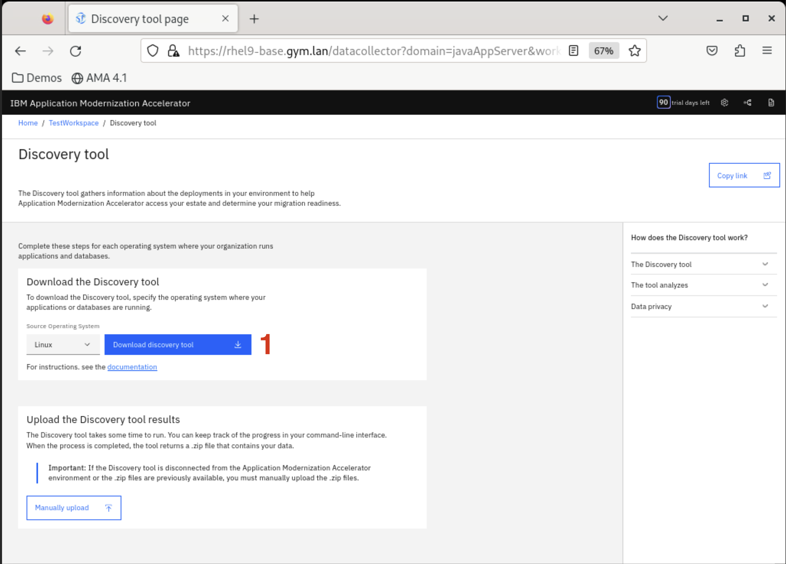

# Install AMA

## Overview

This guide provides step-by-step instructions for installing the **Application Modernization Accelerator (AMA)** on supported platforms. For comprehensive details, refer to the [IBM Documentation: AMA Installation](https://www.ibm.com/docs/en/ama?topic=install){target="_blank"}. AMA can be deployed within your TechZone environment or locally using Podman.

!!! tip "Podman and Local AMA"
    If you don't have **Podman** installed, [download Podman Desktop](https://podman-desktop.io/downloads){target="_blank"} to get started.  Installing AMA on your Mac still may take some tweaking and is not covered in this lab.  We will be running the installation as if the RHEL VM in Tech Zone is your the workstation.

The AMA code itself is available from the [IBM Registration and Download site](https://www.ibm.com/account/reg/us-en/signup?formid=urx-53705){target="_blank"} where you can obtain the AMA Local install script.  We will eventually perform this from the lab TechZone system.

## Log in to Your Tech Zone RHEL Server

This environment likely has a version of AMA / TA previously installed.  We will walk through the process of installing the latest version of AMA.  This is the process you will need to follow in the field.

!!! Tip "Cutting and Pasting to the RHEL Techzone VM"
    {width=40% align=right} From your local laptop copy and paste are not directly supported.  Use the VNC panel on the left side to facilitate this.  Paste the text into this panel and from within the noVNC use `control V` to complete the paste.  You can also improve the view experience by changing the settings within this noVNC control panel.
    
1. Access Your TechZone Environment for **Managed Liberty MoRE-AMA-WCA**
    - Locate your reservation and click the **noVNC** link to connect to your server.
    

2. The username is automatically set for the login  `techzone`.  You will be prompted for the **Password:** `IBMDem0s!` and choose **Send Credentials**.

3. **Prepare the Installation Directory**  
    - Open a Terminal session on the VM and create a directory (e.g., `ama_local`) to store AMA files.
    - Open a browser on the VM and navigate to the **Application Modernization Accelerator Trial** found at `https://www.ibm.com/account/reg/us-en/signup?formid=urx-53705`
    - You are directed through the Trial form.

        

        Complete this form as yourself and download `.zip` file into your `ama_local` directory.

        

        Finally extract its contents.
        
        


## Run the Installer

1. **Start the Installer**  
    - Navigate into the AMA bundle you just extracted and run the `launch` shell script:
        ```bash
        ./launch.sh
        ```
        


2. **Follow the Prompts**  
    - Select `1` to accept the trial.
    - Select `1` to accept the license terms.
    - Select `1` to install Application Modernization Accelerator.

        

        The install takes a few minutes to complete.

3. **Access AMA**  
    - After installation, AMA will be available locally at the URLs provided by the installer:
        - **Linux:** `https://<host name>:443`
        - **MacOS:** `https://<IP Address>:443`

        

Select **Create a Workspace**, select your workspace and follow the prompts to download the Transformation Advisor CLI (aka AMA CLI Discovery Tool):


Follow instructions to download the discovery tools package:

Move the `.tgz` file to your `ama_local` directory and extract it:

```bash
gunzip DiscoveryTool-Linux_TestWorkspace.tgz
tar -xvf DiscoveryTool-Linux_TestWorkspace.tar
```

This creates a `transformationadvisor` folder inside your `ama_local` directory.

Verify the transformationadvisor CLI is available:

```bash
~/ama_local/transformationadvisor-4.x/bin/transformationadvisor –help
```

!!! Tip "Copy and Paste within the Tech Zone VM"
    To copy and paste the URL from the terminal into the VM simply use `right click copy` and `right click paste`. 

Congratulations! AMA is now running "locally" within your Tech Zone machine.

!!! note "Ports"
    Ensure your system allows inbound and outbound traffic on ports **3000** and **2220** for AMA to function correctly.

    Select your workspace and follow the prompts to download the Transformation Advisor CLI (aka AMA CLI **Discovery Tool**):
    

    Follow instructions to download the discovery tools package:
    

    Move the `.tgz` file to your `ama_local` directory and extract it:

    ```bash
    gunzip DiscoveryTool-Linux_TestWorkspace.tgz
    tar -xvf DiscoveryTool-Linux_TestWorkspace.tar
    ```

    This creates a `transformationadvisor` folder inside your `ama_local` directory. 

    Verify the transformationadvisor CLI is available:

    ```bash
    ~/ama_local/transformationadvisor-4.x/bin/transformationadvisor --help
    ```


