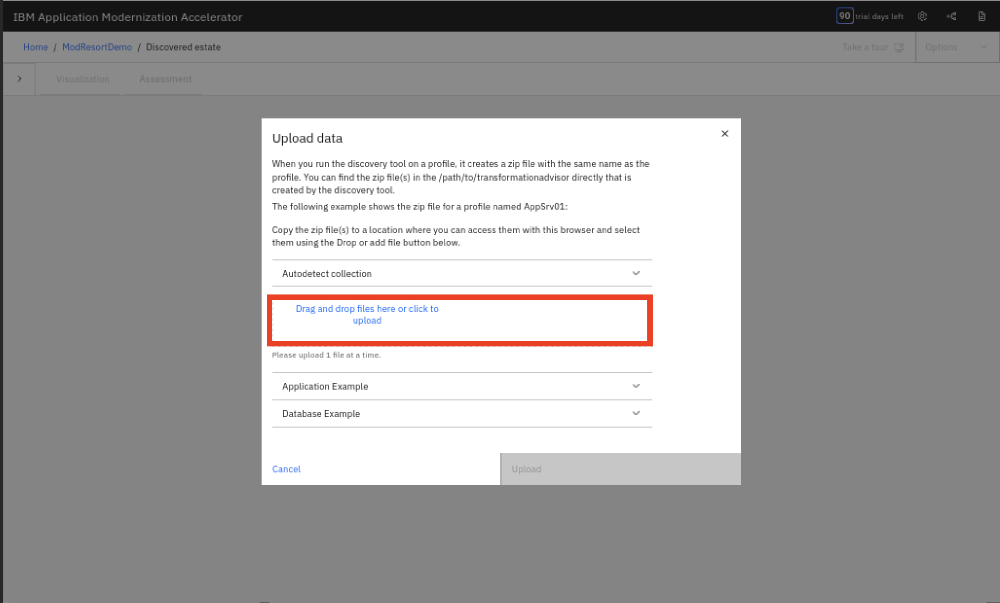

# Running the AMA Scan

You successfully installed AMA.  The next step is scanning WebSphere and generating migration artifacts to assist with modernization.

!!! Information "A Quick Glossary of WebSphere Terms"
    
    A **WebSphere application** is a Java-based application designed to run within the WebSphere Application Server (WAS) environment. WAS is a software framework and middleware that provides a platform for developing, deploying, and managing Java enterprise applications.

    In IBM WebSphere Application Server, a **node** is a logical grouping of one or more application servers on a physical machine. It represents a server or a group of servers within a cell. Nodes are managed by a **node agent**, which handles tasks like starting and stopping servers, deploying applications, and managing configuration. 

    In WebSphere, a **cell** is a logical grouping of one or more nodes, forming a managed domain for application servers. It's the largest unit of organization in WebSphere.

    A **WebSphere profile** is a distinct runtime environment for WebSphere Application Server, containing its own set of files, including scripts, properties, and logs, while sharing core product files with other profiles on the same installation. It allows multiple application servers on a single machine using the same binaries. Profiles are used to isolate different environments (e.g., development, testing, production) and simplify administration.

    A **WebSphere Deployment Manager** is a special WebSphere Application Server instance that acts as the central administrative point for a cell, which is a logical grouping of WebSphere servers. It allows for centralized management of multiple WebSphere nodes and their application servers. Essentially, it provides a single point of entry for administering a domain of WebSphere servers.

    In WebSphere Application Server, **EAR** (Enterprise Archive) and **WAR** (Web Application Archive) files are used to package and deploy Java EE (Jakarta EE) applications. A WAR file contains a single web application, including JSPs, servlets, and other web resources. An EAR file can contain multiple WAR files, as well as other modules like Enterprise JavaBeans (EJBs) and application clients, making it suitable for larger, more complex applications. 

## Locate Application Profiles

The lab system you are using from Tech Zone contains a WAS application deployment. Identify where your application server profiles and deployed EAR/WAR files are stored. The location may vary depending on the environment you are scanning.

Typically, you can find the profiles in an environment by searching for that directory.  As an example, the Tech Zone environment profiles can be accessed via the following:

```bash
ls -l /home/techzone/IBM/WebSphere/AppServer/profiles/
```


## Run AMA Discovery (Transformation Advisor)

Next, invoke the discovery phase using the Transformation Advisor CLI (aka AMA CLI). You previously identified and tested the CLI thus you know the CLI location (e.g., `transformationadvisor-4.x/bin/`).  This is referred to as the **Live-Profile Collect**.

```bash
./transformationadvisor \
    -w /home/techzone/IBM/WebSphere/AppServer \
    -p AppSrv01
```

!!! Question "What is this command accessing?"
    The switches for this command focus the scan to the domain you are interested in.

    - `-w <was-install-root>` tells the scanner the **path** to find your WebSphere installation (contains `profiles/`, `bin/`, etc.).
    - `-p <profileName>` specifies the **profile** to scan (e.g., `AppSrv01`).
    
    By default, the scanner collects all configuration and deployed applications under **profile**, bundles them, and creates a `migrationBundle.zip` for analysis.

## Review Discovery Results

After running the discovery, you receive a migration bundle containing:

- Server configuration
- Deployed EAR/WAR files
- A zipped bundle for further analysis

!!! Tip "Depending on the AMA Version"
    Upload this bundle to the AMA UI for web-based analysis.  If you are curious, you can also unzip this archive to examine the results manually via the raw files.

Create a workspace in the AMA Web UI.


During the creation upload the results of your scan:




Navigate to the scan results you just created:


Perform the **Upload**:


Looking at the **Visualization** of from the scan report quickly shows two **Java Applications** and a **Database**.  If you ran this against a different system you will likely have different results.  Toggling to the **Assessment** tab shows you some additional information about the implementation.


Look through the report and attempt to understand some of the findings.  We will provide additional analysis later.


You will see the assessment report for the applications, including migration time estimates. Click on modresorts-1_0-java8_war.ear to view application details.


View the migration plan for the application.


Download the migration plan for the application.


Once you have downloaded the plan, you can chase the links at the bottom to assist you with potential next steps in your journey including  how to deploy your application on Red Hat OpenShift using the WebSphere Liberty operator.

!!! Note 
    This first scan you ran above does not perform code-level analysis (Java 8 → Java 21, WAS → Liberty). For that, the Binary Application Scanner is used.  We will do that in next step.


## Run Binary Application Scanner

To analyze application binaries and generate migration reports, run the Binary Application Scanner:

```bash
java -jar /home/techzone/IBM/WebSphere/AppServer/bin/migration/wamt/binaryAppScanner.jar \
/home/techzone/IBM/WebSphere/AppServer/profiles/AppSrv01/config/cells/\
rhel9-baseCell01/applications/modresorts-1_0-java8_war.ear \
--all \
--sourceAppServer=was90 \
--sourceJava=ibm8 \
--targetAppServer=liberty \
--targetJava=java21 \
--targetCloud=containers \
--output=/home/techzone/ama-output/modresorts-liberty-java21
```

!!! Tip "Explaining the Command"
    - `java -jar …/binaryAppScanner.jar` You’re launching the Migration Toolkit for Application Binaries’ scanner tool. This JAR contains the logic to inspect Java EE archives and produce:

        - An Application Migration Report (inventory, detailed analysis, technology evaluation)
        - OpenRewrite recipes for code refactoring
        - Configuration recipes for target servers
        -Containerization artifacts (Dockerfile + Kubernetes YAML)
     
    - Positional argument: your .ear path `/home/techzone/IBM/WebSphere/AppServer/profiles/AppSrv01/config/cells/rhel9-baseCell01/applications/modresorts-1_0-java8_war.ear`. This tells the scanner exactly which binary to examine. It will:
        - Unpack the EAR
        - Read its bytecode to analyze API usage
        - Look up any matching server-side configuration under the same profile (for features, resources, etc.)
     
    -  `--all (Action)` This single flag instructs the tool to run every built-in report in one pass:
        - Inventory (what’s in the archive?)
        - Technology Evaluation (what programming models are used?)
        - Detailed Migration Analysis (what rules get flagged?)
        - Configuration (what server.xml or wsadmin scripts to generate?)
        - Using --all is the easiest way to get the full migration bundle.
     
    - Source flags
        - `--sourceAppServer=was90` Indicates your application currently runs on WebSphere Application Server 9.0. The scanner will apply WAS-specific rules and know how to locate any deployed-server artifacts.
        - `--sourceJava=ibm8` Tells it “the code is compiled for IBM Java 8,” so it can detect deprecated or removed APIs.
     
    - Target flags
        - `--targetAppServer=liberty` You want the recommendations and configuration snippets targeted at Liberty, not a traditional WAS profile.
        - `--targetJava=java21` You’re migrating your code to run on Java 21, so the tool will surface any Java–8→21 incompatibilities and generate OpenRewrite recipes to fix them.
        - `--targetCloud=containers` Ask the scanner to include containerization recipes—it will drop in a Dockerfile and Kubernetes YAML under a containerization/ folder in your output.
     
    - `--output=…` Specifies the directory where all of the scanner’s outputs will go. In this case: `/home/techzone/ama-output/modresorts-liberty-java21/` You’ll find:
        - A modresorts-…_migrationBundle.zip with JSON/XML and the raw EAR
        - modresorts-…_MigrationReport.html (the human-readable analysis)
        - server.xml pre-populated with the Liberty features your app needs
        - Possibly sensitivedata.xml and mimetypes.xml (inventory/config snippets)
        - A containerization/ folder containing your Dockerfile and Kubernetes YAML

We have successfully invoked two complementary scans.  Lets go over what we have completed and summarize the steps and commands in the next section. 

Now you have successfully run the AMA scan and generated the migration artifacts for your application. You can use these artifacts to plan and execute your application modernization journey.  The section will give you additional information about these scans.