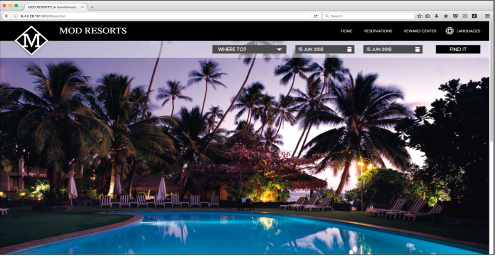

# tWAS Application Modernization

## Prerequisites

The procedure within this exercise is based upon an IBM TechZone environment that will contain both a traditional WAS environment to be modernized and the tooling to perform the exercise.  Deploy the [Modernize WebSphere apps to Liberty using watsonx code assistant - PoT & MoRE / AMA demo environment - Q2 release](https://techzone.ibm.com/collection/67dab2795cf5833838c7bced){target="_blank"} environment.  

This demo provides fundamental hands-on experience with modernizing existing Java applications to WebSphere Liberty, deployed into a container platform, such as Red Hat OpenShift.  The focus of this document is on the practical aspects of how to use the deployment artifacts created by AMA / TA  to speed up the process to deploy a Java app to Liberty running on OpenShift to achieve the objective for operation modernization.

!!! Note "Note on TA and AMA"
    Application Modernization Accelerator (AMA) is the next generation of Transformation Advisor (TA).  AMA is provided as part of the EAR JSphere Suite offering.  TA has been widely available for many years and most recently as part of Cloud Pak for Applications.

### Mod Resorts Application

Mod Resorts app is a WebSphere application showing the weather in various locations. This app is initially developed for WebSphere traditional. In the demo it will be moved to Liberty in a container and deployed to OCP.  You can view the running version of this application from your bootcamp environment by navigating to **localhost:9080/resorts**

{target="_blank"}

