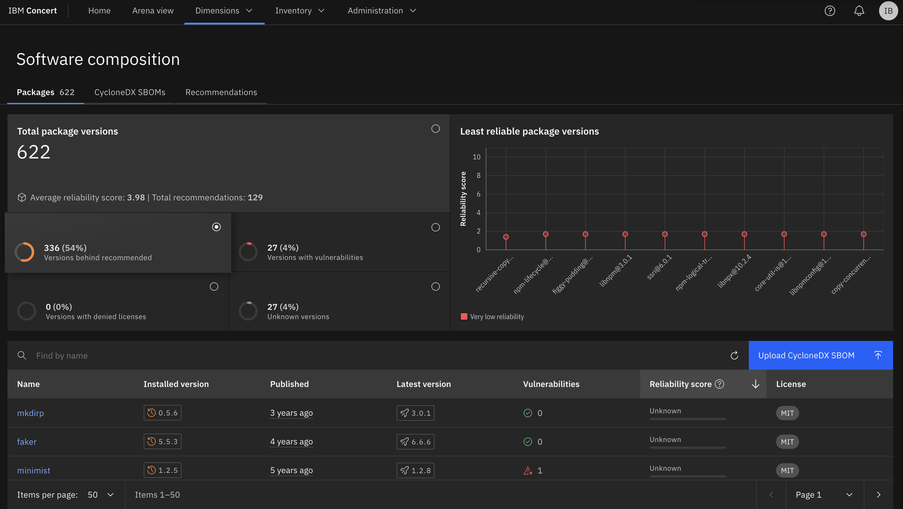
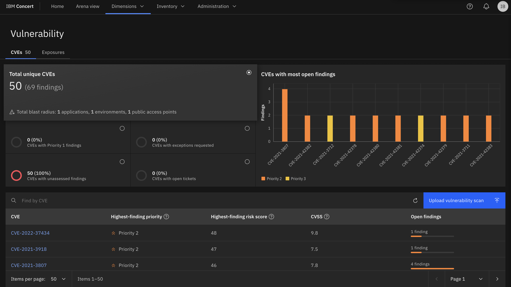

!!! warning "This lab targets Concert v1.0.5.1"
    This lab exercise was written and tested against a Concert v1.0.5.1 instance. Please ensure you are running the right version.

<!-- [:fontawesome-solid-play: Reserve an Environment for this Lab](https://techzone.ibm.com/my/reservations/create/677c0eb8d69537400a8df287){ .md-button }

While it is possible to complete this lab from your local machine, these instructions have been tested on the IBM Concert Virtual Machine.

## Connecting to the IBM Concert VM

1. Connect and log in to your Concert instance using the Public IP and credentials from your TechZone reservation page.
2. From your TechZone reservation page, scroll down and click `Download SSH Key`

3. From your terminal hange the permissions for the ssh key:

```bash
chmod 400 ~/Downloads/pem_ibmcloudvsi_download.pem
```
> The path to your downloaded SSH key may be different on your local machine.


SSH into the instance:

```bash
ssh -i ~/Downloads/pem_ibmcloudvsi_download.pem -p 2223 itzuser@<concert-public-ip-from-techzone>
```

```bash
[itzuser@itzvsi-667000bg6b-iocyoibm ~]$
```

You are now sshed onto the Concert instance. Follow the rest of the lab from this terminal! -->

## Utilities

???+ note "syft"

    `syft` is a command line utility for generating a Software Bill of Materials (SBOM) from container images and filesystems.

    === "Linux (RHEL)"

        ```bash
        curl -sSfL https://raw.githubusercontent.com/anchore/syft/main/install.sh | sudo sh -s -- -b /usr/local/bin
        ```

        You can also obtain the syft CLI following the official syft github repository [install instructions](https://github.com/anchore/syft?tab=readme-ov-file#installation).

    === "Mac"

        The best way to install syft for your Mac is using [Homebrew](https://brew.sh)

        ```bash
        brew install syft
        ```

        You can also obtain the syft CLI following the official syft github repository [install instructions](https://github.com/anchore/syft?tab=readme-ov-file#installation).

    === "Windows"

        You can obtain the syft CLI following the official syft github repository [install instructions](https://github.com/anchore/syft?tab=readme-ov-file#installation).

???+ note "grype"

    `grype` is a vulnerability scanner for container images and filesystems.

    === "Linux (RHEL)"

        ```bash
        curl -sSfL https://raw.githubusercontent.com/anchore/grype/main/install.sh | sudo sh -s -- -b /usr/local/bin
        ```

        You can also obtain the `grype` CLI following the official grype github repository [install instructions](https://github.com/anchore/grype?tab=readme-ov-file#installation).

    === "Mac"

        The best way to install `grype` for your Mac is using [Homebrew](https://brew.sh)

        ```bash
        brew install grype
        ```

        You can obtain the `grype` CLI following the official grype github repository [install instructions](https://github.com/anchore/grype?tab=readme-ov-file#installation).

    === "Windows"

        You can obtain the `grype` CLI following the official grype github repository [install instructions](https://github.com/anchore/grype?tab=readme-ov-file#installation).

???+ note "trivy"

    `trivy` is a vulnerability scanner for container images and filesystems.

    === "Linux (RHEL)"

        ```bash
        cat << EOF | sudo tee -a /etc/yum.repos.d/trivy.repo
        [trivy]
        name=Trivy repository
        baseurl=https://aquasecurity.github.io/trivy-repo/rpm/releases/\$basearch/
        gpgcheck=1
        enabled=1
        gpgkey=https://aquasecurity.github.io/trivy-repo/rpm/public.key
        EOF
        sudo yum -y update
        sudo yum -y install trivy
        ```

        You can also obtain the `trivy` CLI following the official trivy github repository [install instructions](https://aquasecurity.github.io/trivy/latest/getting-started/installation/).

    === "Mac"

        The best way to install `trivy` for your Mac is using [Homebrew](https://brew.sh)

        ```bash
        brew install trivy
        ```

        You can obtain the `trivy` CLI following the official trivy github repository [install instructions](https://aquasecurity.github.io/trivy/latest/getting-started/installation/).

    === "Windows"

        You can obtain the `trivy` CLI following the official trivy github repository [install instructions](https://aquasecurity.github.io/trivy/latest/getting-started/installation/).

???+ note "cdxgen"

    `cdxgen` is a CLI tool to create a valid and compliant CycloneDX Bill of Materials (BOM) containing an aggregate of all project dependencies in JSON format.

    === "Linux (RHEL)"

        ```bash
        sudo dnf module enable nodejs:18
        sudo dnf install -y npm
        curl -s "https://raw.githubusercontent.com/alexdelorenzo/npm-user/main/npm-user.sh" | bash
        npm install -g @cyclonedx/cdxgen
        ```

        We add the npm-user script so that npm packages can be installed and run as non-root users.

        You can also obtain the `cdxgen` CLI following the official cdxgen github repository [install instructions](https://github.com/CycloneDX/cdxgen?tab=readme-ov-file#installing).

    === "Mac"

        The best way to install `cdxgen` for your Mac is using [Homebrew](https://brew.sh)

        ```bash
        brew install cdxgen
        ```

        You can also obtain the `cdxgen` CLI following the official cdxgen github repository [install instructions](https://github.com/CycloneDX/cdxgen?tab=readme-ov-file#installing).

    === "Windows"

        You can obtain the `cdxgen` CLI following the official cdxgen github repository [install instructions](https://github.com/CycloneDX/cdxgen?tab=readme-ov-file#installing).

???+ note "git"

    === "Linux (RHEL)"

        ```bash
        sudo dnf install -y git
        ```

        You can also obtain the git CLI following the official [Git Documentation](https://github.com/git-guides/install-git#install-git-on-linux).

    === "Mac"

        The best way to install the git utility for your Mac is using [Homebrew](https://brew.sh)

        ```bash
        brew install git
        ```

        You can also obtain the git CLI following the official [Git Documentation](https://github.com/git-guides/install-git#install-git-on-mac).

    === "Windows"

        You can obtain the git CLI following the official [GitHub Documentation](https://github.com/git-guides/install-git#install-git-on-windows).

???+ note "jq"

    === "Linux (RHEL)"

        ```bash
        sudo dnf install -y jq
        ```

        You can also obtain the pre-compiled binaries in the [jq Documentation](https://jqlang.github.io/jq/download/).

    === "Mac"

        The best way to install the jq utility for your Mac is using [Homebrew](https://brew.sh)

        ```bash
        brew install jq
        ```

        You can also obtain the pre-compiled binaries in the [jq Documentation](https://jqlang.github.io/jq/download/).

    === "Windows"

        You can obtain the pre-compiled binaries in the [jq Documentation](https://jqlang.github.io/jq/download/).

## Generating SBOMs from command line

!!! tip "Run commands from Linux or MacOS"
    This lab exercise uses commands that are meant to be run from a Linux or MacOS command line.  If you're on a Windows workstation, please ssh to your IBM Concert VM or a bastion host and run these steps from there.

### concert-utils

[concert-utils](https://github.com/IBM/Concert/tree/main/toolkit-enablement/concert-utils) is a series of scripts that can aid you in integrating IBM Concert into your existing automation processes.

Create a sample environment variable file to simulate a pipeline environment.  Create a `common_variables.sh` script from the sample common_variables.sh below, save it, and source it.

??? note "sample common_variables.sh"

    ```text
    ####
    # Concert Toolkit Image
    ####
    export CONCERT_TOOLKIT_IMAGE=icr.io/cpopen/ibm-concert-toolkit:latest

    ####
    # Concert details
    ####
    export BASE_URL="https://<YOUR_CONCERT_VM_PUBLIC_IP>:12443"
    export CONCERT_USERNAME="<YOUR_CONCERT_USERNAME>"
    export CONCERT_PASSWORD="<YOUR_CONCERT_PASSWORD>"
    # If running Concert on OpenShift
    # export BASE_URL="https://<CONCERT_OPENSHIFT_ROUTE>/ibm/concert"
    # export TOKEN="ZenApiKey <YOUR_ZENAPIKEY>"

    ####
    # cyclonedx generation utility for source code
    ####
    export OUTPUTDIR=~/dev/ibm-concert/lab
    export SRC_PATH=./qotd-web

    ######
    # Application Variables
    ###

    export APP_NAME=qotd-app
    export APP_VERSION=1.0.0
    export APP_CRITICALITY=5

    export COMPONENT_NAME=qotd-web
    export COMPONENT_VERSION=4.1.0

    export ENVIRONMANET_NAME_1=qa
    export ENVIRONMANET_NAME_2=stage
    export ENVIRONMANET_NAME_3=prod

    ###
    # inventory specific vaiable
    ###
    export REPO_NAME=qotd-web
    export REPO_URL=https://github.ibm.com/cs-tel-ibm-concert-qotd/qotd-web
    export REPO_BRANCH=main
    export REPO_COMMIT_SHA=30f2b263723dc480c6d506155aafa05ab4461f40
    export BUILD_NUMBER=1
    export IMAGE_NAME=imgrepo.aws.ibm-gtmaa.dev/concert-apps/cs-tel-ibm-concert-qotd/qotd-web
    export IMAGE_TAG=latest
    export IMAGE_DIGEST="sha256:728ca85a2116f001335881d5024f099d50142bc17ff054c5311c4a6ba7956cd2"

    ###
    # deploy/release specific vaiable
    ###

    export ENV_TARGET=production
    export DEPLOYMENT_REPO_NAME=https://github.ibm.com/cs-tel-ibm-concert-qotd/qotd-web/
    export K8_PLATFORM=ocp
    export CLUSTER_ENV_PLATFORM=aws
    export CLUSTER_ID=ncolon-hhdtl
    export CLUSTER_REGION=us-east-2
    export CLUSTER_NAME=ncolon
    export CLUSTER_NAMESPACE=qotd-app
    export APP_URL=${COMPONENT_NAME}-qotd-app.apps.concert.aws.ibm-gmtaa.dev
    export ENVIRONMENT_TARGET=production

    export BUSINESS_NAME="IBM"
    export BUSINESS_UNIT="IBM Technology"
    export BUSINESS_EMAIL="ncolon@us.ibm.com"
    export BUSINESS_PHONE="123-456-7890"

    export ACCESS_POINT_NAME="qotd-web"
    export APP_ENDPOINT="/qotd-web"
    export APP_ENDPOINT_EXPOSURE="public"

    export K8S_NAME=concert-aws-prod-us-east-2
    export K8S_PLATFORM=ocp
    export K8S_ENV_PLATFORM=aws
    export K8S_CLUSTER_ID=concert-nv4pj
    export K8S_CLUSTER_REGION=us-east-2
    export K8S_CLUSTER_NAME=concert
    export K8S_NAMESPACE=qotd

    export CONTAINER_COMMAND="podman run"
    export OPTIONS="--platform linux/amd64 -it --rm -u 0"
    ```

    !!! warning

        If at any point during this training exercise you log off from your IBM Concert VM, or the SSH connection breaks, you need to set your environment variables again with

        ```bash
        source ./common_variables.sh
        ```

  The best way to obtain concert-utils is by pulling them down from GitHub.  Open a terminal window in your workstation, and run the following command

  ```bash
  source ./common_variables.sh
  test -e ${OUTPUTDIR} || mkdir -p ${OUTPUTDIR}
  cp ./common_variables.sh ${OUTPUTDIR}
  cd ${OUTPUTDIR}
  ```

  ```bash
  git clone https://github.com/IBM/Concert.git concert-public
  mv concert-public/toolkit-enablement/concert-utils .
  rm -rf concert-public
  ```

???+ success "output"

    ```{.bash .no-copy}
    Cloning into 'concert-public'...
    remote: Enumerating objects: 646, done.
    remote: Counting objects: 100% (179/179), done.
    remote: Compressing objects: 100% (133/133), done.
    remote: Total 646 (delta 53), reused 127 (delta 37), pack-reused 467 (from 2)
    Receiving objects: 100% (646/646), 6.91 MiB | 25.56 MiB/s, done.
    Resolving deltas: 100% (199/199), done.
    ```

### codescan SBOM

!!! warning
    Before completing this step head to https://github.ibm.com/settings/tokens/new and generate a personal access token. Make sure to tick the `repo    Full control of private repositories` checkbox.

We first need to pull down the microservice application code from GitHub.  We will use the `qotd-web` sample component for this module. Open the [`qotd-web`](https://github.ibm.com/cs-tel-ibm-concert-qotd/qotd-web) in your browser, click on the green `<> Code` dropdown button, click on the HTTP tab, and copy the repository reference.

```bash
git clone git@github.ibm.com:cs-tel-ibm-concert-qotd/qotd-web.git
cd qotd-web
export REPO_COMMIT_SHA=$(git rev-parse HEAD) 
cd -
```

1. Get the latest repository commit hash

???+ success "output"

    ``` {.bash .no-copy}
    ➜  lab $ git clone git@github.ibm.com:cs-tel-ibm-concert-qotd/qotd-web.git
    Cloning into 'qotd-web'...
    remote: Enumerating objects: 143, done.
    remote: Counting objects: 100% (49/49), done.
    remote: Compressing objects: 100% (24/24), done.
    remote: Total 143 (delta 42), reused 31 (delta 25), pack-reused 94
    Receiving objects: 100% (143/143), 855.99 KiB | 3.01 MiB/s, done.
    Resolving deltas: 100% (69/69), done.
    ➜  lab $ cd qotd-web
    ➜  lab $ export REPO_COMMIT_SHA=$(git rev-parse HEAD)
    ➜  lab $ cd ..
    ```

???+ note "using concert-utils"

    Run the `create-code-cyclondex-sbom.sh` helper script against the code directory just downloaded.  The helper script will call `cdxgen`, download all the associated packages needed to run your microservice, and scan them.  The script takes two parameter, `--outputfile <filename>` and `--cdxgen-args "--spec-version 1.5"`.

    ```bash
    source ./common_variables.sh
    ./concert-utils/helpers/create-code-cyclonedx-sbom.sh \
      --outputfile codescan-cyclonedx.json --cdxgen-args "--spec-version 1.5"
    ```

    ???+ success "output"

        ```{.bash .no-copy}
        ➜  lab $ source ./common_variables.sh
        ➜  lab $ ./concert-utils/helpers/create-code-cyclonedx-sbom.sh \
          --outputfile codescan-cyclonedx.json --cdxgen-args "--spec-version 1.5"
        podman run --platform linux/amd64 -it --rm -u 0 -v ./qotd-web:/concert-sample -v /Users/ncolon/dev/ibm-concert/lab:/toolkit-data icr.io/cpopen/ibm-concert-toolkit:v1.0.3.1 bash -c code-scan --src /concert-sample --output-file codescan-cyclonedx.json --cdxgen-args "--spec-version 1.5"

        Running command:
        cdxgen -o /toolkit-data/codescan-cyclonedx.json --spec-version 1.5
        SBOM has been generated successfully at /toolkit-data/codescan-cyclonedx.json
        ➜  lab $ ls -la
        total 392
        drwxr-xr-x   7 ncolon  staff     224 Aug 21 23:49 ./
        drwxr-xr-x   5 ncolon  staff     160 Aug 13 12:00 ../
        -rw-r--r--   1 ncolon  staff      86 Aug 21 23:49 codescan-cyclonedx-metadata.json
        -rw-r--r--   1 ncolon  staff  189286 Aug 21 23:49 codescan-cyclonedx.json # (1)!
        -rwxr-xr-x   1 ncolon  staff    2207 Aug 21 23:49 common_variables.sh*
        drwxr-xr-x   7 ncolon  staff     224 Aug 21 23:44 concert-utils/
        drwxr-xr-x  20 ncolon  staff     640 Aug 21 23:49 qotd-web/
        ➜  lab $
        ```

        1. codescan CycloneDX file generated via concert-utils

??? note "using cdxgen"

    Run `cdxgen` inside the source code directory just downloaded.  cdxgen will download all the associated packages needed to run your microservice, and scan them.

    ```bash
    pushd qotd-web
    cdxgen -r -o ../codescan-cyclonedx-sbom.json --validate --spec-version 1.5
    popd
    ```

    ``` { .bash .no-copy }
    ➜  lab $ pushd qotd-web
    ➜  qotd-web git:(main) $ cdxgen -r -o ../codescan-cyclonedx-sbom.json --validate
    Executing 'npm install' in .
    ➜  qotd-web git:(main) $ popd
    ➜  lab $ ls -al
    total 408
    drwxr-xr-x   5 ncolon  staff     160 Jul 31 20:11 ./
    drwxr-xr-x   8 ncolon  staff     256 Jul 31 20:01 ../
    -rw-r--r--   1 ncolon  staff  205564 Jul 31 20:09 codescan-cyclonedx-sbom.json # (1)!
    drwxr-xr-x   8 ncolon  staff     256 Jul 31 19:51 concert-utils/
    drwxr-xr-x  18 ncolon  staff     576 Jul 31 20:11 qotd-web/
    ```

    1. CycloneDX codescan SBOM just generated

### imagescan SBOM

We will use the `qotd-web` sample component for this module.

???+ note "using concert-utils"

    Run the `create-image-cyclonedx-sbom.sh` helper script against the code directory just downloaded.  The helper script will scan the image defined in using `${IMAGE}:${IMAGE_TAG}` as the full image name.

    ```bash
    source ./common_variables.sh
    ./concert-utils/helpers/create-image-cyclonedx-sbom.sh
    ```

    ???+ success "output"

        ```{.bash .no-copy}
        ➜  lab $ source ./common_variables.sh
        ➜  lab $ ./concert-utils/helpers/create-image-cyclonedx-sbom.sh
        podman run --platform linux/amd64 -it --rm -u 0 -v ./qotd-web:/concert-sample-src -v /Users/ncolon/dev/ibm-concert/lab:/toolkit-data icr.io/cpopen/ibm-concert-toolkit:v1.0.3.1 bash -c image-scan --images imgrepo.aws.ibm-gtmaa.dev/concert-apps/cs-tel-ibm-concert-qotd/qotd-web:latest

        Scanning image: imgrepo.aws.ibm-gtmaa.dev/concert-apps/cs-tel-ibm-concert-qotd/qotd-web:latest # (1)!
        ✔ Parsed image                                sha256:3eedb7a51bea6981ef2710ba4a806f98a4ee6eeade666a478e8ae45d89b62412
        ✔ Cataloged contents                                 04977bf8b7a808957f1b2583bdd2e634ea8853363865fd1f13521115e07af0b4
          ├── ✔ Packages                        [674 packages]
          ├── ✔ File digests                    [64 files]
          ├── ✔ File metadata                   [64 locations]
          └── ✔ Executables                     [33 executables]
        SBOM has been generated successfully at /toolkit-data/imgrepo.aws.ibm-gtmaa.dev_concert-apps_cs-tel-ibm-concert-qotd_qotd-web:latest-imagescan-cyclonedx-sbom.json
        ➜  lab $ ls -la
        total 4752
        drwxr-xr-x   9 ncolon  staff      288 Aug 21 23:51 ./
        drwxr-xr-x   5 ncolon  staff      160 Aug 13 12:00 ../
        -rw-r--r--   1 ncolon  staff       86 Aug 21 23:49 codescan-cyclonedx-metadata.json
        -rw-r--r--   1 ncolon  staff   189286 Aug 21 23:49 codescan-cyclonedx.json
        -rwxr-xr-x   1 ncolon  staff     2207 Aug 21 23:49 common_variables.sh*
        drwxr-xr-x   7 ncolon  staff      224 Aug 21 23:44 concert-utils/
        -rw-r--r--   1 ncolon  staff       86 Aug 21 23:52 imgrepo.aws.ibm-gtmaa.dev_concert-apps_cs-tel-ibm-concert-qotd_qotd-web:latest-imagescan-cyclonedx-sbom-metadata.json
        -rw-r--r--   1 ncolon  staff  1483824 Aug 21 23:52 imgrepo.aws.ibm-gtmaa.dev_concert-apps_cs-tel-ibm-concert-qotd_qotd-web:latest-imagescan-cyclonedx-sbom.json  # (2)!
        drwxr-xr-x  20 ncolon  staff      640 Aug 21 23:49 qotd-web/
        ➜  lab $
        ```

        1. The image full name, from `${IMAGE_NAME}:${IMAGE_TAG}`
        2. The filename generated by the concert-utils script.

??? note "using syft"

    To generate the image scan SBOM, we will use `syft`.
    ```bash
    syft scan registry:quay.io/hollisc/qotd-web:1.0.0 -o cyclonedx-json@1.5 > imagescan-cyclonedx-sbom.json
    ```

    As of 1.0.0 GA code, IBM Concert only understands the 1.5 version of the CycloneDX spec.  With 1.0.1 and later, the more common CycloneDX 1.6 format is available as well.  For now, we will pass the `-o cyclonedx-json@1.5` parameter to syft so that the output is generated following the CycloneDX 1.5 spec.

    ``` {.bash .no-copy}
    ➜  lab $ syft scan registry:quay.io/hollisc/qotd-web:1.0.0 -o cyclonedx-json@1.5 > imagescan-cyclonedx-sbom.json
    ✔ Parsed image                          sha256:c8be3211c2f55692ec876486203925c6e490106577229a55bd91e2ec0934b0d7
    ✔ Cataloged contents                           b98993977e263ecd5debf9936ac4c1624e66691a3e125d239718df65323bf589
      ├── ✔ Packages                        [671 packages]
      ├── ✔ File digests                    [63 files]
      ├── ✔ File metadata                   [63 locations]
      └── ✔ Executables                     [21 executables]
    ➜  lab $ ls -la
    total 2352
    drwxr-xr-x   6 ncolon  staff     192 Jul 31 20:28 ./
    drwxr-xr-x   8 ncolon  staff     256 Jul 31 20:01 ../
    drwxr-xr-x   8 ncolon  staff     256 Jul 31 19:51 concert-utils/
    -rw-r--r--   1 ncolon  staff  993092 Jul 31 20:30 imagescan-cyclonedx-sbom.json # (1)!
    drwxr-xr-x  14 ncolon  staff     448 Jul 31 20:25 qotd-web/
    ➜  lab $
    ```

    1. CycloneDX imagescan SBOM just generated with `syft`

### CVE scan

To generate the CVE vulnerability scan CSV file, we will use `trivy` from Aquasec.  We will use the `qotd-web` sample component for this module. As of 1.0.1 GA code, IBM Concert can consume vulnerability scans in CycloneDX format.

???+ note "using trivy"

    To generate the CVE file, use the following command:

    ```bash
    source ./common_variables.sh
    trivy image $IMAGE_NAME:$IMAGE_TAG --format cyclonedx --scanners vuln -o cve-scan.json
    ```

    ???+ success "output"

        ``` {.bash .no-copy}
        ➜  lab $ source ./common_variables.sh
        ➜  lab $ trivy image $IMAGE_NAME:$IMAGE_TAG --format cyclonedx --scanners vuln -o cve-scan.json
        2024-08-21T23:55:57-04:00	INFO	[vuln] Vulnerability scanning is enabled
        2024-08-21T23:55:57-04:00	INFO	Detected OS	family="alpine" version="3.11.10"
        2024-08-21T23:55:57-04:00	INFO	[alpine] Detecting vulnerabilities...	os_version="3.11" repository="3.11" pkg_num=16
        2024-08-21T23:55:57-04:00	INFO	Number of language-specific files	num=1
        2024-08-21T23:55:57-04:00	INFO	[node-pkg] Detecting vulnerabilities...
        2024-08-21T23:55:57-04:00	WARN	This OS version is no longer supported by the distribution	family="alpine" version="3.11.10"
        2024-08-21T23:55:57-04:00	WARN	The vulnerability detection may be insufficient because security updates are not provided
        ➜  lab $ ls -la
        total 6560
        drwxr-xr-x  10 ncolon  staff      320 Aug 21 23:55 ./
        drwxr-xr-x   5 ncolon  staff      160 Aug 13 12:00 ../
        -rw-r--r--   1 ncolon  staff       86 Aug 21 23:49 codescan-cyclonedx-metadata.json
        -rw-r--r--   1 ncolon  staff   189286 Aug 21 23:49 codescan-cyclonedx.json
        -rwxr-xr-x   1 ncolon  staff     2207 Aug 21 23:49 common_variables.sh*
        drwxr-xr-x   7 ncolon  staff      224 Aug 21 23:44 concert-utils/
        -rw-r--r--   1 ncolon  staff   922179 Aug 21 23:55 cve-scan.json # (1)!
        -rw-r--r--   1 ncolon  staff       86 Aug 21 23:52 imgrepo.aws.ibm-gtmaa.dev_concert-apps_cs-tel-ibm-concert-qotd_qotd-web:latest-imagescan-cyclonedx-sbom-metadata.json
        -rw-r--r--   1 ncolon  staff  1483824 Aug 21 23:52 imgrepo.aws.ibm-gtmaa.dev_concert-apps_cs-tel-ibm-concert-qotd_qotd-web:latest-imagescan-cyclonedx-sbom.json
        drwxr-xr-x  20 ncolon  staff      640 Aug 21 23:49 qotd-web/
        ```

        1. CVE vulnerability file created just now.

### application SBOM

To generate an application SBOM, we use the `create-application-sbom.sh` helper script.  The script requires a config file that we can generate dynamically from variables in `common_variables.sh`.  You can view a more comprehensive application config file in the [IBM Concert Toolkit](https://github.ibm.com/roja/toolkit/blob/develop/samples/app-config-sample.yaml) sample tempalte.

???+ note "using concert-utils"

    ```bash
    source ./common_variables.sh
    cat << EOF | envsubst > app-config.yaml
    spec_version: "1.0.2"
    concert:
      application:
        output_file: "${APP_NAME}-${COMPONENT_NAME}-app-definition-sbom.json"
        app_name: "${APP_NAME}"
        version: "${APP_VERSION}"
        business:
          name: "${BUSINESS_NAME}"
          units:
          - name: "${BUSINESS_UNIT}"
            email: "${BUSINESS_EMAIL}"
            phone: "${BUSINESS_PHONE}"
        properties:
          application_criticality: "${APP_CRITICALITY}"
        components:
        - component_name: "${COMPONENT_NAME}"
          version: "${APP_VERSION}"
          repositories:
          - name: "${REPO_NAME}"
            url: "${REPO_URL}"
          image:
            name: "${IMAGE_NAME}"
        environment_targets:
        - name: "${ENV_TARGET}"
        services:
        - name: "${ACCESS_POINT_NAME}"
          type: "app_end_point"
          endpoints:
          - "${APP_ENDPOINT}"
          properties:
            network_exposure: "${APP_ENDPOINT_EXPOSURE}"
          reliant_by:
          - "${COMPONENT_NAME}"
    EOF
    ./concert-utils/helpers/create-application-sbom.sh --outputdir ${OUTPUTDIR} --configfile app-config.yaml
    ```

    ???+ success "output"

        ```{.bash .no-copy}
        ➜  lab $ source ./common_variables.sh
        ➜  lab $ ./concert-utils/helpers/create-application-sbom.sh --outputdir ${OUTPUTDIR} --configfile app-config.yaml
        podman run--platform linux/amd64 -it --rm -u 0 -v /Users/ncolon/dev/ibm-concert/lab:/toolkit-data icr.io/cpopen/ibm-concert-toolkit:v1.0.3.1 bash -c app-sbom --app-config /toolkit-data/app-config.yaml

        2024-08-22 03:58:02,619 - INFO - Read configuration file: /toolkit-data/app-config.yaml
        2024-08-22 03:58:02,625 - INFO - Rendered template variables
        2024-08-22 03:58:02,626 - INFO - Added additional data to BOM file
        2024-08-22 03:58:02,631 - INFO - Processed application "qotd-app" to BOM file: /toolkit-data/qotd-app-qotd-web-app-definition-sbom.json
        ➜  lab $ ls -la
        total 6576
        drwxr-xr-x  12 ncolon  staff      384 Aug 21 23:57 ./
        drwxr-xr-x   5 ncolon  staff      160 Aug 13 12:00 ../
        -rw-r--r--   1 ncolon  staff      826 Aug 21 23:57 app-config.yaml # (1)!
        -rw-r--r--   1 ncolon  staff       86 Aug 21 23:49 codescan-cyclonedx-metadata.json
        -rw-r--r--   1 ncolon  staff   189286 Aug 21 23:49 codescan-cyclonedx.json
        -rwxr-xr-x   1 ncolon  staff     2207 Aug 21 23:49 common_variables.sh*
        drwxr-xr-x   7 ncolon  staff      224 Aug 21 23:44 concert-utils/
        -rw-r--r--   1 ncolon  staff   922179 Aug 21 23:55 cve-scan.json
        -rw-r--r--   1 ncolon  staff       86 Aug 21 23:52 imgrepo.aws.ibm-gtmaa.dev_concert-apps_cs-tel-ibm-concert-qotd_qotd-web:latest-imagescan-cyclonedx-sbom-metadata.json
        -rw-r--r--   1 ncolon  staff  1483824 Aug 21 23:52 imgrepo.aws.ibm-gtmaa.dev_concert-apps_cs-tel-ibm-concert-qotd_qotd-web:latest-imagescan-cyclonedx-sbom.json
        -rw-r--r--   1 ncolon  staff     2096 Aug 21 23:58 qotd-app-qotd-web-app-definition-sbom.json # (2)!
        drwxr-xr-x  20 ncolon  staff      640 Aug 21 23:49 qotd-web/
        ➜  lab $
        ```

        1. Application SBOM configuration file
        2. Concert Application SBOM generated by the concert-utils script.

### Build SBOM

To generate a build SBOM, we use the `create-build-sbom.sh` helper script. The script requires a config file that we can generate dynamically from variables in `common_variables.sh`. You can view a more comprehensive application config file in the [IBM Concert Toolkit](https://github.ibm.com/roja/toolkit/blob/develop/samples/build-config-sample.yaml) sample template.

???+ note "using concert-utils"

    ```bash
    source ./common_variables.sh
    IMAGESCAN_FILE=$(echo ${IMAGE_NAME}|tr "/" "_"):${IMAGE_TAG}-imagescan-cyclonedx-sbom.json
    CODESCAN_URN=$(jq .serialNumber codescan-cyclonedx.json)
    IMAGESCAN_URN=$(jq .serialNumber ${IMAGESCAN_FILE})

    cat << EOF | envsubst > build-config.yaml
    spec_version: "1.0.2"
    concert:
      builds:
      - component_name: "${COMPONENT_NAME}"
        output_file: "${APP_NAME}-${COMPONENT_NAME}-build-sbom.json"
        app_name: "${APP_NAME}"
        number: 1
        version: "${APP_VERSION}"
        repositories:
        - name: "${REPO_NAME}"
          url: "${REPO_URL}"
          branch: "${REPO_BRANCH}"
          commit_sha: "${REPO_COMMIT_SHA}"
          cyclonedx_bom_link:
            file: "codescan-cyclonedx.json"
            data:
              serial_number: ${CODESCAN_URN}
              version: "1"
        image:
          name: "${IMAGE_NAME}"
          tag: "${IMAGE_TAG}"
          digest: "${IMAGE_DIGEST}"
          cyclonedx_bom_link:
            file: "${IMAGESCAN_FILE}"
            data:
              serial_number: ${IMAGESCAN_URN}
              version: "1"
    EOF
    ./concert-utils/helpers/create-build-sbom.sh --outputdir ${OUTPUTDIR} --configfile build-config.yaml
    ```

    ???+ success "output"

        ```{.bash .no-copy}
        ➜  lab $ source ./common_variables.sh
        ➜  lab $ ./concert-utils/helpers/create-build-sbom.sh --outputdir ${OUTPUTDIR} --configfile build-config.yaml
        podman run run --platform linux/amd64 -it --rm -u 0 -v /Users/ncolon/dev/ibm-concert/lab:/toolkit-data icr.io/cpopen/ibm-concert-toolkit:v1.0.3.1 bash -c build-sbom --build-config /toolkit-data/build-config.yaml

        2024-08-22 04:00:38,189 - INFO - Read configuration file: /toolkit-data/build-config.yaml
        2024-08-22 04:00:38,196 - INFO - Extracted values for component: qotd-web
        2024-08-22 04:00:38,197 - INFO - Rendered template variables
        2024-08-22 04:00:38,199 - INFO - Processed component "qotd-web" to BOM file: /toolkit-data/qotd-app-qotd-web-build-sbom.json
        ➜  lab $ ls -al
        total 6592
        drwxr-xr-x  14 ncolon  staff      448 Aug 22 00:00 ./
        drwxr-xr-x   5 ncolon  staff      160 Aug 13 12:00 ../
        -rw-r--r--   1 ncolon  staff      826 Aug 21 23:57 app-config.yaml
        -rw-r--r--   1 ncolon  staff      558 Aug 22 00:00 build-config.yaml # (1)!
        -rw-r--r--   1 ncolon  staff       86 Aug 21 23:49 codescan-cyclonedx-metadata.json
        -rw-r--r--   1 ncolon  staff   189286 Aug 21 23:49 codescan-cyclonedx.json
        -rwxr-xr-x   1 ncolon  staff     2207 Aug 21 23:49 common_variables.sh*
        drwxr-xr-x   7 ncolon  staff      224 Aug 21 23:44 concert-utils/
        -rw-r--r--   1 ncolon  staff   922179 Aug 21 23:55 cve-scan.json
        -rw-r--r--   1 ncolon  staff       86 Aug 21 23:52 imgrepo.aws.ibm-gtmaa.dev_concert-apps_cs-tel-ibm-concert-qotd_qotd-web:latest-imagescan-cyclonedx-sbom-metadata.json
        -rw-r--r--   1 ncolon  staff  1483824 Aug 21 23:52 imgrepo.aws.ibm-gtmaa.dev_concert-apps_cs-tel-ibm-concert-qotd_qotd-web:latest-imagescan-cyclonedx-sbom.json
        -rw-r--r--   1 ncolon  staff     2096 Aug 21 23:58 qotd-app-qotd-web-app-definition-sbom.json
        -rw-r--r--   1 ncolon  staff     1956 Aug 22 00:00 qotd-app-qotd-web-build-sbom.json # (2)!
        drwxr-xr-x  20 ncolon  staff      640 Aug 21 23:49 qotd-web/
        ➜  lab $
        ```

        1. Build SBOM configuration file
        2. Concert Build SBOM generated by the concert-utils script.

### Deploy SBOM

To generate a deploy SBOM, we use the `create-deploy-sbom.sh` helper script. The script requires a config file that we can generate dynamically from variables in `common_variables.sh`. You can view a more comprehensive application config file in the [IBM Concert Toolkit](https://github.ibm.com/roja/toolkit/blob/develop/samples/deploy-config-sample.yaml) sample template.

???+ note "using concert-utils"

    ```bash
    source ./common_variables.sh
    cat << EOF | envsubst > deploy-config.yaml
    spec_version: "1.0.2"
    concert:
      deployments:
      - output_file: "${APP_NAME}-${COMPONENT_NAME}-deploy-sbom.json"
        metadata:
          component_name: "${COMPONENT_NAME}"
          number: "1"
          version: "${APP_VERSION}"
        environment_target: "${ENV_TARGET}"
        repositories:
        - name: "${REPO_NAME}"
          url: "${REPO_URL}"
          branch: "${REPO_BRANCH}"
          commit_sha: "${REPO_COMMIT_SHA}"
        services:
        - name: "${ACCESS_POINT_NAME}"
          type: "app_access_point"
          properties:
            base_url: "${APP_URL}"
        runtime:
        - name: "${K8S_NAME}"
          type: "kubernetes"
          depends_on:
          - "${COMPONENT_NAME}"
          properties:
            platform: "${K8S_PLATFORM}"
            cluster_platform: "${K8S_ENV_PLATFORM}"
            cluster_id: "${K8S_CLUSTER_ID}"
            cluster_region: "${K8S_CLUSTER_REGION}"
            cluster_name: "${K8S_CLUSTER_NAME}"
          api-server: ${K8S_APISERVER}
          namespaces:
          - name: "${K8S_NAMESPACE}"
            images:
            - name: "${IMAGE_NAME}"
              tag: "${IMAGE_TAG}"
              digest: "${IMAGE_DIGEST}"
    EOF
    ./concert-utils/helpers/create-deploy-sbom.sh --outputdir ${OUTPUTDIR} --configfile deploy-config.yaml
    ```

    ???+ success "output"

        ```{.bash .no-copy}
        ➜  lab $ source ./common_variables.sh
        ➜  lab $ ./concert-utils/helpers/create-deploy-sbom.sh --outputdir ${OUTPUTDIR} --configfile deploy-config.yaml
        podman run --platform linux/amd64 -it --rm -u 0 -v /Users/ncolon/dev/ibm-concert/lab:/toolkit-data icr.io/cpopen/ibm-concert-toolkit:v1.0.3.1 bash -c deploy-sbom --deploy-config /toolkit-data/deploy-config.yaml

        2024-08-22 04:03:40,807 - INFO - Read configuration file: /toolkit-data/deploy-config.yaml
        2024-08-22 04:03:40,812 - INFO - Extracted values for component: qotd-web
        2024-08-22 04:03:40,813 - INFO - Rendered template variables
        2024-08-22 04:03:40,813 - INFO - Added additional data for component: qotd-web
        2024-08-22 04:03:40,814 - INFO - Processed component "qotd-web" to BOM file: /toolkit-data/qotd-app-qotd-web-deploy-sbom.json
        ➜  lab $ ls -la
        total 6608
        drwxr-xr-x  16 ncolon  staff      512 Aug 22 00:03 ./
        drwxr-xr-x   5 ncolon  staff      160 Aug 13 12:00 ../
        -rw-r--r--   1 ncolon  staff      826 Aug 21 23:57 app-config.yaml
        -rw-r--r--   1 ncolon  staff      558 Aug 22 00:00 build-config.yaml
        -rw-r--r--   1 ncolon  staff       86 Aug 21 23:49 codescan-cyclonedx-metadata.json
        -rw-r--r--   1 ncolon  staff   189286 Aug 21 23:49 codescan-cyclonedx.json
        -rwxr-xr-x   1 ncolon  staff     2207 Aug 21 23:49 common_variables.sh*
        drwxr-xr-x   7 ncolon  staff      224 Aug 21 23:44 concert-utils/
        -rw-r--r--   1 ncolon  staff   922179 Aug 21 23:55 cve-scan.json
        -rw-r--r--   1 ncolon  staff      918 Aug 22 00:03 deploy-config.yaml # (1)!
        -rw-r--r--   1 ncolon  staff       86 Aug 21 23:52 imgrepo.aws.ibm-gtmaa.dev_concert-apps_cs-tel-ibm-concert-qotd_qotd-web:latest-imagescan-cyclonedx-sbom-metadata.json
        -rw-r--r--   1 ncolon  staff  1483824 Aug 21 23:52 imgrepo.aws.ibm-gtmaa.dev_concert-apps_cs-tel-ibm-concert-qotd_qotd-web:latest-imagescan-cyclonedx-sbom.json
        -rw-r--r--   1 ncolon  staff     2096 Aug 21 23:58 qotd-app-qotd-web-app-definition-sbom.json
        -rw-r--r--   1 ncolon  staff     1956 Aug 22 00:00 qotd-app-qotd-web-build-sbom.json
        -rw-r--r--   1 ncolon  staff     2927 Aug 22 00:03 qotd-app-qotd-web-deploy-sbom.json # (2)!
        drwxr-xr-x  20 ncolon  staff      640 Aug 21 23:49 qotd-web/
        ```

        1. Deploy SBOM configuration file
        2. Concert Deploy SBOM generated by the concert-utils script.

### Upload SBOMs

???+ note "using concert-utils"

    ```bash
    source ./common_variables.sh
    cat << EOF | envsubst > config.yaml
    general:
      retries: 3
      timeout: 30
      verbose: true
      insecure: true
    app:
      base_url: "${BASE_URL}"
      instance_id: "0000-0000-0000-0000"
    EOF

    if [[ -z ${TOKEN} ]]; then # (1)!
      cat << EOF | envsubst >> config.yaml
      auth:
        user:
          username: ${CONCERT_USERNAME}
          password: ${CONCERT_PASSWORD}
    EOF
    else
      cat << EOF | envsubst >> config.yaml
      auth:
        token:
          token: ${TOKEN}
    EOF
    fi

    cat << EOF | envsubst >> config.yaml
    input-data:
      application-def:
        - file: "/toolkit-data/${APP_NAME}-${COMPONENT_NAME}-app-definition-sbom.json"
      build:
        - file: "/toolkit-data/${APP_NAME}-${COMPONENT_NAME}-build-sbom.json"
      deploy:
        - file: "/toolkit-data/${APP_NAME}-${COMPONENT_NAME}-deploy-sbom.json"
      cyclonedx:
        - file: "/toolkit-data/codescan-cyclonedx.json"
        - file: "/toolkit-data/$(echo ${IMAGE_NAME}|tr "/" "_"):${IMAGE_TAG}-imagescan-cyclonedx-sbom.json"
      image-scan:
        - file: "/toolkit-data/cve-scan.json"
          metadata:
            scanner_name: "trivy"
    EOF
    ./concert-utils/helpers/concert_upload.sh  --outputdir ${OUTPUTDIR}
    ```

    1. If the TOKEN variable is set in common_variables.sh, use token authentication, otherwise use username and password.

    ???+ success "output"

        ```{.bash .no-copy}
        ➜  lab $ source ./common_variables.sh
        ➜  lab $ ./concert-utils/helpers/concert_upload.sh  --outputdir ${OUTPUTDIR}
        podman run --platform linux/amd64 -it --rm -u 0 -v /Users/ncolon/dev/ibm-concert/lab:/toolkit-data icr.io/cpopen/ibm-concert-toolkit:v1.0.3.1 bash -c upload-concert --upload-config /toolkit-data/config.yaml

        2024-08-22 04:05:50,482 - INFO - Read configuration file: /toolkit-data/config.yaml
        2024-08-22 04:05:51,292 - INFO - Upload response for /toolkit-data/qotd-app-qotd-web-build-sbom.json: {'record_paths': ['0000-0000-0000-0000/roja/application_sbom/2024/8/22/51372574_qotd-app-qotd-web-build-sbom.json'], 'job_data': {'message': '200 OK'}}
        2024-08-22 04:05:51,846 - INFO - Upload response for /toolkit-data/qotd-app-qotd-web-deploy-sbom.json: {'record_paths': ['0000-0000-0000-0000/roja/application_sbom/2024/8/22/621108670_qotd-app-qotd-web-deploy-sbom.json'], 'job_data': {'message': '200 OK'}}
        2024-08-22 04:05:52,342 - INFO - Upload response for /toolkit-data/qotd-app-qotd-web-app-definition-sbom.json: {'record_paths': ['0000-0000-0000-0000/roja/application_sbom/2024/8/22/119899727_qotd-app-qotd-web-app-definition-sbom.json'], 'job_data': {'message': '200 OK'}}
        2024-08-22 04:05:53,133 - INFO - Upload response for /toolkit-data/codescan-cyclonedx.json: {'record_paths': ['0000-0000-0000-0000/roja/package_sbom/2024/8/22/896230519_codescan-cyclonedx.json'], 'job_data': {'message': '200 OK'}}
        2024-08-22 04:05:55,638 - INFO - Upload response for /toolkit-data/imgrepo.aws.ibm-gtmaa.dev_concert-apps_cs-tel-ibm-concert-qotd_qotd-web:latest-imagescan-cyclonedx-sbom.json: {'record_paths': ['0000-0000-0000-0000/roja/package_sbom/2024/8/22/352668393_imgrepo.aws.ibm-gtmaa.dev_concert-apps_cs-tel-ibm-concert-qotd_qotd-web:latest-imagescan-cyclonedx-sbom.json'], 'job_data': {'message': '200 OK'}}
        2024-08-22 04:06:04,257 - INFO - Upload response for /toolkit-data/cve-scan.json: {'record_paths': ['0000-0000-0000-0000/roja/image_scan/2024/8/22/993433284_cve-scan.json'], 'job_data': {'message': '200 OK'}}
        ➜  lab $
        ```

# Viewing Application Details on Concert

Now we have uploaded SBOM data to IBM Concert, let's take a look at what insights into the application it gives us.

From the Concert Homepage, we can see an overview of the application vulnerabilities:


Concert will break down Software Composition into outdated dependencies (Versions Behind Recommended), dependencies with vulnerabilities (Versions with Vulnerabilities), denied licenses and unknown versions.

Click on Versions Behind Recommended. Concert will list:

* All of the dependencies installed that need updating
* The installed version in the application
* The latest version published for the dependency
* A reliability Score. A high level score based on the [OpenSSF Scorecard](https://openssf.org/projects/scorecard/)



Back on the Concert Home page, select `Vulnerability` to reveal identified CVEs:


Select `Total identified CVEs`. Concert will show identified CVEs in your application, their priority, a Risk Score Generated by Concert, and a [Common Vulnerability Scoring System (CVSS)](https://www.first.org/cvss/) score:




!!! success "Congratulations"

    You have successfully completed the Concert SBOM Lab!

# Acknowledgments

This lab was based on: https://pages.github.ibm.com/cs-tel-ibm-concert/training/module2/manual-build/
