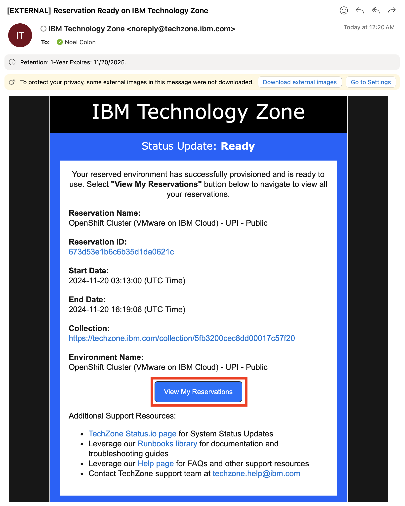

# Installing IBM Concert > OpenShift Install

The following guide is derived from the [IBM Concert Documentation](https://www.ibm.com/docs/en/concert?topic=premises-installing-concert-openshift).  Please refer to the official IBM documentation for the latest up-to-date materials.

## Lab Environments

### Sizing

The [IBM Sales Configurator](https://app.ibmsalesconfigurator.com/#/concert/configure) lists the following configuration for a small t-shirt size Concert cluster.

- 3 master nodes. Each with 4 CPU 16GB RAM
- 3 worker nodes. Each with 16 CPU 64GB RAM


### TechZone

### TechZone Reservation

Use an OpenShift cluster deplpyed on IBM Cloud.  This lab has been written and tested on the following TechZone Certified Base Image in the [VMWare on IBM Cloud Environments](https://techzone.ibm.com/collection/tech-zone-certified-base-images/journey-vmware-on-ibm-cloud-environments) collection.  Select the following environment from this collection.

[](https://techzone.ibm.com/my/reservations/create/63a3a25a3a4689001740dbb3)

In the reservation details, pick your Preferred Geography, and use the `8 vCPU | 32 GB` Worker Node Flavor.


- [OpenShift Cluster (VMware on IBM Cloud) - UPI - Public](https://techzone.ibm.com/my/reservations/create/63a3a25a3a4689001740dbb3)

!!! danger "Network Connectivity"
    Pay close attention to network connectivity.  Your OpenShift cluster needs to be deployed in a network where it can get to your image registry and your github enterprise server.  More importantly, your github enterprise server needs to be able to reach your OpenShift cluster so that it can inform when a code push occurs on the github repo.

When your reservation is ready, you will receive an email from TechZone with a link to your reservation.



In the reservation details page, you will find important information such as the OpenShift API URL, credentials to log in, and a link to the OpenShift Console.  You can also download a copy of the cluster's kubeconfig file for an alternate means of authentication.


## Client workstation requirements

???+ note "podman"

    Docker Desktop is no longer allowed for IBM workstations, so we will use podman. The podman and docker commands are interchangeable throughout this guide.

    === "Linux (RHEL)"

        ```bash
        sudo dnf install -y podman
        ```

    === "Mac"

        ```bash
        brew install podman-desktop
        ```
    
    === "Windows"

        Refer to the [Podman Install Insrtuctions](https://podman-desktop.io/docs/installation) if you havent installed podman in your workstation.

???+ note "jq"

    === "Linux (RHEL)"

        ```bash
        sudo dnf install -y jq
        ```

        You can also obtain the pre-compiled binaries in the [jq Documentation](https://jqlang.github.io/jq/download/).

    === "Mac"

        The best way to install the jq utility for your Mac is using [Homebrew](https://brew.sh)

        ```bash
        brew install jq
        ```

        You can also obtain the pre-compiled binaries in the [jq Documentation](https://jqlang.github.io/jq/download/).

    === "Windows"

        You can obtain the pre-compiled binaries in the [jq Documentation](https://jqlang.github.io/jq/download/).

???+ note "OpenShift Client"

    === "Linux (RHEL)"

        You can obtain the OpenShift CLI following the official [OpenShift Documentation](https://docs.openshift.com/container-platform/latest/cli_reference/openshift_cli/getting-started-cli.html#cli-installing-cli-web-console_cli-developer-commands).

        Alternately, you can download the latest stable version from https://mirror.openshift.com/pub/openshift-v4/clients/ocp/stable/ that suits your OS and Architecture.  Uncompress the file, and move the `oc` utility to a directory in your `$PATH`.
        
        For example:

        ```bash
        curl https://mirror.openshift.com/pub/openshift-v4/clients/ocp/stable/openshift-client-linux-amd64-rhel9-4.17.3.tar.gz -o openshift-client.tgz
        tar xf openshift-client.tgz
        sudo mv oc /usr/local/bin/
        ```

    === "Mac"

        The best way to install the OpenShift Cient utility for your Mac is using [Homebrew](https://brew.sh)

        ```bash
        /bin/bash -c "$(curl -fsSL https://raw.githubusercontent.com/Homebrew/install/HEAD/install.sh)"
        brew install openshift-cli
        ```

        You can also obtain the OpenShift CLI following the official [OpenShift Documentation](https://docs.openshift.com/container-platform/latest/cli_reference/openshift_cli/getting-started-cli.html).

    === "Windows"

        You can obtain the OpenShift CLI following the official [OpenShift Documentation](https://docs.openshift.com/container-platform/latest/cli_reference/openshift_cli/getting-started-cli.html#cli-installing-cli-web-console_cli-developer-commands).

## Obtain IBM Entitlement Key

To obtain your IBM entitlement API key perform the following steps:

Log in to [Container software library on My IBM](https://myibm.ibm.com/products-services/containerlibrary) with the IBMid and password that are associated with the entitled software.
On the Entitlement keys tab, select Copy to copy the entitlement key to clipboard.

## Installing IBM Concert

The Concert [product documentation](https://www.ibm.com/docs/en/concert?topic=installing-creating-image-pull-secret) lists all the steps required to update the global pull secret for your OpenShift cluster.  Bellow is a quick summary

### Log on to OpenShift

On the TechZone reservation details page, take note of the API URL, as well as the cluster admin username and password.

To log on to your OpenShift cluster with the oc utulity, execute the following step:

???+ note "oc login"

    ```bash
    oc login -u <CLUSTER ADMIN USERNAME> -p <CLUSTER ADMIN PASSWORD> <API_URL>
    ```

    In the example reservation details posted above, the login command would be

    ```bash
    oc login -u kubeadmin -p UEz2r-SgXDp-hBLhB-5dusx https://api.673d53e1b6c6b35d1da0621c.ocp.techzone.ibm.com:6443
    ```

### Update global pull secret

???+ note "update global pull secret"

    Set up your environment variables.

    ```bash
    export PROD_REGISTRY=cp.icr.io
    export PROD_USER=cp
    export IBM_ENTITLEMENT_KEY="eY..."
    ```

    The following procedure will extract the global pull secret from your cluster, add the credentials to the IBM Entitlement Registry, and then update the global pull secret in the cluster

    ```bash
    oc get secret/pull-secret -n openshift-config --template='{{index .data ".dockerconfigjson" | base64decode}}' > dockerconfigjson
    oc registry login --registry=${PROD_REGISTRY} --auth-basic="${PROD_USER}:${IBM_ENTITLEMENT_KEY}" --to=dockerconfigjson
    oc set data secret/pull-secret -n openshift-config --from-file=.dockerconfigjson=dockerconfigjson
    ```

### Install IBM Concert

The IBM Concert [install documentation](https://www.ibm.com/docs/en/concert?topic=ocp-installing-concert-software-openshift-container-platform) lists all the steps required to deploy IBM Concert into an OpenShift cluster.  Some additional details are described bellow.

Concert uses a bash script to install and configure its environment, similar to the cpd-cli utility used by CloudPak for Data.

???+ command

    ```bash
    mkdir ibm-concert
    cd ibm-concert
    curl https://raw.githubusercontent.com/IBM/Concert/main/Software/manage/ibm-concert-manage.sh -o ibm-concert-manage.sh
    chmod +x ibm-concert-manage.sh
    ```

set up environemnt variables

???+ command

    ```bash
    export DOCKER_EXE=podman # (1)!
    export WORK_DIR=/Users/ncolon/dev/ibm-concert-training/ibm-concert # (2)!
    export OCP_URL=https://api.concert.aws.ibm-gtmaa.dev:6443 # (3)!
    export PROJECT_OPERATOR=ibm-concert-operators # (4)!
    export PROJECT_INSTANCE=ibm-concert # (5)!
    export STG_CLASS_BLOCK=gp3-csi # (6)!
    export STG_CLASS_FILE="" # (7)!
    export IBM_ENTITLEMENT_KEY="eyJh..." # (8)!
    ```

    1. DOCKER_EXE: docker or podman.  This guide uses podman, but commands are interchangeable.
    2. WORK_DIR: Workstation directory where the `ibm-concert-manage.sh` script runs
    3. OCP_URL: Red Hat OpenShift container platform URL.  You can obtain it by running `oc whoami --show-server`
    4. PROJECT_OPERATOR: IBM automation application framework operator installation project
    5. PROJECT_INSTANCE: Concert installation project
    6. STG_CLASS_BLOCK: Block storage class name
    7. STG_CLASS_FILE: File storage class name
    8. IBM_ENTITLEMENT_KEY: IBM entitlement API key

Initialize the AAF utility.  It runs as a local container in podman.

???+ command

    ```bash
    ./ibm-concert-manage.sh initialize
    ```

???+ success "initialize output"

    ``` {.bash .no-copy }
    ➜  lab $ $ ./ibm-concert-manage.sh initialize
    ibm-aaf-utils
    ===== work_dir is /Users/ncolon/dev/ibm-concert/1.0.3-install/ =====
    2401c7877a46b99dc62317f7513d2d4bc14f3fdbfa792bbce424427b4a1198d6
    /opt/ansible
    Updating param-aaf file
    copying file
    to check on things:-
    podman exec -ti ibm-aaf-utils bash
      %
    ```

Obtain an OpenShift login token from your OpenShift console.  This token expires every 24hrs.  Navigate to your OpenShift console, and clock on the `kube:admin` dropdown on the top right, and click on `Copy login command`


On the next screen, click on `Display Token`.


Copy the token, and copy it as the value for `OCP_TOKEN` below, and then log the installer into your OpenShift instance.

???+ command

    ```bash
    export OCP_TOKEN="sha256~..."
    ./ibm-concert-manage.sh login-to-ocp --token=${OCP_TOKEN} --server=${OCP_URL}
    ```

???+ success "login-to-ocp output"

    ``` {.bash .no-copy}
    ➜  lab $ ./ibm-concert-manage.sh login-to-ocp --token=${OCP_TOKEN} --server=${OCP_URL}
    login-to-ocp..
    WARNING: Using insecure TLS client config. Setting this option is not supported!

    Logged into "https://api.concert.aws.ibm-gtmaa.dev:6443" as "kube:admin" using the token provided.

    You have access to 69 projects, the list has been suppressed. You can list all projects with 'oc projects'

    Using project "default".
    Using project "default" on server "https://api.concert.aws.ibm-gtmaa.dev:6443".
    ```

  Finally, start the Concert installation.  It should take around 45-60 minutes.

???+ command

    ```bash
    ./ibm-concert-manage.sh concert-setup
    ```

???+ success "concert-setup output"

    ``` {.bash .no-copy}
    ➜  lab $ ./ibm-concert-manage.sh concert-setup
    concert-setup

    [...REDACTED FOR BREVITY...]
    PLAY [localhost] ***************************************************************

    TASK [include_role : utils] ****************************************************

    TASK [utils : include_vars] ****************************************************
    ok: [localhost]

    TASK [utils : include_vars] ****************************************************
    ok: [localhost]

    [...REDACTED FOR BREVITY...]

    TASK [debug] *******************************************************************
    skipping: [localhost]

    PLAY RECAP *********************************************************************
    localhost                  : ok=86   changed=9    unreachable=0    failed=0    skipped=118  rescued=0    ignored=0   

    running pre-validation routines (if any) for post_apply_cr..
    Fri Aug  2 01:56:32 UTC 2024
    command ran successfully. ['cr-apply', '--license_acceptance=true', '--release=4.8.3', '--components=cpd_platform,concert', '--cpd_operator_ns=ibm-concert-operators', '--cpd_instance_ns=ibm-concert', '--block_storage_class=gp3-csi', '--file_storage_class=', '--preview=false', '@']
    2024-08-02 01:56:32,182 - __main__ - INFO - command ran successfully. ['cr-apply', '--license_acceptance=true', '--release=4.8.3', '--components=cpd_platform,concert', '--cpd_operator_ns=ibm-concert-operators', '--cpd_instance_ns=ibm-concert', '--block_storage_class=gp3-csi', '--file_storage_class=', '--preview=false', '@']
    2024-08-02 01:56:32,184 - __main__ - INFO - deployment succeeded
    ```

??? note "Upgrading IBM Concert"

    To upgrade IBM Concert, repeat the steps to set up environment variables, initialize and login to ocp.  Replace the `./ibm-concert-manage.sh concert-setup` step with

    ```bash
    ./ibm-concert-manage.sh upgrade-concert
    ```

### Validating Install

Upon completion, you can run these following commands to validate that the install completed successfully.

Validate the IBM Concert CatalogSources

???+ command

    ```bash
    oc get catalogsource -n ${PROJECT_OPERATOR}
    ```

???+ success "validating CatalogSource"

    ``` {.bash .no-copy}
    ➜  lab $ oc get catalogsource -n ${PROJECT_OPERATOR}
    NAME                              DISPLAY                                 TYPE   PUBLISHER   AGE
    cloud-native-postgresql-catalog   ibm-cloud-native-postgresql-4.18.0      grpc   IBM         18m
    cpd-platform                      ibm-cp-datacore-4.3.0+20240311.101055   grpc   IBM         12m
    ibm-aaf-operator-catalog          ibm-aaf-operator-1.0.0-linux-amd64      grpc   IBM         10m
    opencloud-operators               ibm-cp-common-services-4.4.0            grpc   IBM         18m
    ```

Validate the ClusterServiceVersions

???+ command

    ```bash
    oc get csv -n ${PROJECT_OPERATOR}
    ```

???+ success "validate csv"

    ``` {.bash .no-copy}
    ➜  lab $ oc get csv -n ${PROJECT_OPERATOR}
    NAME                                          DISPLAY                                VERSION   REPLACES                          PHASE
    cloud-native-postgresql.v1.18.7               EDB Postgres for Kubernetes            1.18.7    cloud-native-postgresql.v1.18.6   Succeeded
    cpd-platform-operator.v5.3.0                  Cloud Pak for Data Platform Operator   5.3.0                                       Succeeded
    ibm-aaf-operator.v1.0.0                       ibm-aaf-operator                       1.0.0                                       Succeeded
    ibm-cert-manager-operator.v4.2.2              IBM Cert Manager                       4.2.2                                       Succeeded
    ibm-common-service-operator.v4.4.0            IBM Cloud Pak foundational services    4.4.0                                       Succeeded
    ibm-commonui-operator.v4.3.1                  Ibm Common UI                          4.3.1                                       Succeeded
    ibm-iam-operator.v4.4.0                       IBM IM Operator                        4.4.0                                       Succeeded
    ibm-mongodb-operator.v4.2.2                   IBM MongoDB Operator                   4.2.2                                       Succeeded
    ibm-namespace-scope-operator.v4.2.2           IBM NamespaceScope Operator            4.2.2                                       Succeeded
    ibm-zen-operator.v5.1.1                       IBM Zen Service                        5.1.1                                       Succeeded
    operand-deployment-lifecycle-manager.v4.2.3   Operand Deployment Lifecycle Manager   4.2.3                                       Succeeded
    ➜  lab $ 
    ```
!!! note
    You may have more CSVs in your `${PROJECT_OPERATOR}` namespace depending on what other cluster scoped operators are installed on your cluster.

Validate the status of all the CPFS services.  All services should have a Status of `Completed`.

???+ command

    ```bash
    ./ibm-concert-manage.sh get-cr-status
    ```

???+ success "get-cr-status"

    ```{ .bash .no-copy }
    ➜  lab $ ./ibm-concert-manage.sh get-cr-status
    get-cr-status
    Execute script: python3 /opt/ansible/bin/get_cr_status.py --cpd_instance_ns ibm-concert

    Running the get_cr_status.py script. Start of the log.
    ================================================================

    [...REDACTED FOR BREVITY...]

    Component     CR-kind     CR-name    Namespace    Status     Version    Creationtimestamp     Reconciled-version    Operator-info
    ------------  ----------  ---------  -----------  ---------  ---------  --------------------  --------------------  ----------------------------------
    zen           ZenService  lite-cr    ibm-concert  Completed  5.1.1      2024-08-02T01:24:50Z  5.1.1                 zen operator 5.1.1 build 37
    cpd_platform  Ibmcpd      ibmcpd-cr  ibm-concert  Completed  4.8.3      2024-08-02T01:22:20Z  N/A                   cpdPlatform operator 5.3.0 build 5

    The get_cr_status.py script ran successfully. End of the log.
    ================================================================

    [SUCCESS] The status of custom resources was saved to '/status.csv'.
    ```

### Acessing IBM Concert Instance

Once deployed, you can access your IBM Concert instance by issuing the following command:

???+ command

    ```bash
    ./ibm-concert-manage.sh get-concert-instance-details
    ```

???+ success "get-concert-instance-details"

    ```{.bash .no-copy}
    ➜ lab $ ./ibm-concert-manage.sh get-concert-instance-details
    get-concert-instance-details
    # admin_password
    Concert Url: concert-ibm-concert.apps.concert.aws.ibm-gtmaa.dev
    Zen Administration URL: concert-ibm-concert.apps.concert.aws.ibm-gtmaa.dev/zen
    Concert Username: cpadmin
    Concert Password: [REDACTED]
    ```
