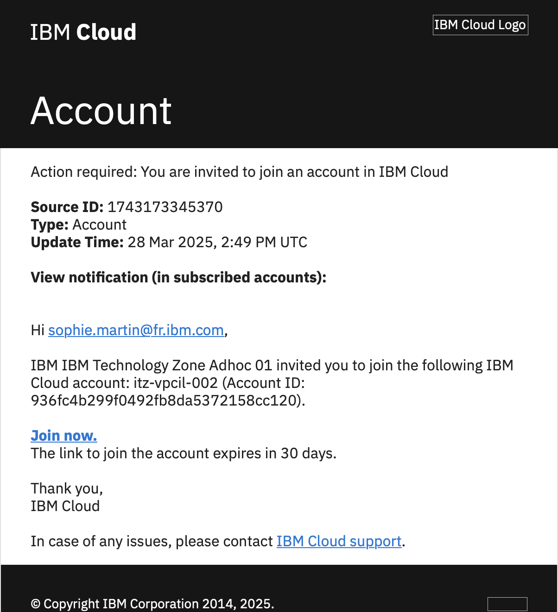
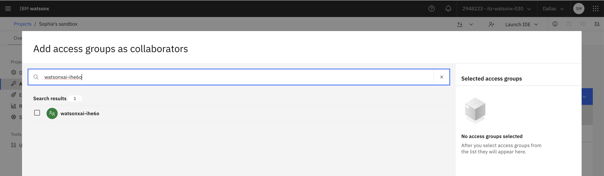
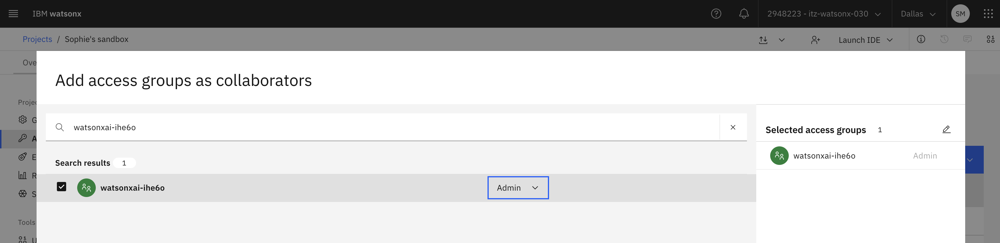

# Installing IBM Concert > VM Install

## Documentation

The following guide is derived from the [IBM Concert Documentation](https://www.ibm.com/docs/en/concert?topic=concert-deploying-virtual-machine-vm) and labs created by Sophie Martin and Gauthier Siri.  Please refer to the official IBM documentation for the latest up-to-date materials.

## Lab Environments

### Sizing

The recommended size for your Linux VM is a 16 CPU, 32GB RAM with 512GB for storage.

### TechZone Reservation

Use a RHEL9 VM on IBM Cloud.  This lab has been written and tested on the following TechZone Certified Base Image in the [IBM Cloud Environment](https://techzone.ibm.com/my/reservations/create/68a831993211144a53c49722).  Select this environment from this collection.

In the reservation details, pick your Preferred Geography, and use the `16 vCPU | 64 GiB` VM Profile.

<!--  -->

???+ warning "Bring Your Own VM"

    You can also bring your own Linux VM from your on-prem or cloud environment.  Ensure access to port 12443 is allowed to VM.  This lab exercise is based on RHEL9 VMs provisioned by the TechZone environment above, there may be changes that need to be accounted for when using other environments, but that is outside of the scope of this guide.

<!-- When your reservation is ready, you will receive an email from TechZone with a link to your reservation

 -->

On the reservation details, take note of the public IP address of your RHEL9 vm, as well as download the SSH key with the button provided


## Obtain IBM Entitlement Key

To obtain your IBM entitlement API key perform the following steps:

Log in to [Container software library on My IBM](https://myibm.ibm.com/products-services/containerlibrary) with the IBMid and password that are associated with the entitled software.
On the Entitlement keys tab, select Copy to copy the entitlement key to clipboard.

## Install Prerequirements

SSH into the IBM Concert VM with the public IP and SSH key obtained from the TechZone reservation details.  You'll need to change permissions on the SSH key first before you SSH.

???+ note "SSH"

    ```bash
    chmod 600 ~/Downloads/pem_ibmcloudvsi_download.pem
    ssh -i ~/Downloads/pem_ibmcloudvsi_download.pem -p 2223 itzuser@<PUBLIC IP>
    ```

!!! warning
    The installation steps need to be run on the Linux VM that will act as your IBM Concert server.  See the [Before you being](https://www.ibm.com/docs/en/concert?topic=vm-installing-concert#installing_on_vm__title__2) section in the IBM Concert documentation for VM requirements

### Modify the TechZone Machine Hostname

In version 2.0.0, Concert can be joined only if the machine has a FQDN known by a DNS. This is not the case of TechZone VMs. You will need to change the VM hostname so that it can be resolvable.  
Replace **YOUR_VM_PUBLIC_IP** with the public IP defined in your TechZone reservation.

```bash
sudo hostnamectl set-hostname <YOUR_VM_PUBLIC_IP>.nip.io
```

Reboot the VM

```bash
sudo reboot
```

### Prepare VM disk

To prepare the 500Gb disk, execute the following commands. Note: if you run into any issues, it may be helpful to execute the commands one at a time.

???+ note "Code"

    ```bash
    sudo -i
    lsblk
    mkfs.ext4 -m 0 -E lazy_itable_init=0,lazy_journal_init=0,discard /dev/vdd
    blkid | grep /dev/vdd
    ```

Copy the UUID value output and store it in a safe place.

???+ note "Code"

    ```bash
    mkdir -p /mnt/concert
    cp /etc/fstab /etc/fstab.orig
    vi /etc/fstab
    ```

Insert this line at the end of the file: 

???+ note "Code"

    ```bash
    UUID=YOUR_UUID /mnt/concert ext4 discard,defaults,nofail 0 0
    ```

Replace YOUR_UUID by the one listed by the **blkid | grep /dev/vdd** command       
Save the file and continue with following commands:

???+ note "Code"

    ```bash
    mount -a
    systemctl daemon-reload
    lsblk
    chmod 777 /mnt/concert
    ```

???+ note "Required Utilities"

    === "podman "

        Docker Desktop is no longer allowed for IBM workstations, so we will use podman. Refer to the [Podman Install Instructions](https://podman-desktop.io/docs/installation) if you havent installed podman in your workstation.  The podman and docker commands are interchangeable throughout this guide.

    === "git"

        You can obtain the git CLI following the official [Git Documentation](https://github.com/git-guides/install-git#install-git-on-linux).


    === "wget"

        `wget` should be installed by default on your Linux system.  If its not, follow the install instructions on the official [GNU Wget](https://www.gnu.org/software/wget/) website.


    === "jq"

        `jq` should be installed by default on your Linux system.  If its not, follow the install instructions on the official [jq](https://jqlang.github.io/jq/download/) website.

    
    This lab is based on a RHEL9 VM in TechZone, to install all prereqs at once there, you can run the following command
    
    ```bash
    sudo dnf install -y podman git wget jq
    ```

## Provision watsonx.ai on TechZone

> Note: Concert require model ibm/granite-3-2-8b-instruct on watsonx.ai, so watsonx.ai must be provision in US
> 
### Watsonx.ai Provisioning

1. Navigate to [watsonx.ai on IBM Techzone](https://techzone.ibm.com/my/reservations/create/64b8490a564e190017b8f4eb)

2. Make a reservation for IBM watsonx.ai and choose **AMERICAS** as preferred geography (at the time we write this lab, only this region has the model used by IBM Concert inferences)

3. When the reservation is ready, you should receive a mail from **IBM Cloud** to join an account in IBM Cloud.

4. Open the mail, click the **join now** link and follow the instructions.

    {width=400}

5. When you have the IBM Cloud first screen, verify that you have the good account selected on the top bar

    

> Note: The IBM Cloud account selected should match the Cloud Account specified in the IBM TechZone reservation.
>
{width=700}

### Create a watsonx project and get project ID

1. Select watsonx to from the burger menu on the left

    {width=400}

2. Click **Launch** in the watsonx.ai tile

    {width=400}

3. Scroll down in the page that appear and click **Create a sandbox project** in the Projects tile

    {width=700}

4. Select the sandbox that have been created (you may need to refresh the page)

    {width=700}

5. In **Manage** tab, copy the "Project ID" and store it in a safe place

    {width=700}

### Get API Key and service ID information

- From your techzone reservation screen, retrieve the APIKey and the service ID and store them in a safe place

    {width=600}

### API key - import the Service ID as part of the project

1. From your watsonx screen, in the **manage** tab, select **Access control** in the left menu

    

2. Click the **Add Collaborators** button and select **Add Access Group**.

    

3. Enter your Access Group name. The access Group Name is the IBM Cloud Service ID on your TechZone reservation page.

    

4. Select your group, give it admin right and click **Add** button

    

## Installing IBM Concert

!!! warning
    IMPORTANT: if you are already logged on the VM, verify that you are connected as itzuser (not root). You may need to open a new terminal window and re-ssh into the machine. The installation steps need to be run on the itzuser of the Linux VM that will act as your IBM Concert server.  See the [Before you being](https://www.ibm.com/docs/en/concert?topic=vm-installing-concert#installing_on_vm__title__2) section in the IBM Concert documentation for VM requirements. 

### Download installation artifacts

???+ Code

    ```bash
    loginctl enable-linger itzuser
    
    LATEST_TAG=$(curl --silent https://api.github.com/repos/IBM/Concert/releases/latest | jq -r .tag_name)
    cd /mnt/concert
    wget https://github.com/IBM/Concert/releases/download/${LATEST_TAG}/ibm-concert-std.tgz
    tar -xf ibm-concert-std.tgz
    ```

### Set up environment variables

???+ Note "Create a $HOME/env.sh file"

    ```bash
    vi $HOME/env.sh
    ```
    
Copy and paste the content of [env.sh](../files/env.sh) in this $HOME/env.sh file  
Update the values for the following keys (other keys will be updated later):

- **CONCERT_REGISTRY_PASSWORD**: your [entitlement key](https://www.ibm.com/docs/en/concert?topic=concert-obtaining-entitlement-api-key) surrounded by double quotes

Save the file (:wq)

???+ Note "Source the $HOME/env.sh file to set environment variables"

    ```bash
    source $HOME/env.sh
    ```

### Log in to the IBM Container Registry

??? note "Notes on Airgap Environments"

    If you're deploying on an AirGap environment, you will first need to mirror the images to your private container image registry.  You will need to [install skopeo](https://github.com/containers/skopeo/blob/main/install.md) on a workstation with access to both cp.icr.io and to the private image registry where images will be mirrored.


    ```bash
    export CONCERT_PUBLIC_REGISTRY=cp.icr.io/cp/concert
    export CONCERT_PUBLIC_REGISTRY_USER=cp
    export CONCERT_PUBLIC_REGISTRY_PASSWORD="eyJh..."  ## Your IBM Entitlement Key
    export CONCERT_REGISTRY=<YOUR PRIVATE REGISTRY>
    export CONCERT_REGISTRY_USER=<YOUR PRIVATE REGISTRY USERNAME>
    export CONCERT_REGISTRY_PASSWORD=<YOUR PRIVATE REGISTRY PASSWORD>
    export BUILD_VERSION=$(cat ibm-concert-std/etc/build_version)

    skopeo login ${CONCERT_PUBLIC_REGISTRY} -u ${CONCERT_PUBLIC_REGISTRY_USER} -p ${CONCERT_PUBLIC_REGISTRY_PASSWORD}
    skopeo login ${CONCERT_REGISTRY} -u ${CONCERT_REGISTRY_USER} -p ${CONCERT_REGISTRY_PASSWORD}
    IMAGES=(
        ibm-roja-sra
        ibm-roja-portal-gw
        roja-ui
        rojacore
        ibm-roja-compliance
        ibm-roja-pipeline
        ibm-roja-ingestion
        ibm-roja-py-utils
        ibm-roja-postgres
        ibm-roja-minio
    )
    for image in "${IMAGES[@]}"; do
        skopeo copy \
            docker://${CONCERT_PUBLIC_REGISTRY}/${image}:${BUILD_VERSION} \
            docker://${CONCERT_REGISTRY}/${image}:${BUILD_VERSION}
    done

    ```

    Once the images are mirrored, you can proceed with the installation steps.

???+ Code

    ```bash
    ${DOCKER_EXE} login ${CONCERT_REGISTRY} \
        --username=${CONCERT_REGISTRY_USER} --password=${CONCERT_REGISTRY_PASSWORD}
    ```

### Install IBM Concert

???+ code

    ```bash
    ibm-concert-std/bin/setup --license_acceptance=y \
        --registry=${CONCERT_REGISTRY} --runtime=${DOCKER_EXE} \
        --username=ibmconcert --password
    ```

If you don't specify a password with `--password=<somepassword>` the installation process will prompt you for one.

???+ success "output"

    ```{.bash .no-copy}
    $ ibm-concert-std/bin/setup --license_acceptance=y \
        --registry=${CONCERT_REGISTRY} --runtime=${DOCKER_EXE} \
        --username=ibmconcert --password
    Enter Password:
    ```

### Validate IBM Concert Install

Validate the IBM Concert install with the ibm-concert/bin/status script.  Ensure all services are `running`.

???+ code

    ```bash
    ibm-concert-std/bin/status
    ```

???+ success "output"

    ```{.bash .no-copy}
    $ ibm-concert-std/bin/status
    ibm-roja-minio : running
    ibm-roja-postgres : running
    ibm-roja-py-utils : running
    ibm-roja-ingestion : running
    ibm-roja-pipeline : running
    ibm-roja-compliance : running
    ibm-roja-portal-gw : running
    ibm-roja-core : running
    ibm-roja-ui : running
    ibm-roja-mgmt : running
    ibm-roja-sra : running

    URL:  https://your.server:12443
    ```

### Updating SSL Certificate on IBM Concert

The customer has installed a piece of vendor software that exposes a https service. IBM Concert generates a self-signed certificate and serves that.

When connecting from a client, like a browser:

- self-signed certs by unknown issuers will trigger warnings in the browser and even after you accept it, it will continue to mark it as "connection not secure"
- in certain browser side UI situations, caching to local storage is not done when untrusted connections are in use. Hence that also leads to performance problems.

As per security policies, most customers will not permit the use of such self-signed certs - but rather require certs that are signed by an official CA or by their own internal CA.
For example, w3.ibm.com cert is issued/signed by Digicert (an official CA), but many other internal IBM sites serve certs issued by "IBM INTERNAL INTERMEDIATE CA".

- our browsers and command lines trust the internal issues and external issuers - and hence permit access to such websites.

Certificates are issued to a specific host/domain. For example, if a customer installs Concert in a machine called "my-vm-03.us.example.com", then the certificate must match that host/domain name. Typically it is a "wildcard" cert issued to the domain - such as us.example.com.

- these certificate-key pair must be generated by a CA that is trusted by the clients, including browsers.
- these certificates are renewed and generally maintained by the customer, because only their CA can issue/sign such certs in the first place.

To replace the self-signed certificate for IBM Concert, place a copy of the certificate and private key in the `ibm-concert-std/localstorage/volumes/infra/tls/external-tls/` folder and restart the `ibm-roja-portal-gw` service.  In this example, we are creating a self-signed certificate key pair.  For deployments on customer's systems, obtain real certificates signed by your customer's CA for their environment.

???+ code

    ```bash
    OUT=ibm-concert-std/localstorage/volumes/infra/tls/external-tls
    sudo openssl req -newkey rsa:2048 -noenc -keyout $OUT/tls.key -out $OUT/tls.csr \
        -subj "/C=US/ST=North Carolina/L=Raleigh/O=IBM/OU=WW CS/CN=server.example"
    sudo openssl x509 -signkey $OUT/tls.key -in $OUT/tls.csr -req -days 365 -out $OUT/tls.crt
    sudo chmod 644 $OUT/tls*
    ./ibm-concert-std/bin/start_service ibm-roja-portal-gw
    ```


### Log in to IBM Concert

Log in to IBM Concert using `https://<VM_PUBLIC_IP>:12443` as your URL and the credentials from the previous steps.

### Set up Concert and watsonx integration

In the following steps, **YOUR_VM_IP** is the public IP defined in your Techzone reservation

1. From a browser go to the Concert URL (https://YOUR_VM_IP:12443)
2. Login to Concert using **ibmconcert** as the username and the password you created in step 4.
3. Click the circle at top right of the window and select **API Key**

    {width=400}

4. In the API Key window, click **Generate API Key**

    

5. Copy the API key generated and save in a safe place

6. Update environment variables

    ```bash
    vi $HOME/env.sh
    ```

    Update the values for the following keys:

    - **CONCERT_APIKEY** with the API Key you created in step 5.
    - **CONCERT_URL** with https://YOUR_VM_IP:12443 (replace YOUR_VM_IP with your own VM address)
    - **WATSONX_API_KEY**: use the API key you got in [Lab 0 - Get API Key and service ID information](Lab0-setup.md#get-api-key-and-service-id-information), from your TechZone wx.ai reservation page
    - **WATSONX_API_PROJECT_ID**: use the project ID you got from [Lab 0 - Create a watsonx project and get project ID](Lab0-setup.md#create-a-watsonx-project-and-get-project-id),
    - **WATSONX_API_URL**: https://us-south.ml.cloud.ibm.com , since the instance is provision in US.
    Save the file (:wq) and source the $HOME/env.sh file to set environment variables

    ```bash
    source $HOME/env.sh
    ```

7. Apply the watsonx.ai configuration

    ```bash
    echo "WATSONX_API_KEY=$WATSONX_API_KEY" >> ibm-concert-std/etc/local_config.env
    echo "WATSONX_API_PROJECT_ID=$WATSONX_API_PROJECT_ID" >> ibm-concert-std/etc/local_config.env
    echo "WATSONX_API_URL=$WATSONX_API_URL" >> ibm-concert-std/etc/local_config.env
    ```

8. Then you need to start the appropriate service:

    ```bash
    cd /mnt/concert
    ibm-concert-std/bin/start_service ibm-roja-py-utils
    ```

9. Test the integration 

    To verify that the integration with watsonx.ai is successfull, you can look at the **ibm-roja-py-utils** pod logs:

    ```bash
    podman logs ibm-roja-py-utils
    ```

???+ success "The 2 first lines of the logs should be:"

    ```txt
    {'timestamp': 2025-04-13:13:45:15, 'logLevel': info, 'callerMethod': client.py:L459, 'message': Client successfully initialized}
    {'timestamp': 2025-04-13:13:45:15, 'logLevel': info, 'callerMethod': genai.py:L129, 'message': Connection to watsonx.ai successful!}
    ```

## Create an IBM Github token to clone the GitHub repo

Create a GitHub Token to clone using cli thru HTTPS:

- Login to [https://github.ibm.com](https://github.ibm.com)
- Click your profile in the top right
- Settings —&gt; Developer settings —&gt; Personal access tokens
- Click **Generate new token**
- Enter a name you can remember, for example **IBM GitHub Clone**
- Check **repo**, the underlying boxes such as `repo:status` will also be checked
- Click **Generate token**
- Copy your token and store it in a safe place as you won't be able to retrieve it (but you can generate a new one)
