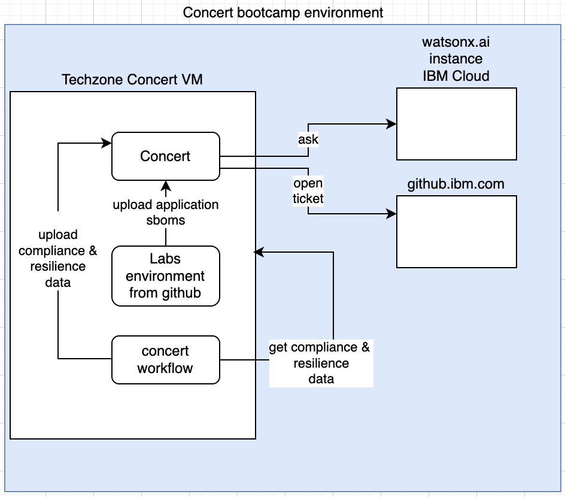

# IBM Concert bootcamp

These materials were made by Sophie Martin and Gauthier Siri

In this bootcamp, based on a simple python application composed of 2 micro services, you will learn to:

- [Lab0](labs/Lab0-setup.md) - Reserve required environment on techzone
- [Lab1](labs/Lab1-concert-installation-vm.md) - Install IBM Concert
- [Lab2](labs/Lab2-concert-workflow-installation.md) - Install Concert Workflow
- [Lab3](labs/Lab3-concert-walkthrough.md) - Concert walkthrough
- [Lab4](labs/Lab4-managing-software-composition-and-cves.md) - Upload applications SBOMS in IBM Concert and manage software composition
- [Lab5](labs/Lab5-managing-operations-certificates.md) - Upload applications certificates in IBM Concert and manage operations
- [Lab6](labs/Lab6-managing-compliance-using-concert-workflow.md) - Upload Compliance data in IBM Concert and manage compliance
- [Lab7](labs/Lab7-managing-resilience-using-concert-workflow.md) - Upload Resilience data in IBM Concert and manage resilience
- [Lab8](labs/Lab8-auto-discovery-auto-resilience.md) - Auto-discovery and Auto-resilience

All the labs are based on Concert Version 2.0.0.     
In order to run the labs, you will provision on IBM Techzone some environments.     

Here is the architecture schema of your environment:    

  
