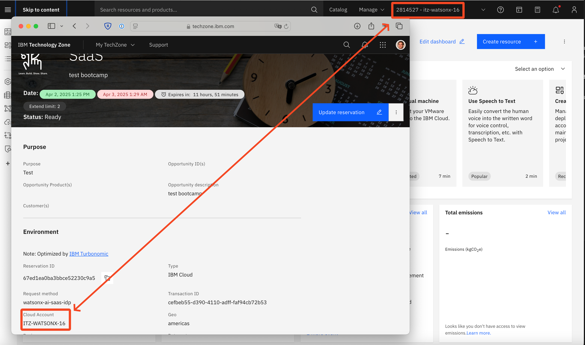

# IBM Concert bootcamp - Lab setup

## Objective

This lab covers the prerequisite to the IBM Concert bootcamp.

It will cover:
-  booking a VM on Techzone, where IBM Concert will be deployed
-  booking a watsonx.ai instance on Techzone
-  creating a github token to clone the required files

## Prerequisite

- You must have:
  - An IBM Cloud user
  - An account on https://github.ibm.com
  
- On your laptop, you must have
  - A ssh client
  - A web browser

## Content

- [IBM Concert bootcamp - Lab setup](#ibm-concert-bootcamp---lab-setup)
  - [Objective](#objective)
  - [Prerequisite](#prerequisite)
  - [Content](#content)
  - [I - Provision a vm on techzone](#i---provision-a-vm-on-techzone)
    - [Provision the VM](#provision-the-vm)
    - [Modify the techzone machine hostname](#modify-the-techzone-machine-hostname)
    - [Prepare VM disk](#prepare-vm-disk)
  - [II - Provision a watsonx.ai on techzone](#ii---provision-a-watsonxai-on-techzone)
    - [Watsonx.ai Provisioning](#watsonxai-provisioning)
    - [Create a watsonx project and get project ID](#create-a-watsonx-project-and-get-project-id)
    - [Get API Key and service ID information](#get-api-key-and-service-id-information)
    - [API key - import the Service ID as part of the project](#api-key---import-the-service-id-as-part-of-the-project)
  - [III - Create an IBM Github token to clone the github repo](#iii---create-an-ibm-github-token-to-clone-the-github-repo)

## I - Provision a vm on techzone

### Provision the VM

Provision your concert VM from this [link](https://techzone.ibm.com/my/reservations/create/68a831993211144a53c49722).   
The minimum requirements to install IBM Concert and Concert workflox are: 16 vCPUs/32GB RAM/512GB Disk.     
On the provisionned VM, a 500GB disk is present but you need to prepare it.

Once your reservation is provisioned, all the connection information are available from the reservation page:


From your reservation page, download the ssh key to connect to your VM instance.
Save it somewhere, you will need to use it to connect to your instance using SSH.

> Note: On Linux/MacOS, you need to modify the SSH Key permission to be able to use it.
```bash 
chmod 600 /path/to/concert/sshkey/pem_ibmcloudvsi_download.pem
```

### Modify the techzone machine hostname

In version 2.0.0, concert can be joined only if the machine has a FQDN known by a DNS. This is not the case of techzone VMs. You will then change the vm hostname so that it can be resolvable.  
Replace **YOUR_VM_PUBLIC_IP** with the public IP defined in your Techzone reservation.

```bash
sudo hostnamectl set-hostname <YOUR_VM_PUBLIC_IP>.nip.io
```

4. Reboot the VM

```bash
sudo reboot
```

### Prepare VM disk

- To prepare the 500Gb disk, execute the following commands:

```bash
ssh itzuser@<VM ip address> -p 2223 -i /path/to/concert/sshkey/pem_ibmcloudvsi_download.pem
sudo -i
lsblk
mkfs.ext4 -m 0 -E lazy_itable_init=0,lazy_journal_init=0,discard /dev/vdd
blkid | grep /dev/vdd
```

- Copy the UUID value and store it in a safe place

```bash
mkdir -p /mnt/concert

cp /etc/fstab /etc/fstab.orig
vi /etc/fstab
```

- Insert this line at the end of the file: 

```bash
UUID=YOUR_UUID /mnt/concert ext4 discard,defaults,nofail 0 0
```

- Replace YOUR_UUID by the one listed by the **blkid | grep /dev/vdd** command       
- Save the file and continue with following commands:

```bash
mount -a
systemctl daemon-reload
lsblk
chmod 777 /mnt/concert
```

## II - Provision a watsonx.ai on techzone

> Note: Concert require model ibm/granite-3-2-8b-instruct on watsonx.ai, so watsonx.ai must be provision in US
> 
### Watsonx.ai Provisioning

1. Navigate to [watsonx.ai on IBM Techzone](https://techzone.ibm.com/my/reservations/create/64b8490a564e190017b8f4eb)

2. Make a reservation for IBM watsonx.ai and choose **AMERICAS** as preferred geography (at the time we write this lab, only this region has the model used by IBM Concert inferences)

3. When the reservation is ready, you should receive a mail from **IBM Cloud** to join an account in IBM Cloud.

4. Open the mail, click the **join now** link and follow the instructions.

{width="400"}

5. When you have the IBM Cloud first screen, verify that you have the good account selected on the top bar

{width="400"}

The IBM Cloud account selected should match the Cloud Account specified in the IBM TechZone reservation.

{width="400"}

### Create a watsonx project and get project ID

1. Select watsonx to from the burger menu on the left

{width="400"}

2. Click **Launch** in the watsonx.ai tile

{width="400"}

3. Scroll down in the page that appear and click **Create a sandbox project** in the Projects tile

{width="400"}

4. Select the sandbox that have been created (you should need to refresh the page)

{width="400"}

5. In **Manage** tab, copy the "Project ID" and store it in a safe place

{width="400"}

### Get API Key and service ID information

1. From your techzone reservation screen, retrieve the APIKey and the service ID and store them in a safe place

{width="400"}

### API key - import the Service ID as part of the project

1. From your watsonx screen, in the **manage** tab, select **Access control** in the left menu

{width="400"}

2. Click the **Add Collaborators** button and select **Add Access Group**.

{width="400"}

3. Enter your Access Group name. The access Group Name is the IBM Cloud Service ID on your TechZone reservation page.

{width="400"}

1. Select your group, give it admin right and click **Add** button

{width="400"}


## III - Create an IBM Github token to clone the github repo

Create a GitHub Token to clone using cli thru HTTPS:

- Login to [https://github.ibm.com](https://github.ibm.com)
- Click your profile in the right top
- Settings —&gt; Developer settings —&gt; Personal access tokens
- Click **Generate new token**
- Enter a name you can remember, for example **IBM GitHub Clone**
- Check **repo**, the underlying boxes such as `repo:status` will also be checked
- Click **Generate token**
- Copy your token and store it in a safe place as you won't be able to retrieve it (but you can generate a new one)