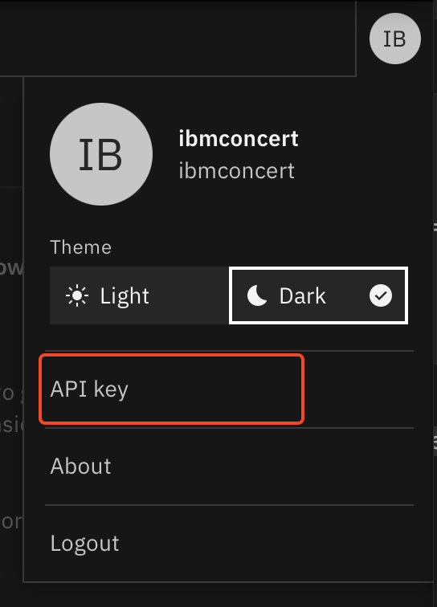

# IBM Concert installation on a virtual machine

## Objective

In this lab, you will install IBM Concert on a standalone server.

## Prerequisite

- An virtual machine must have been provisionned on Techzone and configured as explained in [Lab0](./Lab0-setup.md)

## Content

- [IBM Concert installation on a virtual machine](#ibm-concert-installation-on-a-virtual-machine)
  - [Objective](#objective)
  - [Prerequisite](#prerequisite)
  - [Content](#content)
  - [I - Installing IBM Concert on a VM](#i---installing-ibm-concert-on-a-vm)
  - [II - Watsonx.ai integration](#ii---watsonxai-integration)
    - [Techzone reservation](#techzone-reservation)
    - [Configure watsonx.ai in IBM Concert](#configure-watsonxai-in-ibm-concert)
  
## I - Installing IBM Concert on a VM

> Official documentation [VM installation](https://www.ibm.com/docs/en/concert/2.0.0?topic=vm-installing-concert-software)

1. Connect on the machine you have provisioned on Techzone in Lab0

IMPORTANT: if you are already logged on the VM, verify that you are connected as itzuser (not root).   

```bash
ssh itzuser@<VM ip address> -p 2223 -i /path/to/concert/sshkey/pem_ibmcloudvsi_download.pem
```

2. Change the umask in .bashrc file

```bash
echo "umask 022" >> $HOME/.bashrc
source $HOME/.bashrc
```

5. Start the installation

```bash
loginctl enable-linger itzuser
cd /mnt/concert
wget https://github.com/IBM/Concert/releases/download/v2.0.0.1/ibm-concert.tar.gz
tar xfz ibm-concert.tar.gz
```

6. Create a $HOME/env.sh file

```bash
vi $HOME/env.sh
```

Copy Paste the content of [env.sh](../files/env.sh) in this $HOME/env.sh file  
Update the values for the following keys (other keys will be updated later):

- **CONCERT_REGISTRY_PASSWORD**: your [entitlement key](https://www.ibm.com/docs/en/concert?topic=concert-obtaining-entitlement-api-key) surrounded by double quotes

Save the file (:wq)

7. Source the $HOME/env.sh file to set environment variables

```bash
source $HOME/env.sh
```

8. Configure the Concert parameter file

```bash
cd $INSTALL_DIR
cp $INSTALL_DIR/etc/sample-params/concert-vm-quick-start-params.ini $INSTALL_DIR/etc/params.ini
```

9. Edit the params.ini file with the required parameters

```text
DOCKER_EXE=podman

INSTALL_VM=true
INSTALL_CONCERT=true
IMAGE_REGISTRY_PREFIX=cp.icr.io/cp
HUB_IMAGE_REGISTRY_SUFFIX=/solis-hub
CONCERT_IMAGE_REGISTRY_SUFFIX=/concert
```

10. Install concert

Replace **CONCERT_USER** and **CONCERT_PASSWORD** by values of your choice

```bash
${DOCKER_EXE} login ${IBM_REGISTRY} --username=${IBM_REGISTRY_USER} --password=${IBM_REGISTRY_PASSWORD}
$INSTALL_DIR/bin/setup --license_acceptance=y --username=CONCERT_USER --password=CONCERT_PASSWORD
```

The installation take 5 to 7 minutes, be patient.    

1.  Connect on Concert and create an API Key

In the following steps, **YOUR_VM_PUBLIC_IP** is the public IP defined in your Techzone reservation

- From a browser go to the Concert URL (https://YOUR_VM_PUBLIC_IP.nip.io:12443)
- Log on concert using **ibmconcert** as user and with the password you have specified in step 4.
- Click the circle at top right of the window and select **API Key**
  {width="400"}
- In the API Key window, click **Generate API Key**
  {width="400"}
- Copy the API key generated in a safe place

## II - Watsonx.ai integration

### Techzone reservation

Be sure to reserve a watsonx.ai instance as explained in [Lab 0 - III - Provision a watsonx.ai on techzone](Lab0-setup.md#iii---provision-a-watsonxai-on-techzone).

### Configure watsonx.ai in IBM Concert

The watsonx.ai integration is simply done through setting some config parameters in the config files of IBM concert.  

1. You will need to update the $HOME/env.sh file.
```bash
vim $HOME/env.sh
```

Update the following variables:
- **WATSONX_API_KEY**: use the API key you got in [Lab 0 - Get API Key and service ID information](Lab0-setup.md#get-api-key-and-service-id-information), from your techzone wx.ai reservation page
- **WATSONX_API_PROJECT_ID**: use the project ID you got from [Lab 0 - Create a watsonx project and get project ID](Lab0-setup.md#create-a-watsonx-project-and-get-project-id),
- **WATSONX_API_URL**: https://us-south.ml.cloud.ibm.com , since the instance is provision in US.

Save the file (:wq) and source the $HOME/env.sh file to set environment variables

```bash
source $HOME/env.sh
```

2. Apply the watsonx.ai configuration

```bash
echo "WATSONX_API_KEY=$WATSONX_API_KEY" >> ibm-concert-std/etc/local_config.env
echo "WATSONX_API_PROJECT_ID=$WATSONX_API_PROJECT_ID" >> ibm-concert-std/etc/local_config.env
echo "WATSONX_API_URL=$WATSONX_API_URL" >> ibm-concert-std/etc/local_config.env
```

3. Then you need to start the appropriate service:

```bash
cd /mnt/concert
ibm-concert-std/bin/start_service ibm-roja-py-utils
```

4. Test the integration 

To verify that the integration with watsonx.ai is successfull, you can look at the **ibm-roja-py-utils** pod logs:

```bash
podman logs ibm-roja-py-utils
```

The 2 first lines of the logs should be:

```txt
{'timestamp': 2025-04-13:13:45:15, 'logLevel': info, 'callerMethod': client.py:L459, 'message': Client successfully initialized}
{'timestamp': 2025-04-13:13:45:15, 'logLevel': info, 'callerMethod': genai.py:L129, 'message': Connection to watsonx.ai successful!}
```

