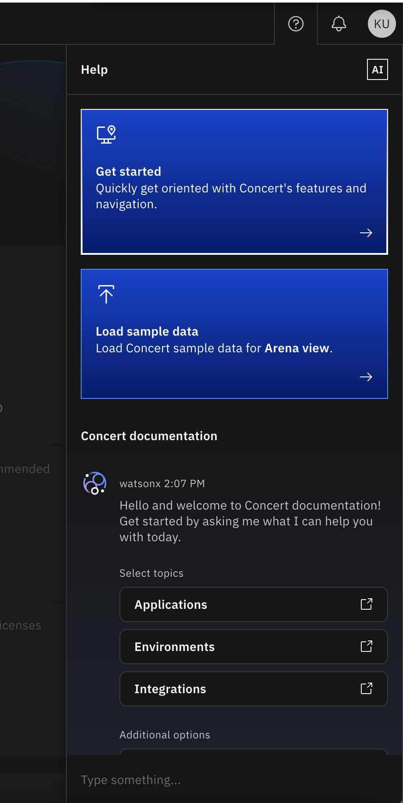
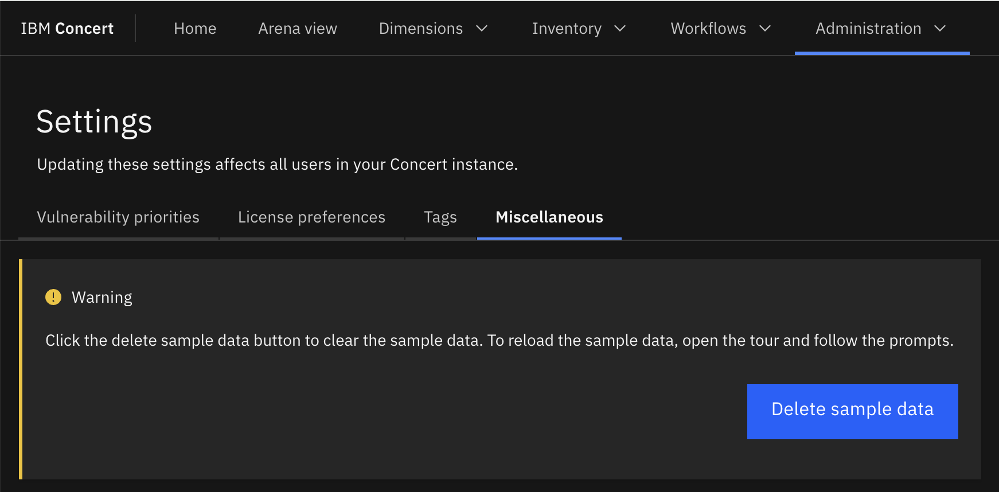

# Concert Walkthrough

## Objective

In this lab, we will load demo data on concert and walkthrough IBM Concert functionnalities. At the end, we will clean these demo data in order to have an empty instance to execute following labs.

## Prerequisite

- IBM Concert must be installed
- IBM Concert must be integrated with Watsonx.ai 
  
## Content

- [Concert Walkthrough](#concert-walkthrough)
  - [Objective](#objective)
  - [Prerequisite](#prerequisite)
  - [Content](#content)
  - [I - Log on Concert and load demo data](#i---log-on-concert-and-load-demo-data)
  - [II - Walkthrough](#ii---walkthrough)
  - [III - Reset concert data](#iii---reset-concert-data)

## I - Log on Concert and load demo data

1. From a browser, enter the URL of your concert instance (https://YOUR_VM_IP:12443) and log with your concert username and password.
2. If it is the first time you log in, you are invited to upload sample data on the right of the window. 
3. Otherwise, you can upload sample data by clicking the question mark at the top right of the window.

{width="400"}

4. In order to have a first view of IBM Concert functionnalities, click either **Sample data** or "Load sample data** depending if you are in case 2. ou 3.

## II - Walkthrough

With sample data uploaded in IBM Concert, you can navigate in the Home page, the Arena view and the Dimensions and have a first idea of IBM Concert possibilities

## III - Reset concert data

- Navigate in **Administration->Settings**
- Select the **Miscellaneous tab**
- Click the **Delete Sample data** button

{width="400"}