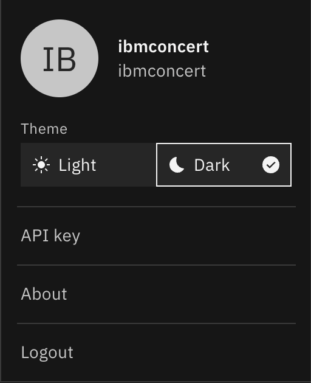
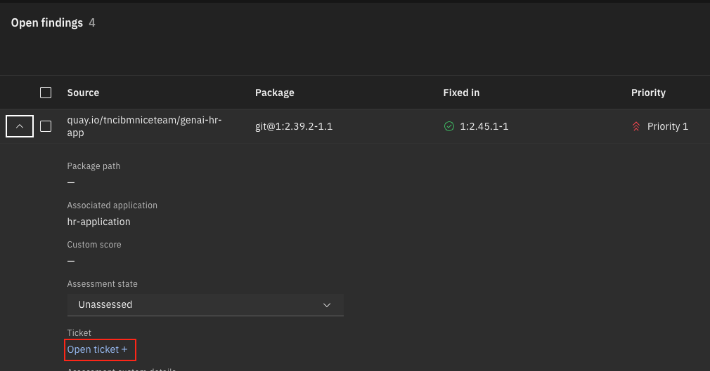

# Managing Software Composition and CVEs

## Objective

In order to use Software composition dimension, an organisation need to ingest its application description in Concert using Software Bill of Materials (SBOMs). Then the Software composition dimension helps to identify and mitigate risks associated with packages and components based on several key indicators of reliability, maintainability, and security.  

IBM® Concert fetches a set of reliability checks and generates an aggregate score measuring the reliability of each package. Based on its assessment, Concert recommends specific actions to address risks, such as those related to outdated or unsupported packages, licenses compliance issues, and exploitable vulnerabilities.

In this lab, you will learn how to ingest application data from micro-services development in IBM Concert. Then you will see the result and the related functionnalities of IBM Concert concerning these data.

## Prerequisite

You must have installed IBM Concert and integrate IBM Concert with watsonx.ai (Lab0 and Lab1)

## Content

- [Managing Software Composition and CVEs](#managing-software-composition-and-cves)
  - [Objective](#objective)
  - [Prerequisite](#prerequisite)
  - [Content](#content)
  - [I - Data ingestion](#i---data-ingestion)
    - [Verify that you have a Concert API Key defined, if not create it](#verify-that-you-have-a-concert-api-key-defined-if-not-create-it)
    - [a - Manual ingestion](#a---manual-ingestion)
      - [Clone and build the micro-services](#clone-and-build-the-micro-services)
      - [Clone the SBOM ingestion scripts](#clone-the-sbom-ingestion-scripts)
      - [Execute the SBOM generation script](#execute-the-sbom-generation-script)
      - [Upload SBOMs on IBM concert](#upload-sboms-on-ibm-concert)
    - [b - Jenkins Pipeline](#b---jenkins-pipeline)
  - [II - Managing Software Composition](#ii---managing-software-composition)
  - [III - Managing CVEs](#iii---managing-cves)
    - [Create a github connection for ticketing](#create-a-github-connection-for-ticketing)
    - [Open a ticket for a CVE](#open-a-ticket-for-a-cve)

## I - Data ingestion

Data ingestion in IBM Concert is done using SBOM (Software Bill of Materials).  
IBM Concert provides a Concert Toolkit docker image to help to generate SBOMs based on configuration yaml files and scanning products (Syft, CycloneDX, Trivy, etc ....).
For more information, the documentation is [here](https://www.ibm.com/docs/en/concert?topic=using-concert-toolkit)

We will use this toolkit to generate the SBOMs of a very simple provided python application.

### Verify that you have a Concert API Key defined, if not create it

- From a browser go to the IBM Concert
- Log on concert using your concert credentials
- Click the circle at top right of the window and select **API Key**
  {width="400"}
- In the API Key window, click **Generate API Key**
  {width="400"}
- Copy the API key generated somewhere, we will use it to upload SBOMs files in IBM Concert
  

### a - Manual ingestion

In the following steps, you are going to clone three github repositories:

- the **hr-app** repository that contain the code of a backend application called hr-app. It is a python script that just call the summarization-svc.
- the **summarization-svc** repository that contain the code of a summarization service. It is a python script that do a LLM inference.
- the **SBOMs-ingestion** repository that contain a script to generate SBOMs using the concert toolkit, its templates files and the required environment variables.

Here is the structure that you will have after the clone of the repositories:

  {width="400"}

In the folder SBOMs-ingestion you have:

1. **scripts/generate-sboms.sh**: 
   
A shell script that take as parameter the component for which we want to generate SBOMs.  
This script will:
- Load the common variables and specific application variables
- Use the templates of the **templates** directory to generate the config files used by concert toolkit to generate the application, build and deploy SBOMs.
- Generate the code scan SBOM with concert toolkit. Concert toolkit use Cyclone DX.
- Generate the image scan SBOM with concert toolkit. Concert toolkit use Syft.
- Generate the image CVEs using Trivy

1. **scripts/upload.sh**: 

A shell script that take as parameter the application for which we want to upload the SBOMs generated by generate-sboms.sh.
This script use Concert APIs to upload SBOMs in IBM Concert

1. **app-common-variables.variables**

The environment variables used by the scripts whatever the component is.

4. **hr-app.variables**

The environment variables with values specific to hr-app component.

5. **summarization-svc.variables**

The environment variables with values specific to summarization-svc component.

In the following steps, you will just clone the repositories and run the script. But in lab5, you will manually generate a certificate SBOM for your application and upload it in IBM Concert. So, you will have the opportunity to manipulate a template file, environment variables, the concert toolkit and IBM Concert Apis.

For this lab, follow these steps to ingest our application data in Concert:

#### Clone and build the micro-services

You will start to clone the 2 micro-services composing the application.

1. Connect on the machine you have provisioned on Techzone in Lab0

```bash
ssh itzuser@<VM ip address> -p 2223 -i /path/to/concert/sshkey/pem_ibmcloudvsi_download.pem
```

2. Create a folder named **concert-bootcamp**

```bash
umask 022
mkdir -p $HOME/concert-bootcamp/Applications
```

3. Clone and build the hr-app component

> NOTE: `git clone` command will ask you a for username and password. Enter here your github.ibm email and the token you create in Part III of [lab0](https://github.ibm.com/concert-bootcamp/ibm-concert-lab-guide/blob/main/labs/Lab0-setup.md)


```bash
cd $HOME/concert-bootcamp/Applications
git clone https://github.ibm.com/concert-bootcamp/hr-app.git
cd hr-app
./buildImage.sh
```

1. Clone and build summarization-svc component

```bash
cd $HOME/concert-bootcamp/Applications
git clone https://github.ibm.com/concert-bootcamp/summarization-svc.git
cd summarization-svc
./buildImage.sh
```

#### Clone the SBOM ingestion scripts

Then you will clone a project containing a directory structure and a script to generate SBOMs using the Concert Toolkit and upload them in concert using IBM Concert APIs.

```bash
cd $HOME/concert-bootcamp
git clone -b concert-2.0.0 https://github.ibm.com/concert-bootcamp/SBOMs-ingestion.git
```

Create an output directory for the generated SBOMs

```bash
mkdir $HOME/concert-bootcamp/SBOMs-ingestion/concert_data
chmod 777 $HOME/concert-bootcamp/SBOMs-ingestion/concert_data
```

#### Execute the SBOM generation script

```bash
cd $HOME/concert-bootcamp/SBOMs-ingestion/scripts
./generate-sboms.sh hr-app
./generate-sboms.sh summarization-svc
```

Here you can take a look at the SBOMs generated in folder **$HOME/concert-bootcamp/SBOMs-ingestion/concert_data**.    
One folder as been created for each component (one for hr-app and one for summarization-svc)

#### Upload SBOMs on IBM concert
  
1. Update **app-common-variables.variables** file to specify Concert variables:

```bash
cd $HOME/concert-bootcamp/SBOMs-ingestion
vi app-common-variables.variables
```

Put your concert values for:

- CONCERT_HOST (just the server IP address, in the form aaa.bbb.ccc.ddd)
- CONCERT_PORT (12443)
- CONCERT_APIKEY
  
Save the file (:wq)

2. Run the upload script
  
```bash
cd $HOME/concert-bootcamp/SBOMs-ingestion/scripts
./upload.sh hr-app
./upload.sh summarization-svc
```
3. Log on concert and look at the Arena view

### b - Jenkins Pipeline

Manual data ingestion in Concert is quite painful. So, the best way to ingest these data and keep concert up to date during the application lifecycle is to generate and ingest SBOMs during the CI/CD process.   

In each component code of this lab (hr-app and summarization-svc) you will find a Jenkins file as a pipeline example.   
Any other CI/CD tools could be use (teckton, ...)

Jenkins demo done by the instructor.

## II - Managing Software Composition

Walkthrough the uploaded data:

- Home page - Software composition dimension
- Arena view
- Application Inventory

## III - Managing CVEs

Walkthrough the uploaded CVEs:

- Home page - Vulnerability dimension
- Vulnerability Dimension
- Risk score vs CVSS score
- Select a CVE
  - Recommended mitigation strategy generated by watsonx
  - Ask watsonx
  - Blast radius
  - Expand and open ticket

### Create a github connection for ticketing

In many places, you have the possibility to open tickets. IBM Concert allow to open ticket on Github, Jira, ServiceNow or Salesforce.    
Before beeing able to open tickets on github, a github connection must be created.   
Here are the steps to follow:

1. Navigate to **Administration->Integrations**
2. Select **Connections** tab
3. Click **Create connection** button
4. Search for github

  {width="600"}

5. Select the card and enter following value:
   
- **Name**: Github.ibm connection
- **Host**: https://github.ibm.com/api/v3
- **Personal access token**: your personal access token you created in step III of [Lab0](Lab0-setup.md)
- Click **Validate connection**

  {width="600"}

- If Validation status is success, click **Create** button

### Open a ticket for a CVE

Here we are going to open a ticket for a CVEs on our hr-app component.

1. Navigate to **Arena View**
2. Select a CVE
  
  {width="600"}

3. Click the red circle
4. Take a look at the **Blast radius** and go back to **Overview** tab
5. Expand an **Open findings** entry 
6. Click **Open ticket+**

  {width="600"}

7. In the **Open Ticket** window, select your connection and enter following values:

- **Organization**: concert-bootcamp
- **Repository**: hr-app

8. Click **Open**

  {width="600"}

9. On the CVE page that is displayed now, select your ticket to see it on github

  {width="600"}
  {width="600"}


