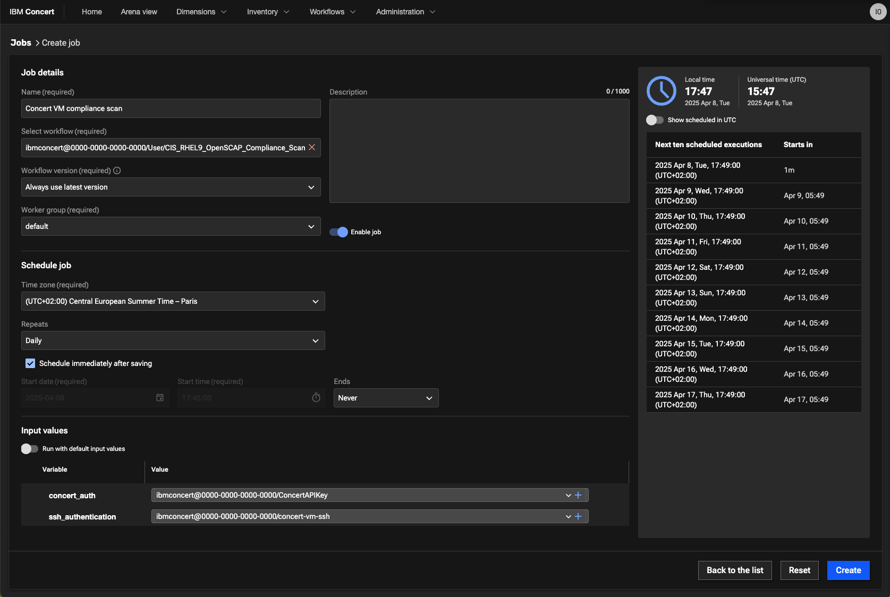

# Managing Compliance

## Objective

In order to use Compliance dimension, an organisation need to ingests compliance assessment data using Concert workflow. This will deliver a holistic view of the compliance posture of its application environments.

In this lab, you will use concert workflow to ingest compliance data from a rhel vm in IBM Concert.   
We will use your VM concert as the target of the compliance job.

## Prerequisite

- IBM Concert must be installed
- Concert workflow must be installed
  
## Content

- [Managing Compliance](#managing-compliance)
  - [Objective](#objective)
  - [Prerequisite](#prerequisite)
  - [Content](#content)
  - [Run compliance workflow](#run-compliance-workflow)
      - [Create an environment](#create-an-environment)
    - [Create a compliance catalog and a compliance profile](#create-a-compliance-catalog-and-a-compliance-profile)
    - [Install the workflow in IBM Concert](#install-the-workflow-in-ibm-concert)
    - [Create an Authentication to ssh the Concert VM](#create-an-authentication-to-ssh-the-concert-vm)
    - [Create an Authentication for concert](#create-an-authentication-for-concert)
    - [Run manually the workflow](#run-manually-the-workflow)
    - [Scheduling the workflow job](#scheduling-the-workflow-job)
  - [Compliance Management](#compliance-management)

## Run compliance workflow

You are going to use a workflow called **CIS RHEL9 OpensSCAP Compliance Scan** provided by IBM Concert to ingest compliance data in Concert.
This workflow automates the CIS compliance scan for RHEL 9 using OpenSCAP. 

> Official documentation is [here](https://www.ibm.com/docs/en/concert/2.0.0?topic=icsucw-using-concert-workflows-generate-import-cis-rhel9-openscap-compliance-scans)

#### Create an environment 

In order to be able to ingest compliance data in IBM Concert, you must have an environment defined in IBM Concert with the hostname of the machine that will be scanned.

To create this environment, follow these steps:

1. Get your hostname with the `hostname`command

2. From the arena view on your concert UI, select **Define and upload->Define Environment->From resources**
  {width="600"}

1. In the **Define an environment** screen, enter following informations:

- **name**: your VM hostname
- **type**: other
- **purpose**: what you want

Then click **next**, **next** and **Create**

### Create a compliance catalog and a compliance profile

> Official documentation is [here](https://www.ibm.com/docs/en/concert/2.0.0?topic=compliance-overview-assessing)

- A compliance catalog serves as the single source of truth for an client organization's compliance-related policies, procedures, and standards. Concert supports compliance catalogs based on the NIST 800-53 (Rev4 for OCP and Rev5), PCI, or a custom standard.

To create a catalog for our  **CIS RHEL9 OpensSCAP Compliance Scan** workflow, follow these steps:

1. Navigate to **Dimensions->Compliance**
2. Select **Catalog** tab and click **Add catalog->From Standards Library** button
3. Select **CIS Controls** entry and click **Add**

- A compliance profile represents a subset of controls from a compliance catalog. Each profile specifies a set of rules the scan results will use to assess the overall compliance of the application environments.

To create a profile for our **CIS RHEL9 OpensSCAP Compliance Scan** workflow, follow these steps:

1. Select **Profile** tab, click **Create profile** button and select **From resources**
2. Enter following values and click **Create** button

- **Name**: profile_cis
- Select one or more **catalogs**: select **CIS Controls** catalog
- Select **controls**: Click Select all (or choose specific compliance rules)

### Install the workflow in IBM Concert

1. Download the **CIS RHEL9 OpensSCAP Compliance Scan** worflow from the [Automation Library](https://automation-library.ibm.com/workflows/CIS%20RHEL9%20OpenSCAP%20Compliance%20Scan)

2. Upload the workflow in concert 

- From the burger menu, select **Workflows->Worflows** menu
- Select **Import** button
- And choose the zip file corresponding to the workflow you downloaded in step1 (name CIS_RHEL9_OpenSCAP_Compliance_Scan.zip)
   
### Create an Authentication to ssh the Concert VM

CIS_RHEL9_OpenSCAP_Compliance_Scan workflow will do an ssh connection to the target machine to run an OpenSCAP compliance scan. In our case, the target machine is our Concert VM.   
Follow these step to create an SSH Authentication:

1. From the burger menu, select **Workflows->Authentications** menu 
2. Click the **Create authentication** button and enter following informations:

- **name**: concert-vm-ssh
- **service**: SSH
- **Host**: your VM Ip public address (from your reservation page)
- **Port**: 2223
- **Username**: itzuser
- **RSA Private Key**: the content of your VM pem key (downloaded from your reservation page)

  {width="600"}

### Create an Authentication for concert

CIS_RHEL9_OpenSCAP_Compliance_Scan workflow will upload the scan result to IBM Concert.
Follow these step to create an IBM Hub - Self Authentication:

1. From the burger menu, select **Workflows->Authentications** menu 
2. Click the **Create authentication** button and enter following informations:

- **name**: concert-auth
- **service**: IBM Hub - Self

  {width="600"}

### Run manually the workflow

1. From the burger menu, select **Workflows->Workflows** menu 
2. Select **CIS_RHEL9_OpenSCAP_Compliance_Scan** workflow
3. Edit the RHEL_OSCAP_Scan step

  {width="600"}

5. Add a sudo before each commands and save your modifications

  {width="600"}

6. In the **Start** box, update the value of following variables (keep the "):

- **concert_auth**: "concert-auth"
- **ssh_authentication**: "concert-vm-ssh"

  {width="600"}

1. Execute the worflow

- Click the **Run** button

   
>
> Note: You can also run the workflow in debug mode.
>

The execution of the flow take at least 5 minutes, be patient.

1. Check the ingested data

- When the workflow is finished, navigate to **Concert->Administration->Event log** menu and check that the compliance file upload is successfull
  {width="600"}

- Navigate to **Dimensions->Compliance** menu and consult compliance data for your concert VM.

### Scheduling the workflow job

You can also schedule a workflow job for ingestion of compliance scans into Concert if needed.

1. Navigate to **Workflows->Job** menu
2. Select **Create job** button
3. Populate the values and click **Create**

  {width="600"}

## Compliance Management

Walkthrough the uploaded compliance assessment:

- Home page - Compliance dimension
- Compliance Dimension
- Select an entry
  - Sort by results
  - Expand one
  - Open ticket
