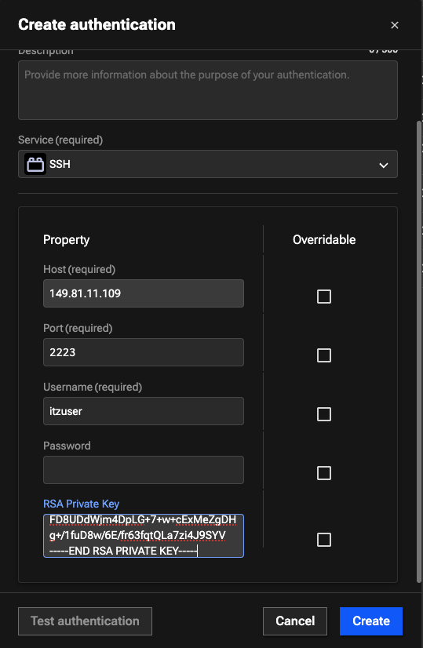
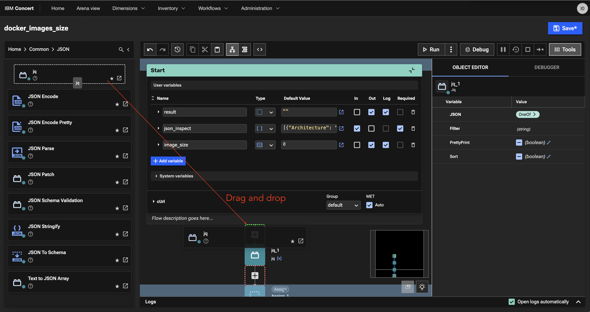
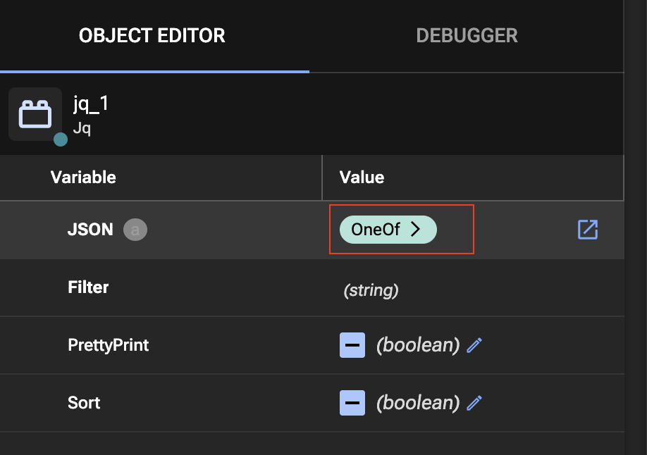
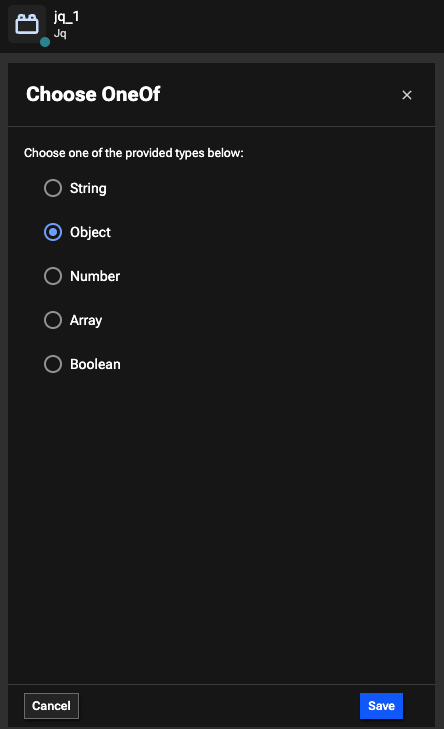
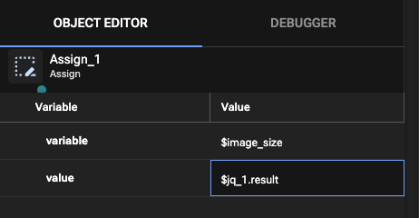
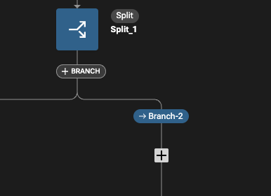
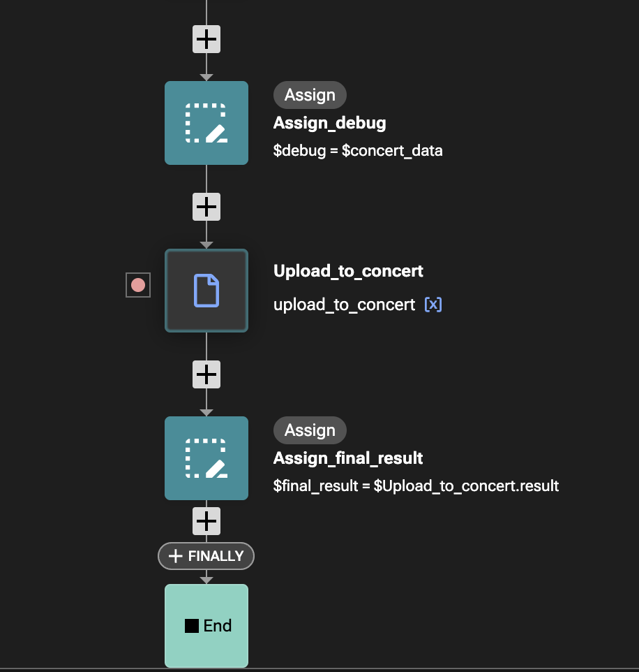
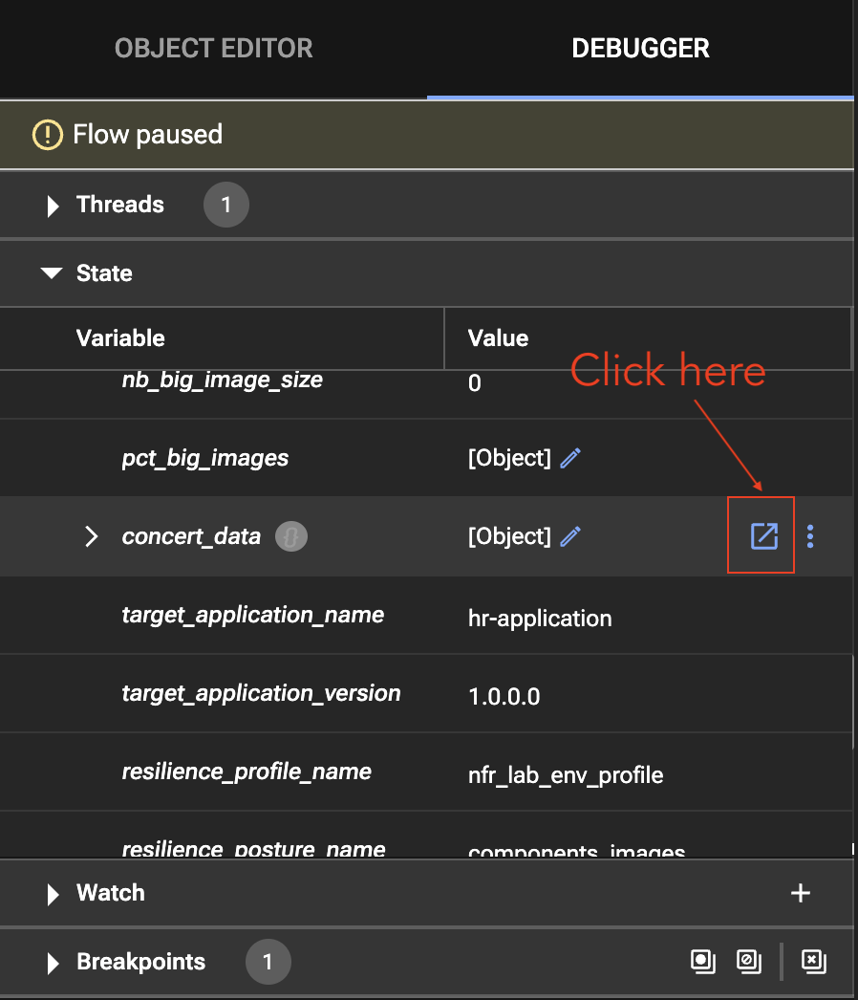
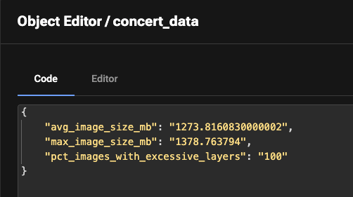
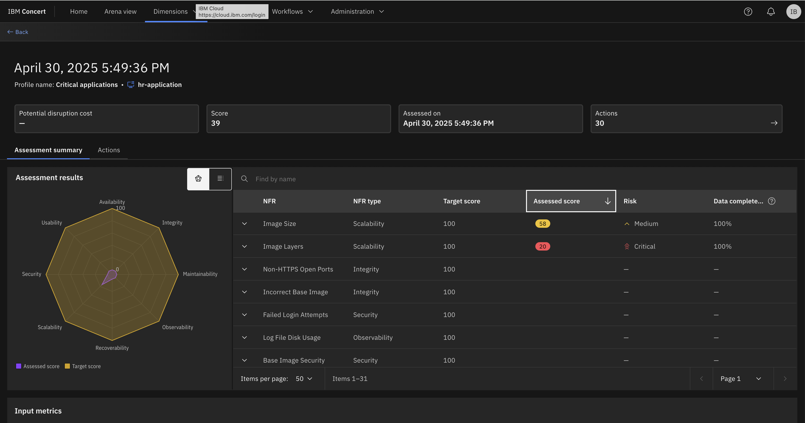

# Managing Resilience

## Objective

In order to use Resilience dimension, an organisation need to determine the non-functional requirements (NFRs) that apply to its applications, as well as the target values that must be achieved to meet contractual obligations or otherwise be considered resilient. Also, relevant data must be collected from the applications and their environment components in order to import them to Concert on a regular basis.

In this lab, you will use and create a concert workflow to ingest in IBM Concert resilience data concerning the quality of docker images.  
We will use the 2 images that you have build in lab4.

## Prerequisite

- IBM Concert must be installed
- Concert workflow must be installed
  
## Content

- [Managing Resilience](#managing-resilience)
  - [Objective](#objective)
  - [Prerequisite](#prerequisite)
  - [Content](#content)
  - [Import Resilience data using a workflow](#import-resilience-data-using-a-workflow)
    - [Resilience library and a Resilience profile](#resilience-library-and-a-resilience-profile)
    - [Import a resilience workflow](#import-a-resilience-workflow)
    - [Build your own sub workflow](#build-your-own-sub-workflow)
    - [Complete the resilience workflow previously imported](#complete-the-resilience-workflow-previously-imported)
    - [Run the workflow to populate you application resilience posture](#run-the-workflow-to-populate-you-application-resilience-posture)
  - [Resilience Management](#resilience-management)

## Import Resilience data using a workflow

### Resilience library and a Resilience profile

For this lab, we will use part of a provided library called **Container Build Integrity Library**.
These library NFRs are used to assess security, efficiency and maintainability of container image quality.
We will calculate these metrics:
 
- Average image size
- Max image size
- Percentage of images with excessive layers

To discover this library, follow these steps

1. From Concert UI, navigate to **Dimensions->Resilience**
2. Select **Libraries** tab
3. Click **Container Build Integrity Library** link
4. Expand **Image Layers** and **Image Size**

And take a look at how the scores are calculated.
The next steps consists in creating a workflow to get images metrics and upload an assessment in IBM Concert.

### Import a resilience workflow

You will start to import a pre-defined workflow available [here](../files/workflows_lab7).   

1. From burger menu, navigate to **Workflows->Workflow**
2. Click the **Import** button (top right of the window) and select the **concert_v2001_absolute_Resilience** workflow from your laptop

This workflow retrieves, from your concert VM, the hr-application images you have build in Lab4.    
Then, for each images it will do a `podman inspect` command and calculate metrics based on the `podman inspect` command result 

To be able to ssh your concert VM, you need to define an SSH Authentication:

1. Navigate to **Workflows->Authentications**
2. Click the **Create authentication** button (top right of the window)
3. Call it **dev-vm**
4. In Service, select **SSH**
5. Then enter these values:

- **Host**: your Concert VM IP
- **Port**: 2223
- **Username**: itzuser
- **RSA Private Key**: the content of the pem file you download from your reservation page

  {width="600"}

### Build your own sub workflow

You will now create a workflow that will be used as a sub-worflow of **docker_images_metrics** workflow in order to define a new metric: the percentage of big images.
The aim of this workflow is to extract the image size from a json object that have the format of the result of the `podman inspect` command

1. From burger menu, navigate to **Workflows->Workflow**
2. Click the button **Create workflow** (top right of the window)
3. Call it **docker_images_size** and click **Create** button
4. Define your variables:

| Name         | Type   | Default Value                                                  | Selected box  |
| :----------- | :----- | :------------------------------------------------------------- | :-----------: |
| json_inspect | Array  | [{"Architecture": "amd64", "Os": "linux", "Size": 1378729490}] | in / required |
| image_size   | Number | 0                                                              |   out / log   |

Then you are going to use a "jq" node in order to extract the size from the **json_inspect** input variable:

1. From the palette that is at the left pane of your window, navigate in **Common->Json**
2. Select the **jq** box and drag and drop it before the **Assign_1** box
     {width="600"}

3. From the **Object Editor** that is in the right pane of your window, click on **OneOf>**
    {width="400"}

4. Select **Object**, Click **Save** 
    {width="400"}

5. Then select the pencil to set the JSON variable that jq will use as input
    {width="400"}
   
6. Enter value: $json_inspect
7. For the Filter variable put the value: ".[].Size" (don't forget the quotes)
    {width="400"}

You just need now to assign the result of the jq node in the **image_size** output variable of your flow

1. Select the **Assign** node that is under the **jq** node
2. From the **Object Editor** that is in the right pane of your window, enter following values:

- **variable**: $image_size
- **value**: $jq_1.result

    {width="400"}

You can now test your workflow:

1. Click the Run button
    {width="400"}

2. At the bottom of your window, you should have the image size corresponding to the value of your **json_inspect** input variable displayed

    {width="400"}

### Complete the resilience workflow previously imported

You are going to complete the empty branch in the main workflow in order to calculate images metrics

1. From burger menu, navigate to **Workflows->Workflow**
2. Navigate in **Resilience** folder
3. Open the **docker_images_metrics** workflow
4. Scroll the **Split_1** node where you will see an empty  **Branch-2**

    {width="400"}

5. From the palette that is at the left pane of your window, navigate in **User->Resilience**
6. Drag and drop the **docker_image_size** node (it is the sub-flow you just create before) in the empty branch 
7. Name the node **get_image_size_flow**
8. From the **Object Editor** that is in the right pane of your window, enter following values:

- **json_inspect**: $ssh_inspect_image.result (the result of the node named ssh_inspect_image is the input of your sub-flow)
  
1. Then complete your branch as shown in following image

> TIPS: most common nodes can be added by clicking the + that are in the flow where you want to add your node. 

  {width="600"}

### Run the workflow to populate you application resilience posture

Before running your flow, you need to modify the value of these variables:

| Name            | Value                                    |
| :-------------- | :--------------------------------------- |
| concert_host    | The IP address of your Concert VM        |
| concert_api_key | The API key of your concert installation |

Now, you can now run your flow.   
The best to begin is to run it in debug mode and put a breakpoint for example on node **Upload_to_concert** and take a look at the value of your **concert_data** variable

{width="400"}
{width="400"}

You should see these values for **concert_data** variable:

{width="400"}

Then you can finish the flow by clicking the Resume debug button

{width="400"}

If the flow is successfull, you see that in the logs

{width="400"}

You can now navigate to **Dimensions->Resilience** and select the **components_images_posture**

## Resilience Management

Walkthrough the uploaded assessment:

- Home page - Resilience dimension
- Resilience Dimension
  - Select "component_images_posture"
    - Open a change request on an assessment
    - Select an assessment
      - In assessment summary tab, Sort by Assessed score
      - In Actions tab, sort by Assessed score

{width="600"}
