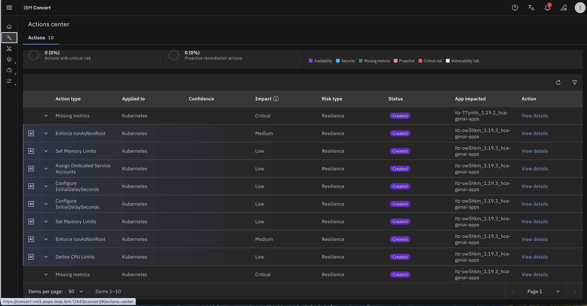
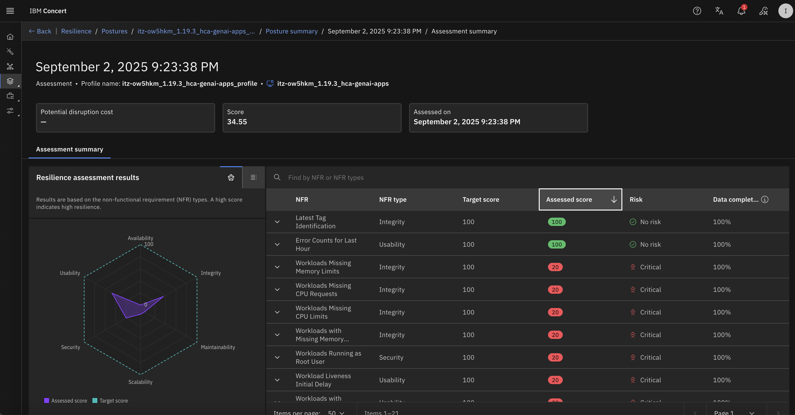
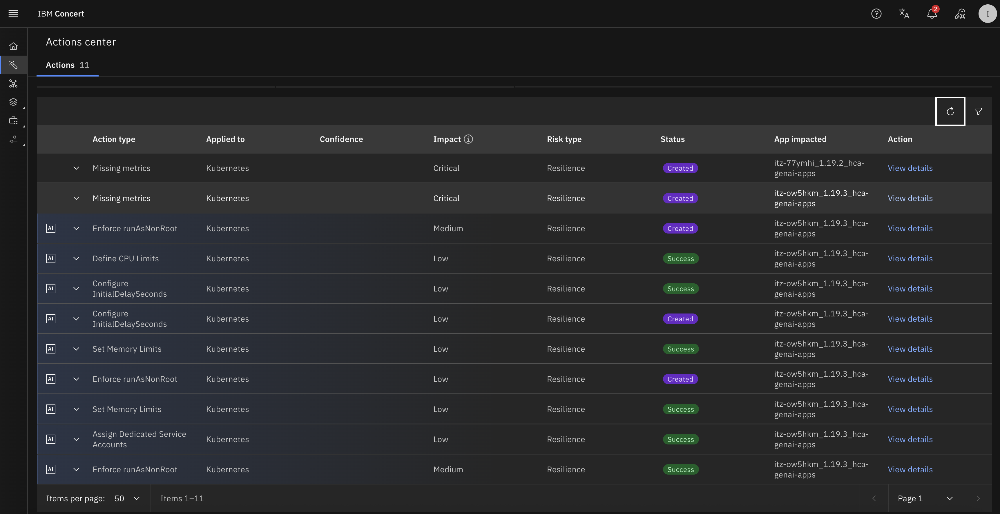
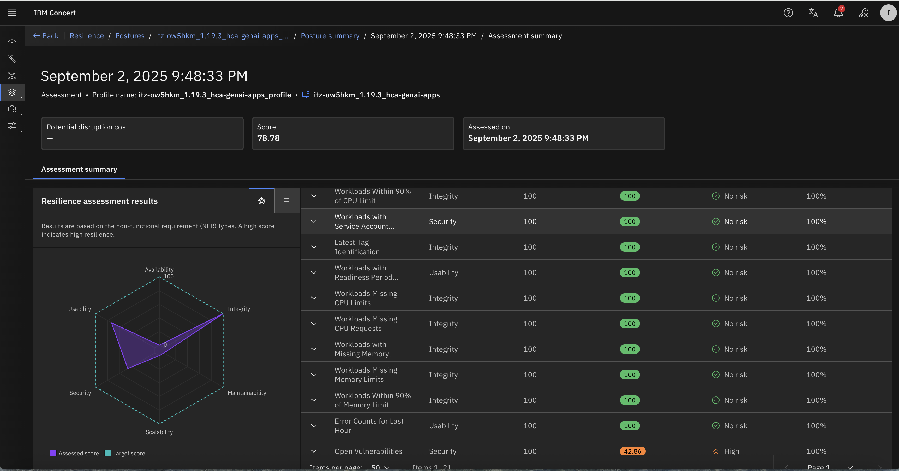

# Auto-discovery and Auto-resilience

## Objective

In concert 2.0.0, a new feature named **Discover your data** is available. In this lab, you will use this **Auto-discovery** feature to discover the hr-application deployed on an Openshift environment.
This feature also do **Auto-resilience**, generating a resilience assessment and Actions in the **Action center**.   
You will analyze the result of the resilience assessment and try to solve the application deployment quality as a remediation to the proposed actions.

## Prerequisite

- IBM Concert must be installed
- IBM Concert is linked to a watsonx.ai instance
- An openshift deployment environment has been created for you 
- A namespace named **hca-genai-apps-XX** has been created for you (XX is a number the instructor will give to you)
- Your instructor provided you with:
  - **Your student number**: ex: XX
  - **Openshift endpoint**: ex: https://api.itz-ow5hkm.infra01-lb.fra02.techzone.ibm.com:6443
  - **Openshift Token**: ex: sha256~piQ_gJT81JdV1q9zzh2ZqkMAoWoHNaR-Y4VHbYiXt-A
  - **Cluster Name**: ex: itz-ow5hkm
  
## Content

- [Auto-discovery and Auto-resilience](#auto-discovery-and-auto-resilience)
  - [Objective](#objective)
  - [Prerequisite](#prerequisite)
  - [Content](#content)
  - [Clear the previously imported data](#clear-the-previously-imported-data)
  - [Deploy the application on openshift](#deploy-the-application-on-openshift)
  - [Run **Discover your data**](#run-discover-your-data)
  - [Explore the actions generated in the Action Center and the created resilience assessment](#explore-the-actions-generated-in-the-action-center-and-the-created-resilience-assessment)
  - [Remediation: Improve the quality of the application deployment](#remediation-improve-the-quality-of-the-application-deployment)
  - [Run again the integration job to generate a new resilience assessment](#run-again-the-integration-job-to-generate-a-new-resilience-assessment)

## Clear the previously imported data

In this lab, we use the same application you have imported manually in lab 4.  
Then you will start to clear these data.

- From the burger menu, navigate to **Concert->Inventory->Application Inventory**
- Go in the **Build artifacts** tab
- For each build artifact listed, at the end of the line click the 3 points, select **Delete**, check the 'Do you want ...' checkbox and click **Delete**
- Do the same for the **Repository** tab
- Do the same for the **Application** tab
- Navigate in the Arena View and check that all as been deleted except the environment data

## Deploy the application on openshift

1. From your techzone concert VM or your laptop, connect to openshift

```bash
oc login --token=<Openshift Token> --server=<Openshift endpoint>
```

2. Navigate in the application folder and deploy the application in your namespace

```bash
oc project hca-genai-apps-XX (replace XX by your student number)
```

3. Download these deployment files:
   - [hr-app](../files/lab8/ocp-deploy-HR-app.yaml)
   - [summarization-svc](../files/lab8/ocp-deploy-summarization-svc.yaml)

4. Deploy the application

```bash
oc apply -f ocp-deploy-HR-app.yaml
oc apply -f ocp-deploy-summarization-svc.yaml
```

5. Verify the deployment and wait until the pods are in running state

```bash
oc get pods
```

## Run **Discover your data** 

- From the burger menu, navigate to **Concert->Home**
- On the top right of the screen, click the **Discover Your Data** button
- Select **Kubernetes**
- Choose **Openshift** integration
- Enter following information:
  - **Endpoint**: <Openshift endpoint>
  - **Token**: <Openshift Token>
  - **Cluster Name**: <Cluster Name>
- Validate the connexion from the **Revalidate** label
- Click **Next**
- Select the namespace named hca-genai-apps-XX (XX is your student number)
- Select **Next**

Then Concert discover the content of the namespace and run a Resilience Assessment. You can see the result on the left of your screen.

## Explore the actions generated in the Action Center and the created resilience assessment 

Thanks to watsonx.ai, some actions have been created in the **Actions center**. Take the time to explore them.

  {width="600"}

You can also navigate to the Resilience assessment: **Concert->Dimension->Resilience**. Take the time to explore this assessment.

  {width="600"}

## Remediation: Improve the quality of the application deployment

You are going to focus on these actions listed in the **Actions Center**:
- Assign Dedicated Service Accounts
- Configure InitialDelaySeconds
- Define CPU Limits

For that, you will deploy again the application using a new yaml file

> Note: you can take a look at the 2 yamls files (before and after improvment) to understand the improvments that have been done

1. From your techzone concert VM or your laptop, connect to openshift

```bash
oc login --token=<Openshift Token> --server=<Openshift endpoint>
```

2. Navigate in the application folder and deploy the application in your namespace

```bash
oc project hca-genai-apps-XX (replace XX by your student number)
```

3. Download these deployment files:
   - [hr-app](../files/lab8/ocp-deploy-HR-app-mem-limit-sa-readinessprobe.yaml)
   - [summarization-svc](../files/lab8/ocp-deploy-summarization-svc-mem-limit-sa-readinessprobe.yaml)

4. Deploy the application

```bash
oc apply -f ocp-deploy-HR-app-mem-limit-sa-readinessprobe.yaml
oc apply -f ocp-deploy-summarization-svc-mem-limit-sa-readinessprobe.yaml
```

5. Verify the deployment and wait until the pods are in running state

```bash
oc get pods
```

You can see that the pods are restarting and take more time to become running.


## Run again the integration job to generate a new resilience assessment

- From the burger menu, navigate to **Concert->Administration->Integrations**
- Select the more recent discovery job, click the 3 points at the end of the line and select **Run now**
- When finished, 
  - go back in the **Actions center**, you will see that some actions are now in **Success** mode

  {width="600"}

  - Navigate also in the **Resilience** dimension, you will see that NFRs have a better score

  {width="600"}
