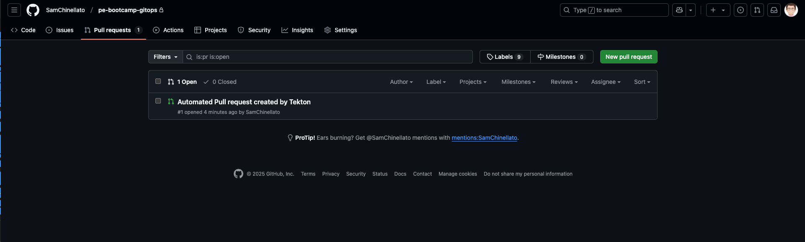

# Deploying an Application to OpenShift

## Description

This workshop covers containerising an application and deploying it to OpenShift using a CI/CD pipeline with OpenShift-Pipelines (Tekton) and OpenShift GitOps (ArgoCD).

We will be building the following Pipeline to deploy our cloud native application:


1. The pipeline starts by cloning the application source code from a git repository
2. It builds the application image
3. It updates deployment YAML manifests using [kustomize](https://github.com/kubernetes-sigs/kustomize)
4. It pushes updated manifests to a gitops repository, creating a new feature branch
5. It creates a pull request into main for the new feature
6. Human approval is required to deploy the application
7. [ArgoCD](https://argo-cd.readthedocs.io/en/stable/) then reconciles manifests to OpenShift once the pull request is merged

## Prerequisites

- :white_check_mark: Access to the OpenShift cluster Deployed during the OpenShift Install Lab
- :white_check_mark: ODF installed successfully
- :white_check_mark: The OpenShift internal registry deployed successfully
- :white_check_mark: [Tekton Lab completed successfully](../tekton/tekton.md)

Clear up any deployed resources from the previous lab:

```bash
NAMESPACE=tekton-demo
```

```bash
oc delete deployment -n $NAMESPACE --ignore-not-found=true cloudnative && \
oc delete service -n $NAMESPACE --ignore-not-found=true cloudnative && \
oc delete route -n $NAMESPACE --ignore-not-found=true cloudnative
```

!!! note "Copying to clipboard"

    This lab guide uses the `pbcopy` command to reduce mistakes copying to the clipboard. The `pbcopy` command comes by default on MacOS. If you are following the lab on RHEL, you can achieve the same by running these commands: 

    ```bash
    sudo yum install xclip -y 
    ```

    ```bash
    alias pbcopy='xclip -selection clipboard'
    ```


## Guide

## Fork the Cloud Native Application Template

Navigate to the following github repository: https://github.com/platformengineers-xyz/cloud_native_sample_app

1. Select `Use this template`
2. Select `Create a new repository`
3. Make sure to create the application in your personal github space
4. Name your new repository `cloud_native_sample_app`
5. Set visibility to Private
4. Select `Create`


## Configuring SSH Access for Tekton


Generate an SSH key to clone the repository with. We will use this both for the bastion and Tekton:

```bash
ssh-keygen -t ed25519 -N '' -f ~/.ssh/tekton
```

Copy it to your clipboard:
```bash
cat ~/.ssh/tekton.pub | pbcopy
```

## Add the SSH Key to your Repo

1. Navigate to your copy of `cloud_native_sample_app`
2. Select `Settings`
3. Select `Deploy Keys`
4. Select `Add deploy key`
5. Paste in the Tekton key
6. Give the key a title and click `Add Key`


## Set up a Secret to clone from Github Enterprise repo with an SSH key for OpenShift Pipelines


Copy the private key to your clipboard.

```bash
cat ~/.ssh/tekton | pbcopy
```

Set your namespace:

```bash
NAMESPACE=tekton-demo
```

Add the private key to OpenShift as a Secret in the `tekton-demo` Project:

```bash
MY_HOMEPATH=$(echo ~)
```

```bash
oc create secret generic -n $NAMESPACE github-ssh-key  --from-file=ssh-privatekey=$MY_HOMEPATH/.ssh/tekton --type=kubernetes.io/ssh-auth
```

Annotate the Secret:


```bash
oc annotate secret -n $NAMESPACE github-ssh-key tekton.dev/git-0=github.com
```

!!! question "What does this label do?"
    This label tells Tekton to monitor this secret, and use it when cloning `github.com` repositories. There are many ways to configure authentication in Tekton. [Take a minute to review them here](https://github.com/tektoncd/pipeline/blob/main/docs/auth.md#configuring-authentication-for-git)

Add `known_hosts` to the secret:

```bash
known_hosts_value=$(ssh-keyscan github.com | base64 -w 0) && oc patch -n $NAMESPACE secret github-ssh-key --type='json' -p="[{'op': 'add', 'path': '/data/known_hosts', 'value': '${known_hosts_value}'}]"
```

Once complete, your secret should look as follows:

```bash
oc get secret github-ssh-key -n $NAMESPACE -o yaml
```

```YAML
apiVersion: v1
kind: Secret
metadata:
  name: gihthub-ssh-key
  annotations:
    tekton.dev/git-0: github.com
data:
  ssh-privatekey: <private-key>
  known_hosts: <your-known-hosts>
type: kubernetes.io/ssh-auth
```

Add the secret to your Pipeline Service Account:

```bash
oc secrets link pipeline -n $NAMESPACE github-ssh-key
```

# Configure a GitOps Repository 

## Create a Github Repository for your GitOps Resources

GitOps Applications are designed to deploy applications from a git repository. We are now going to create a repository for our Gitops manifests. Navigate to `github.com/<YOUR-USERNAME>?tab=repositories`:

1. Select `New`
2. Name your new repository `pe-bootcamp-gitops`
3. Make sure to create the application in your personal github space
4. Select `Add a README file`. This will make GitHub create a `main` branch for us.
5. Set the repository to `Private`
6. Select `Create`


## Create a Personal Access Token (PAT) for GitOps

From github.com:

* Click on your profile in the top left
* Select `Settings`
* From the left menu, select `Developer Settings`
* Select `Personal access tokens > Tokens (classic)`
* Select `Generate new token > Generate new token (classic)`
* Name your token `gitops`
* Tick the base `repo` tickbox
* Click `Generate new token`
* Copy the token to your clipboard


Store the token as a secret:

```bash
oc create secret generic gitops-token -n $NAMESPACE \
   --from-literal=GH_TOKEN=<your-pat-token>
```

## Install OpenShift GitOps

Install the OpenShift GitOps operator from OperatorHub. ([You can follow these instructions](https://docs.openshift.com/gitops/1.15/installing_gitops/installing-openshift-gitops.html))


!!! note "OpenShift GitOps vs ArgoCD"
    You may notice we sometimes use OpenShift Gitops and ArgoCD interchangeably in this guide. OpenShift GitOps is a Red-Hat-provided Operator that installs and manages ArgoCD on OpenShift. All ArgoCD concepts apply to OpenShift GitOps.

### Edit The app-build pipeline

!!! note "Prerequisite"
    Make sure you have completed the [Tekton Lab](../tekton/tekton.md) as it is a prerequisite to this section!

Create a GitOps Task:

```YAML
apiVersion: tekton.dev/v1
kind: Task
metadata:
  name: gitops-create-new-branch
spec:
  params:
  - name: directory
    type: string
  - description: the username and repository for the gitops repository, e.g. youruser/pe-bootcamp-gitops
    name: gitops-repo
    type: string
  - description: A name for the new branch to create for this feature
    name: new-branch
    type: string
  - description: Name for a secret containing the github PAT to clone the repo with
    name: GITHUB_TOKEN_SECRET_NAME
    type: string
  - description: Name for a secret containing the github PAT to clone the repo with
    name: GITHUB_TOKEN_SECRET_KEY
    type: string
  steps:
  - args:
    - |-
        echo "Fetching token"
        GH_TOKEN="$(cat /etc/gitops-new-branch/$(params.GITHUB_TOKEN_SECRET_KEY))"
        echo "Cloning Repo"
        git clone -b main https://$GH_TOKEN@github.com/$(params.gitops-repo).git/ gitops 
        git config --global user.email "tekton@ibmcloud.com" 
        git config --global user.name "Tekton Pipeline" 
        cd gitops/
        mkdir -p $(params.directory)
        cp ../k8s/manifests.yaml $(params.directory)/

        git checkout -b $(params.new-branch)
        git add .
        git commit -m "Updating image name" --allow-empty 
        git push --set-upstream origin $(params.new-branch)
    command:
    - /bin/bash
    - -c
    computeResources: {}
    image: docker.io/csantanapr/helm-kubectl-curl-git-jq-yq
    name: gitops
    volumeMounts:
    - mountPath: /etc/gitops-new-branch
      name: githubtoken
      readOnly: true
    workingDir: $(workspaces.source.path)
  volumes:
  - name: githubtoken
    secret:
      secretName: $(params.GITHUB_TOKEN_SECRET_NAME)
  workspaces:
  - name: source
```

Create a `kustomize` task. `kustomize` lets you customize raw, template-free YAML files for multiple purposes. [You can learn more about it here](https://kubectl.docs.kubernetes.io/references/kustomize/):

```YAML
apiVersion: tekton.dev/v1
kind: Task
metadata:
  name: kustomize-build
spec:
  params:
  - description: the name of the app
    name: app-name
    type: string
  - description: namespace that deployment will be tested in
    name: app-namespace
    type: string
  - description: contains the full image take in image:tag format
    name: image-with-tag
    type: string
  steps:
  - computeResources: {}
    image: quay.io/upslopeio/kustomize:latest
    name: kustomize-build
    script: |
      #!/bin/sh
      set -e
      echo "image-with-tag: $(params.image-with-tag)"
      cd k8s
      kustomize edit set image "*=$(params.image-with-tag)"
      kustomize edit set label "app:$(params.app-name)"
      kustomize edit set label "app.kubernetes.io/instance:$(params.app-name)"
      kustomize edit set label "app.kubernetes.io/name:$(params.app-name)"
      kustomize build > manifests.yaml

      if [ -f manifests.yaml ]; then
        echo "manifests.yaml successfully generated"
        echo "contents of manifests is:"
        cat manifests.yaml
        cp manifests.yaml ../manifests.yaml
      else
        echo "ERROR: manifests.yaml not generated"
        exit 1
      fi
    workingDir: $(workspaces.source.path)
  workspaces:
  - description: contains the cloned git repo
    name: source
```

Add a `Github Open Pull Request` Task:

```YAML
apiVersion: tekton.dev/v1
kind: Task
metadata:
  name: github-open-pr
spec:
  description: This task will open a PR on Github based on several parameters. This
    could be useful in GitOps repositories for example.
  params:
  - default: api.github.com
    description: |
      The GitHub host, adjust this if you run a GitHub enteprise.
    name: GITHUB_HOST_URL
    type: string
  - default: ""
    description: |
      The API path prefix, GitHub Enterprise has a prefix e.g. /api/v3
    name: API_PATH_PREFIX
    type: string
  - description: |
      The GitHub repository full name, e.g.: JohnDoe/pe-gitops-bootcamp
    name: REPO_FULL_NAME
    type: string
  - default: github
    description: |
      The name of the kubernetes secret that contains the GitHub token, default: github
    name: GITHUB_TOKEN_SECRET_NAME
    type: string
  - default: token
    description: |
      The key within the kubernetes secret that contains the GitHub token, default: token
    name: GITHUB_TOKEN_SECRET_KEY
    type: string
  - default: Bearer
    description: |
      The type of authentication to use. You could use the less secure "Basic" for example
    name: AUTH_TYPE
    type: string
  - description: |
      The name of the branch where your changes are implemented.
    name: BRANCH
    type: string
  - default: main
    description: |
      The name of the branch you want the changes pulled into.
    name: BASE
    type: string
  - default: Automated Pull request created by Tekton
    description: |
      The body description of the pull request.
    name: BODY
    type: string
  - default: Automated Pull request created by Tekton
    description: |
      The title of the pull request.
    name: TITLE
    type: string
  results:
  - description: Number of the created pull request.
    name: NUMBER
    type: string
  - description: URL of the created pull request.
    name: URL
    type: string
  steps:
  - computeResources: {}
    env:
    - name: PULLREQUEST_NUMBER_PATH
      value: $(results.NUMBER.path)
    - name: PULLREQUEST_URL_PATH
      value: $(results.URL.path)
    image: registry.access.redhat.com/ubi8/python-38:1-34.1599745032
    name: open-pr
    script: |
      #!/usr/libexec/platform-python

      """This script will open a PR on Github"""

      import json
      import os
      import sys
      import http.client

      with open("/etc/github-open-pr/$(params.GITHUB_TOKEN_SECRET_KEY)", "r", encoding="utf-8") as file:
          github_token = file.read()

      open_pr_url = "$(params.API_PATH_PREFIX)/repos/$(params.REPO_FULL_NAME)/pulls"

      data = {
          "head": "$(params.BRANCH)",
          "base": "$(params.BASE)",
          "title": "$(params.TITLE)",
          "body": """$(params.BODY)"""
      }
      print("Sending this data to GitHub: ")
      print(data)

      authHeader = f"$(params.AUTH_TYPE) {github_token}"

      # This is for our fake github server
      if "$(params.GITHUB_HOST_URL)".startswith("http://"):
          conn = http.client.HTTPConnection("$(params.GITHUB_HOST_URL)"
                                            .replace("http://", ""))
      else:
          conn = http.client.HTTPSConnection("$(params.GITHUB_HOST_URL)")

      conn.request(
          "POST",
          open_pr_url,
          body=json.dumps(data),
          headers={
              "User-Agent": "TektonCD, the peaceful cat",
              "Authorization": authHeader,
              "Accept": "application/vnd.github.v3+json ",
              "Content-Type": "application/vnd.github.v3+json",
          })
      resp = conn.getresponse()
      if not str(resp.status).startswith("2"):
          print(f"Error: {resp.status}")
          print(resp.read())
          sys.exit(1)
      else:
          body = json.loads(resp.read().decode())

          with open(os.environ.get('PULLREQUEST_NUMBER_PATH'), 'w', encoding="utf-8") as f:
              f.write(f'{body["number"]}')

          with open(os.environ.get('PULLREQUEST_URL_PATH'), 'w', encoding="utf-8") as f:
              f.write(body["html_url"])

          print("GitHub pull request created for $(params.REPO_FULL_NAME): "
                f'number={body["number"]} url={body["html_url"]}')
    volumeMounts:
    - mountPath: /etc/github-open-pr
      name: githubtoken
      readOnly: true
  volumes:
  - name: githubtoken
    secret:
      secretName: $(params.GITHUB_TOKEN_SECRET_NAME)
```

Update the pipeline to include those tasks:

```YAML
apiVersion: tekton.dev/v1
kind: Pipeline
metadata:
  name: app-build
spec:
  params:
    - description: username/repo-name, e.g. JohnDoe/pe-bootcamp-gitops
      name: gitops-repo
      type: string
    - description: SSH url for the source repository
      name: source-repo
      type: string
    - name: image_registry
      type: string
    - description: Application name
      name: app-name
      type: string
    - default: gitops-token
      description: A secret containing the PAT for the gitops repo
      name: gitops-secret-name
      type: string
    - default: GH_TOKEN
      description: The secret key for the PAT
      name: gitops-secret-key
      type: string
  tasks:
    - name: clone-repository
      params:
        - name: URL
          value: $(params.source-repo)
      taskRef:
        params:
          - name: kind
            value: task
          - name: name
            value: git-clone
          - name: namespace
            value: openshift-pipelines
        resolver: cluster
      workspaces:
        - name: output
          workspace: source
    - name: buildah-build
      params:
        - name: IMAGE
          value: $(params.image_registry):$(tasks.clone-repository.results.COMMIT)
        - name: DOCKERFILE
          value: ./Dockerfile
        - name: CONTEXT
          value: .
        - name: STORAGE_DRIVER
          value: vfs
        - name: FORMAT
          value: oci
        - name: BUILD_EXTRA_ARGS
          value: ""
        - name: PUSH_EXTRA_ARGS
          value: ""
        - name: SKIP_PUSH
          value: "false"
        - name: TLS_VERIFY
          value: "true"
        - name: VERBOSE
          value: "false"
      runAfter:
        - clone-repository
      taskRef:
        params:
          - name: kind
            value: task
          - name: name
            value: buildah
          - name: namespace
            value: openshift-pipelines
        resolver: cluster
      workspaces:
        - name: source
          workspace: source
    - name: kustomize-build
      params:
        - name: app-name
          value: $(params.app-name)
        - name: app-namespace
          value: $(context.pipelineRun.namespace)
        - name: image-with-tag
          value: $(params.image_registry):$(tasks.clone-repository.results.COMMIT)
      runAfter:
        - buildah-build
      taskRef:
        kind: Task
        name: kustomize-build
      workspaces:
        - name: source
          workspace: source
    - name: gitops-create-new-branch
      params:
        - name: directory
          value: $(params.app-name)
        - name: gitops-repo
          value: $(params.gitops-repo)
        - name: new-branch
          value: feature-$(context.pipelineRun.name)
        - name: GITHUB_TOKEN_SECRET_NAME
          value: $(params.gitops-secret-name)
        - name: GITHUB_TOKEN_SECRET_KEY
          value: $(params.gitops-secret-key)
      runAfter:
        - kustomize-build
      taskRef:
        kind: Task
        name: gitops-create-new-branch
      workspaces:
        - name: source
          workspace: source
    - name: github-open-pr
      params:
        - name: GITHUB_HOST_URL
          value: api.github.com
        - name: API_PATH_PREFIX
          value: ""
        - name: REPO_FULL_NAME
          value: $(params.gitops-repo)
        - name: GITHUB_TOKEN_SECRET_NAME
          value: gitops-token
        - name: GITHUB_TOKEN_SECRET_KEY
          value: GH_TOKEN
        - name: AUTH_TYPE
          value: Bearer
        - name: BRANCH
          value: feature-$(context.pipelineRun.name)
        - name: BASE
          value: main
        - name: BODY
          value: Automated Pull request created by Tekton
        - name: TITLE
          value: Automated Pull request created by Tekton
      runAfter:
        - gitops-create-new-branch
      taskRef:
        kind: Task
        name: github-open-pr
  workspaces:
    - name: source
```

### Run Your Pipeline (CI)

Update the PipelineRun yaml to point to your GitOps and Source repo:

```yaml
apiVersion: tekton.dev/v1
kind: PipelineRun
metadata:
  labels:
    tekton.dev/pipeline: app-build
  generateName: app-build-qup9da
spec:
  params:
  - name: gitops-repo
    value: UPDATE-ME # e.g. JohnDoe/pe-bootcamp-gitops
  - name: source-repo
    value: UPDATE-ME # e.g. git@github.com:JohnDoe/cloud_native_sample_app.git
  - name: image_registry
    value: image-registry.openshift-image-registry.svc:5000/tekton-demo/cloud-native-sample-app
  - name: app-name
    value: cloud-native-sample-app
  - name: gitops-secret-name
    value: gitops-token
  - name: gitops-secret-key
    value: GH_TOKEN
  pipelineRef:
    name: app-build
  taskRunTemplate:
    serviceAccountName: pipeline
  timeouts:
    pipeline: 1h0m0s
  workspaces:
  - name: source
    volumeClaimTemplate:
      metadata:
        creationTimestamp: null
      spec:
        accessModes:
        - ReadWriteOnce
        resources:
          requests:
            storage: 1Gi
        storageClassName: ocs-storagecluster-cephfs
        volumeMode: Filesystem
      status: {}
```

Create the PipelineRun:

```bash
oc create -n $NAMESPACE -f pipelinerun.yaml
```

The pipeline should succeed:


* Navigate to your `pe-bootcamp-gitops` repository
* Select `Pull Requests`
* You should see a new pull request created by Tekton



# Enable CD in your application


# Login to Your Openshift GitOps Instance

On the OpenShift console navigate to the `openshift-gitops` project and open the url in `Networking > Routes > openshift-gitops-server`, or run:

```bash
echo https://$(oc get route -n openshift-gitops openshift-gitops-server -ojsonpath="{.spec.host}")
```

Your username is `admin` and the password can be found in the Secret called `openshift-gitops-cluster` in the `openshift-gitops` namespace

# Connect Your GitOps repo to OpenShift GitOps


Create an SSH Key with Write access

```bash
ssh-keygen -t ed25519 -a 100 -f ~/.ssh/argo -N ''
```

Copy the private key:

```bash
cat ~/.ssh/argo | pbcopy
```

Back in the Argo UI, navigate to `Settings > Repositories > Connect Repo`:

* Name: `pe-bootcamp-gitops`
* Project: `default`
* Repository URL: `git@github.com:YOUR-USER/pe-bootcamp-gitops.git`
* Paste the SSH key
* Click Connect

Copy your public key:

```
cat ~/.ssh/argo.pub | pbcopy
```

Add the public key as a `Deploy` key to the `pe-bootcamp-gitops` Github Repo

**Make sure to check `Allow write access` this time (Setting > Deploy keys)**

## Configure Argo RBAC Permissions

To deploy our application, we need to give the Argo Service account appropriate permissions to deploy in our `tekton-demo` namespace.

Create a `ClusterRoleBinding`:

```YAML
kind: ClusterRoleBinding
apiVersion: rbac.authorization.k8s.io/v1
metadata:
  name: cluster-role-binding
subjects:
  - kind: ServiceAccount
    name: openshift-gitops-argocd-application-controller
    namespace: openshift-gitops
roleRef:
  apiGroup: rbac.authorization.k8s.io
  kind: ClusterRole
  name: admin
```

!!! warning "Careful"
    This `ClusterRoleBinding` gives `ArgoCD` cluster admin permissions across all namespaces. While this is fine for a demo environment, it is not appropriate for real environments. Role Based Access Control (RBAC) in OpenShift is very granular, and you should always give an application only the permissions it **requires** to run (Principle of Least Privilege). [Read more about RBAC on OpenShift here](https://docs.openshift.com/container-platform/4.17/authentication/using-rbac.html)


### Deploy your Application

!!! Note "Prerequisites"
    Ensure the app-build pipeline has run successfully

Copy your private key:

```
cat ~/.ssh/argo | pbcopy
```

From the Argo UI, navigate to `Settings > Repositories`.

Add a new repository. Provide the SSH url for yor GitOps repo and paste in your private key:


Navigate to `Applications > New App`

Add the following settings and everything else on the default options

> - Application Name: `cloud-native-app`
> - Project Name: `default`
> - SYNC POLICY: `Automatic`
> - :ballot_box_with_check: `Prune Resources`
> - :ballot_box_with_check: `Self Heal`
> - Repository URL: `git@github.com:YOUR-USER/pe-bootcamp-gitops.git`
> - Path: `./cloud-native-sample-app`
> - Cluster URL: `https://kubernetes.default.svc`
> - Namespace: `tekton-demo`

Select `Create`. You should see the following error:


> ArgoCD does not have any resources to create at this stage.

* Navigate to your `pe-bootcamp-gitops` repository in Github. Select `Pull Requests`. 
* Approve and merge the pull request
* Go back to Argo and create the App. It should now succeed!

You have successfully completed the lab once your Argo application looks like below, and you can access the application via the following route:

```bash
curl "https://$(oc get route -n $NAMESPACE cloudnative -o jsonpath={.spec.host})/greeting?name=world"
```

```bash
{"id":4,"content":"Welcome to CloudNative bootcamp !!! Hello, world :)"}
```

And argo syncs your application successfully:


## Acknowledgements

This lab was inspired by, and borrowed heavily from https://github.ibm.com/TechnologyGarageUKI/openshift-workshop

---