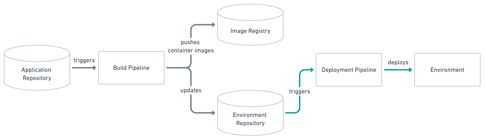
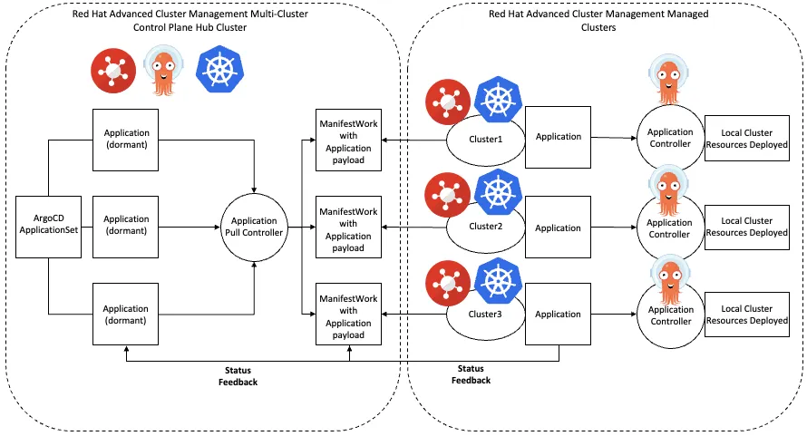

# Continuous Deployment

Continuous Integration, Delivery, and Deployment are important devOps practices and we often hear a lot about them. These processes are valuable and ensures that the software is up to date timely.

- **Continuous Integration** is an automation process which allows developers to integrate their work into a repository. When a developer pushes his work into the source code repository, it ensures that the software continues to work properly. It helps to enable collaborative development across the teams and also helps to identify the integration bugs sooner.
- **Continuous Delivery** comes after Continuous Integration. It prepares the code for release. It automates the steps that are needed to deploy a build.
- **Continuous Deployment** is the final step which succeeds Continuous Delivery. It automatically deploys the code whenever a code change is done. Entire process of deployment is automated.

## What is GitOps?
GitOps in short is a set of practices to use Git pull requests to manage infrastructure and application configurations. Git repository in GitOps is considered the only source of truth and contains the entire state of the system so that the trail of changes to the system state are visible and auditable.

- Traceability of changes in GitOps is no novelty in itself as this approach is almost universally employed for the application source code. However GitOps advocates applying the same principles (reviews, pull requests, tagging, etc) to infrastructure and application
configuration so that teams can benefit from the same assurance as they do for the application source code.
- Although there is no precise definition or agreed upon set of rules, the following principles are an approximation of what constitutes a GitOps practice:
  - Declarative description of the system is stored in Git (configs, monitoring, etc)
  - Changes to the state are made via pull requests
  - Git push reconciled with the state of the running system with the state in the Git repository

# GitOps And Continuous Deployment

## How does GitOps fit within Continuous Delivery?

GitOps organizes the deployment process around code repositories as the central element. There are at least two repositories: the application repository and the environment configuration repository. The application repository contains the source code of the application and the deployment manifests to deploy the application. The environment configuration repository contains all deployment manifests of the currently desired infrastructure of an deployment environment. It describes what applications and infrastructural services (message broker, service mesh, monitoring tool, …) should run with what configuration and version in the deployment environment.

There are two important points:

1. the codebase and deployment manifests live in the application's repository
1. a second repository contains only the desired state of infrastructure for a given deployment environment

This second point sounds suspicious, it deals with the _desired state_ of a system. That sounds _a lot like something Kubernetes would be great at_.

This diagram from the documentation does a good job of showing the overall concept behind the Push-based model of GitOps:

Everything flows as a series of triggers, in a single direction. The end result is a deployment. For our course, we will demonstrate this flow using only Tekton to demonstrate the difference between Tekton's approach to CI/CD and using a mixture of Tekton and ArgoCD.

The other model is Pull-based:

In this case our `Operator` will be [ArgoCD](https://argoproj.github.io/argo-cd/) and deployment environment will be OpenShift/Kubernetes.

Finally, the "core idea" statement at the beginning of the documentation sums it up best:

> The core idea of GitOps is having a Git repository that always contains declarative descriptions of the infrastructure currently desired in the production environment and an automated process to make the production environment match the described state in the repository.

We want a single spot to change that updates all of our declarative infrastructure.

This is a departure from traditional models of deployment that typically did not use declarative infrastructure, were exclusively push-based or time-based, and relied heavily on manual processes. This approach also gives an option for isolation of the production environment from developers (for example if required for compliance).

This introduces a number of benefits:

- having a commit log of the production environment is a mechanism for performing fast rollbacks and audits
- developers already know Git and are comfortable in the tooling
- centralizes environment configuration while still allowing for parameterization
- ability to segregate developer access ("left of Image Registry and Environment Repository") versus production access ("only access Image Registry and Environment Repository")

## GitOps at Scale 

GitOps enables easy scaling across different environments by leveraging Git as the single source of truth. 

With infrastructure and application configurations stored in version-controlled repositories, scaling becomes as simple as updating a manifest—whether adding nodes to a cluster, deploying to new regions, or spinning up entirely new environments. 

Argo CD continuously monitors these Git repositories, automatically applying changes to match the declared state. 

This approach ensures that scaling is not only rapid but also consistent, reproducible, and transparent. Real-time synchronization and rollback capabilities allow for precise control, while Git’s commit history provides clear audit trails, making it easy to monitor the state of all environments and ensure they remain aligned with organizational standards.

!!! note "Push vs Pull at Scale"
    As you scale your GitOps environment to several clusters you can start thinking of a different kind of 'Pull' and 'Push' model. 
    
    As a first approach you might want to design your Continuous Delivery around a single Argo instance that **pushes** deployed applications to different clusters. 
    
    However, as your application and infrastructure estate grows, you could consider deploying an Argo instance into each target cluster that **pulls** desired application configurations. This stops ArgoCD becoming a single point of failure, and reduces the workload on a single ArgoCD instance.

    For example, you might work with a client who manages several small OpenShift clusters deployed at the edge. Choosing a highly scalable pattern for application delivery in this environment is increasingly important.

[You can find some more info on GitOps Here](https://www.gitops.tech/)

We will dive deeper into this topic by building our very own GitOps Continuous delivery pipeline in the upcoming lab!

---

## ArgoCD Overview
## Presentations

[GitOps Overview :fontawesome-regular-file-pdf:](../materials/05-Understanding-GitOps.pdf){ .md-button target=_blank}

## Activities

These activities give you a chance to walkthrough building CD pipelines using ArgoCD.

These tasks assume that you have:
 - Reviewed the Continuous Deployment concept page.

| Task                            | Description         | Link        | Time    |
| --------------------------------| ------------------  |:----------- |---------|
| ***Walkthroughs***                         |         |         |     |
| GitOps | Introduction to GitOps with OpenShift | [Learn OpenShift GitOps](https://docs.openshift.com/gitops/1.15/understanding_openshift_gitops/about-redhat-openshift-gitops.html){:target="_blank"} | 20 min |
| ***Try It Yourself***                         |         |         |     |
| ArgoCD Lab | Learn how to setup ArgoCD and Deploy Application | [ArgoCD](./argocd.md) | 30 min |

Once you have completed these tasks, you will have created an ArgoCD deployment and have an understanding of Continuous Deployment.
