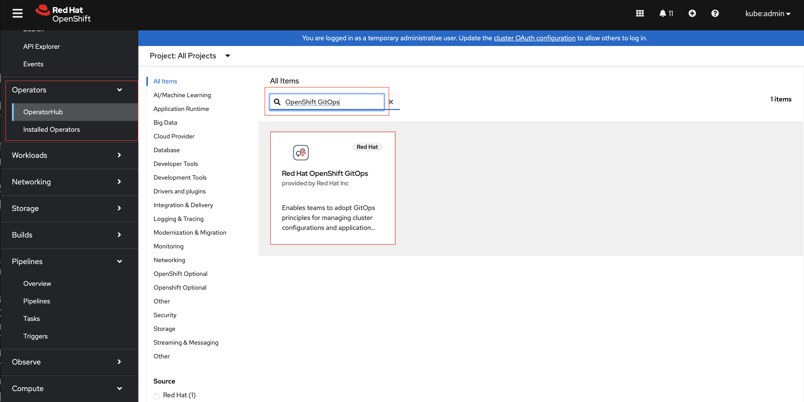
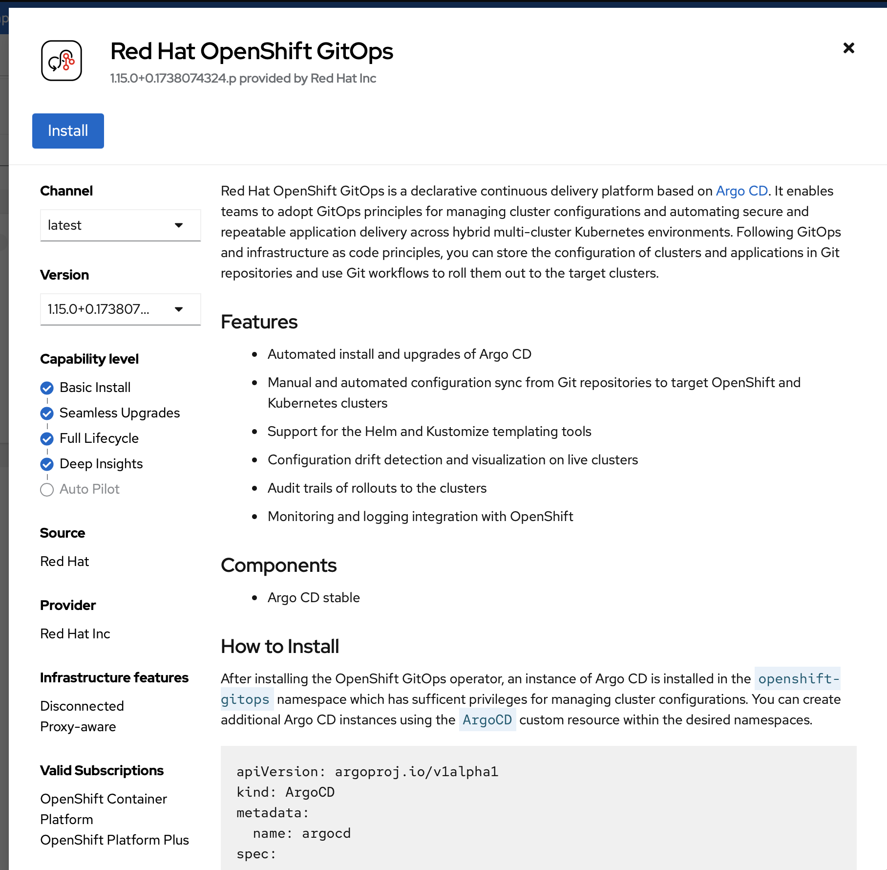
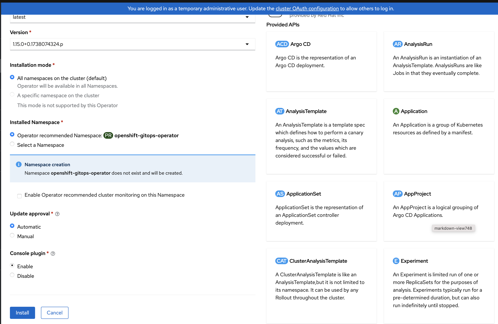
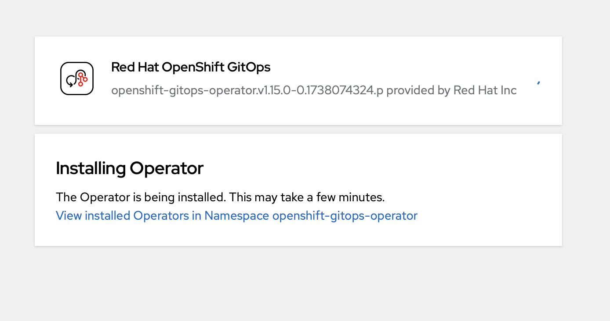
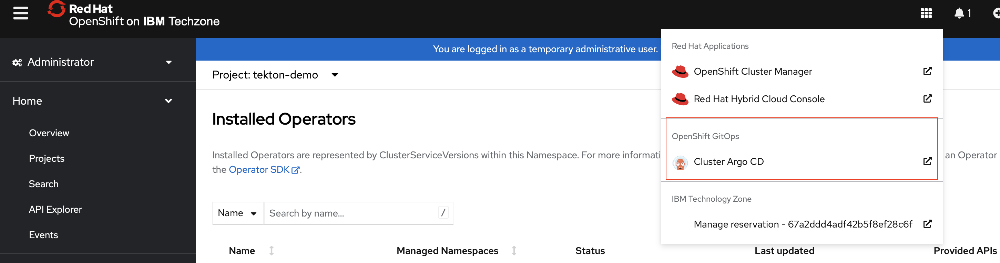
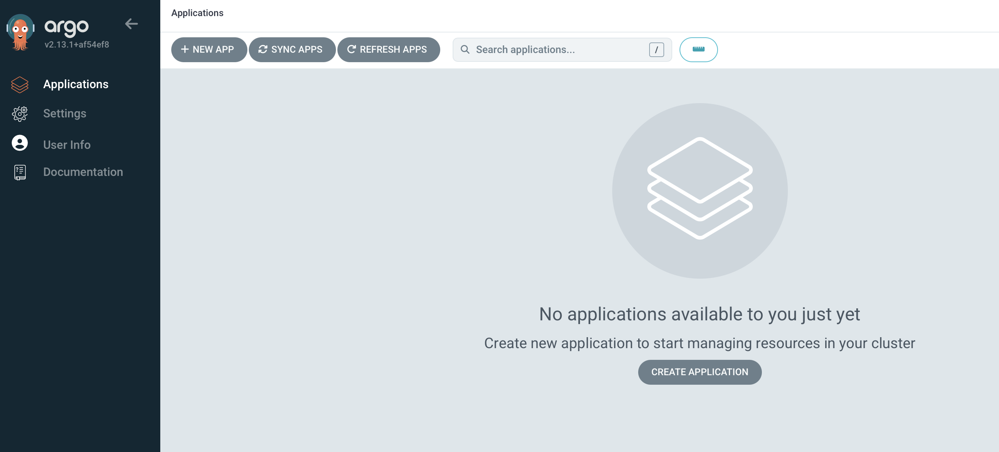

# Solution: GitOps

## Bastion and Workstation Prep

1. Download and install `argo` on Linux. [Other Platforms here](https://argo-cd.readthedocs.io/en/stable/cli_installation/)

    ```bash
    curl -sSL -o argocd-linux-amd64 https://github.com/argoproj/argo-cd/releases/latest/download/argocd-linux-amd64
    sudo install -m 555 argocd-linux-amd64 /usr/local/bin/argocd
    rm -f argocd-linux-amd64
    ```

2. Verify `argocd`

    ```bash
    # argocd version
    argocd: v2.14.2+ad27246
      BuildDate: 2025-02-06T00:06:23Z
      GitCommit: ad2724661b66ede607db9b5bd4c3c26491f5be67
      GitTreeState: clean
      GoVersion: go1.23.3
      Compiler: gc
      Platform: linux/amd64
    FATA[0000] Argo CD server address unspecified
    ```
    **Note:** The error does not apply. This is to ensure that the command `argocd` is in the PATH.

## OpenShift GitOps Operator Install

1. Login to OpenShift Console as kubeadmin.
2. Select Operaters->Operator Hub.
3. In the 'Search' Type 'open gitops' to search for OpenShift GitOps.
4. Select the 'Red Hat OpenShift GitOps' Operator.

    

5. Install the OpenShift GitOps Operator with default values.

    

6. Select Install

    

7. The operator is installing

    

9. Launch the ArgoCD Application in OpenShift.
 
    

10. Login via OpenShift

    

11. ArgoCD Console

    
