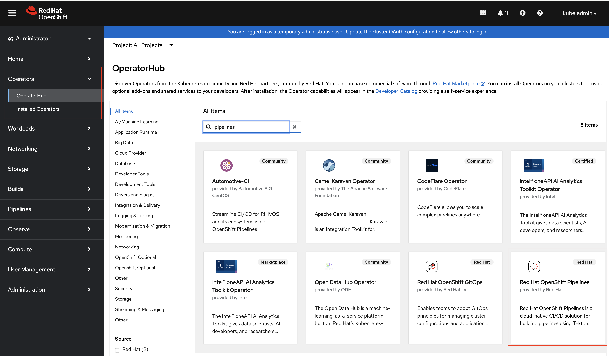
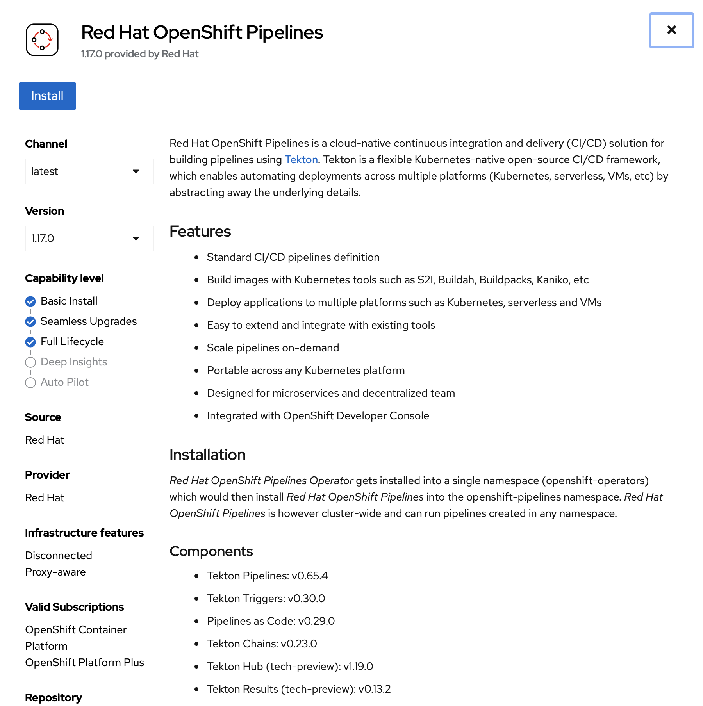
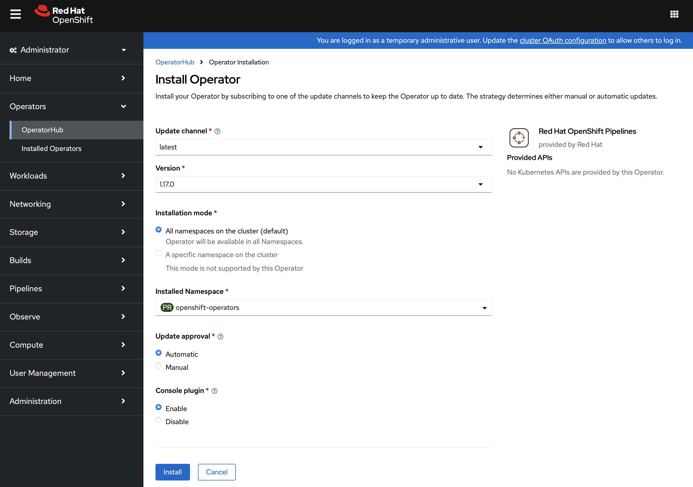
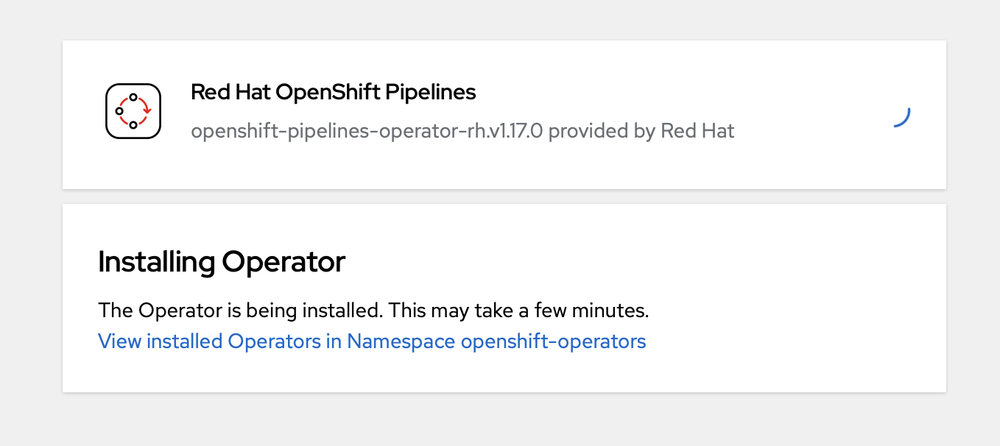
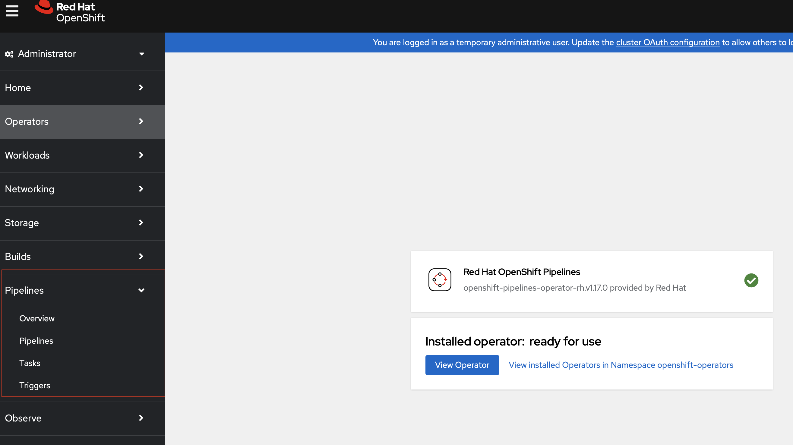

# Solution: Pipelines

## Bastion and Workstation Prep

1. Download `tkn cli` for Linux. [For other platforms](https://github.com/tektoncd/cli)

    ```bash
    curl -O https://github.com/tektoncd/cli/releases/download/v0.39.1/tektoncd-cli-0.39.1_Linux-64bit.rpm -L 
    ```

2. Install `tkn cli`

    ```bash
    rpm -i tektoncd-cli-0.39.1_Linux-64bit.rpm
    ```

3. Verify `tkn`

    **Note:** Kubernetes context is required for the cli to function.  Set the KUBECONFIG environment variable as you would to execute `oc` commands.

    ```bash
    # tkn version
    Client version: 0.39.1
    Pipeline version: unknown, pipeline controller may be installed in another namespace please use tkn version -n {namespace}
    ```

    ```bash
    # export KUBECONFIG=~/ocpinstall/auth/kubeconfig
    # tkn version
    Client version: 0.39.1
    Chains version: v0.23.0
    Pipeline version: v0.65.4
    Triggers version: v0.30.0
    Operator version: v0.74.0
    ```

## OpenShift Operator Installation

1. Login to OpenShift Console as kubeadmin.
2. Select Operaters->Operator Hub.
3. In the 'Search' Type 'Pipelines' to search for OpenShift Pipelines
4. Select 'Red Hat OpenShift Pipelines'

    

5. Install the Operator with the default values.

    

6. Select Install

    

7. Operator Install Updates the OpenShift Console, adding Pipelines to the navigation menu on the left side of the UI.

    

8. Operator Install Complete and Web Console Refreshsed

    

