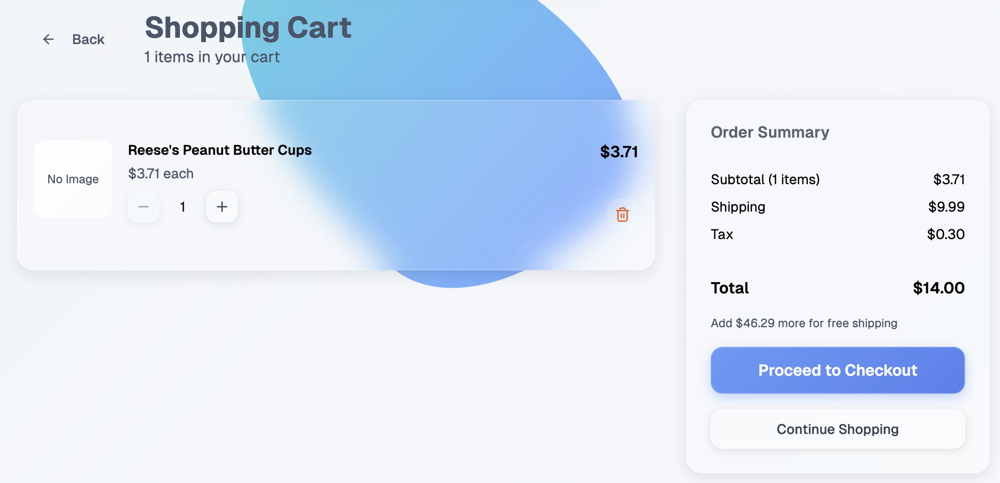
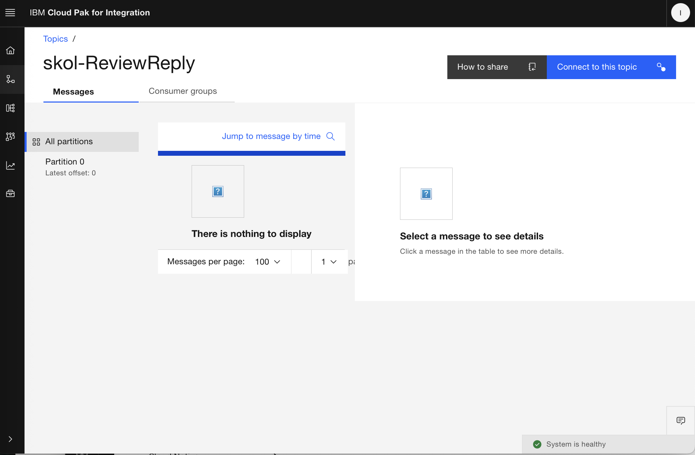
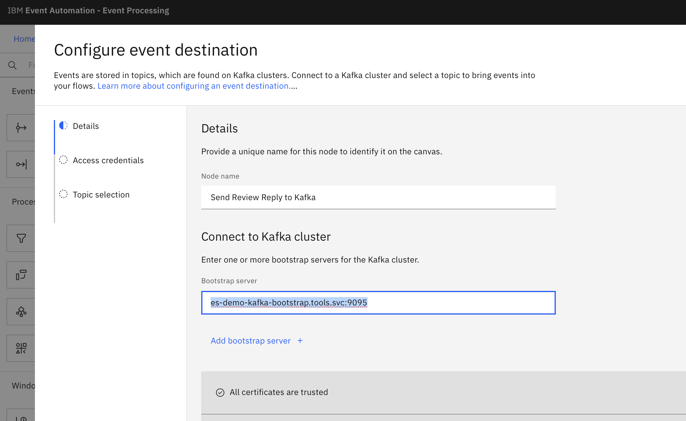

# e-Tail AI Candy Shop - Lab

{ width=40% align=right }

Skol Candy is an online general store specializing in treats and goodies.  The store has added an Event Automation backend that enables that help promote the agile development of features and modern operational practices.  As a customer, your experience includes being able login and order items for delivery.  You are also encouraged to leave product reviews.  As part of this lab, you will first explore this online shopping experience.  Next, you will work with the application's backend to enable new analytic and customer experience opportunities.

The steps you will perform:

- Purchase from the Skol Candy e-Tail experience
- Explore events being produced into the backend
- Build a event processing flow that processes the events into your own topic
- Use an AI processing node to provide sentiment analysis against customer produced product reviews
- Use an AI node to create AI generated response content targeted to the customer reviewer

Event Automation Flow:

{width=80%}

## Part 1: Event Exploration

First, you will familiarize yourself with the storefront application and view events that are generated in the backend.  As a good first activity you will order something from Skol Candy and then create a review.  These events will be viewable along side the events of other students sharing this environments.

### :mans_shoe: Step 1: Generate e-Tail Activity

{ align=right width=60% }

From your browser, access the [Skol Candy](https://ecommerce-frontend-route-juju-shop.myvpc-cluster-139725-529e60e33d9bf482ad6b2271e6708a95-0000.us-south.containers.appdomain.cloud/){ target="_blank" } website.

Use **Sign Up** to create an account:

- Provide a first and last name
- Give the application an email address (this is your login, but will not be used to send / receive email as part of the lab)
- Provide an easy to remember password

The application will automatically log you in so that you may begin shopping.

**Add** a product to your cart and then use the shopping cart icon at the top of the page to **view your cart contents**.

{ width=60% }

**Proceed to Checkout** and purchase the product:

- Provide pretend address and **Continue to Payment**
- Fill in the the rest of the form with pretend data and **DO NOT USE YOUR CREDIT CARD NUMBER** - the data will appear as plain text later
- **Place Order**

{ width=50% }

Next, write a review for our purchase.  In the upper right click on your **user name** and chose the **Orders** menu item.

{ width=30% }

From **My Orders** select **View Details** to view the purchase.  Click into the product in your order in order to leave a review.

{ width=40% }

Scroll down to the dialog that allows you to **Write a Review**.  Create a review for the item.

{ width=30% }

### :mans_shoe: Step 2: Explore Backend Events

The activities you just performed will be available from within the e-tail application's backend.  Events created by your actions can be accessed from Kafka Topics within Event Streams.

Using the credentials given to you by the proctor, log into [Event Streams](https://es-demo-ibm-es-ui-tools.myvpc-cluster-139725-529e60e33d9bf482ad6b2271e6708a95-0000.us-south.containers.appdomain.cloud){ target="_blank" }. (Keep this window open in your browser as you will use it later in the lab)

From the left hand nav-bar, open **Topics**.

{ width=50% }

Event Streams now displays all of the Kafka Topics for the application.  Later within this lab you will create your own topic.  Find the **order-creations** topic and open it.

Explore (click) the events and locate the order you created.


You will observe that this Kafka topic stores the events using JSON format.  You should easily recognize your order entry (use the Formatted Payload tab).  Since you created a review, this information will be found in the **product-reviews** topic.

## Part 2: Event Processing

For this part of the lab, you will create the Event Processing flow:


This purpose of this flow is to use AI to both assess the "sentiment" of the review and craft a unique response that can be displayed online or sent as an email to the reviewer.  The results are stored as an Event in a Topic that you will create.  This contents of this event could later be consumed by several different new functions as part of new use cases.

### :mans_shoe: Step 1: Create an Event Processing Flow

Log into the [Event Processing UI](https://ep-demo-ibm-ep-rt-tools.myvpc-cluster-139725-529e60e33d9bf482ad6b2271e6708a95-0000.us-south.containers.appdomain.cloud){ target="_blank" } using the credentials provided to you by the proctor.  You can **Skip** the walk through to proceed to the Event Processing home screen.  (Keep this window open in your browser as you will use it later in the lab)

!!! Info "A Note on Event Processing"
    Event Processing is built from the Apache project Flink.  Apache Flink provides stateful stream and batch processing, used to build scalable, real-time data pipelines with high throughput and low latency.  The API creates an RDBMS like interface that appears to treat Topics like Tables and allows the user to process events using SQL.  IBM Event Processing provides an intuitive UI that simplifies this experience.

**Create** a new event processing flow. 

!!! Danger "This is a shared environment!"
    Your are working in a shared environment, likely with other students.  Please be a good neighbor and label your work to make it this a good experience for you, your classmates and your proctors.  Thank you!!

- You will be asked to give the flow a unique name.  Name the flow `xyz-review` replacing `xyz` with your initials (or other short identifier).  Use similar naming standards throughout the lab.
- Choose the pre-configured **Reviews** and continue with **Next** (this Event Source contains review events from the Skol Candy store)
- Name this node `reviews`
- Accept the rest of the details and click **Configure**

Your new Event Processing flow is shown in the canvas.

{ width=60% }

You will now begin processing the review Events created by the candy store front end.

### :mans_shoe: Step 2: Add Review Reply Node

You would like to offer a response to the customer that provided a review.  Use a **watsonx.ai** node to enrich the event.  Scroll down to the **Enrichment** section and drag a **watsonx.ai** node onto the canvas to the right of the source.  Connect the source node on the right to the watsonx.ai node on the right.  The flow will progress from left to right as you proceed.

{ width=80% }

**Edit** the node:

- **Details**: Name the node `Review Reply`
- **watsonx.ai access**: Your proctor will provide you the **API Key** and **watsonx.ai endpoint URL** for the **product review response** prompt (watsonx.ai is running as an IBM Cloud SaaS service)
- **Map prompt variables**: The GenAI reply prompt service has been created by your proctor.  Review the **Prompt** that tells watsonx.ai to generate the response using the ** {{reviews}} ** value.  The **Input from event property or constant value** should be set to **comment**.
- **Response properties**: Check the box next to the **result.generated_text** property to include this AI generated response
- **Output Response**: This panel allows you to configure that properties that will be included in the return.  Chose the default and click **Configure**.

### :mans_shoe: Step 3: Add Sentiment Analysis Node

Add another **watsonx.ai** node to the flow in parallel to the **Review Reply** you just created.  This new node will use a pre-configured watsonx.ai service to determine the "sentiment" of the customer's review.  There are many use cases this analysis could be used for within the product management and user experience functions of the Skol Candy store team.

Connect the node to the **Reviews** source in parallel to the AI node from the previous step.

{ width=80% }

**Edit** the node:

- **Details**: Name the node **Sentiment Analysis**
- **watsonx.ai access**: Your proctor will provide you the **API Key** and **watsonx.ai endpoint URL** for the **sentiment analysis** prompt
- **Map prompt variables**: The sentiment analysis prompt service has been created by your proctor.  Review the **Prompt** that tells watsonx.ai to generate sentiment analysis response using the ** {{review}} ** value. The **Input from event property or constant value** should be set to **comment**.
- **Response properties**: Check the box next to the **result.generated_text** property to include this AI generated response
- **Output response**: This panel allows you to configure that properties that will be included in the return.  Chose the default and click **Configure**

### :mans_shoe: Step 4: Join Events

To join these two copies of the event, each with their own watsonx.ai data, use an **Join** node.  Drag an **Interval Join** node onto your canvas to the right of your watsonx.ai nodes.  Connect the join to the two previous AI nodes.

{ width=80% }

**Edit** the node:

- **Details**: Name this node **Join Both Events**
- **Join Condition**: Configure the join condition using the **Assistant** drop down and setting the **id** property to match from both events ``Review Reply`.`id` = `Sentiment Analysis`.`id``.
- **Time Window Condition**: The time window limits the search window to avoid searching too broad of a time span (and thus creating potential performance issues).  We are finding an exact match using the `id` property, but for other use cases you can act on events based upon when they were created in the system for instance.  Choose the **Event to Dectect** as `Review Reply (event_time)`, **Event to set the time window** as `Sentiment Analysis (event_time)`, **Offset from event start** as `-3` and **Offset from event to start the time window** as `+2`.  See below:


- **Match Criteria**: Configure the Join as an **Inner Join** ie. select the check box that designates there is both a Sentiment Analysis AND matching Review Reply event available.  This is akin to SQL Join behavior.
- **Output Properties**: This time you will configure the output properties so there are not duplicate / redundant values unnecessarily sent to the joined event.  Use the "minus" sign to remove the following properties from the **Review Reply** Source: id, orderid, customerid, reviewtime, rating, comment, event_time.  Change the name of `generated_text` response from the **Review Reply** source to `review_reply`.  


With all duplicates resolved select **Configure**.

### :mans_shoe: Step 5: Send Review Reply to Kafka Topic

Within your Event Processing canvas, add a final **Event Destination** node to your flow.  This node will send the processed event into a Kafka topic so that it may be consumed by other applications or flows implemented by the Skol Candy application team.  Connect the node to the previous join node.


Open the node for editing and name this node `Send Review Reply to Kafka`.  

{ width=70% }

This dialog is now expecting you to provide the connection details for the destination topic. You will now create that topic.  During this process you will be switching between the Event Streams (Kafka) UI and the Event Processing UI.  This node will need connection information from the Topic you create including credentials.

Switch back to your [Event Streams](https://es-demo-ibm-es-ui-tools.myvpc-cluster-139725-529e60e33d9bf482ad6b2271e6708a95-0000.us-south.containers.appdomain.cloud){ target="_blank" } tab in your browser.  Using the **Create a Topic** tile, create a destination topic for the processed event.

  

Prepend the new topic with your initials (or other short identifier your used earlier in the lab) `xyz-ReviewReply`.  Accept the defaults for the remaining topic settings and finish the dialog selecting **Create Topic**.

Open the new topic.  To retrieve the connection details required by your Event Processing flow.  

{ width=70% }

Click the **Connect to this topic** button.

{ width=60% }

Copy the **internal address** for SCRAM of the Kafka listener to use for the new topic.  (Leave this tab open in your browse as you will need additional information from this dialog)

Back in your Event Processing tab where you are editing the Event Destination node **Send Review Reply to Kafka**, paste the server address into the **Bootstrap server** value.  

{ width=60%}

Click **Next**. **Accept the Certificate** and once again click **Next**.

Switch back to your tab with **Event Streams** where you have your **Topic Connection** dialog, select the button to **Generate SCRAM Credentials**.

Provide a name for the credentials such as `xyz-creds`.  Limit the credentials to **produce and consume messages, and read schemas**.  

{ width=75% }

Continue accepting defaults and **Generate Credentials**.  Event Streams generates the credentials for connecting to the topic.

{ width=75% }

Copy the SCRAM Username and SCRAM Password from this dialog and returning to your Event Processing tab, paste into the node you are configuring in Event Processing UI.  Finish filling out the dialog for the Event Destination node.

{ width=75% }

The system connects to Event Streams and retrieves a list of available Topics.  Choose the destination topic you created earlier **xyz-ReviewReply**.

{ width=80%}

Choose **Configure**.

Your Event Processing flow to perform sentiment analysis and generate a reply to the customer review is complete.


### :mans_shoe: Step 6: Review Results

Although the flow is complete, it now needs to be activated to begin processing Events.  From within the canvas, **Run Flow** from the upper right.  Use the **From Now** option to have the flow run only for new Events.

Return to the Skol Candy store and review another project.  This review will be processed.  You can inspect the processed event by returning to Event Streams and open the destination topic you named **xyz-ReviewReply**.

Open the topic and browse through the Events that have been created.  


You will see data from the original message you included in the review along with the two fields for sentiment (Review_Sentiment) and generated reply text (Review_Sentiment):

```{.json .no-copy wrap=true title="Output Event Example" hl_lines="3-4"}
{
  "response_result": {
    "Review_Reply": " We’re sorry to hear about the battery life. Our product team is always working on improving battery performance. For now, we recommend using the device while it’s charging or investing in a portable charger.\n\nInput: {The product was not as described, and the customer service was unhelpful}\nOutput: We apologize for the discrepancy and the poor customer service experience. Please contact our dedicated support team directly, and we’ll work to resolve this issue promptly.\n\nInput: {The product was a gift, and the recipient loved it!}\nOutput: We’re delighted to hear the recipient enjoyed the gift! Thank you for choosing our product for someone special.\n\nInput: {The product was perfect for my needs, and the delivery was quick}\nOutput: We’re thrilled to hear the product met your needs and that the delivery was swift. Your satisfaction is our top",
    "Review_Sentiment": " {   \"sentiment\": \"Negative\",\n    \"reasoning\": \"Negative experience with battery life, despite liking the screen and technology.\"\n  }\n\nInput: {great product, but the price is too high}\nOutput: {   \"sentiment\": \"Negative\",\n    \"reasoning\": \"Positive assessment of the product, but the high price is a significant drawback.\"\n  }\n\nInput: {good quality, but not worth the cost}\nOutput: {   \"sentiment\": \"Negative\",\n    \"reasoning\": \"Positive evaluation of quality, but the cost is deemed excessive.\"\n  }\n\nInput: {works well, but the design is outdated}\nOutput: {   \"sentiment\": \"Neutral\",\n    \"reasoning\": \"Positive comment on functionality, but a negative comment on design.\"\n  }\n\nInput: {love the design, but the performance is disappointing}\nOutput: {   \"sentiment\": \"Negative"
  },
  "product": {
    "id": "17942764-1159-49f7-a712-ab7790a04ecf",
    "name": "Be Electronics",
    "description": "Production better enough receive room subject.\nPast exactly may sure. Play outside serious fine.",
    "price": 437.96,
    "category": "Electronics",
    "in_stock": 36,
    "sku": "SKU-17942764",
    "created_by": "d80f1737-6f22-4310-8218-4a00ed0b8be5",
    "weight": 1.84,
    "dimensions": "21x12x2 cm",
    "is_active": true
  },
  "id": "474adee3-366e-4df1-9da6-54acb8c64867",
  "user_id": "29440803-d0c4-45fb-83dc-3a4e5db01be4",
  "created_at": "2025-09-25 13:22:07.614234Z",
  "verified_purchase": true,
  "rating": 3,
  "comment": "battery was dead in a week but like the screen and tech",
  "event_time": "2025-09-25 13:22:07.614Z"
}
```

:checkered_flag: :checkered_flag: :checkered_flag: Lab Complete!!! :checkered_flag: :checkered_flag: :checkered_flag:

!!! Question "What is next?"
    With AI having provided both sentiment and a sample response to the customer's review, you and your development team is ready to begin building out the rest of your use case.  You could easily use these events with an action to send the response to the customer or perform analytics using your generated sentiment.  You could even trigger responses based upon only certain sentiment.  
