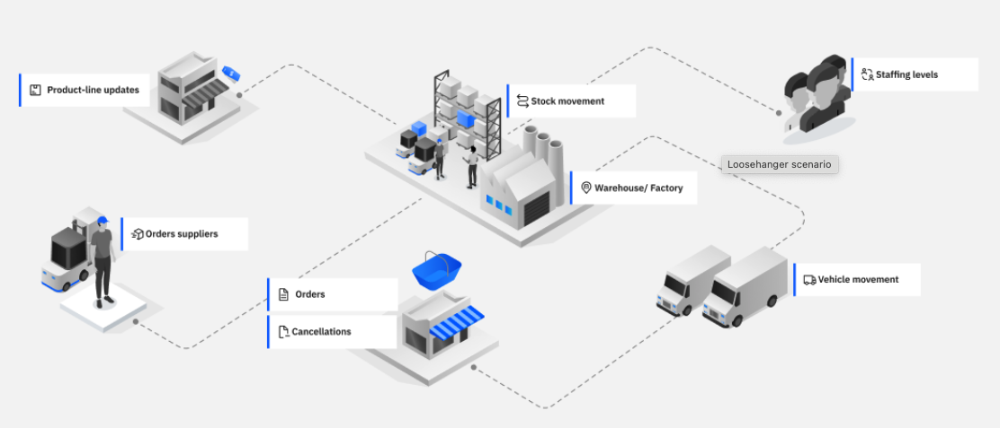
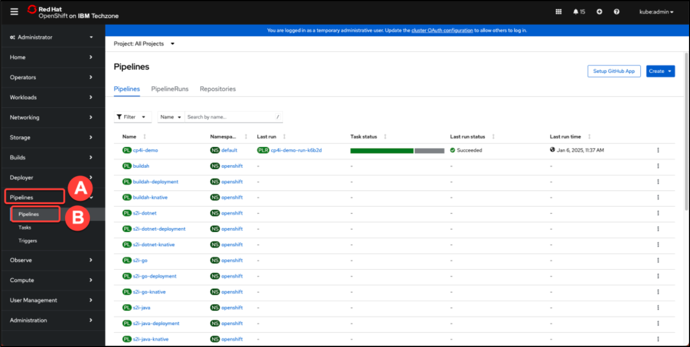
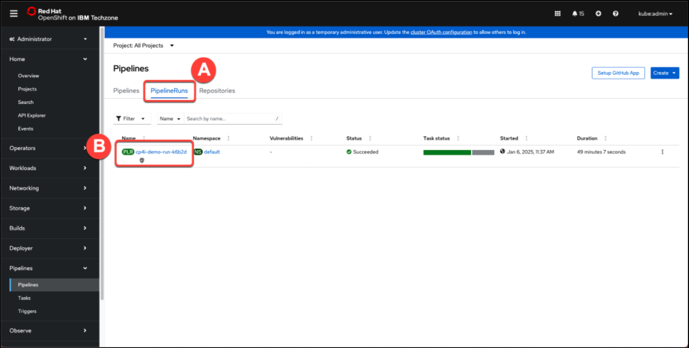

# Event Automation - Lab Environment

To help you start exploring the features of IBM Event Automation, the tutorial includes a small selection of topics with a live stream of events that are ready to use.

This page outlines how to set up and access the tutorial environment on your own OpenShift Container Platform cluster.

The tutorial topics simulate aspects of a clothing retailer, with topics relating to sales, stock management, and employee activities. Messages on the topics are consistent (for example, events on the topic for cancelled orders use order IDs that are used in events on the orders topic) to allow you to experiment with joining and correlating events from different topics. Some topics include events that are intentionally delayed, duplicated, or produced out of sequence, to allow you to learn how to use Event Automation to correctly process topics like this.



his tutorial environment is not intended to demonstrate a production deployment. It is a quick and simple instance of Event Automation for learning some of the key features.

## Event Automation Environment Setup

An IBM Cloud Pak for Integration installation consists of a Red Hat OpenShift Container Platform cluster
with one or more Cloud Pak for Integration operators installed and one or more instances of Platform
UI deployed.  In this section we will follow the steps below to install Event Automation on CP4I.

!!! Note "Which OCP Environment?"
    In most PE Bootcamps we will use the IPI installation of OCP that we create as part of another lab.  If this environment is not available, request an [OpenShift Cluster on VMware on IBM Cloud from TechZone](https://techzone.ibm.com/my/reservations/create/67fd762c701ec2a8e6e0ecd9){target="_blank"}. Use the below specifications:

    {width=50%}

### Login to Your OpenShift Cluster

In a web browser, open the OCP Console link and paste the Cluster Admin Username (A) and Password (B) copied in the previous step and click Log in (C).

{width=100%}

You are almost ready for the demo. Finally, let’s copy login command to access the cluster by CLI.  On the top right, click your username (A) and select Copy login command (B).

{width=100%}

**Display Token** and copy the login command to your local CLI. 

Use `--insecure-skip-tls-verify=true` if you get **error: tls: failed to verify certificate: x509: certificate signed by unknown authority**

### Demo GitHub Repo

This repo is intended to simplify the process to get a full CP4I demo environment for the latest versions of CP4I (v16.1.0 for LTS and v16.1.1 for CD) based on the CP4I end-to-end demo assets.  This repo does not include the extra elements like Instana and Logging, but the core CP4I capabilities and License Service are included now.

You will need to clone the demo repo to your workstation.  Open a terminal window and run the command below:

```bash
git clone github.ibm.com/joel-gomez/cp4i-tz-deployer
```

Open the cp4i-tz-deployer-yl folder:

```bash
cd cp4i-tz-deployer
```

This repo is intended to simplify the process to get a full CP4I demo environment for the latest versions of CP4I.

### Deploying CP4I and core services

Here you will use Tekton pipeline to install Cloud Pak for Integration, including Event Automation and MQ services. This pipeline is ready to install the key CP4I services. We will only remove the services that we don’t need for this demo. Let’s do it!

First, you need to deploy the Tekton pipeline:

```bash
oc apply -f resources/pipeline1.yaml
```

Now, let’s start the pipeline, defining the input parameters:

```bash
tkn pipeline start cp4i-demo \
--use-param-defaults \
--workspace name=cp4i-ws,volumeClaimTemplateFile=resources/workspace-template.yaml \
--pod-template resources/pod-template.yaml \
--param DEFAULT_SC="ocs-storagecluster-ceph-rbd" \
--param OCP_BLOCK_STORAGE="ocs-storagecluster-ceph-rbd" \
--param OCP_FILE_STORAGE="ocs-storagecluster-cephfs" \
--param DEPLOY_ASSET_REPOSITORY_OPERATOR=false \
--param DEPLOY_API_CONNECT_OPERATOR=false \
--param DEPLOY_APP_CONNECT_OPERATOR=false \
--param DEPLOY_DATAPOWER_GATEWAY_OPERATOR=false \
--param DEPLOY_ASSET_REPO=false \
--param DEPLOY_API_CONNECT=false \
--param DEPLOY_ACE_SWITCH_SERVER=false \
--param DEPLOY_ACE_DESIGNER=false \
--param DEPLOY_ACE_DASHBOARD=false \
--param DEPLOY_ACE_INTEGRATION_SERVER=false \
--param DEPLOY_QUEUE_MANAGER=false
```

As result of your command, you will see a command to track the PipelineRun progress. You are welcome to execute it.

```bash
tkn pipelinerun logs cp4i-demo-run-???? -f -n default
```

Another way to track the PipelineRun progress is using the OpenShift Web Console. Back to the OpenShift Web console, open the Pipelines menu (A), then click on Pipelines page (B).

{width=100%}

Open the PipelineRuns page (A) and select your pipeline instance (B).

{width=100%}

In the Pipeline details page, you can see all the steps (if necessary, move to the right to see other steps). Some steps will be skipped based on the parameters defined when you executed the pipeline. If you want to see the details of a specific step, you are welcome to click on step to check the outputs.

{width=100%}

When the PipelineRun completed as Succeeded (A), click on the final step: output-usage (B).

{width=100%}

Here you can get the details about how to access your environment. Copy and paste this information in a notepad, you will need this information later.

{width=100%}

## Launching Support Scripts

Additional supporting services are needed to generate results and data for the hands-on lab experience.

Navigate outside of the cp4i-demo directory first so that the support scripts can be cloned in a separate directory:

```bash
cd ..
```

Execute the following command to clone (via git) the support script repository (eventautomationl3.git) to your local machine:

```bash
git clone https://github.com/ibm-integration/eventautomationL3.git
```

Navigate into the eventautomationL3 directory:

```bash
cd eventautomationL3
```

Execute the script below to create Event Streams users:

```bash
oc apply -f resources/02a-es-initial-config-jgr-users.yaml -n tools
```

Execute the script below to install the support script services:

```bash
./deploy-helpers.sh
```

Enable the Kafka Connect base (Time to install ~5 minutes):

```bash
scripts/08c-event-streams-kafka-connect-config.sh
```

Confirm the instance has been deployed successfully before moving to the next step running the following command.

```bash
oc get kafkaconnects jgr-connect-cluster -n tools -o
jsonpath='{.status.conditions[0].type}';echo
```

Wait for a response of Ready.

Deploy the MQ Source Connector:

```bash
oc apply -f resources/02b-es-mq-source.yaml
```

Deploy the MQ Sink Connector:

```bash
oc apply -f resources/02c-es-mq-sink.yaml
```

Enable the Kafka Connector data generator:

```bash
scripts/08e-event-streams-kafka-connector-datagen-config.sh
```

Confirm the instance has been deployed successfully before moving to the next step running the following command.

```bash
oc get kafkaconnector -n tools
```

After several minutes, you should receive the following response:

```bash
NAME CLUSTER CONNECTOR CLASS MAX TASKS READY
kafka-datagen jgr-connect-cluster com.ibm.eventautomation.demos.acme.DatagenSourceConnector 1 True
mq-sink jgr-connect-cluster com.ibm.eventstreams.connect.mqsink.MQSinkConnector 1 True
mq-source jgr-connect-cluster com.ibm.eventstreams.connect.mqsource.MQSourceConnector 1 True
```

!!! Info
    mq-source jgr-connect-cluster com.ibm.eventstreams.connect.mqsource.MQSourceConnector 1 True You can ignore, if you don’t see ready equal true for mq-sink and mq-source connectors.


