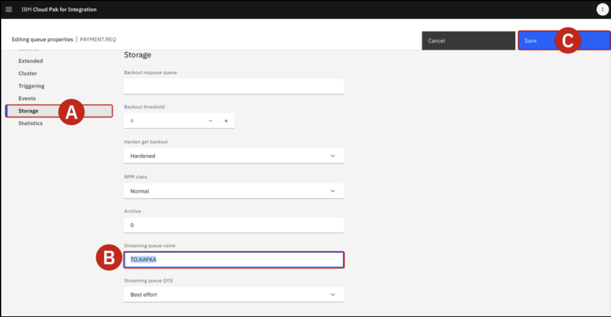
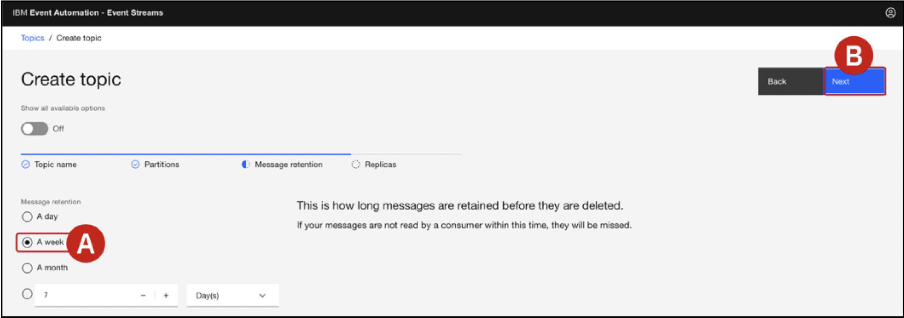

# Event Automation Labs

## Lab 0 - Creating an Event Stream from an IBM MQ Message Queue

To take advantage of the message queue data available from IBM MQ, Company's integration team will need to make IBM MQ's enterprise data available to a broader set of APIs. This will allow application developers to subscribe to the data without any risk or impact to the core back-end systems that support the data. Risks will be lowered, and the application development process can be decoupled from data retention processes.

To do so, Company's integration team will need to expose the IBM MQ enterprise data using "event streams." Specifically, the integration team (and application developers) will need access to the customer order information contained within these streams. This data will be vital for the marketing team's plans to offer high-value promotions for newly-acquired customers in a timely manner.

### Configuring IBM MQ to Clone Customer Order Data

Both the order management system and its payment gateway system are currently using IBM MQ message queues for exchanging customer order data. The integration team will need to tap into this message exchange, clone each of the orders being handled across IBM MQ, and then publish those messages into a new event stream.

1. Open your Cloud Pak for Integration Platform navigator. On the homepage, open the Orders queue manager (if necessary, accept the risks).


2. From the left-hand side menu, drill down into the Manage tab


3. Select the Queues tab along the top of the page.


4. Scroll down the page until you reach a table, which at this time should show several queues that are already a part of the environment.Create a new queue by clicking the Create button in the top-right corner of the table.


5. Wait for the Queue creation wizard to load, then select Local from Choose queue type (A), and click Next (B).


6. The Quick create (A) option should be selected by default.
    - Under the Queue name (B) field, enter TO.KAFKA (all uppercase) 
    - Leave all other settings configured to their default values
    - When ready, click Create (C)
    -   The web browser will refresh back to the Manage > Queues perspective 
    - From the Queues table, confirm that the TO.KAFKA queue is now available


7. From the Manage > Queues table, locate the queue named PAYMENT.REQ and click the name (A) to inspect it in more detail 


8. The queue will already have been populated with multiple Messages. Click on any of the Timestamp(A) names available in the table to pull open a Message Details panel.
    - Scroll down the Message Details panel until you reach Application Data (B).
    - Inspect the contents of the packet, which is a series of key-value pairs: you should see details about the order id, customer, customerid, description, price, quantity, region, and ordertime.
    - Close (C) the Message Details panel by clicking the X in the top-right corner or the grey 


9. Back on the PAYMENT.REQ orders summary table, locate the Actions button in the top-right corner of the page (A). Click to open a drop-down menu and then select View configuration (B)


10. Multiple attributes of the PAYMENT.REQ order queue can be configured from this page. Click the grey Edit (A) button to the right side of the General page.


11. From the tabs on the left side of the page, drill down into Storage (A).
    - Scroll down until you reach the Streaming queue name (B) field and change the value to TO.KAFKA
    - This will direct IBM MQ to clone messages from the PAYMENT.REQ queue into the TO.KAFKA
streaming queue created in previous step..
    - When satisfied, click the blue Save (C) button in the top-right of the page to confirm the configuration changes


12. Once confirmed, the new configuration will immediately take effect and cloned order messages will promptly begin filling the TO.KAFKA queue. Scroll back up to the top of the page and locate the blue Manage (A) text in the top-left corner of the screen. Click the text to return back to the Manage page for Orders


13. From the tabs along the top of the page, click the Queues tab (A). From the table of queues, drill down into the TO.KAFKA queue (B)


14. Take note of the customer order messages that are now populating the TO.KAFKA message queue table. You can click the circular refresh icon (to the left of the blue Create button) to reload the queue contents

!!! error "Error"
    If you don’t see any message available on TO.KAFKA queue, maybe your datagen
    application is not working. Go back to the OpenShift web console and on Workloads > 
    Pods page, search and delete the jgr-connect-cluster. As soon as the pod is running 
    back, check if you are receiving new messages in the TO.KAFKA queue.


### Cloning order queues with IBM Event Streams
Integration team will now need to create an event stream called Orders using IBM 
Event Streams. This will serve as the repository where messages, cloned from IBM MQ, are published and made available to other parts of the organization.

The integration team will need to make decisions about how to replicate the data (with or without modification) and also determine the appropriate retention settings for this data. Given the governance policies in place at company, they will need to retain data for up to 1 week and replicate entries for high availability.

!!! Info MQ-KAFKA CONNECTOR
    IBM MQ allows applications, systems, services, and files to request and coordinate processing tasks —sending and receiving message data via messaging queues. IBM Event Automation's Kafka integrations makes it possible to capture a continuous stream of events, representing state changes across one or multiple environments, and makes those events persistently available for retrieval.

    In combination, IBM MQ and Event Automation enable business-critical communications originating over MQ to be captured as events within Kafka topics, which can later be shared across the enterprise for fueling more responsive applications. IBM MQ-Kafka connectors support bi-directional connectivity between these two architectures. Clients of IBM Event Automation are fully supported for using MQ-Kafka connectors with the Event Streams capability of the platform. Support for the MQ-Kafka connector is also available for IBM clients with MQ Advanced entitlements.

1. On the left navigator, select Run > Kafka clusters

2. Click on es-demo, to open your Event Streams cluster.

3. From the IBM Event Streams dashboard, click the Create a topic (A) tile.

4. The team must first decide on a Topic Name. Set the value to OldOrders (A) and then click the blue Next (B) button to continue.

5. Under the Partitions tab, accept the default recommendation of 1 by clicking Next

6. Under the Message Retention tab, accept the default recommendation (A) of A week and click Next (B) to continue

7. Under the Replicas tab, accept the default recommendation (A) of Replication factor: 3 and confirm your selections by clicking the Create Topic (B) button.


!!! Info
    :white_check_mark: Replication Factor
    In Kafka (or similar systems), replication factor is the number of copies of each partition stored across different brokers.

    - Example: If you set replication.factor = 3, each partition will have 1 leader and 2 followers — total 3 copies.

    - Purpose: Provides fault tolerance. If one broker goes down, replicas on others ensure no data loss.

    :white_check_mark: min.insync.replicas
    This is the minimum number of replicas (including the leader) that must acknowledge a write for it to be considered successful.

    - Example: If min.insync.replicas = 2 and acks=all, then at least 2 replicas (leader + 1 follower) must confirm the write.
    
    - Purpose: Ensures data durability. If too many replicas are down, Kafka will reject writes to avoid data loss.

### Configuring a message bridge between IBM MQ and IBM Event Streams

Using the Apache Kafka connector framework, integration team will now need to 
configure an "event bridge" using Red Hat OpenShift. The task can be performed programmatically via the OpenShift console. The bridge configuration will include connectivity details for accessing both IBM MQ and IBM Event Streams.

Once configured and deployed, the bridge will utilize the Apache Kafka connector framework to read messages from the TO.KAFKA message queue and then publish those to the newly-created Orders event stream.

1. Return to the OpenShift container platform dashboard. From the Home page, click the +icon (A) located in the top-right corner of the interface.

2. The interface will load an Import YAML configuration tool, with a black canvas awaiting input. Here you can supply YAML (Yet Another Markup Language) or JSON files to define new deployments on the OpenShift cluster.The YAML definition of the Apache Kafka connector "bridge" has been prepared ahead of time. Copy and paste the following YAML exactly as written into the Import YAML canvas:
```yaml
apiVersion: eventstreams.ibm.com/v1beta2
kind: KafkaConnector
metadata:
  name: mq-connector
  namespace: tools
  labels:
    eventstreams.ibm.com/cluster: jgr-connect-cluster
spec:
  class: com.ibm.eventstreams.connect.mqsource.MQSourceConnector
  tasksMax: 1
  config:
    # the Kafka topic to produce to
    topic: OldOrders
    # the MQ queue to get messages from
    mq.queue: TO.KAFKA
    # connection details for the queue manager
    mq.queue.manager: orders
    mq.connection.name.list: orders-ibm-mq(1414)
    mq.channel.name: SYSTEM.DEF.SVRCONN
    # format of the messages to transfer
    mq.message.body.jms: true
    mq.record.builder: com.ibm.eventstreams.connect.mqsource.builders.JsonRecordBuilder
    key.converter: org.apache.kafka.connect.storage.StringConverter
    value.converter: org.apache.kafka.connect.json.JsonConverter
    # whether to send the schema with the messages
    key.converter.schemas.enable: false
    value.converter.schemas.enable: false

```
When ready, click Create (A). Full deployment should only take a moment.


3. Switch over to the IBM Event Streams tab with your web browser. Having configured the streaming queue in IBM MQ (earlier in previous step), Integration team now wants to view the orders that have been generated so far. From the home dashboard of the IBM Event Streams service, click the Topic (A) tab (left-hand side) and then click on the name OldOrders (B) to drill down into the topic details.

 
4. Granular details about the ORDERS topic will be loaded within the browser. From this page, you can inspect all of the messages (orders) generated from the time you set up the IBM MQ streaming queue configuration earlier

5. Click any one of the orders to pull up additional details on the payload and its contents


These fields will be valuable later for the marketing team as they look to perform outreach on 
customers meeting certain criteria.

## Configuring SCRAM credentials for Event Streams

1. Switch back to Event Streams home page (A) and click Connect to this cluster (B).

2. Details about your Kafka cluster, including URL and authentication details, are summarized on the page. Record the Kafka SCRAM URL to a notepad for reference later (A). Then click Generate SCRAM credentials (B).

3. To connect securely to Event Streams, your application needs credentials with permissions to access the cluster and resources, such as topics. Set the Credential name to es-demo (A). Keep Produce messages, consume messages and create topics and schemas (B). Then click Next (C) to continue.

4. Select All topics(A) and click Next (B) to continue.

5. Select All consumer groups (A) and click Next (B)

6. Select No transactional IDs (A) and click Generate credentials (B).

7. Record the SCRAM username (A) and SCRAM password (B) to a notepad for reference later.


8. Download the SCRAM certificate (A) and save it to your local machine (B). This will be used later to connect to the Event Streams cluster.


## Produce data to kafka topic

1. Export environment variables 
```bash
# looks at bootstrap.servers you created in the previous step
export KAFKA_BOOTSTRAP_SERVERS='your.kafka.server:443' 
# use the SCRAM username you generated
export KAFKA_USERNAME='your-username' 
# use the SCRAM password you generated
export KAFKA_PASSWORD='your-password' 
# use the path to the SCRAM certificate you downloaded. Full path is required.
export KAFKA_CA_LOCATION='/path/to/your/cafile.pem'
```

> 💡 **Optional: Data generation with UI**  
>  If you want to code with UI, go to [JeansGenerator](https://github.ibm.com/Bikash-Mainali/JeansGenerator).
    Follow the README instructions to run the code. Work in progress.
    

# Setup python environment
```bash
python3 -m venv kafkaenv
source kafkaenv/bin/activate  # On Windows: kafkaenv\Scripts\activate
````

```bash
# Install required libraries
pip install -r requirements.txt
```

2. save this code as `kafka_producer.py`:
```python
import json
import uuid
import time
from datetime import datetime
from faker import Faker
from confluent_kafka import Producer
import random
import os

# Setup Faker
fake = Faker()

# Product attributes
sizes = ["XXS", "XS", "S", "M", "L", "XL", "XXL"]
materials = ["Classic", "Retro", "Navy", "Stonewashed", "Acid-washed", "Blue", "Black", "White", "Khaki", "Denim", "Jeggings"]
styles = ["Skinny", "Bootcut", "Flare", "Ripped", "Capri", "Jogger", "Crochet", "High-waist", "Low-rise", "Straight-leg", "Boyfriend", "Mom", "Wide-leg", "Jorts", "Cargo", "Tall"]
cancel_reasons = ["BADFIT", "TOOEXPENSIVE", "CHANGEDMIND", "DELAYED", "DUPLICATE"]


# Kafka Config with SCRAM using environment variables
conf = {
    'bootstrap.servers': os.environ.get('KAFKA_BOOTSTRAP_SERVERS', 'XXX.techzone.ibm.com:443'),
    'security.protocol': 'SASL_SSL',
    'sasl.mechanism': 'SCRAM-SHA-512',
    'sasl.username': os.environ.get('KAFKA_USERNAME', 'XXX'),
    'sasl.password': os.environ.get('KAFKA_PASSWORD', 'XXX'),
    'ssl.ca.location': os.environ.get('KAFKA_CA_LOCATION', '/es-producer.pem'),
}

producer = Producer(conf)
orders_topic = "ORDERS"
cancellations_topic = "CANCELS"

def generate_order(customerid=None, customer_name=None, quantity=None):
    size = random.choice(sizes)
    material = random.choice(materials)
    style = random.choice(styles)
    
    return {
        "id": str(uuid.uuid4()),
        "customer": customer_name if customer_name else fake.name(),
        "customerid": customerid if customerid else str(uuid.uuid4()),
        "description": f"{size} {material} {style} Jeans",
        "price": round(random.uniform(15.0, 120.0), 2),
        "quantity": quantity if quantity else random.randint(1, 15),
        "region": random.choice(["EMEA", "APAC", "AMER"]),
        "ordertime": datetime.now().strftime("%Y-%m-%d %H:%M:%S.%f")[:-3]
    }

def generate_cancellation(order):
    return {
        "id": str(uuid.uuid4()),
        "orderid": order["id"],
        "canceltime": datetime.now().strftime("%Y-%m-%d %H:%M:%S.%f")[:-3],
        "reason": random.choice(cancel_reasons)
    }

def delivery_report(err, msg):
    if err is not None:
        print(f"❌ Delivery failed: {err}")
    else:
        print(f"✅ Delivered to {msg.topic()} [{msg.partition()}] offset {msg.offset()}")

def send_order(order):
    producer.produce(orders_topic, key=order["customerid"], value=json.dumps(order), callback=delivery_report)
    producer.flush()

def send_cancellation(cancel_msg):
    producer.produce(cancellations_topic, key=cancel_msg["orderid"], value=json.dumps(cancel_msg), callback=delivery_report)
    producer.flush()

def send_split_orders(original_order):
    num_split = random.randint(2, 5)
    print(f"🔁 Generating {num_split} small orders for customer {original_order['customer']} (cancelled large order)")
    
    deadline = time.time() + 120  # 2 minutes
    for i in range(num_split):
        split_order = generate_order(
            customerid=original_order["customerid"],
            customer_name=original_order["customer"],
            quantity=random.randint(1, 5)
        )
        split_order["description"] = original_order["description"]
        print(f"🔸 Split order {i+1}: {split_order['description']} | Qty: {split_order['quantity']}")
        send_order(split_order)
        
        if i < num_split - 1:  # Don't wait after last message
            time_left = deadline - time.time()
            if time_left > 0:
                time.sleep(min(time_left / (num_split - i - 1), 20))  # Evenly spread under 2 min

print("🟢 Kafka producer running (every 10s)")

try:
    while True:
        order = generate_order()
        print(f"📦 Order: {order['description']} | Qty: {order['quantity']} | Customer: {order['customer']}")
        send_order(order)

        if random.random() < 0.5:
            cancellation = generate_cancellation(order)
            print(f"❌ Cancellation: {cancellation['orderid']} | Reason: {cancellation['reason']}")
            send_cancellation(cancellation)

            if order["quantity"] > 10:
                send_split_orders(order)

        time.sleep(2) # Wait for 2 seconds before sending the next order

except KeyboardInterrupt:
    print("\n🛑 Stopped by user.")
```

3. Run your Python script
```bash
# Make sure you have the required libraries installed
pip install confluent-kafka faker
# Run the script to produce messages to Kafka
# Make sure to replace 'XXX' with your actual SCRAM username and password
# and 'XXX.techzone.ibm.com:443' with your actual Kafka bootstrap server address.
# Also ensure that the 'es-producer.pem' file is in the same directory as this script.
# You can run the script using Python 3
python kafka_producer.py
```

## Lab 1 - Filter events based on particular properties

**Filter:**  When processing events, we can use filter operations to select a subset that we want to use. Filtering works on individual events in the stream.

**Scenario: Identify orders from a specific region** 

The EMEA operations team wants to move away from reviewing quarterly sales reports and be able to review orders in their region as they occur.

Identifying large orders as they occur will help the team identify changes that are needed in sales forecasts much earlier. These results can also be fed back into their manufacturing cycle so they can better respond to demand.

[Take me to Lab 1](https://ibm.github.io/event-automation/tutorials/guided/tutorial-1){target="_blank"}

## Lab 2 - Transform events to create or remove properties
**Transform:** When processing events we can modify events to remove some properties from the events. Transforms work on individual events in the stream.

**Scenario: Redact personal information from order events**

The operations team wants to enable another team to analyze order events, however this other team is not permitted access to personally-identifiable information (PII) about customers. They need to be able to process order events without customer PII.

[Take me to Lab 2](https://ibm.github.io/event-automation/tutorials/guided/tutorial-2){target="_blank"}

## Lab 3 - Aggregate events to detect trends over time

**Aggregate:** Aggregates enable you to process events over a time-window. This enables a summary view of a situation that can be useful to identify overall trends.

**Transform:** When processing events we can modify events to create additional properties, which are derived from the event. Transforms work on individual events in the stream.

**Scenario: Track how many products of each type are sold per hour**

In this scenario, we identify the product that has sold the most units in each hourly window. This could be used to drive a constantly updating event streams view of “Trending Products”.

[Take me to Lab 3](https://ibm.github.io/event-automation/tutorials/guided/tutorial-3){target="_blank"}

## Lab 4 - Join related events within time windows

**Interval join:** When looking for patterns in an event stream, sometimes we need to examine events from more than one topic. We talk of this as a “join” between the streams - the same term we would use when working with databases and correlating data between two tables.

**Filter:** When processing events we can use filter operations to select a subset that we want to use. Filtering works on individual events in the stream.

**Scenario: Identify suspicious orders**

Many interesting situations need us to combine multiple streams of events that correlate events across these inputs to derive a new, interesting situation.

In this scenario, we will look for suspicious orders. Specifically, we will be looking for a particular pattern of behavior where large orders have been placed, followed by a smaller order, but the large order was at some point cancelled. This pattern would suggest an attempt to manipulate prices, since the presence of the large order might result in a subsequent reduction in prices, which the smaller order can take advantage of.

To find this pattern, we will use the “join” capability to compare a stream of “orders” with a stream of “cancellations”.

[Take me to Lab 4](https://ibm.github.io/event-automation/tutorials/guided/tutorial-4){target="_blank"}

## Lab 5 - Automate actions based on event triggers
Event destination
When processing events we can send the results to a new Kafka topic. This lets the results from the flow be used to trigger automations, notifications, business workflows, or be processed further in other applications.

Scenario : Distributing results of analysis and processing
The EMEA operations team wants to provide a dedicated stream of EMEA order events for further processing.

[Take me to Lab 5](https://ibm.github.io/event-automation/tutorials/guided/tutorial-5){target="_blank"}

## Lab 6 - Share events for discovery by others

**Scenario: Sharing results of analysis and processing**

The EMEA operations team wants to share their new topic of EMEA orders for use by other teams in their enterprise.

[Take me to Lab 6](https://ibm.github.io/event-automation/tutorials/guided/tutorial-6){target="_blank"}