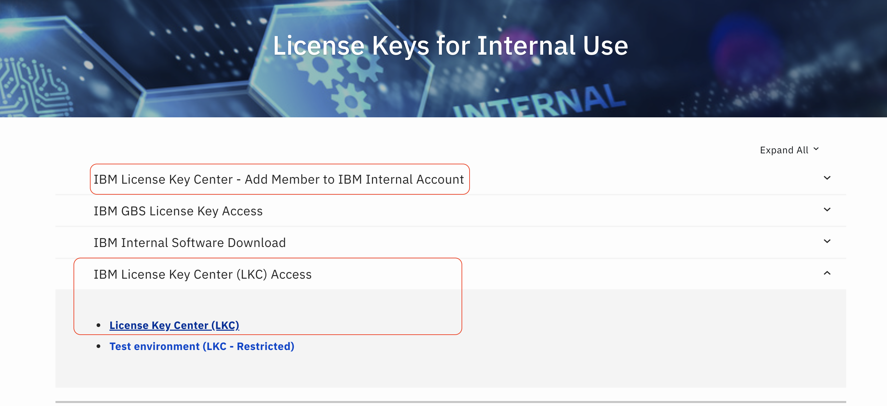
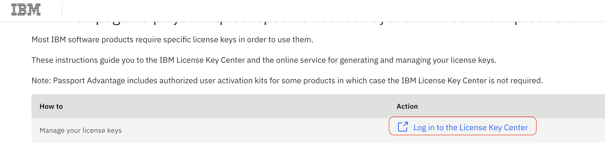
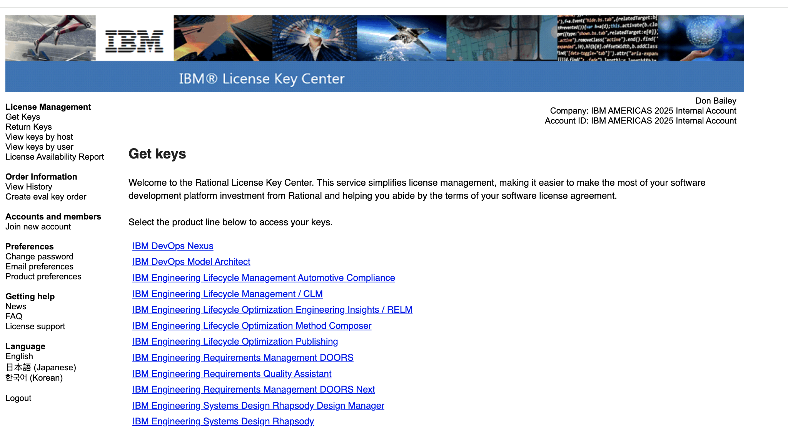
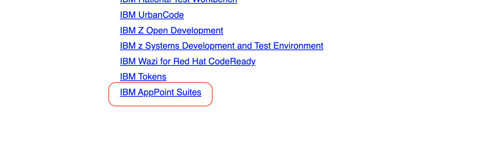
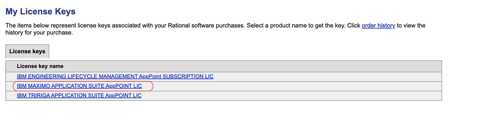
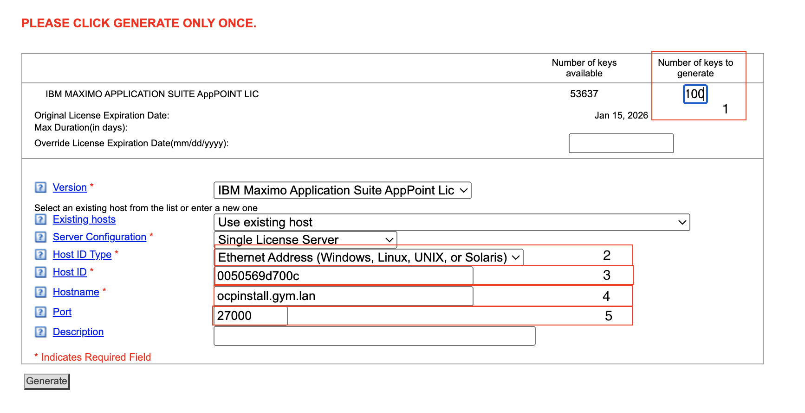

# Maximo One-Click Installaton

## Using Techzone Gym to Install of MAS 9.0.x 

### Using Ansible Oneclick Method 

This document and solution were prepared using a Techzone Gym.  These notes are from my first attempt I received this document in MS Word .docx format from TK (Taeksu Kim - taeksu@ibm.com)

## Original Contributors 

- David Boggs
- Hannah Carr
- Taeksu Kim (TK)

## Installation Methods 

There are a number of ways to install MAS in this lab you will be using the MAS One Click method. Please review the MAS One Click process at [OneClick Install for MAS Core](https://ibm-mas.github.io/ansible-devops/playbooks/oneclick-core/){target="_blank"}

## Lab Overview 

In this lab you will install MAS Core, MAS Manage with demo data. The install will take approximately 12 hours to complete, most of which is hopefully just wait time. The one click install uses the DB2 Database Operator to install the necessary data schemas for Manage, it does not install CP4D as there is no dependency on CP4D for Manage. The cluster can be used as a hosting environment, a basic playground, demo, or knowledge transfer. While the lab focus is on Manage, after completion you should be able to install other MAS applications.

## Pre-requisites for One Click Lab 

### OpenShift Cluster

1. Large OpenShift Cluster.
    - 3 control plane nodes
    - 5 worker nodes
    - 3 infra nodes (OpenShift Data Foundation)

    **Note:** All nodes have 300GB OS disk, 65536 MB RAM and 32 VCPU.  The IPI Install will enable platform integration so ODF will use the default 'thin' storage class to build the storage cluster.

    **Note:** This lab describes the installation and configuration of the required tools on the RHEL 8 Linux bastion node that is included with the OpenShift Gym.

### AppPoint License File

1. IBM Rational Key Store Account (IBM Employees Only), Business Partners must have purchased the "Value Package" or renew if they have purchased one in the past. If the BP has purchased and/or renewed they will have access to the License Key Store. The process of license generation is the same. [IBM employees follow guidance here to create account](https://w3.ibm.com/w3publisher/ibm-license-key-mgmt/license-key-management/internal-use-license-keys)

2. Request Access First, then open the License Key Center  
    {width=80%}

3. Log in to License Key Center  
    {width=80%}

4. In the 'Get keys' screen scroll down to the bottom for IBM AppPoint Suites.  
    {width=80%}
    {width=80%}

5. Select 'IBM Maximo Application Suite AppPoint Lic'
    {width=80%}

6. Request License Key.  Use the example below for generating the license file.

    | Field             | Content                                                      |
    |-------------------|--------------------------------------------------------------|
    | 1. Number of Keys | 100 (How many AppPoints to assign to the license file)       |
    | 2. Host Type      | Set to Ethernet Addresss                                     |
    | 3. Host ID        | 0050569d700c (MAC Address of bastion)                        |
    | 4. Hostname       | ocpinstall.gym.lan (set to the hostname of the OCP Instance) |
    | 5. Port           | Set to 27000                                                 |

    {width=80%}

7. Click the 'Generate' Button and Download the AppPoint License.  This license file is also referred to as the SLS License file.

8. Download and save the license file.

9. Upload the license file to the bastion node in the TechZone gym.

