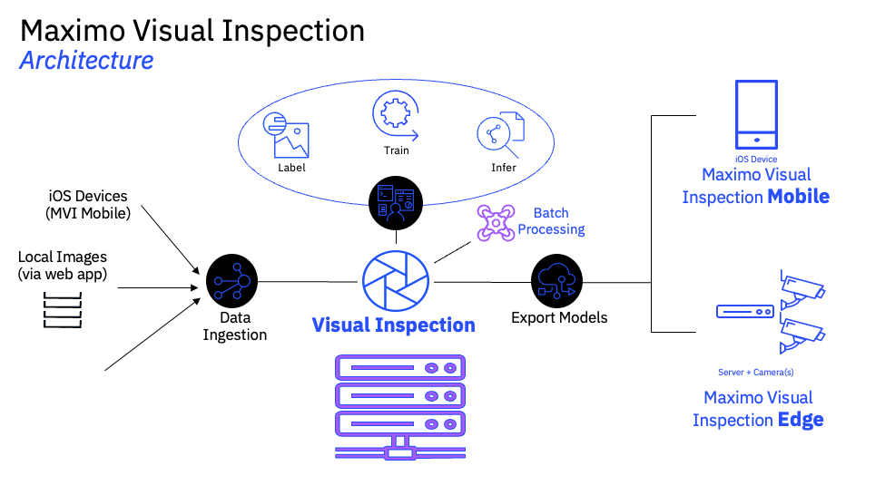
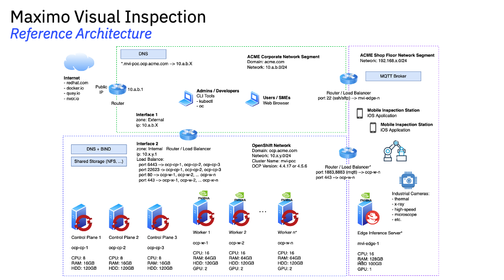
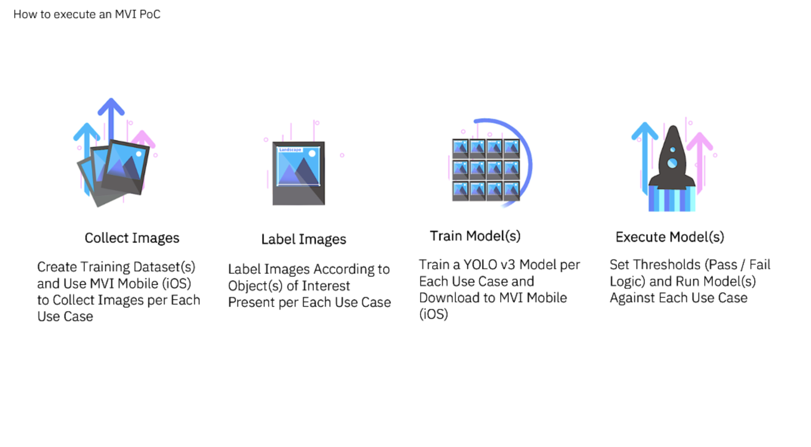

---
hide:
  - toc
---

# Maximo Visual Inspection

Human based visual inspection errors typically range from 20% to 30%, IBM Institute of Business Value performance and benchmark study has shown automated visual inspection are achieving significant business benefits about 92% improvement in product quality issues and anomalies.

Rework cost is much higher and if not captured recalls and customer satisfaction are at risk. Leveraging IBM Maximo Visual Inspection, we can help automate quality inspection, increase accuracy, reduce rework cost and improve worker safety and customer satisfaction

1. Mimimize Defects

    - Capture defects at the point of occurance

2. Increased Productivity

    - Reduce inspection time.

3. Automate Visual Inspection

    - Improve quality inspection and consistency

4. Fast Deployment

    - Quick Value Realization

## MVI Architecture

{width=80%}

## MVI Reference Architecture

{width=100%}

**Notes**

1. Does Maximo Visual Inspection require GPUs to operate?  

    - Yes. Maximo Visual Inspection requires GPUs to train all model types. However, in some configurations, Maximo Visual Inspection can perform model inferencing without using GPUs. In some cases, models might use only the central processing unit (CPU) or might be optimized for edge devices. For more information about model-specific requirements, capabilities, and optimizations, see the Models and supported functions topic.

2. Why do I need a GPU for this application?  

    - Maximo Visual Inspection uses deep learning to create AI models for computer vision tasks. GPUs provide highly parallel computation resources, are suited to performing deep learning tasks, and greatly reduce the training and inference time for the resulting models.

3. Must I allocate a fixed number of GPUs?  

    - No. Maximo Visual Inspection relies on Kubernetes, Red Hat OpenShift, and the NVIDIA GPU operator to allocate GPUs as requested Kubernetes resources when it needs to use them. Maximo Visual Inspection and IBM Maximo Application Suite share GPU resources with other applications, in the same way that applications share other Kubernetes resources, such as memory or CPUs.

4. What happens if no GPUs are available?  

    - During training, Maximo Visual Inspection queues training jobs and periodically checks to see whether any GPUs are available. When a GPU becomes available, Maximo Visual Inspection assigns it to the job that is queued for the longest time.  
    - For some models, when you deploy the model for inferencing, you might choose to deploy the model in CPU mode or to run the model on an edge device by using Maximo Visual Inspection Edge or IBM Maximo Visual Inspection Mobile. In these configurations, no GPU is consumed during inferencing.  

5. Which GPUs are supported?

    - IBM collaborates with NVIDIA to certify the software. In the current release, IBM certifies NVIDIA Ampere, Turing, Pascal, and Volta devices, such as the NVIDIA T4, P40, P100, V100, A10, and A100. At least 16 GB of GPU memory is required during model training.

[Reference Link](https://www.ibm.com/docs/en/masv-and-l/maximo-vi/cd?topic=troubleshooting-frequently-asked-questions-about-graphics-processing-units)

## MVI Workflow

{width=80%}

## Pilot Delivery Timeline

=== "Week 0"

    - Use Case Alignment and Requirements Gathering

        - Activities
            - Conduct Workshop(s)
            - Use Case Discovery and Alignment
            - Solution Discovery
            - Pilot Scoping.
            -  Identify technical/business/user needs and challenges
            - Assess business and user value of proposed solution

        - Outcome
            - Use cases identified & aligned
            - Data and accelerators identified
            - Scope and success criteria defined with client sign-off
            - Project proposal with estimated timeline, resource requirements, IBM investment and client commitments
            - Alignment of sponsors and stakeholders

        - Parties Involved
            - IBM Team (Account, Client Engineering, Tech Sales) 
            - Client Product Owner 
            - Client sponsors)

=== "Week 1"

    - Preparation and Kick-off

        - Activities
            - Finalize architecture diagram for pilot
            - Complete Al business value assessment framework
            - Setup dev and runtime environments **Default option is TechZone**
            - Identify, source, and prepare data and documentation needed for the pilot, including data transfer to CE if required
            - Define validation plan
            - Align on way of working

        - Outcome
            - Environment ready with technology installed, IBM and client having access
            - Lifecycle and project management tools ready
            - Data ready to be used (if applicable)
            - UX designed & validated (if applicable)
            - Team ready to start with backlog of user stories prioritized.
            - Playbacks with sponsor, stand up, and retrospectives booked
            - Any legal agreements are completed

        - Parties Involved
            - Delivery Squad: IBM Client Engineering, Client Product Owner, Client sponsor

=== "Week 2-Week 4"

    - Pilot Build

        **Note:** Pilot build initiates once all data and documentation needed for the pilot have been received by Client Engineering from the client.

        - Activities
            - Develop pilot solution
            - Execute regular playbacks with Client Product Owner & stakeholders
            - Complete AI business value assessment
            - Final Executive playback & proposal delivered to the client

        - Outcome
            - Client has learned and evaluated IBM Technology's ability to bring value
            - Pilot scope has been created and delivered and success criteria met
            - Compelling, story/demo to move forward
            - Business value case developed
            - Stakeholder buy in to adopt

        - Parties Involved
            - Delivery Squad: IBM Client Engineering, Client Product Owner, Client sponsor

=== "Week 5"

    - Transition

        - Activities
            - Knowledge transfer
            - Proposal review with the client
            - Deliverable hand-off
            - Identified deployment team onboarded

        - Outcome
            - IBM support team identified and in place
            - Plan to get to production
            - Roadmap for scaling
            - Knowledge transferred to the service team
            - Additional opportunities to drive value identified
            - Attain client signature on proposal

        - Parties Involved
            - IBM Team, Account, CSM, Client Engineering
            - Client Product Owner
            - Client Sponsor
            - Deployment Services Provider, Expert Labs or Partners

The above slides came from this deck, [CE MVI Presentation](https://ibm.ent.box.com/s/mpqpkqirxzs6a0ob7ldokaxhq9rdnxe8){target="_blank"}. 

## Useful Links

[Main MVI Seismic Page](https://ibm.seismic.com/Link/Content/DCddWcBd7Dm488C2mT3cDj3hh8j8){target="_blank"}  
[MAS POC / Demo Request](https://forms.monday.com/forms/e1c991bd71ae959e450c4c5937e449be?r=use1){target="_blank"}  

