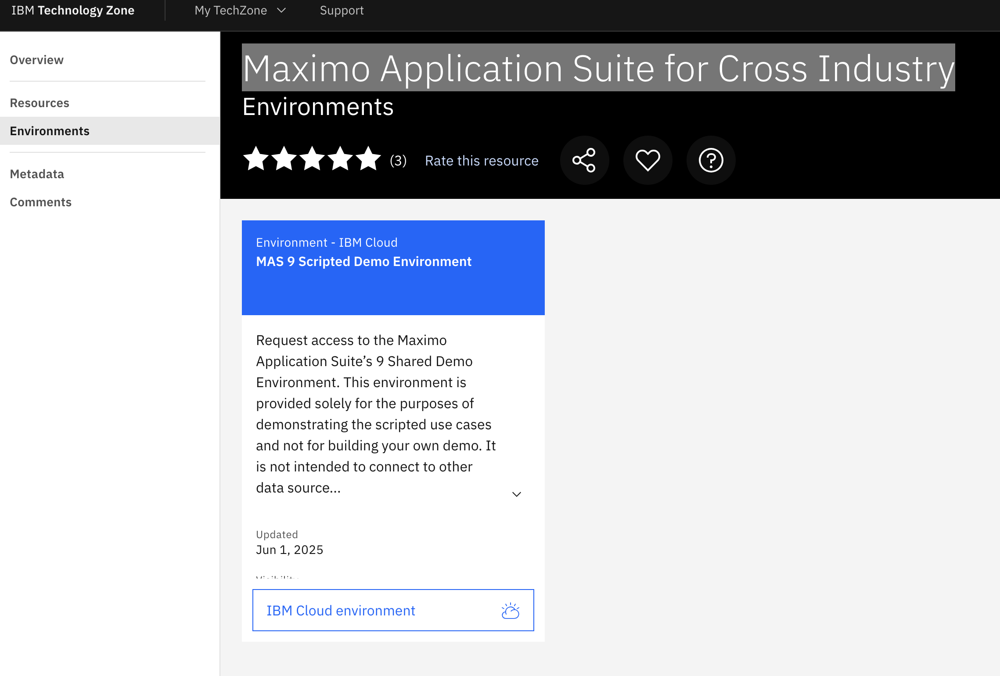
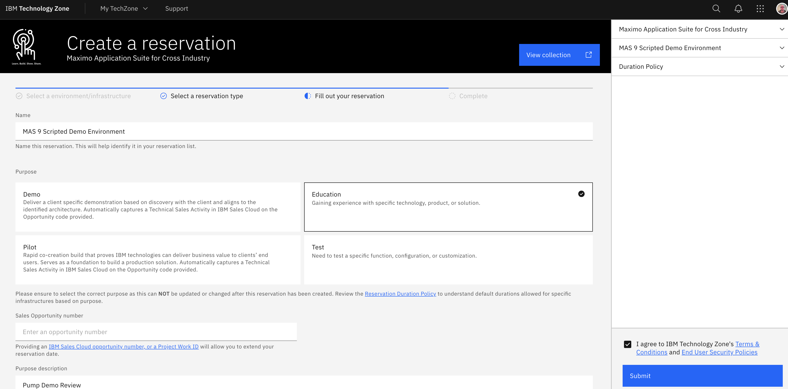
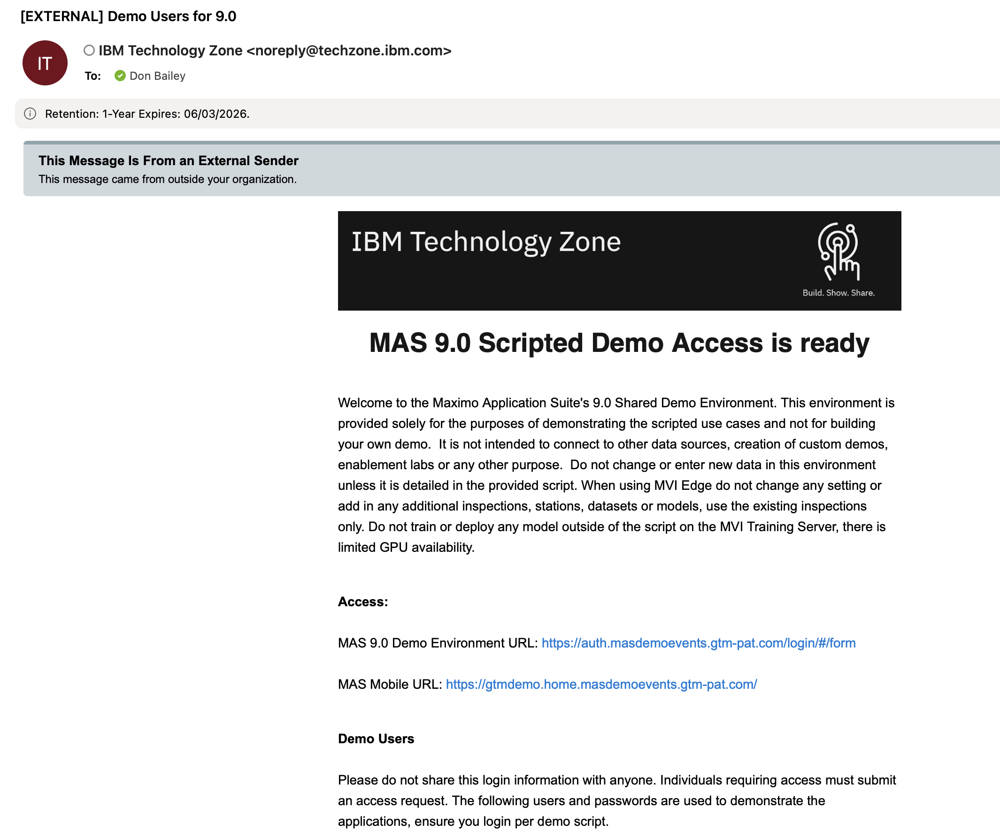

---
hide:
  - toc
---

# Maximo Learning Next Steps

1.  The first step to learn the Maximo application basics is to request access to an environment follow this link [Techzone Maximo Application Suite for Cross Industry](https://techzone.ibm.com/collection/ibm-sustainability-software-maximo-application-suite-811-for-cross-industry/environments).

    {width=50%}

2. Select **'Reserve It'** and complete the TechZone request.

    {Width=100%}

3. Once access to the demonstration environment has been completed. An email will be sent containing the required URL's, usernames and passwords.

    {Width=75%})

4. Link to [demonstration script](https://ibm.seismic.com/app#/doccenter/861ea1fd-99e0-44d7-9135-85412e5c28d1/doc/%252Fdd3359e5f7-a856-a91b-7688-41024b2ac637%252FdfNTY4NmVhOWItY2RkNS04ZWY3LTZkNzItZTQwZjczMWUyMjk1%252CPT0%253D%252CQXV0b21hdGlvbiBQbGF0Zm9ybQ%253D%253D%252FdfNDRmODBlMzMtY2ViMC0zMDI1LTVhNDEtNzg2OTg4MWVmZDBl%252CPT0%253D%252CTWF4aW1v%252FdfOTRiYmU4NTQtNWY4NC03Y2QyLWZjYWUtOGIxYmFmZjkyZThk%252CPT0%253D%252CRGVtbw%253D%253D%252Flfb5963fee-cac8-421c-81e0-1aa7ec635ef7//?mode=view&searchId=2d7f1bde-bcec-4783-850a-9d2a38c24e9d)

## Hannah Carr - National Market Demo and Education

This box folder has recordings of the presentations and slide decks.  
The most important document in this folder is 'Maximo Mobile + Health.docx'. This document is a scripted demo to set up an asset class and define its health score.  [Self Paced Mobile and Health](https://ibm.ent.box.com/folder/315514715311?s=0g00glkf82z4wbmzi0lt855qqrtw0h88&tc=collab-folder-invite-treatment-b)

## [MAS Workshop](https://github.com/cloud-native-toolkit/mas-workshop){target="_blank"}

1. Maximo Overview and Installation (SNO)
2. Monitor and IoT
3. Health and Predict
4. MVI and Mobile
5. EAM to MAS Manage Upgrade

## Integrate MVI with Other Maximo applications

[MVI Integration](https://yourlearning.ibm.com/activity/AB-6697E7B4CCEE)

