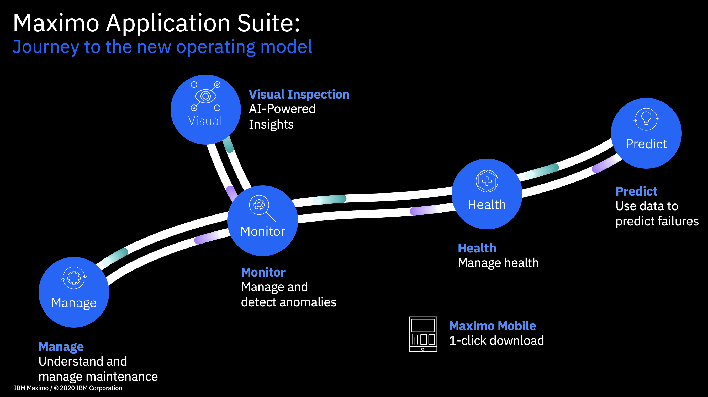

# Maximo Overview

IBM Maximo Asset Management (Maximo) is an enterprise asset management (EAM) software solution designed to help organizations manage physical assets throughout their lifecycle.

Maximo offers a comprehensive set of features for managing assets, work orders, inventory, contracts, purchasing, and service requests. It supports various industries, including manufacturing, transportation, utilities, and facilities management.

## Key features of Maximo include:

- **Asset Management:** Track and manage assets, including their location, condition, and maintenance history.
- **Work Management:** Create, assign, and track work orders, including preventive maintenance, corrective maintenance, and service requests.
- **Inventory Management:** Monitor and control inventory levels, including stock, consumables, and direct materials.
- **Contract Management:** Manage contracts, including vendor information, pricing, and performance metrics.
- **Procurement:** Streamline the purchasing process, from requisition to receipt and invoicing.
- **Service Management:** Manage service requests, including incidents, problems, and changes.
- **Mobile Access:** Access Maximo functionality through mobile devices, enabling field technicians to perform tasks and update records in real-time.
- **Reporting and Analytics:** Generate custom reports and use analytics to gain insights into asset performance, maintenance costs, and other key metrics.
- **Integration:** Integrate Maximo with other enterprise systems, such as ERP, CMMS, and GIS, to ensure data consistency and streamline processes.

## Maximo Visual Inspection

Maximo Visual Inspection helps organizations improve asset reliability, reduce maintenance costs, and enhance safety by providing a structured approach to visual inspections. MVI also helps organizations standardize their inspection processes, improve data accuracy, and make informed decisions based on visual inspection data.

- **Inspection Planning:** Create and manage inspection plans, including defining inspection routes, frequencies, and required documentation.
- **Mobile Inspections:** Conduct inspections using mobile devices, allowing field technicians to capture photos, videos, and other visual data directly in the application.
- **Defect Management:** Document and track defects found during inspections, including their location, severity, and corrective actions.
- **Reporting and Analytics:** Generate custom reports and use analytics to gain insights into inspection trends, asset performance, and maintenance costs.
- **Integration:** Integrate Maximo Visual Inspection with other enterprise systems, such as Maximo Asset Management and GIS, to ensure data consistency and streamline processes.

## What is Maximo

### Introduction to MAS Video

[MAS Introduction Video](https://mediacenter.ibm.com/media/t/1_jg5ynql0){target="_blank"}

### Maximo Application Suite

Journey to the New Operating Model including Generative AI

{width=80%}

### Notes

1. Moving from left to right moves up the chain from Basic asset management to Predictive asset management by infusing the operational data with generative AI.
2. Each of the blue circles is a module that can be added to Maximo Core and Maximo Manage to add features to a very powerful suite of asset management tools.

### A Different View of MAS

{width=80%}

### Notes

1. Notice the asset data and sensor data flow to the Monitor application.  This is where AI begins to analyze the data.  This image like the previous one show the move from basic asset management to predictive management by infusing AI.

### Maintenance Strategies

{width=80%}

### Multi-Cloud Deployment Model

IBM Maximo Application Suite (MAS) can be installed on-premise or in cloud environments like Amazon Web Services (AWS) and Microsoft Azure. It requires a Red Hat OpenShift cluster as a prerequisite. MAS can be deployed anywhere OpenShift can be deployed, including on-prem or on a public cloud. 

{width=80%}

## MAS Upgrade and Planning Links

[MAS Sizing Calculator](https://www.ibm.com/docs/en/masv-and-l/cd?topic=premises-requirements-capacity-planning)  
**Note:** The sizing calculator is an Excel spreadsheet that is downloaded and executed locally.

[MAS Installation Upgrade and Deployment](https://ibm.seismic.com/app?ContentId=a4a97158-e87e-4765-a282-6d3bc10f6844#/doccenter/861ea1fd-99e0-44d7-9135-85412e5c28d1/doc/%252Fdd3359e5f7-a856-a91b-7688-41024b2ac637%252FdfNTY4NmVhOWItY2RkNS04ZWY3LTZkNzItZTQwZjczMWUyMjk1%252CPT0%253D%252CQXV0b21hdGlvbiBQbGF0Zm9ybQ%253D%253D%252FdfNDRmODBlMzMtY2ViMC0zMDI1LTVhNDEtNzg2OTg4MWVmZDBl%252COthers%252FdfOTRiYmU4NTQtNWY4NC03Y2QyLWZjYWUtOGIxYmFmZjkyZThk%252CPT0%253D%252CQ2xpZW50IHByZXNlbnRhdGlvbg%253D%253D%252Flfb2f86b61-9cb5-449c-8d7d-f286c660422f/grid/)  

[Client Engineering MAS Upgrade Template](https://techzone.ibm.com/collection/client-engineering-mas-upgrade-template)  
- [Day 1 OCP Installation on VMWare Gym](https://techzone.ibm.com/collection/client-engineering-mas-upgrade-template)  
- [Day 2 - Ansible playbooks Collection for Maximo Application Suite](https://ibm-mas.github.io/ansible-devops/)  
    **Note:** One Click Install page  
- [MAS Upgrade Process](https://ibm.se ismic.com/app?ContentId=a4a97158-e87e-4765-a282-6d3bc10f6844#/doccenter/861ea1fd-99e0-44d7-9135-85412e5c28d1/doc/%252Fdd3359e5f7-a856-a91b-7688-41024b2ac637%252FdfNTY4NmVhOWItY2RkNS04ZWY3LTZkNzItZTQwZjczMWUyMjk1%252CPT0%253D%252CQXV0b21hdGlvbiBQbGF0Zm9ybQ%253D%253D%252FdfNDRmODBlMzMtY2ViMC0zMDI1LTVhNDEtNzg2OTg4MWVmZDBl%252COthers%252FdfOTRiYmU4NTQtNWY4NC03Y2QyLWZjYWUtOGIxYmFmZjkyZThk%252CPT0%253D%252CQ2xpZW50IHByZXNlbnRhdGlvbg%253D%253D%252Flfb2f86b61-9cb5-449c-8d7d-f286c660422f/grid/)  
    **Note:** Same as the first link in this section  
- [Presentation Slides for Day1/Day2](https://ibm.ent.box.com/s/xhgw3zw87njznsgax95bt0007glndaxu)  
- [Q & A for MAS Upgrades](https://github.ibm.com/client-eng-apps/mas-install-faq)  
- [EAM to MAS Upgrade Training](https://www.ibm.com/training/collection/maximo-application-suite-375)  

## Content Contributors

### Americas Technical Sales Leader

**Ed Neubecker**  
Principal Automation Technical Specialist  
E-mail: Ed.Neubecker@us.ibm.com  
Slack: ed.neubecker  
[YouTube Channel](https://www.youtube.com/@mviguy)  
[MVI Community Page](https://w3.ibm.com/w3publisher/mvi-techsalescommunity)  
[The Pursuit of Zero Defect](https://ibm.seismic.com/app?ContentId=6e593be2-49c2-46a8-b94d-b9fc99bb8230#/doccenter/861ea1fd-99e0-44d7-9135-85412e5c28d1/doc/%252Fdd3359e5f7-a856-a91b-7688-41024b2ac637%252FdfNTY4NmVhOWItY2RkNS04ZWY3LTZkNzItZTQwZjczMWUyMjk1%252CPT0%253D%252CQXV0b21hdGlvbiBQbGF0Zm9ybQ%253D%253D%252FdfNDRmODBlMzMtY2ViMC0zMDI1LTVhNDEtNzg2OTg4MWVmZDBl%252CPT0%253D%252CTWF4aW1v%252FdfOTRiYmU4NTQtNWY4NC03Y2QyLWZjYWUtOGIxYmFmZjkyZThk%252CPT0%253D%252CU2FsZXMga2l0%252Flf0ed6dd1b-bc77-422b-8100-6329902854c5/grid/?anchorId=1d634cef-5d41-4768-b058-e2037a23cb6b)  

### BTS Asset Lifecycle Management 

**Hannah Carr**  
E-mail: Hannah.Carr@ibm.com  
Slack: Hannah Carr  
[Mobile and Health Scripted Demo and Slides](https://ibm.ent.box.com/folder/315514715311?s=0g00glkf82z4wbmzi0lt855qqrtw0h88)

### IBM Distinguished Engineer; CTO - Sustainability - Data & AI, IBM Client Engineering

**Janki Vora**
E-mail: janki@us.ibm.com
Slack: @Janki

## Maximo Vocabulary

`AIO`
: Asset Investment Optimizer

`ALM`
: Asset Lifecycle Management

`Asset`
: A Machine, Tool, or Subassembly that you need to track maintenance against

`Asset Attribute`
: A value associated to the Asset Object/Asset Table

`Asset Class`
: A collection of Similar Assets that follow the same processes and act similar

`Asset Object`
: Maximo Business Object/Class for the Asset Table’s

`Asset Specification`
: A value associated to a classification which is assigned to the asset, allowing you to easily add data to your health scores

`CBM`
: Conditioned-based Maintenance (on roadmap not available today) - a strategy that monitors the actual condition of equipment and performs maintenance only when necessary, based on real-time data and performance indicators, rather than a fixed schedule. It uses various techniques like sensors, visual inspections, and tests to detect deviations from normal operating conditions and schedule maintenance before potential failures.

`CM`
: Corrective Maintenance, generally unplanned

`CMMS`
: Computerized Maintenance Management System.

`Contributors`
: A normalized value to be added to a health score. Can be made up of anything associated to the asset object that is quantifiable

`CP4D`
: IBM CloudPak for Data

`Database Configuration`
: An application in Maximo Manage that gives users the power to change the structure of the database and the Maximo Formulas

`EAM`
: Enterprise Asset Management

`EM`
: Emergency Maintenance – Corrective action taking precedent over all other work

`FMEA`
: Failure Mode and Effects Analysis - a systematic approach to identify and assess potential failures in a system, process, or product, and their potential effects. It's used to proactively prevent or minimize failures by analyzing potential problems before they occur.

`Health Score`
: A customized score made up of weighted contributors. Can be of type Health, Risk, Criticality or a Custom Score

`ITAM` 
: IT asset management (ITAM) is the end-to-end tracking and management of IT assets to ensure that every asset is properly used, maintained, upgraded and disposed of at the end of its lifecycle. For further info please see https://www.ibm.com/blog/it-asset-management.

`ITSM`
:  IT service management (ITSM) is the practice of provide the optimal deployment, operation and management of every IT resource for every end user across an enterprise. For further info please see https://www.ibm.com/topics/it-service-management

`Job Plan`
: A template to be applied to a work order for common work scenarios

`MAS`
: Maximo Application Suite

`Meter`
: A Guage, description, or other used to record categorical or numerical data against an asset

`MBO`
: Maximo Business Object

`MRR`
: Maintenance Repair Ratio – Cost of Work Orders compared to Replacement Cost

`Message Queuing Telemetry Transport (MQTT)`
: A lightweight, TCP-based protocol designed for machine-to-machine (M2M) communication, particularly well-suited for low-bandwidth, high-latency environments. It's a key component of the Internet of Things (IoT) framework, enabling communication between resource-constrained devices like sensors, actuators, and smart home appliances.

`OCP`
: OpenShift Container Platform

`PM`
: Preventative Re-Occurring maintenance

`Service Request`
: A request for service, inspection, or general knowledge put in by any user, client or customer care representative

`VI or MVI`
: Visual Inspection or Maximo Visual Inspection used for both Asset Based inspection and Quality Assurance during manufacturing.

`Work Order`
: A request for service, inspection, or general knowledge put in by any user, client or customer care representative
