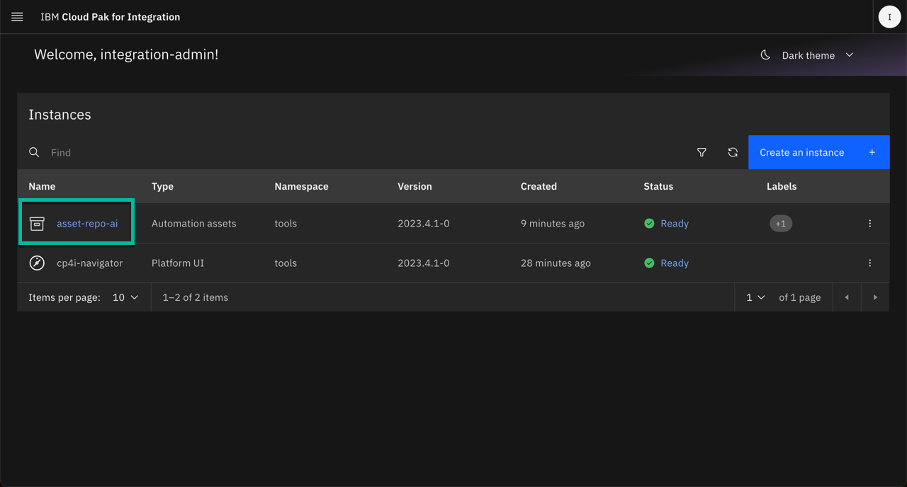
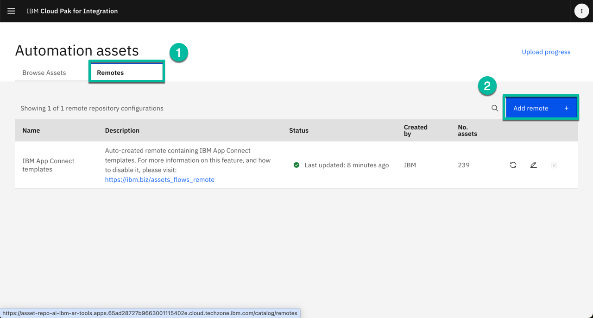
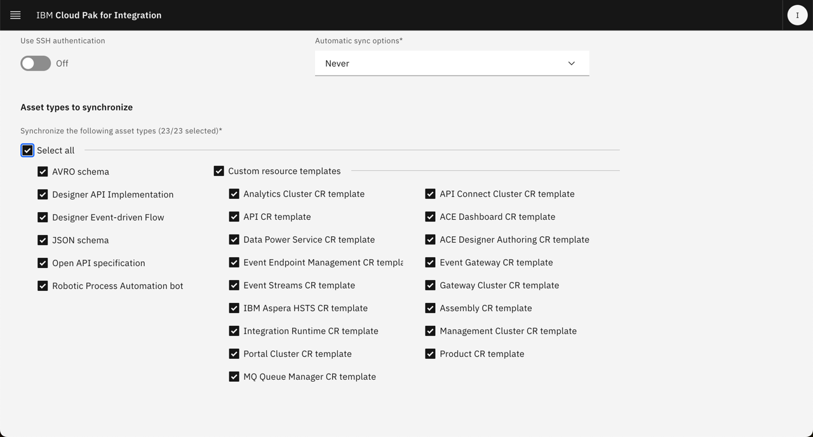
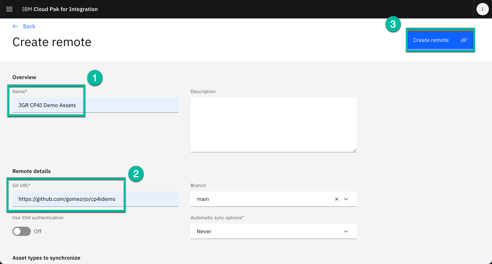

# Configure CP4I and Install Prerequisites

## Install Common Services

### Cert-Manager Installation

!!! Note "cert-manager"
      You can use IBM Cloud Pak for Multicloud Management cert-manager to create and mount a certificate to a Kubernetes Deployment, StatefulSet, or DaemonSet. You can also create and add a certificate to a Kubernetes Ingress.  [cert-manager documentation](https://www.ibm.com/docs/en/cloud-paks/cp-management/2.3.x?topic=certificates-certificate-manager-cert-manager){ target="_blank"}

Begin by installing the Cert Manager Operator:

```bash
oc apply -f resources/00-cert-manager-namespace.yaml
oc apply -f resources/00-cert-manager-operatorgroup.yaml
oc apply -f resources/00-cert-manager-subscription.yaml
```

!!! Tip "What just happened?"
      For the most significant commands we will provide some explanation.  In less interesting cases, you are left on your own to investigate the yaml being applied to determine what just happened.  You should review each command you are running.  Much of this larger demo configuration exercise could be completed from the UI, but we have chosen to show the steps from the CLI.  Why do you find this important?

Confirm the subscription has been completed successfully before moving to the next step running the following command:

```bash
SUB_NAME=$(oc get deployment cert-manager-operator-controller-manager -n cert-manager-operator --ignore-not-found -o jsonpath='{.metadata.labels.olm\.owner}');if [ ! -z "$SUB_NAME" ]; then oc get csv/$SUB_NAME -n cert-manager-operator --ignore-not-found -o jsonpath='{.status.phase}';fi;echo
```

!!! Tip "Take a look at that command ..."
      Look at the command you just ran.  Throughout the demo you will be given such commands to determine when a process has finished or finished successfully.  Look at the syntax.  How else could you determine these results?  Experiment with your own `jsonpath` settings.

You should get a response like this:

```
Succeeded
```
### Install Common Services:

Before deploying the Common Services required for CP4I, you must configure the catalog source.

```bash 
oc apply -f catalog-sources/${CP4I_VER}/02-common-services-catalog-source.yaml
```

Confirm the catalog source has been deployed successfully before moving to the next step running the following command:

```bash
oc get catalogsources opencloud-operators -n openshift-marketplace -o jsonpath='{.status.connectionState.lastObservedState}';echo
```

You should get a response like this:
```
READY
```

Create the Common Services namespace:
```bash
oc create namespace ibm-common-services
```

Install Common Services Operator:
```bash
oc apply -f subscriptions/${CP4I_VER}/00-common-service-subscription.yaml
```

Confirm the operator has been deployed successfully before moving to the next step running the following command:
```bash
SUB_NAME=$(oc get deployment/ibm-common-service-operator -n openshift-operators --ignore-not-found -o jsonpath='{.metadata.labels.olm\.owner}');if [ ! -z "$SUB_NAME" ]; then oc get csv/$SUB_NAME --ignore-not-found -o jsonpath='{.status.phase}';fi;echo
```

You should get a response like this:
```
Succeeded
```

### Prepare the CP4I Namespace

Use the provided script to create namespaces with the corresponding entitlement key:

Set your entitlement key:

!!! Question "Where do I get my entitlement key?"
       You can copy your entitlement key from the [My IBM Entitlement Key](https://myibm.ibm.com/products-services/containerlibrary){target="_blank"} web page.

```bash
export ENT_KEY=<my-key>
```

Create namespaces:
   
```bash
scripts/02a-cp4i-ns-key-config.sh
```

### Deploy Platform UI

You will now deploy the Platform UI (formerly known as the Navigator).

Install Platform UI Catalog Source:
```bash
oc apply -f catalog-sources/${CP4I_VER}/03-platform-navigator-catalog-source.yaml
```

Confirm the catalog source has been deployed successfully before moving to the next step running the following command: 
```bash
oc get catalogsources ibm-integration-platform-navigator-catalog -n openshift-marketplace -o jsonpath='{.status.connectionState.lastObservedState}';echo
```

You should get a response like this:

```
READY
```

Install Platform UI Operator:

```bash
oc apply -f subscriptions/${CP4I_VER}/01-platform-navigator-subscription.yaml
```

Confirm the operator has been deployed successfully before moving to the next step running the following commands:
```bash
SUB_NAME=$(oc get deployment ibm-integration-platform-navigator-operator -n openshift-operators --ignore-not-found -o jsonpath='{.metadata.labels.olm\.owner}');if [ ! -z "$SUB_NAME" ]; then oc get csv/$SUB_NAME --ignore-not-found -o jsonpath='{.status.phase}';fi;echo
```

You should get a response like this:
```
Succeeded
```

Deploy an instance of the Platform UI:

```bash
scripts/03a-platform-navigator-inst-deploy.sh
```

!!! Note "What just happened?"
      If you look into the scripts that perform deployments as part of this exercise, you will see that the script helps run the correct `yaml` for the storage and CP4I versions.  If desired, you could tweak settings with these files.  For instance, the most notable setting chosen for the deployment of the navigator instance is the number of replicas:

      ```yaml
      apiVersion: integration.ibm.com/v1beta1
      kind: PlatformNavigator
      metadata:
        name: cp4i-navigator
      spec:
        integrationAssistant:
          enabled: true
        license:
          accept: true
          license: L-QYVA-B365MB
        replicas: 3
        version: 16.1.1
      ```

Confirm the instance has been deployed successfully before moving to the next step running the following command:
```bash
oc get platformnavigator cp4i-navigator -n tools -o jsonpath='{.status.conditions[0].type}';echo
```

You should get a response like this:
```
Ready
```

!!! Note "Install Flow"
      You will notice a repeating pattern as you install the Cloud Pak for Integration capabilities.

      - Configure a **Catalog Source**
      - Install (subscribe) the **Operator(s)**
      - Create / Prepare a **namespace**
      - **Deploy an instance** of the capability

      We have provided scripts to streamline these steps.  These scripts and `yaml` can be valuable references when you deploy some of these features within your Pilots.
      

Once the Platform UI instance is up and running get the access info:
```bash
scripts/03b-cp4i-access-info.sh
```

!!! Note "Log Into the Platform UI"
      Use the information you just received to login into the UI.  Where else do you find this information? The password is temporary and you will be required to change it the first time you log into Platform UI.


### Optional Exercise: Deploy Asset Repo 

Install Asset Repo Catalog Source:
```bash
oc apply -f catalog-sources/${CP4I_VER}/04-asset-repo-catalog-source.yaml
```

Confirm the catalog source has been deployed successfully before moving to the next step running the following command: 
```bash
oc get catalogsources ibm-integration-asset-repository-catalog -n openshift-marketplace -o jsonpath='{.status.connectionState.lastObservedState}';echo
```

You should get a response like this:
```bash
READY
```

Install Asset Repo Operator:
```bash
oc apply -f subscriptions/${CP4I_VER}/02-asset-repo-subscription.yaml
```

Confirm the operator has been deployed successfully before moving to the next step running the following command:
```bash
SUB_NAME=$(oc get deployment ibm-integration-asset-repository-operator -n openshift-operators --ignore-not-found -o jsonpath='{.metadata.labels.olm\.owner}');if [ ! -z "$SUB_NAME" ]; then oc get csv/$SUB_NAME --ignore-not-found -o jsonpath='{.status.phase}';fi;echo
```

You should get a response like this:
```
Succeeded
```

Deploy an Asset Repo instance:
```bash
scripts/05-asset-repo-inst-deploy.sh
```

Confirm the instance has been deployed successfully before moving to the next step running the following command:
```bash
oc get assetrepository asset-repo-ai -n tools -o jsonpath='{.status.phase}';echo
```

You should get a response like this:
```
Ready
```

Post-deployment configuration:

1. Navigate to the Asset Repo instance from Platform UI clicking on the instance name as shown below:
      

2. From the main page select the `Remotes` tab and click `Add Remote` as shown below:
      
      
3. In the next page scroll all the way down and select `Select All` as shown below:
      
      Note at the moment not all the asset types are available in the repo but we are ready for future enhancements.

4. Now scroll up again and enter the name of the remote repo, for instance `JGR CP4I Demo Assets` and then enter the `Git URL` "https://github.com/gomezrjo/cp4idemo" and then click "Create Remote" as shown below:
      
      You can add your own repo following the same process.

