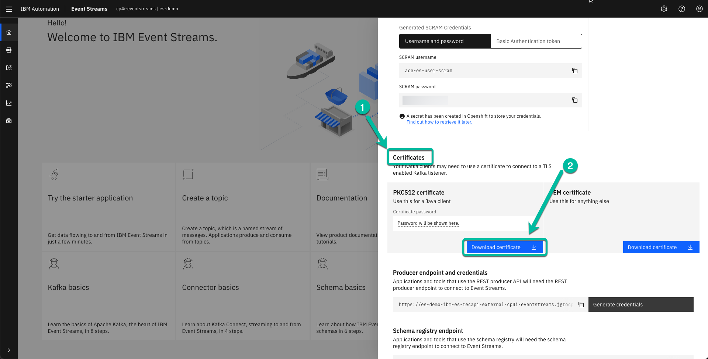
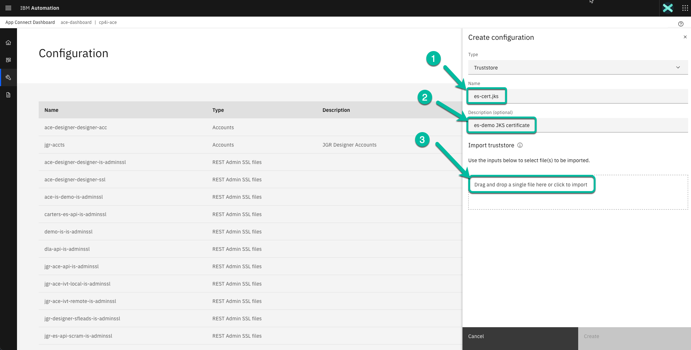
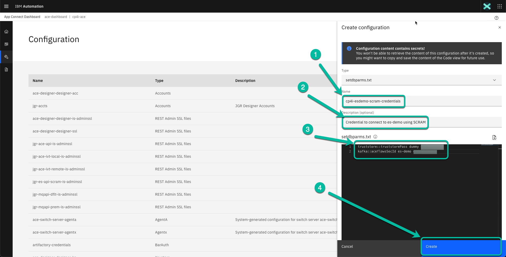
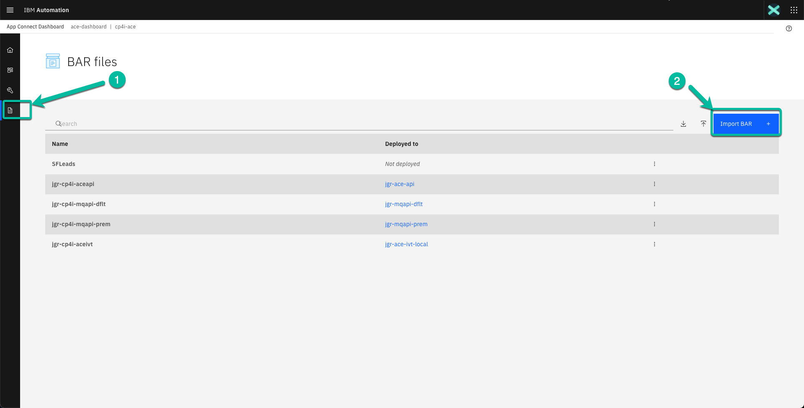
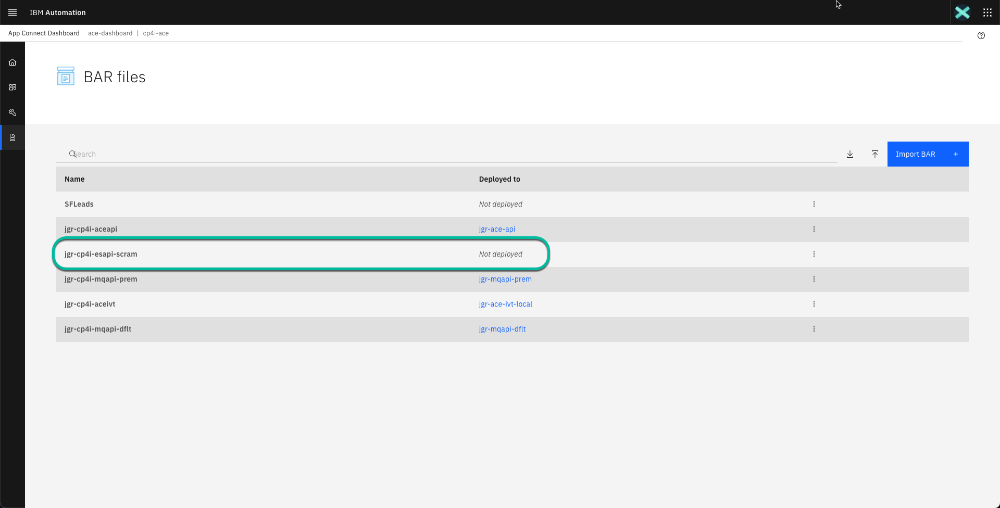
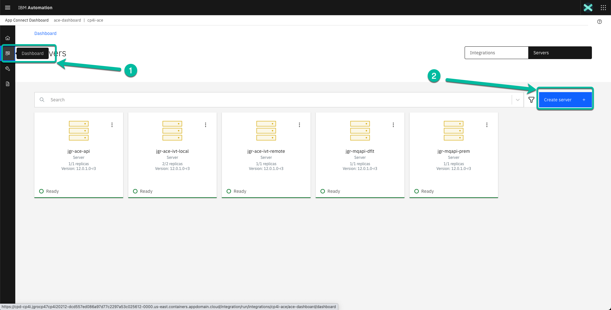
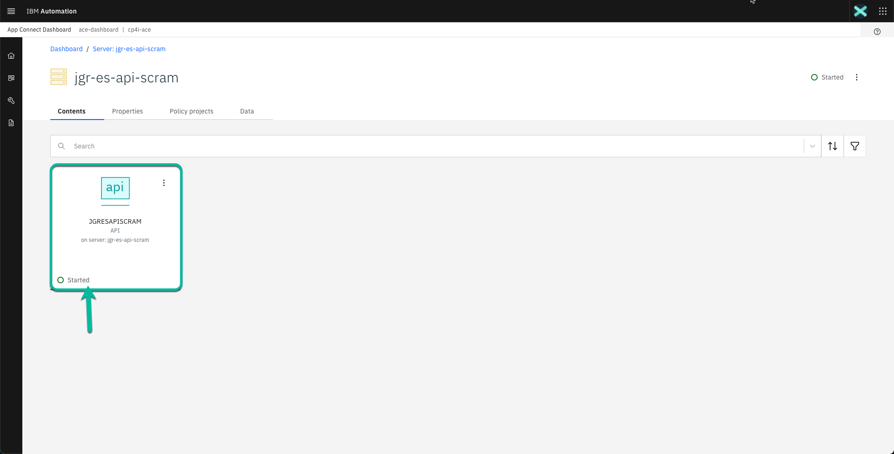

# Configuration to allow an Integration Flow developed with ACE Toolkit to connect to Event Streams

This article explains what configuration is needed to deploy an Integration Flow developed with **ACE Toolkit** that uses the **Kafka Nodes** to connect to an **Event Streams cluster** using the latest version of the **ACE Integration Server Certified Container (ACEcc)** as part of the IBM Cloud Pak for Integration (CP4I) v2021.2.

!!! Note 
    These instructions have been updated to support the versions of Event Streams included with CP4I v2021.3 and v2021.4. The update also works with previous versions. 

## Create a Topic in Event Streams

1. Navigate to the Event Streams instance from the CP4I Platform Navigator. Click on the corresponding instance. In the below image it is called **es-demo**.
    { style='height: auto;width: 90%;'}

2. From the Event Streams Home page click on the **Create a topic** tile.
    { style='height: auto;width: 90%;'}

3. The wizard guides you during the process.  In the first screen type the topic name.  In image below **kafka-cp4i-demo-topic** is used. You can use any name, you will use it later on when configuring your Flow in the Toolkit.  
    { style='height: auto;width: 90%;'}

4. You can review the different options, but for simplicity I'm accepting the defaults, so you can simply click **Next**.
    { style='height: auto;width: 90%;'}

5. You can change the retention period, but I'm accepting the default clicking **Next** without manking any change.
    { style='height: auto;width: 90%;'}

6. Click **Create Topic** to complete the wizard. 
    { style='height: auto;width: 90%;'}

7. The new topic will be displayed in the **Topics** page. First confirm the topic was created and then return to the home page clicking on the **Home icon**.
    { style='height: auto;width: 90%;'}

## Create SCRAM Credentials to Connect to Event Streams

1. From the Event Streams Home page click on the **Connect to the cluster** tile. 
    { style='height: auto;width: 90%;'}

2. The wizard will guide you during the process. First, make sure you have selected **External**.  Then, copy the bootstrap information and paste it in a safe place since we will need it later on. Finally, click on **Generate SCRAM credentials**.
  { style='height: auto;width: 90%;'}

3. In the pop up window type the name of the user you want to create. In my case I have used **ace-es-user-scram**.  Click **Next**.
    { style='height: auto;width: 90%;'}

4. The example grants full access to the new user, but you can control the level of access as needed.  Once you adjust the values click **Next**. 
    { style='height: auto;width: 90%;'}

5. Adjust the values as needed and click **Next**. 
  { style='height: auto;width: 90%;'}

6. Select **All transactional IDs** or the value you prefer and then clik **Generate credentials**.
{ style='height: auto;width: 90%;'}

7. After a moment the credentials are generated and presented to you.  Make sure to copy the password and paste it into a notepad since you will use it later.
    { style='height: auto;width: 90%;'}

8. Scroll down to the **Certificates** section and click on **Download certificate**.
    { style='height: auto;width: 90%;'}

9. Navigate to the folder where you want to save the certificate and click **Save**.
    { style='height: auto;width: 90%;'}

10. Once the certificate is saved the corresponding password will be displayed.  Click on the **Copy** icon to paste it into a notepad for future use.
    { style='height: auto;width: 90%;'}

11. Scroll up and close the wizard. 
    { style='height: auto;width: 90%;'}

12. Before you move to ACE you need to convert the certificate format from `PKCS12` to `JKS`. Open a **Terminal** and navigate to the location where you stored the certificate in **step 8** and run the following command changing the **cert-password** value for the actual password you got in step 10. 
    
    ```sh
    keytool -importkeystore -srckeystore es-cert.p12 -srcstoretype PKCS12 -destkeystore es-cert.jks  -deststoretype JKS -srcstorepass <cert-password> -deststorepass <cert-password> -srcalias ca.crt -destalias ca.crt -noprompt
    ```
    
    Now you are ready to move to ACE and create the required configuration using the information you have collected.

## Create Resources in the ACE Toolkit

For this exercise a simple project has been created that exposes an API to POST information into a Kafka topic.  The following picture shows the corresponding flow. If you want to use this sample, you can find the Project Interchange [here](https://github.ibm.com/joel-gomez/tinkering-cp4i/blob/master/ACE/PIs/JGRESAPISCRAM.zip)

{ style='height: auto;width: 90%;'}

First, we will create a **Policy Project** to store the Event Streams configuration.

1. From the **Application Development** pane click on **New** and select **Policy Project**. 
    { style='height: auto;width: 90%;'}

2. In the pop-up window enter the name of the project, i.e. `CP4IESDEMOSCRAM` and click **Finish**.
    { style='height: auto;width: 90%;'}

3. The project appears in the **Application Development** pane. Expand the project and click **(New...)**. Then select **Policy** from the **New Artifact** menu.
    { style='height: auto;width: 90%;'}

4. In the pop-up window enter the name of the policy, i.e. **es-demo** and click **Finish**.
    { style='height: auto;width: 90%;'}

5. The **Policy Editor** opens for you to enter the data.  Click on the **Type** drop down box and select **Kafka**.
    { style='height: auto;width: 90%;'}
    
    The default values from the **Kafka Template** are used to pre-populate the policy.
    { style='height: auto;width: 90%;'}

6. Update the policy using the following values:

    ! Property | Value |
    ! ---------|------- |
    ! Bootstrap servers | &lt;Value copied from previos section>  |
    ! Security protocol | `SASL_SSL`  |
    ! SASL Mechanism | `SCRAM-SHA-512`  |
    ! SSL protocol | `TLSv1.2`  |
    ! Security identity (DSN) | any value, i.e. `aceflowsSecId`  |
    ! SASL config | `org.apache.kafka.common.security.scram.ScramLoginModule required;`  |
    ! SSL truststore location | `/home/aceuser/truststores/es-cert.jks` |
    ! SSL truststore type | `JKS` |
    ! SSL truststore security identity | `truststorePass` |
    ! Enable SSL certificate hostname checking | `true` |
    
    The policy should look similar to this:
    { style='height: auto;width: 90%;'}

7. Don't forget to **Save** your changes.
    
8. Go back to the **Flow Editor** to update the flow. Select the **KafkaProducer** node and update the properties in the **Basic** tab. Use the following information as a reference:

    ! Property | Value |
    ! ---------|------- |
    ! Topic name | &lt;Value used in the first section> i.e.`*kafka-cp4i-demo-topic` |
    ! Bootstrap servers | We have configured this value in the policy, but since this is a mandatory field we will enter `dummy` |
    ! Client ID | any value, i.e. `cp4iace-esapi-scram` |
    
    The tab should look similar to this:
    { style='height: auto;width: 90%;'}

9. Select the **Policy** tab and in the window click **Browse**.  From the pop-up window select the policty we just created and click **OK**.
    { style='height: auto;width: 90%;'}

10. The policy with be displayed in the **Policy** field.  Save your project to get rid of the error message.
    { style='height: auto;width: 90%;'}

11. Now we will create the BAR file to deploy our flow.  Navigate to the **File** menu and select **New** and then **BAR file**
    { style='height: auto;width: 90%;'}

12. In the pop-up window enter the name of the `BAR` file, i.e. **jgr-cp4i-esapi-scram** and click **Finish**.
    { style='height: auto;width: 90%;'}

13. The **BAR Editor** is open. Select **Applications, shared libraries, services, REST APIs, and Test Projects** to display the right type of resources and then select your application, in this case `JGRESAPISCRAM`. Finally click **Build and Save...** to create the`BAR` file.
    { style='height: auto;width: 90%;'}

14. You can dismiss the notification window reporting the result clicking **OK**.
    { style='height: auto;width: 90%;'}

15. Before we head to the **ACE Dashboard** we need to do a final step. We need to create a zip file from the **Policy Project** we created earlier in this section.  For that you need to navigate to the folder where your **ACE Toolkit** workspace is located (in my case that use Mac it is located at /Users/&lt;your user>/IBM/ACET12/&lt;your workspace>) and use your tool of choice to compress the folder where the policy project is located.  The following picture shows a possible option.
    { style='height: auto;width: 90%;'}

16. Take a note where the zip file is located because we will use it in the next section.
    { style='height: auto;width: 90%;'}

Now we can move to the next phase.

## Create Configurations in ACE Dashboard

1. From the Platform Navigator click on the **ACE Dashboard** you want to work. In the example case it is called **ace-dashboard** to avoid any confusion.
    { style='height: auto;width: 90%;'}

2. Click on the **Wrench** icon to navigate to the **Configuration** section.
    { style='height: auto;width: 90%;'}

3. Once you are in the **Configuration** window, click on **Create configuration**.
    { style='height: auto;width: 90%;'}

4. In the wizard click on the **Type** drop down box to select **Truststore** to upload the Event Streams certificate.
    { style='height: auto;width: 90%;'}

5. In the next window enter the name of the certificate you created in the previous section (`es-cert.jks`), then a brief description if you want to.  In the example case, **es-demo JKS certificate** is used.  Finally, click on **Drag and drop a single file here or click to import**.
    { style='height: auto;width: 90%;'}

6. Navigate to the folder where you created the JKS certificate in the previous section and select the file and click **Open**.
    { style='height: auto;width: 90%;'}

7. Finally, click **Create** to add the TrustStore Configuration.
    { style='height: auto;width: 90%;'}

8. Mext we will define the Configuration to store the credentials selecting the **setdbparms.txt** type from the drop down box.
    { style='height: auto;width: 90%;'}

9. In the next window enter the name of the configuration. In my case I used **cp4i-esdemo-scram-credentials**. Followed by a brief description i.e. **Credential to connect to es-demo using SCRAM**.  Finally, use the following information as a reference to enter the data in the text box.
    
    | Resource Name | User | Password |
    | --------------|------|--------- |
    | **truststore::truststorePass** | dummy | &lt;Password obtained in step 10 of section "Create SCRAM credentials to connect to Event Streams"> |
    | **kafka::aceflowsSecId** | &lt;Name of user created in step 3 of section "Create SCRAM credentials to connect to Event Streams", i.e. **ace-es-user-scram**> | &lt;Password obtained in step 7 of section "Create SCRAM credentials to connect to Event Streams"> |
    { style='height: auto;width: 90%;'}

10. Next, create the Configuration for the Policy selecting the **Policy project** type from the drop down box.
    { style='height: auto;width: 90%;'}

11. In the next window enter the name of the configuration, i.e **jgr-es-demo-scram-policy**, a brief description if you want to, i.e. **Policy to connect to Event Streams instance es-demo using SCRAM** and finally click on hyper link **Drag and drop a single file here or click to import** to import the zip file we created in the previous section. 
    { style='height: auto;width: 90%;'}

12. Navigate to the folder where you saved the zip file in the previous section, select the file and click **Open**.
    { style='height: auto;width: 90%;'}

13. Finally, click **Create** to save the configuration for the policy project.
    { style='height: auto;width: 90%;'}

We are ready to move to the final phase of the process.

## Deploy BAR file using ACE Dashboard

1. From the **ACE Dashboard** home page navigate to the `BAR` files section clicking the **Document** icon and then click **Import BAR** button.
    { style='height: auto;width: 90%;'}
    
2. In the wizard click the hyperlink **Drag and drop a BAR file or click to upload** to upload the BAR file we created in the previous section.
    { style='height: auto;width: 90%;'}
    
3. Navigate to the folder where the BAR file was created (on macOS you can find it at /Users/&lt;your user>/IBM/ACET12/&lt;your workspace>/BARfiles) and select the file and click **Open**.
    { style='height: auto;width: 90%;'}
    
4. To complete the process click **Import**.
    { style='height: auto;width: 90%;'}
    
5. After a moment the file will be displayed in the list of BAR files available with the status of **Not deployed**
    { style='height: auto;width: 90%;'}
    
6. Now navigate to the **Dashboard** section and click on the **Create server** button.
    { style='height: auto;width: 90%;'}

7. This will start the deployment wizard. Select the **Quick start toolkit integration** tile and then click the **Next** button.
  { style='height: auto;width: 90%;'}

8. In the next window click on the drop down box to select the BAR file we previously uploaded and then click **Next**.
    { style='height: auto;width: 90%;'}

9. In the next window select the 3 configurations we created in the previous section and then click **Next**.
    { style='height: auto;width: 90%;'}

10. In the next page give your deployment a name, i.e **jgr-es-api-scram** and click **Create** to start the deployment.
    { style='height: auto;width: 90%;'}

11. After a moment you will be taken back to the Dashboard page where you will see a new tile with your **Integration Server** deployment name in **Pending** state, similar to the picture shown below:
    { style='height: auto;width: 90%;'}

12. The **App Connect Dashboard** is deploying the **Integration Server** in the background creating the corresponding pod in the specified **namespace** of the **Red Hat OpenShift Container Platform**. This process can take more than a minute depending on your environment. Click the refresh button in your browser until you see the tile corresponding to your deployment in **Ready** state as shown below:
    { style='height: auto;width: 90%;'}

    Now is time to test everything is working as expected. Click on the tile corresponding to your deployment.

14. The next window shows the API in started state. Click on the tile to get the details.
    { style='height: auto;width: 90%;'}
    
15. In the next page navigate to the operation implemented in your flow (**POST /contacts** in my case). Then click on the **Try it** tab followed by the **Generate** hyperlink to generate some test data. Review the data generated and click the **Send** button.
    { style='height: auto;width: 90%;'}

16. After a moment you will get a response back.  If everything is OK you will receive a **200** response code indicating the request was successful and the same payload you sent plus some metadata including a timestamp showing the request completed few seconds ago. 
  
    !!! NOTE 
        Some people has reported issues at this stage that could be caused for the resources assigned to the **Integration Server** at deployment time. In this case, you can wait a little bit longer, like 3 or 4 more minutes, or you can redeploy the **Integration Server** increasing the *CPU* and *Memory* assigned to it.
    
    { style='height: auto;width: 90%;'}

17. To fully confirm the message landed on the corresponding topic, you can navigate to the Event Streams instance and check the message is there.  Once you are in the Event Streams Home page click on the **Topics** icon in the navigation section and then click on the topic you used in your flow.  In the example:  **kafka-cp4i-demo-topic**.
    { style='height: auto;width: 90%;'}

18. In the topic page navigate to the **Messages** tab, then select the most recent message and confirm the payload includes the same data we sent during the test.
    { style='height: auto;width: 90%;'}

The configuration has been completed.

## Review

In this exercise you performed the steps required to integrate **Event Streams** with **App Connet Enterprise** to support an **Event Driven Architecture**. 
