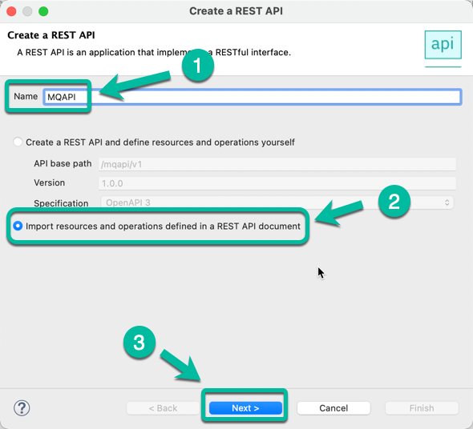
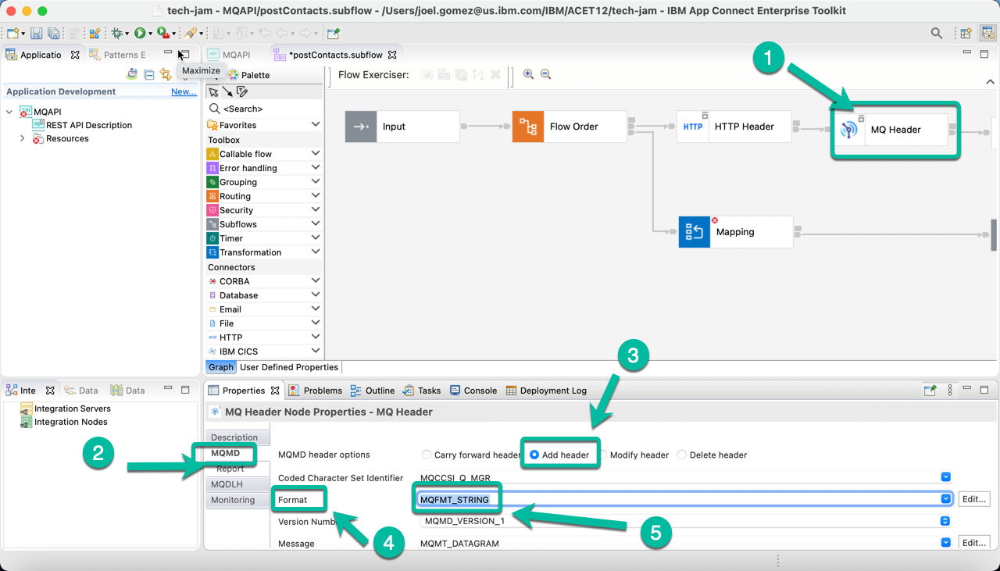
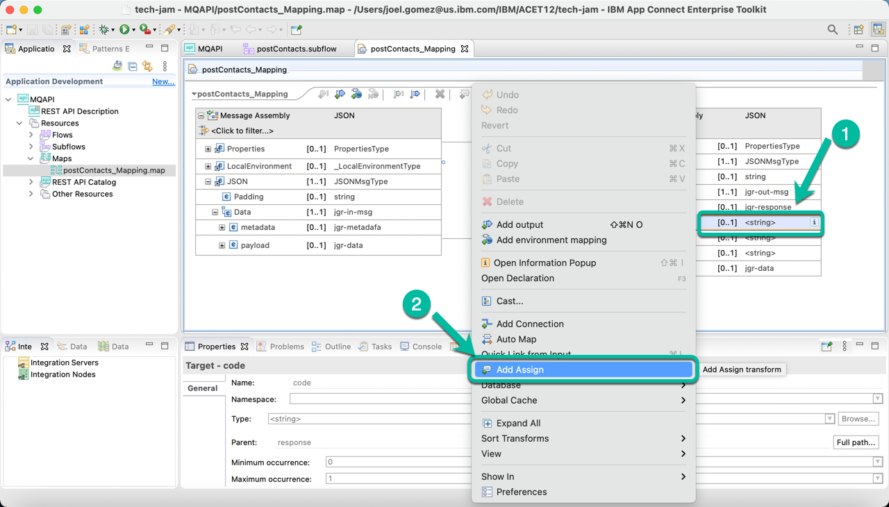
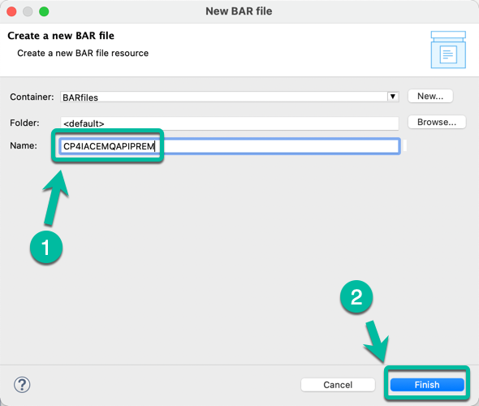

# Develop a REST API using ACE Toolkit to interact with MQ

This article explains the steps need to create an Integration Flow developed with **ACE Toolkit** that uses the `REST API` functionality, as well as, the `MQ Nodes` to interact with an **MQ Queue Manager** using the latest version of the **ACE Integration Server Certified Container (ACEcc)** as part of the IBM Cloud Pak for Integration (CP4I).  This is considered "Low-Code / No-Code" development with ACE Toolkit.   You deployed the toolkit to your workstation as part of the [prerequisite steps](https://pages.github.ibm.com/skol/ce-int-guild/learning/tech-jam/materials/prereq-ace-toolkit/).

## Creating a REST API

Open the Toolkit in your workstation and create a new `REST API` project as shown below.

{ style='height: auto;width: 90%;'}

Give a name to your project, i.e. `MQAPI` and then select the option to *Import resources* since we will leverage a definition that has already been created.

{ style='height: auto;width: 60%;'}

In the wizard click `Browse` and navigate to the location where the `OpenAPI` file definition is located.

{ style='height: auto;width: 60%;'}

Once the path is displayed in the `Location` field, click **Finish**.

## Add Flow Logic

{ style='height: auto;width: 60%;'}

The REST API is displayed.  Scroll to the right if needed to open the `sunflow` operation as shown in the image to proceed to implement the API logic.

{ style='height: auto;width: 90%;'}

The **Message Flow Editor** will be open with only the `Input` and `Output` terminals.  Double click the tab to maximize the editor and work with the flow.

{ style='height: auto;width: 90%;'}

Drag and drop the following `Nodes` from the palette to implement the "logic":

  - Flow Order Node
  - HTTP Header Node
  - MQ Header Node
  - MQ Output Node
  - Mapping Node

Wire the nodes. The flow should appear similar to the one below. Once you have completed this, double click the tab again in order to access the properties for each node.

{ style='height: auto;width: 90%;'}

## Configure the Nodes

Next, configure each node, starting with the `HTTP Header Node`. Click on it to bring it to focus and then select the `HTTP Input` tab followed by the `Delete header` option as shown below.

{ style='height: auto;width: 90%;'}

Now select the `MQ Header Node` and navigate to the `MQMD` tab enabling the `Add header` option. And selecting `QMFT_STRING` for the *Format* field as shown below.

{ style='height: auto;width: 90%;'}

Then select the `MQ Output Node` and in the *Basic* tab enter the name of the queue we will use to put the messages, in this case `CP4I.DEMO.API.Q`

{ style='height: auto;width: 90%;'}

In the same `MQ Output Node` navigate to the `MQ Connection` tab enter the information to connect to the Queue Manager. The information is based upon the configuration you used for MQ, and for simplicity is included below.

| Property | Value |
| ---------|------- |
| Connection | **MQ client connection properties** |
| Destination queue manager name | **QMGRDEMO** |
| Queue manager host name | **qmgr-demo-ibm-mq** |
| Listener port number | **1414** |
| Channel name | **ACE.TO.MQ** |

{ style='height: auto;width: 90%;'}

Double click the `Mapping Node`,

{ style='height: auto;width: 90%;'}

In the wizard window simply click **Finish**.

{ style='height: auto;width: 70%;'}

Expand the **JSON** section in both the input and output message assemblies and connect the **payload** as shown below.  

{ style='height: auto;width: 90%;'}

Next, **right click** the `code` field and select **Add Assign** from the menu.

{ style='height: auto;width: 90%;'}

In the properties section enter `CP4I0000` in the *value* field.

{ style='height: auto;width: 90%;'}

Repeat the same process for field *msg* and assign the value `Request has been processed`

Do the same for field `time` but this time we will replace the `Assign` option with the `current-time` function as shown below.

{ style='height: auto;width: 90%;'}

The integration flow is completed. **Save** your progress and close the `mapping` tab.

{ style='height: auto;width: 90%;'}

## Generate the BAR File

Finally, generate the `BAR` file that we will use to deploy the Integration into CP4I. From the **File** menu select **New** and then `BAR file` as shown below. You must check the box for `REST APIs` and 

{ style='height: auto;width: 90%;'}

Check the boxes for `REST APIs` and `MQAPI`.  Click **Build and Save**.
{ style='height: auto;width: 90%;'}

In the pop up window enter the name of the `BAR` file, in this case `CP4IACEMQAPIPREM`. And then click **Finish**.

{ style='height: auto;width: 50%;'}

Click **OK** in the confirmation window and the `BAR` file is ready to be deployed.

{ style='height: auto;width: 50%;'}

## Deploy the BAR File

1. From the **ACE Dashboard** home page navigate to the `BAR` files section clicking the **Document** icon and then click **Import BAR** button.

    
2. In the wizard click the hyperlink **Drag and drop a BAR file or click to upload** to upload the BAR file we created in the previous section.
    { style='height: auto;width: 90%;'}
    
3. Navigate to the folder where the BAR file was created (on macOS you can find it at /Users/&lt;your user>/IBM/ACET12/&lt;your workspace>/BARfiles) and select the file and click **Open**.
   
    
4. To complete the process click **Import**.
    
    
5. After a moment the file will be displayed in the list of BAR files available with the status of **Not deployed**
    
    
6. Now navigate to the **Dashboard** section and click on the **Create server** button.
    

7. This will start the deployment wizard. Select the **Quick start toolkit integration** tile and then click the **Next** button.
  

8. In the next window click on the drop down box to select the BAR file we previously uploaded and then click **Next**.
    

9. In the next window select the 3 configurations we created in the previous section and then click **Next**.
    

10. In the next page give your deployment a name, i.e **jgr-mqapi-prem** and click **Create** to start the deployment.
    

11. After a moment you will be taken back to the Dashboard page where you will see a new tile with your **Integration Server** deployment name in **Pending** state, similar to the picture shown below:
    

12. The **App Connect Dashboard** is deploying the **Integration Server** in the background creating the corresponding pod in the specified **namespace** of the **Red Hat OpenShift Container Platform**. This process can take more than a minute depending on your environment. Click the refresh button in your browser until you see the tile corresponding to your deployment in **Ready** state as shown below:
    

    Now is time to test everything is working as expected. Click on the tile corresponding to your deployment.

14. The next window shows the API in started state. Click on the tile to get the details.
    
    
??? Question
    How would you test the deployed flow to verify you were successful?  You can look ahead to the next lab for some hints.

The configuration has been completed.

