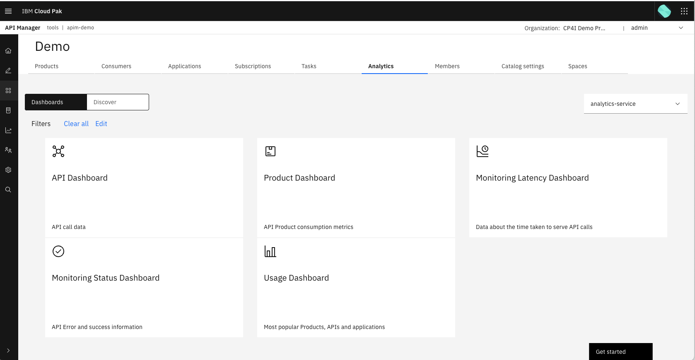
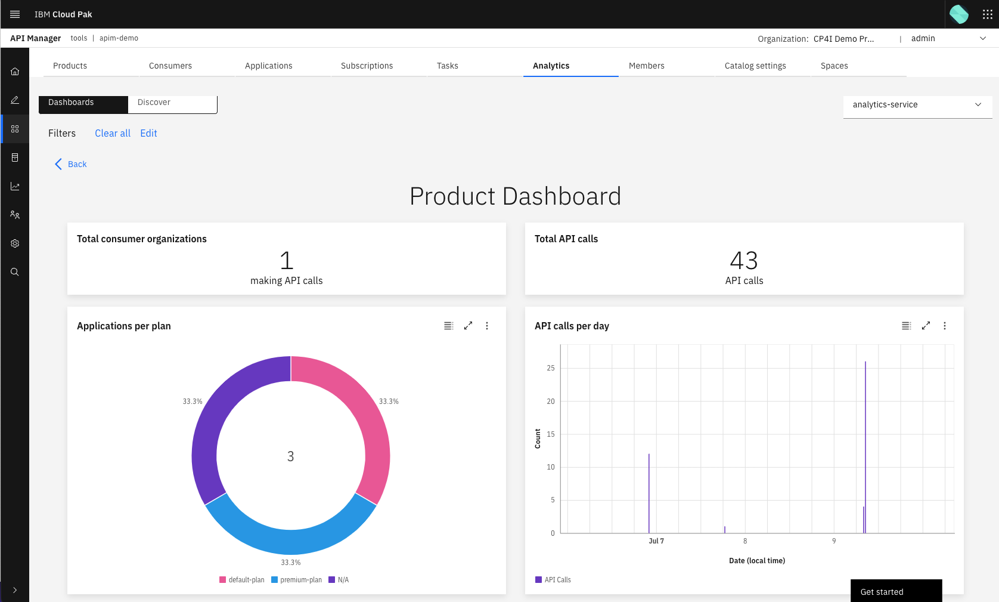
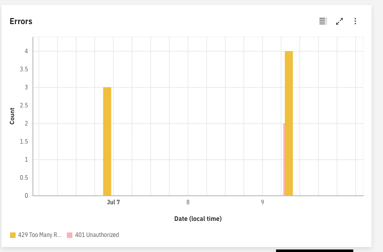
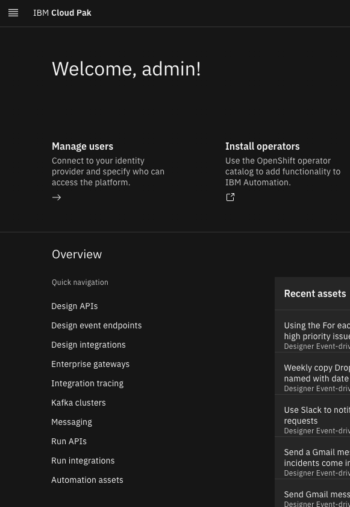
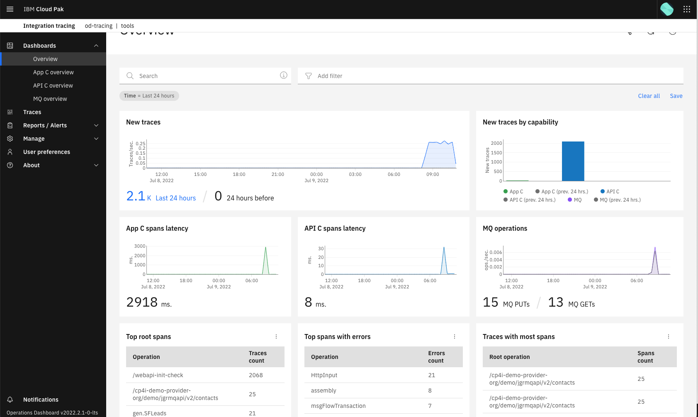
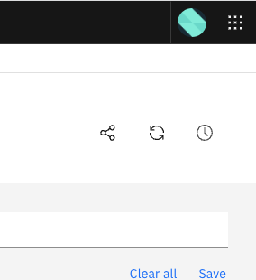
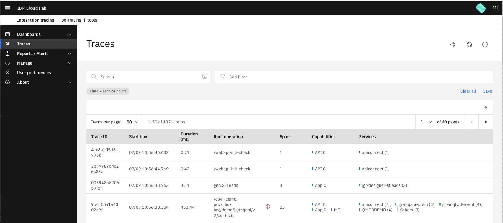
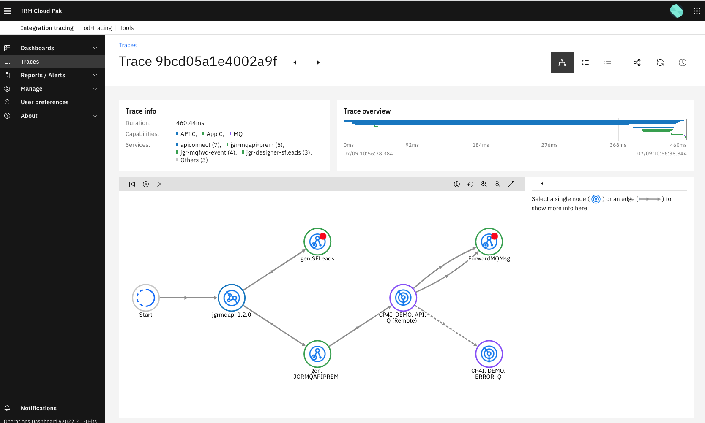

# Analyzing the usage of Your API

Personas played:

- **API Life Cycle Manager - Jason** logs into the API Manager as the *admin* user on this lab for simplicity.  In this section, Jason logs into the API Manager and view the analytics for the API to see how it has performed who Andre was using it.

## Navigate to the Analytics Portal

Login to the API manager using the admin user.

From the API Manger home page click **Manage Catalogs -> Demo catalog -> Analytics**.

Observe the available dashboards.

{ style='height: auto;width: 90%;'}

## Look at the Available Dashboards

Select the `Product Dashboard`.

!!! Note
    This dashboard provides useful information such as the number of Consumer Organizations using the API Product, the number of applications using the product and what plan they are using, plus the number of API calls.

{ style='height: auto;width: 90%;'}

Click **Back**, then select the `API Dashboard`. This dashboard also shows useful information, such as API response times, the status codes that have been returned and number of errors.

!!! Note 
    If you have exceeded the number of API requests allowed on the *default* plan, this will show in the errors.

{ style='height: auto;width: 90%;'}

Now click **Back** and explore the other dashboards.

## View with Operations Dashboard

View the overall end-to-end journey in the CP4I Operations Dashboard.  Navigate back to the Cloud Pak for Integration Platform UI (Navigator) - to do this you can click **IBM Cloud Pak** at the top-left of the screen.

On the left-hand side of the Platform UI, in the list under `Overview`, click **Integration Tracing**.

{ style='height: auto;width: 40%;'}

The Operations Dashboard will load.  If a license agreement displays accept this. If a `What's new` message displays click **x**.

The Overview page will be displayed. You will be able to see a variety of tracing information about `APIC`, `ACE` and `MQ`.

{ style='height: auto;width: 90%;'}

On the left-hand side of the screen, click **Traces**. A series of traces will display.  A lot of them will be from the API Connect Healthcheck `/webapi-init-check` - this is a default behavior and is not from your application.

Submit another request to the `Premium` plan API in SoapUI.  Then click the refresh button on the top right of the `Traces` screen.

{ style='height: auto;width: 30%;'}

After 1-2 refreshes you should see a trace that lists multiple components (bottom line in the below image).  If you only see API Connect in the trace refresh again.

{ style='height: auto;width: 90%;'}

Click on the trace with the multiple components.  You will see a diagram showing the journey of your request. 

??? Question "Errors?"
    Do you see some errors?  These are expected errors that we have left in the demo deliberately!

{ style='height: auto;width: 90%;'}

From here you can continue to explore the options on the CP4I Dashboard.

**You have now completed the API Connect Labs**