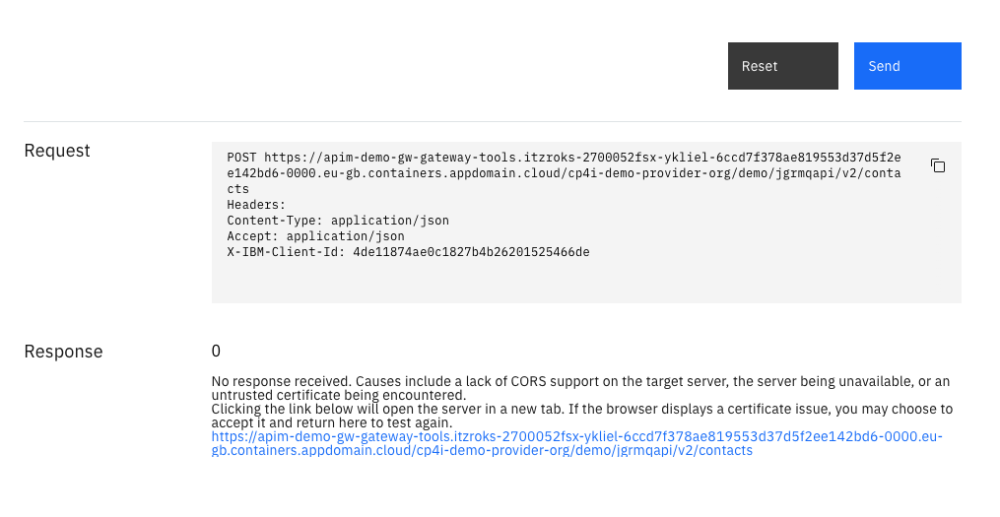

# Consuming our new API

Personas played:


- `Cloud Manager` - 'Will' - logs into the API Manager as the *admin* user on this lab for simplicity


- `Community Manager` - 'Marsha' - logs into the Developer Portal as *admin* user on this lab for simplicity


- `API Life Cycle Manager` - Jason - logs into the API Manager as the *admin* user on this lab for simplicity


- `App Developer` - Andre - logs into the Developer Portal as `andre_integration`

In this section, as the **Cloud Manager** - Will, you will setup a `Developer Portal` for Marsha and Andre to login to, so that Marsha can manage the developer community and so that Andre can subscribe to API Products and start using Shavon's API in a well-managed and governed way.

You will then proceed to use and test the API as Andre the **App Developer**.

We will see that for our `Default` plan the `API Life Cycle Manager` persona, Jason, does not approve the subscription made by Andre. For the `Premium` subscription you will see that Jason does need to approve Andre's subscription.  

## Create the Developer Portal for the *Demo* API Catalog

In this section we will:

- As the **API Life Cycle Manager**, Jason, create a Developer Portal for the `Demo` Catalog - API consumers (App Developers like Andre) will be able to log into here and use the APIs in a well governed and managed way
- As the **Community Manager**, Marsha, accept an invitation to login to the Developer Portal
- As the **API Life Cycle Manager** - Jason, setup a `Consumer Organization` or `cOrg` and define a member of the `cOrg` for Andre called `andre_integration`
- As Andre, login to the Developer Portal

!!! Note 
    In this lab several of the personas are using the `admin` user. This reduces the number of logins we need to use for this lab. In real life each persona would have their own login, normally backed by LDAP.

### Create the Developer Portal (playing part of Jason API Life Cycle Manager)

Navigate back to the API Manager Homepage by Clicking on the `Home` icon in the top-left corner of the screen.

Next click on **Manage catalogs**.

Click on the tile for your `Demo` catalog.

On the `Catalog settings` tab in the catalog, select `Portal` and **create** to create the Portal application developers will use to access the APIs in the catalog.

{ style='height: auto;width: 90%;'}

The `Create portal` page is displayed. Select the following options:

- **Select the portal service to use for this catalog** : `portal-service`
- **URL** : select the option in the list `https://apim-demo-ptl-portal-web-tools.<your-ocp-cluster>.appdomain.cloud/cp4i-demo-provider-org/demo`

{ style='height: auto;width: 90%;'}

Click **Create**.

A message is displayed explaining that the Developer Portal is being provisioned.

{ style='height: auto;width: 90%;'}

### Accept the invitation to the Developer Portal (playing part of Marsha the Community Manager)

Check Mailtrap and use the link to login to the portal as the administrator.

{ style='height: auto;width: 90%;'}

You will be asked to change the `cOrg` administrator password. Specify `IntegrationIsFun21!`

You will then be logged into the Developer Portal as the `admin` user.

{ style='height: auto;width: 90%;'}

You will see that you have the `JGRMQAPI Product 1.2.0` product available. Click on this, then click on the API to get to the overview page.

Click **POST /contacts > Try it > Register an application to test this API**

You will then be given a permission denied error. This is because `cOrg` admins cannot consume the APIs (due to separations of responsibility), instead you must add a member to the cOrg who can do this.

{ style='height: auto;width: 90%;'}

### Create Consumer Organization in the API Manager (playing part of Jason API Life Cycle Manager)

In this step we will:

- Return to the API Manager, as the `admin admin` user
- Navigate to the `Demo` catalog
- Create a new ***Consumer Organization*** or ***cOrg***
- Invite an API Consumer - Andre to the `cOrg`

Login to the API Manager as the `admin` user. Navigate back to the API Manager Homepage by Clicking on the `Home` icon in the top-left corner of the screen.

Click on **Manage Catalogs > Demo > Consumers**. Then click `Add` and select **Create organization**.

{ style='height: auto;width: 90%;'}

The `Create consumer organization` page will load.

Specify the following details:

- **Title** : `DemoOrg-Sales`
- **User registry** : `Demo Catalog User Registry`
- **Type of user** : select `New user`
- **Username** : `andre_integration`
- **Email** : `andre.integration@cp4i.demo.net`
- **First name** : `Andre`
- **Last name** : `Integration`
- **Password** : `IntegrationIsFun21!`
- **Confirm Password** : `IntegrationIsFun21!`

Click **Create**. The `Consumers` page for the `Demo` Catalog will now show with the `DemoOrg-Sales` consumer organization showing.

You will see it has no subscriptions.

{ style='height: auto;width: 90%;'}

Now let's login to the Developer Portal as Andre Application Developer. Go to your private browser where you had the Developer Portal open. If you are still signed in as `admin` the logout (top-right of the screen).

You should be at the sign-in page. Add in Andre's login details as shown below:

{ style='height: auto;width: 90%;'}

When you login for the first time you will be asked to create an application, click **Cancel** (we will come back to that).

The Developer Portal homepage is displayed.

Note the following:

1. In the top banner you can review `API Products` and `Apps` + you can add blogs, start a forum and seek support (faqs).
2. In the top-right the name of the `Consumer Organization` is displayed: `DemoOrg-Sales`
3. In the top-right the user details for Andre can be displayed by clicking `A`
4. In the middle of the screen you will see the `JGRMQAPI Product 1.2.0` API Product is displayed.

{ style='height: auto;width: 90%;'}

## Create an Application and subscribe to the API on the Default Plan

Click on the `JGRMQAPI Product 1.2.0` API Product. Information about the product the API will be displayed, along with two 'plans':
  a. Default Plan - allows 5 calls per minute
  b. Premium Plan - allows 600 calls per hour

{ style='height: auto;width: 90%;'}

Select **Default Plan**

Click **Create Application** and give it the name `mqapi-default-dev001`. Optionally, add a Description. Click **Save**.

{ style='height: auto;width: 90%;'}

!!! Note "IMPORTANT" 
    An API key will display!  Copy the API Key and secret and keep this in a text file - it is only displayed once!

{ style='height: auto;width: 90%;'}

Once you have safely copied the API Key and Secret, click **x**. Your new application is displayed on the left hand side of the screen. Click on the new Application.

You will then be asked to Subscribe to the API on behalf of the Application - the subscription is the object that controls which APIs your (Application's) API key and Secret give you access to. To do this, click **Next**.

{ style='height: auto;width: 90%;'}

A screen displays saying 'Subscription Complete'. Click **Done**.

## Test the API on the Default plan

At the top of the screen click **Apps**. Your application is displayed - click on it to display the application dashboard will be displayed (you can see some API analytics here after the API has been used)

Click **Subscriptions**. At the bottom of the screen the 'Product subscriptions' list will show.

{ style='height: auto;width: 90%;'}


Click on the 'JGRMQAPI Product (1.2.0)' API Product. The API displays with the plans once more.
Click on the **API**. The API Overview page displays.

{ style='height: auto;width: 90%;'}

Click on **POST /contacts**. The details screen displays and shows the API parameters and example requests.

Click on the **Try it** tab near the top of the screen. A testing page then displays.  Note:  The API key is populated for you here.

{ style='height: auto;width: 90%;'}

Scroll down to the `Body` field in the `Parameters` section.  Click **Generate** to create an example message body.

It will look similar to the following:
```sh
  {
  "metadata": {
    "code": "tazawewjiolualaa"
  },
  "payload": {
    "id": "4378063097823232",
    "fname": "Derek",
    "lname": "Cognome",
    "email": "ekabakun@fuw.ws",
    "phone": "(755) 811-5225",
    "company": "newat",
    "comments": "gaakuzikigi"
  }
}
```

{ style='height: auto;width: 90%;'}

Click **Send**.  If a `CORS` error appears, click the link (this opens a new tab and accepts the insecure connection.  If you are working on Chrome you might have to type `thisisunsafe` in the window to accept the certificate exception and try again.

{ style='height: auto;width: 90%;'}

You should get a response that looks like this:
```sh
{
    "response": {
        "code": "CP4I0000",
        "msg": "Request has been processed.",
        "time": "2022-07-06T21:04:51.362Z"
    },
    "payload": {
        "id": "00Q8d000005LTLTEA4",
        "fname": "Timothy",
        "lname": "Storey",
        "email": "vuhnizu@fozalnu.me",
        "phone": "(951) 981-5174",
        "company": "nodiffivwadekiz",
        "comments": "wesazaazesoba"
    }
}
```

{ style='height: auto;width: 90%;'}

Check Salesforce for your new contact!

- On the top banner in Salesforce click the down arrow next to **Leads**
- Your new contact should be in the list. Click on the contact to see the details on the *Details* tab and check they match the response in the developer portal.

!!! Note
    For face to face sessions your instructors may be providing a shared SalesForce instance, if so please check with them that your lead has arrived. To avoid confusion, try changing the name of your lead to something recognizable.

Test the application in a test harness of your choice, for example SOAP UI remembering to set the following headers:
- **X-IBM-Client-Id** : <your API Key you saved earlier>
- **accept** : `application/json`
- **content-type** : `application/json`

{ style='height: auto;width: 90%;'}

Make multiple requests in quick succession and see that the API is rate limited - you will get a message like this:
```sh
{
   "httpCode": "429",
   "httpMessage": "Too Many Requests",
   "moreInformation": "Assembly Rate Limit exceeded"
}
```

{ style='height: auto;width: 90%;'}

## Create a new Application and subscribe to the API on the Premium Plan

Return to the Developer Portal. At the top of the screen click **Apps**, then click **Create new app**.

Give the application the title `mqapi-premium-dev001`. Optionally, add a description and click **Save**.

{ style='height: auto;width: 90%;'}

!!! Note "IMPORTANT" 
    Copy the API Key and secret and keep this in a text file - it is only displayed once!

Once you have safely copied the API Key and Secret, click **OK**.  Your new application is displayed on the left hand side of the screen
Under `Product subscriptions` you will see that the application is currently not subscribed to anything.  Click on 'Why not browse the available APIs?'. The API Products Page displays.

Click on the **JGRMQAPI Product 1.2.0** Product.  The APIs and Plans are displayed

{ style='height: auto;width: 90%;'}

On the `Premium Plan` click **Select**. The `MQAPI-SF12-PREMIUM` application is shown on screen, as it is not currently subscribed to the API and is therefore available to subscribe.

{ style='height: auto;width: 90%;'}

Click on the **MQAPI-SF12-PREMIUM** application. The `Confirm Subscription` page is shown. Verify that the Premium Plan is showing in the list and click **Next**.

The `Subscription Complete` page is shown. Click **Done**.

Click on the new **MQAPI-SF12-PREMIUM** Application.

## Approve the subscription of the `MQAPI-SF12-PREMIUM` application to the Premium Plan in the API Manager (playing part of Jason the API Lifecyle Manager)

For the Premium Plan, subcriptions must be approved by the owner of the `Provider Organisation`. The shows how providers can control who can and cannot use our APIs.

Return to the API Manager (follow the steps in the section `Log into the API Manager Console` if you have lost this tab) and navigate to `Manage Catalogs` > `Demo` > `Applications`


Click *Subscriptions* in the top banner. The list of Subscriptions is displayed and you will see that the `MQAPI-SF12-PREMIUM` product has a subscription in the *pending* state.


To approve the subscription, click on *Tasks* in the top banner. A task is displayed: `Subscription approval task for subscription of jgrmqapi-product:1.2.0 (Premium Plan) requested by Andre Integration (andre_integration)`


Click on the three dots on the right hand side and click *Approve*. The task will disappear from the list.


Return to the 'Subscriptions' tab and you will observe that the subscription for the `MQAPI-SF12-PREMIUM` application is now in state *enabled*.


## Test the API

Test the API on the Premium plan (playing part of Andre the Application Developer).  Return to the Developer Portal where you are logged in as `andre_integration`.  At the top of the screen click **Apps**. The new `mqapi-premium-dev001` application will be displayed - click on it.

Click **Subscriptions**. At the bottom of the screen the 'Product subscriptions' list will show.  Click on the **JGRMQAPI Product (1.2.0)** API Product.  The API displays with the plans once more.

Click on the API. The API Overview page is displayed.  Continue on to test the application like you did in the previous [Test the API on the Default plan](#Test-the-API-on-the-Default-plan) section.

- Test it in the 'Try it' section under `POST /contacts`
- Be sure to select the API Key for `mqapi-premium-dev001` in the `Security` section

  { style='height: auto;width: 90%;'}

-  Test it SoapUI or test harness of your choice - make sure to use the correct API Key!
-  Observe that with this subscription you are on the `Premium Plan` and can there make many requests and will not get throttled (unless you do more than 600 requests in one hour).

{ style='height: auto;width: 90%;'}


