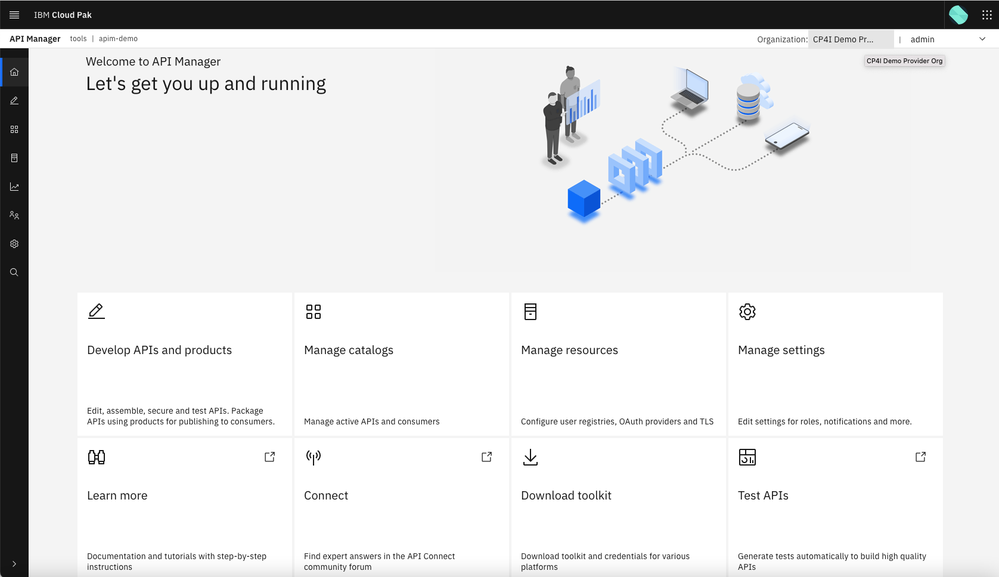
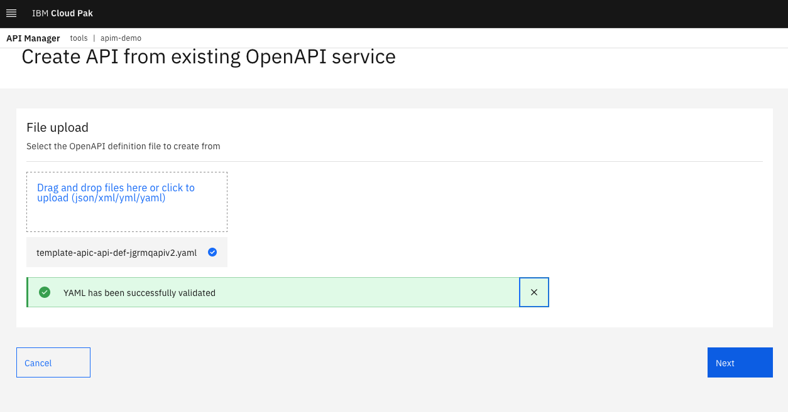
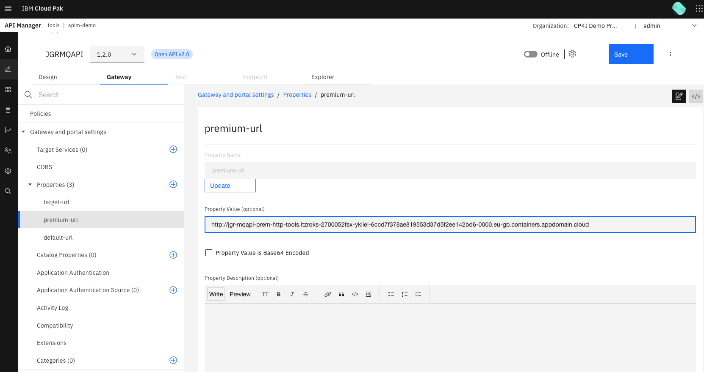
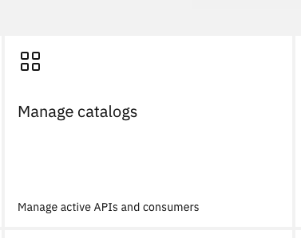
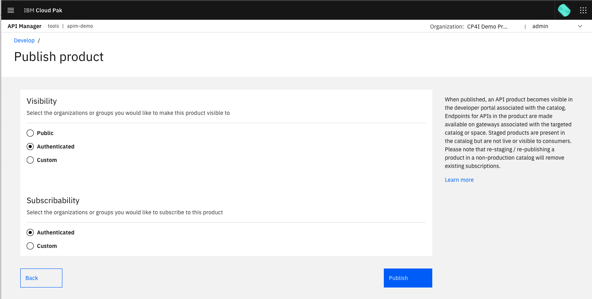

# API Connect API Development


In this lab you will be preparing APIC for API development in following exercises.  The API will call the App Connect micro-services we created in a previous ACE exercise.  You will then consume the API via a **Developer Portal** and observe the results.

As part of this exercise you will work though developing your API.

## Developing our API

Personas played:


**Cloud Manager - Will** - logs into the API Manager as the *admin* user on this lab for simplicity


**API Developer - Shavon** - logs into the API Manager Portal as the *admin* user on this lab for simplicity

In this section Shavon, the API Developer, will develop the API in the API Manager.

### Setup the Provider Organisation (pOrg) as Will the Cloud Manager

=== "Manual setup of the pOrg"
    We need to create a Provider Organisation or *pOrg* to organise the APIs that we will make available to consumers on API Connect.  We will create a *pOrg* called `cp4i-demo-org` and set the `admin admin` user as the Owner.
    To complete this log into the `Cloud Manager` UI as the `Plaform Nav` admin user (you will be logged in from the previous steps).
    Follow these [Creating a provider organization](https://www.ibm.com/docs/en/api-connect/10.0.x?topic=organizations-creating-provider-organization) instructions.
    
    There are two options in these instructions.
    
    { style='height: auto;width: 90%;'}
    
    We used option 2: `Add > Create Organization`. Specify the following information in the form:

    - `Title`: `CP4I Demo Provider Org`
    - `User Registry`: Select `Common Services User Registry`
    - Type of user: Slect `Existing`
    - `Username`: `admin`
    
    { style='height: auto;width: 90%;'}
    
    Click **Create**
    
    The `Provider organizations` page is displayed and you will see the new *pOrg* in the list.
    
    { style='height: auto;width: 90%;'}
=== "Automated setup of the pOrg with script 04-apic-new-porg.sh"
     ```sh
    export MAILTRAP_USER=<my-mailtrap-user>
    export MAILTRAP_PWD=<my-mailtrap-pwd>
    scripts/04-apic-new-porg.sh
    ```
    This script performs the following steps:
    
    1. Logs into API Connect using the *apic* client on your workstation, with the Cloud Management Console Admin User and Password
    2. Creates a *Provider Organisation* for the *admin* user

## Develop and publish our API as Shavon the API Developer

In this section you will:

- Login to the API Manager
- Import, review and test our API
- Create an API Product to host our API
- Publish our API Product

### Log into the API Manager

1. Login to the Automation Foundation
    
    From the platform navigator, under **API lifecycle management**, right click on **apim-demo** and open in a private browser tab.
    
    !!! Note
        When working with API Connect it is useful to open up the **Cloud Manager** and **API Manager** in separate private browser tabs.
    
    Accept the security exceptions (on Chrome you might have to type in 'thisisunsafe' to achieve this).
    
    Choose the *IBM provided credentials (admin only)* option to login.  This allows you to login to the IBM Automation foundation with the default `admin` account. This can be found in the `tools` project under `workloads` > `secrets` > `ibm-iam-bindinfo-platform-auth-idp-credentials`  
    Alternatively run the following `oc` commands to get the credentials:

    ```sh
    oc get secret ibm-iam-bindinfo-platform-auth-idp-credentials -n tools -o jsonpath="{.data.admin_username}"| base64 -d
    oc get secret ibm-iam-bindinfo-platform-auth-idp-credentials -n tools -o jsonpath="{.data.admin_password}"| base64 -d
    ```

    Once you login to Automation Foundation, the API Manager Login page will display.

2. Login to the API Manager Console and select the option **Common Services User Registry**. You will be automatically logged into the API manager.

3. Validate that you are in the new Provider Organization, as the admin user
    
    At the top right hand side of the screen hover over the text to right of **Organization:**, it should display the text **CP4I Demo Provider Org**
    
    { style='height: auto;width: 90%;'}
    
    To the right of the Provider Org, you will see that you are logged in as *admin*. You can expand the list and can click on `My account` to see more information.

### Get the API endpoints from App Connect Enterprise (ACE)

Our API will have three possible endpoints:

1. The 'TARGET_URL' which points to our App Connect Designer instance `jgr-designer-sfleads`
2. The 'PREMIUM_URL' which points to our ACE instance `jgr-mqapi-prem` - this will be exposed on an API *Plan* with 600 calls allowed per hour
3. The 'DEFAULT_URL' which points to our ACE instance `jgr-mqapi-dflt` - this will be exposed on an API *Plan* with 5 calls allowed per minute

To get the required URLS run the following commands in a terminal window, where you are logged into the OCP cluster:

```sh
touch appconnurls.txt
echo TARGET_URL is: $(oc get integrationserver jgr-designer-sfleads -n tools -o jsonpath='{.status.endpoints[0].uri}')'/SFLeads/lead' >> appconnurls.txt
echo PREMIUM_URL is: $(oc get integrationserver jgr-mqapi-prem -n tools -o jsonpath='{.status.endpoints[0].uri}') >> appconnurls.txt
echo DEFAULT_URL is: $(oc get integrationserver jgr-mqapi-dflt -n tools -o jsonpath='{.status.endpoints[0].uri}') >> appconnurls.txt
cat appconnurls.txt
rm appconnurls.txt ;
```

!!! Note "TARGET_URL"
    We are currently using the Sales Force URL use this value instead: http://jgr-designer-sfleads-http-tools.jgrocp410cp4i20221-dcd557ed086a97d77c2297a53c025612-0000.us-south.containers.appdomain.cloud/SFLeads/
    For the other two URLs, if your above script does not return a URL, you may not have deployed the BAR file from the earlier MQ message flow lab.  This lab expects you have deployed that BAR twice.  Once to an integration server `jgr-mqapi-prem` and second to an integration server `jgr-mqapi-dflt`.

### Import our API definition to API Connect

On the **API Manager** Home Page, select the `Develop APIs and products` tile on the home page or the `Develop` icon on the left menu.

{ style='height: auto;width: 30%;'}

Select **Add > API(from REST, GraphQL or SOAP)** from the top right.

{ style='height: auto;width: 40%;'}

Use the `jgrmqapiv2` OpenAPI (Swagger) document in the `templates` part of the repository you cloned in a previous exercise: `template-apic-api-def-jgrmqapiv2.yaml` (found in the <repo route>/templates/template-apic-api-def-jgrmqapiv2.yaml) to define the API by selecting **Create > From existing OpenAPI service > Next**.

{ style='height: auto;width: 50%;'}

Next drag the templates/template-apic-api-def-jgrmqapiv2.yaml document into the `File upload` box and select `Next`.

{ style='height: auto;width: 90%;'}

Review the details and select `Next`.

{ style='height: auto;width: 90%;'}

The `Secure` page is displayed. Ensure the following are selected
- `Secure using Client ID`
- `CORS`

{ style='height: auto;width: 90%;'}

Select **Next**.  The output of the API definition should inidicate that it was successfully generated and security applied.  

{ style='height: auto;width: 70%;'}

Choose **Edit API**

The `Design` tab opens for the API.

In the `Security Schemes` section a `clientID` scheme of type `apiKey` has been added.

{ style='height: auto;width: 90%;'}

In the **General > Security** section, the scheme is shown as mandatory meaning a valid `clientID` is required to be passed whenever the API is called.

{ style='height: auto;width: 90%;'}

### Update the API backend URLS

In the top banner click `Gateway`, then, in the left-hand side, expand `Properties`.  You will see that three url properties are listed:

- target-url
- premium-url
- default-url

{ style='height: auto;width: 90%;'}

Click on each of these and add the corresponding URLs from the `Get the API endpoints from App Connect Enterprise (ACE)` section to the `Property Value (optional)` field.

Target URL:

{ style='height: auto;width: 90%;'}

Premium URL:

{ style='height: auto;width: 90%;'}

Default URL:

{ style='height: auto;width: 90%;'}

Click `Save`

### Build the API Policy

The API Connect Designer gives us the ability to build *Gateway Policies* which are executed on each API request. This allows us to add in elements to the API definition that are [IBM extensions to the OpenAPI specification](https://www.ibm.com/docs/en/api-connect/10.0.5.x_lts?topic=file-extensions-openapi-specification).

We will use the lo-code [assembly editor](https://www.ibm.com/docs/en/api-connect/10.0.5.x_lts?topic=assembly-editor) to build out our policy to look like the below:

{ style='height: auto;width: 90%;'}

The completed Gateway Policy will have:

- 1 x Parse element
- 1 x set-varible element
- 2 x switch elements
- 2 x gatewayscript element
- 3 x invoke element

The above elements are documented in [this API Connect Documentation](https://www.ibm.com/docs/en/api-connect/10.0.5.x_lts?topic=specification-execute).


To start with your policy will look like the below image.  On the left-hand side, you will see that there is a canvas with a single `invoke` element. On the right-hand side you will see a 'palette' of various elements.

{ style='height: auto;width: 70%;'}

1. Delete the existing **Invoke** element:
    You will add other `Invoke` elements later, the default one is not needed.
    
    Hover over the Invoke element and a delete icon will appear in the top right corner (looks like a trash can). Click this icon.
    
    { style='height: auto;width: 50%;'}
    
    You will then have a blank canvas like this:
    
    { style='height: auto;width: 60%;'}


2. Add the ***Parse*** element:
    To add an element you click on it and drag it onto the canvas.
    
    The `Parse` element is in the `Transforms` section of the palette:
    
    { style='height: auto;width: 60%;'}
    
    Click and drag the `Parse` element onto the canvas.  When you do this you will see a small square box display on the line in the top left of the canvas. Drop the `Parse` element onto this square.
    
    The result will look similar to the following:
    
    { style='height: auto;width: 60%;'}
    
    !!! Note 
        For this `Parse` element, no further information needs to be configured on the right hand side.
        
    Click **Save**.

3. Add the **set-variable** element from the `Policies` section of the palette: 
    Drag and drop the `set-variable` element to be to the right of the `Parse` element.
    On the right hand side, a menu will display where you can configure this element.  You will use this to add two actions.
    
    Add the first action. Click **Add action** and set the following attributes:
    - **Action**: `Set`
    - **Set**: `my-path`
    - **Type**: `string`
    - **Value**: `/jgrmqapi/v1/contacts`
    
    Add the second action. Click `Add action` and set the following attributes:
    - **Action**: `Set`
    - **Set**: `my-mb`
    - **Type**: `any`
    - **Value**: `$(message.body)`
    
    { style='height: auto;width: 90%;'}
    
    Click **Save**.
    
    The `set-variable` has prepared us for the next element, a `Switch`.

4. Add a **Switch** element:
    This is found in the `Logic` section of the palette.  Drag the `Switch` element onto the canvas and drop it to the right of the `set-variable` element.
    
    It should look like this:
    
    { style='height: auto;width: 90%;'}
    
    On the right-hand side of the screen, add the following string into the `Condition` field in the `Case 0` section:
    
    ```sh
    message.body.metadata.code="TEST"
    ```
    Next, click `Add Otherwise`. You will end up with a configuration similar to the picture below:
    
    { style='height: auto;width: 90%;'}
    
    Click `Save`.

5. Add a **gatewayscript** element to the canvas on the **otherwise** condition:

    In the event that the condition is not met (ie: we have not set "TEST"), then we will call a `GatewayScript`.
    
    The `GatewayScript` element can be found in the `Policies` section of the palette. Drag and drop a `GatewayScript` element onto the line below `Otherwise` (see picture below).
    
    In the panel on the right-hand side, there is a text editor box for your code. Copy / Paste this code into the text box:
    
    ```sh
    var apim = require('apim');
    var mb = apim.getvariable('message.body.payload');
    apim.setvariable('message.body', mb);
    apim.output('application/json');
    ```
    
    It should look similar to the following:
    
    { style='height: auto;width: 70%;'}
    
    !!! Note 
        The warning message is expected on this demo and does not affect the operation of the API.
    Click **Save**.

6. Add an **Invoke** element to the canvas on the **otherwise** condition:
    The `Invoke` element can be found in the `Policies` section of the palette. Drag and drop this on the canvas, to the right of the `GatewayScript` you just added.
    
    Configure the `Invoke` element with the following details:
    
    !!! Note
        If the parameter is not mention it does not need to be changed from the default setting.
    
    - **Title**: `invoke-designer`
    - **URL**: `$(target-url)`
    - **Inject proxy headers**: `selected`
    - **Persistent Connection**: `selected`
    - **Allow chunked uploads**: `de-selected`
    - **Header control**: Select `Blocklist`
    - Click `Add blocklist` and enter `^X-IBM-Client-Id$` in the field that appears
    - **Parameter control**: Select `Blocklist`
    - **Response object variable**: `sf-lead`
    - **Stop on error**: `de-selected`
    
    { style='height: auto;width: 90%;'}

7. Add a second `GatewayScript` on the  **otherwise** condition:
    
    Drag and drop a `GatewayScript` element onto the `Otherwise` condition, to the right of the `invoke-designer` element.
    
    On the right-hand side, copy the below code and paste it into the text editor box:
    ```sh
    var apim = require('apim');
    var mb = apim.getvariable('my-mb');
    var sf = apim.getvariable('sf-lead.body');
    mb.payload.id = sf.id;
    apim.setvariable('message.body', mb);
    apim.output('application/json');
    ```
    
    It should look like this:
    
    { style='height: auto;width: 90%;'}
    
    !!! Note 
        The warning message is expected on this demo and does not affect the operation of the API.
    
8. Add a second **Switch** element to the left of the **Output Node**:
    The end of our flow is represented on thr right hand side of the canvas with a circular icon containing a flag, as shown in the below image:
    
    { style='height: auto;width: 40%;'}
    
    Drag and drop a `Switch` element onto the canvas to the left of the `Output Node`.  See the picture below to check the correct location.
    
    On the right-hand side of the screen add the following string into the `Condition` field in the `Case 0` section:
    
    ```sh
    plan.name="default-plan"
    ```
    
    Then click **Add Otherwise**.
    
    You will end up with a configuration looking like the picture below, showing a line for `plan.name="default-plan"` and a line for `Otherwise`:
    
    { style='height: auto;width: 90%;'}
    
    Click **Save**.

9. Add an **Invoke** on the **plan.name="default-plan"** line:
    Drag and drop an `Invoke` element onto the `plan.name="default-plan"` line. Configure this `Invoke` element with the following details:
    
    !!! Note
        If the parameter is not mention it does not need to be changed from the default setting.
    
    - **Title**: `invoke-default`
    - **URL**: `$(default-url)$(my-path)`
    - **Inject proxy headers**: `selected`
    - **Allow chunked uploads**: `de-selected`
    - **Persistent Connection**: `selected`
    - **Header control**: Select `Blocklist`
    - Click `Add blocklist` and enter `^X-IBM-Client-Id$` in the field that appears
    - **Parameter control**: Select `Blocklist`
    - **Stop on error**: `de-selected`
    
    The canvas should now look like this:
    
    { style='height: auto;width: 90%;'}
    
    Click **Save**.

10. Add an **Invoke** on the **Otherwise** line:
    
    Drag and drop an `Invoke` element onto the `plan.name="default-plan"` line. Configure this `Invoke` element with the following details:
    
    !!! Note 
        If the parameter is not mention it does not need to be changed from the default setting.

    - **Title** : `invoke-premium`
    - **URL** : `$(premium-url)$(my-path)`
    - **Inject proxy headers** : `selected`
    - **Allow chunked uploads** : `de-selected`
    - **Persistent Connection** : `selected`
    - **Header control** : Select `Blocklist`
    - Click `Add blocklist` and enter `^X-IBM-Client-Id$` in the field that appears
    - **Parameter control** : Select `Blocklist`
    - **Stop on error** : `de-selected`
    
    The canvas should now look like this:
    
    { style='height: auto;width: 70%;'}
    
    Click **Save**.

11. The completed flow will look like this:
    
    { style='height: auto;width: 90%;'}

### Use the API on the `Explorer`

1. Put the API online, this will deploy the API to the (DataPower) Gateway.
    At the top of the screen there is a selector which says `Offline`:
    
    { style='height: auto;width: 40%;'}
    
    Click on the selector and your API will be deployed and go `Online`.
    
    { style='height: auto;width: 40%;'}
    
2. Navigate to the `Explorer` panel and setup the test:
    
    In the banner click on `Explorer`, then click `POST /contacts`
    
    On the `postContacts` page click `Try it`
    
    In the drop down menu next to `POST` select the endpoint: `https://apim-demo-gw-gateway-tools.<your-ocp-cluster>.eu-gb.containers.appdomain.cloud/cp4i-demo-provider-org/sandbox/jgrmqapi/v2/contacts`
    
    Scroll down to the `Body` section and click `Generate`. API Connect will create sample test data for you.
    
    Click **Send**
    
    !!! Note "You might see the following message"
        You may see a message explaining that API Connect does not truest the certificate. Click on the provided link and accept the exception (if you are on Chrome you might have to type 'thisisunsafe').
    
    { style='height: auto;width: 90%;'}
    
    Upon a successful request you will see a `200 OK` message returned with a payload featuring a Salesforce ID:
    
    { style='height: auto;width: 90%;'}

    If you get an internal server `500` error go back and double check that all of your API elements are configured correctly.

!!! Note "Optional Step"
    Test the API in the **TEST** Panel
    
    Navigate to the `Test` panel and setup the request
    
    In the top banner click `Test`. The `Request` panel will be displayed.
    
    On the `Parameters` section you will see the request headers displayed, including a Client ID, `X-IBM-Client-Id`.
    
    { style='height: auto;width: 90%;'}
    
    On the `Body` panel you will see that an example message body has been populated. It should look something like this:
    
    ```sh
    {
      "metadata": {
        "code": "igdisenewel"
      },
      "payload": {
        "id": "6682892837060608",
        "fname": "Ricardo",
        "lname": "Sestini",
        "email": "wew@jo.nz",
        "phone": "(555) 819-9636",
        "company": "imidimpudw",
        "comments": "gudubj"
      }
    }
    ```
    If the `Body` is not populated copy and paste the above sample into the provided field.
    
    Send a test request message: Click **Send**
    
    If successful, the response should look like this:
    
    { style='height: auto;width: 90%;'}


### Import our API Product Definition to API Connect

Navigate back to the API Manager Homepage by Clicking on the **Home** icon in the top-left corner of the screen.

Click on `Develop APIs and Products`. You will see the `APIs` screen is displayed and you will see the `JGRMQAPI` API is listed.

{ style='height: auto;width: 90%;'}

Click **Products**. A blank list is displayed.

{ style='height: auto;width: 90%;'}

Click **Add** and select `Product`. Then select `Existing Product` and click **Next**.

Drag and drop artifacts/03-jgr-mqapi-product.yaml product from your file system to the box below `Import from file`.

{ style='height: auto;width: 90%;'}

Click **Next**.

On the `Publish` page leave `Publish product` un-ticked and click **Next**, then click **Done**. YOu will be taken back to the `Develop` screen, with the `APIs` listed.

Click **Products** and you will see `JGRMQAPI Product` is now listed.

{ style='height: auto;width: 90%;'}

Click on the `JGRMQAPI Product`. The `jgrmqapi-product` page is displayed.

{ style='height: auto;width: 90%;'}

On the `Design` tab there are a series of sections to review:

- **Product setup**: Allows us to set the title, version and description for the product
- **Visibility**: controls who can view and subscribe to the product. For this product subscribers and viewers must be authenticated to API Connect.
- **APIs**: we can see that the `JGRMQAPI` (which we just configured) is part of this product.
- **Plans**: plans control the way in which consumer applications can use the APIs in this product. This product has two plans defined: `default` and `premium`
    - You can click on the three dots on the right hand side of each plan and click `Edit`
    - You can then review the relative rate limits that are setup for each plan (you will need to scroll down)
    - To exit the `Edit plan` screen, click `Categories` on the left hand side
- **Categories**: these can be used to arrange the diaply of APIs within the product on the Developer Portal. This product does not configure anything here.

On the `Source` tab you can see the `yaml` representation of the API product.

## Create the ***Demo*** catalog and publish the API Product

### Create the ***Demo*** catalog - as Jason the API Lifecyle Manager

Navigate back to the API Manager Homepage by clicking on the **Home** icon in the top-left corner of the screen.

Next click on **Manage catalogs**.

{ style='height: auto;width: 90%;'}

The `Manage` page is displayed. Click on **Add**.

{ style='height: auto;width: 90%;'}

Follow these documents:

- [Creating and configuring Catalogs](https://www.ibm.com/docs/en/api-connect/10.0.x?topic=catalogs-creating-configuring)
- [Creating a consumer organization](https://www.ibm.com/docs/en/api-connect/10.0.x?topic=organizations-creating-consumer-organization) instructions

In summary do the following:

Create the catalog and set the owner.

- **Title**: `Demo`
- **Select user**: use the default value - `admin admin (admin), admin@cp4i.net`

Click **Create** and your catalog will be created and then be shown on the manage page.

### Publish the `JGRMQAPI` Product API Product*** to the `Demo` catalog - as Shavon the API Developer

Navigate back to the API Manager Homepage by Clicking on the **Home** icon in the top-left corner of the screen.

Click on **Develop APIs and Products**. You will see the `APIs` screen is displayed and you will see the `JGRMQAPI` API is listed.

Click on **Products**. The `JGRMQAPI Product API Product` is displayed.

Click on the three dots on the right-hand side and then click **Publish**.

{ style='height: auto;width: 90%;'}

The `Publish Product` screen will then display. Make sure that the following values are set:

- **Publish to (this is the catalog)** : `Demo`
- **Preserve subscription** : `de-selected`

{ style='height: auto;width: 90%;'}

Click **Next**. The `Visibility` screen will display. Make sure that `Authenticated` is set for both `Visibility` and `Subscribability`.

{ style='height: auto;width: 90%;'}

Click **Publish**. A notification will pop up in the top-right of the screen informing you that the product successfully published.

Next, check the `Demo` catalog to see that the product is now reporting as published.

Click **Home > Manage Catalogs > Demo > Products**. The `JGRMQAPI Product API Product` will show in the list with state `Published`. It will show that it has two plans (the `Default` and `Premium` plans we saw when we imported the product).

{ style='height: auto;width: 90%;'}

### Automated setup of API creation and product publication via the 09-apic-publish-api.sh Script

This script will perform the following actions:

1. Login to the API manager using the `admin` user
2. Retrieve a series of values from the API Manager to facilitate API publication
    a. You will need to follow the prompt to open the url in your browser
    b. Login to API Connect using the `ibm-iam-bindinfo-platform-auth-idp-credentials`
    c. Copy the CliedID and paste it back into the terminal, then press `enter`
3. Create a `Swagger` (API specification) file for the `jgrmqapi` API using the template `templates/template-apic-api-def-jgrmqapiv2.yaml`    
    a. See the target URLs are updated in lines 124-128
4. Publish the API in `draft` state
5. Publishes a corresponding `API Product` in `draft` state, with the `jgrmqapi` API added to the product
6. Creates a new `Demo` API Catalog
7. Enables the creation of a `Developer Portal` for the Demo Catalog - this portal is where application developers can login to use APIs.
    a. **Note:** this is not actually created by the script, just the setting to *enable* you to create one later is done.
8. Publishes the `jgrmqapi` API to the Demo Catalog

