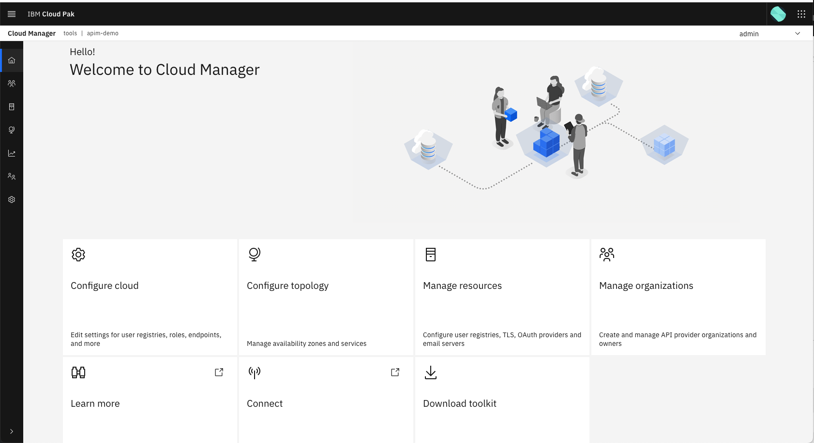
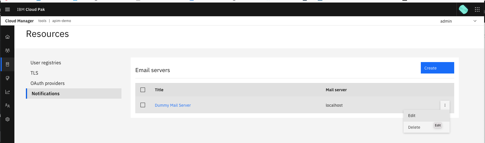
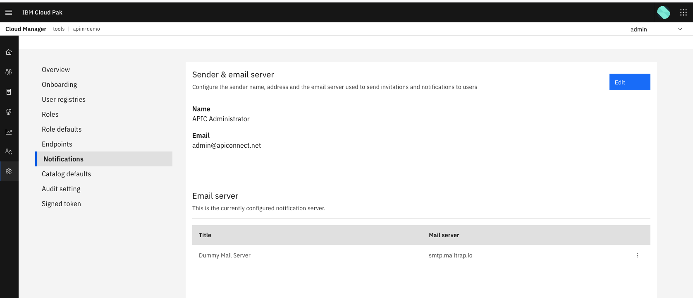
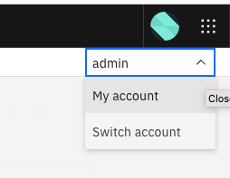
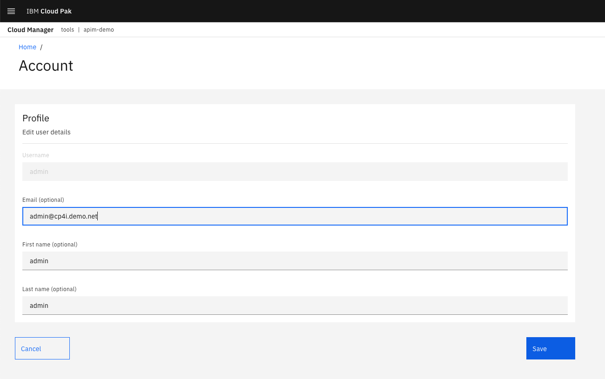
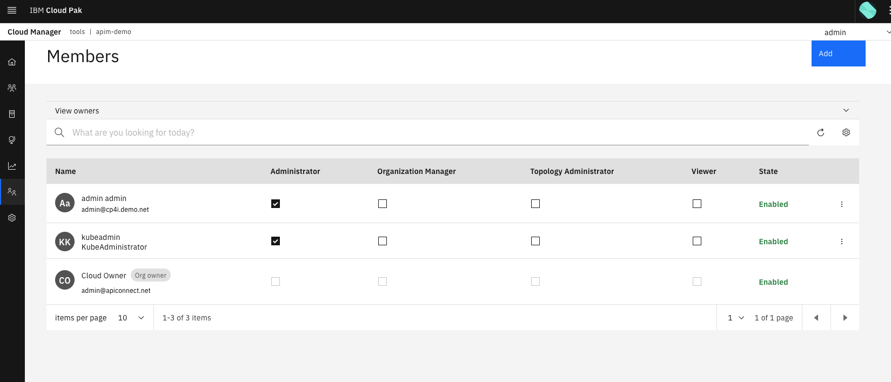

# Preparing for APIC Development

In this lab you will be preparing APIC for API development in following exercises.  The API will call the App Connect micro-services we created in a previous ACE exercise.  You will then consume the API via a **Developer Portal** and observe the results.

As part of this lab you will work though the following topics:

- Pre-reqs and setup
- Setting up API Connect in the Cloud Manager

For some of the steps there is a scripted option to do the configuration, however in this lab you will use the manual procedure, as this is the best way to learn API Connect (APIC).

!!! Note
    You are strongly encouraged to download a copy of the [API Connect White Paper](https://community.ibm.com/HigherLogic/System/DownloadDocumentFile.ashx?DocumentFileKey=ad1a8ba0-1515-f9a9-179d-4904f28eade2). This is one of the most authoritative sources of information on how API Connect works and it was created by IBMers who have implemented API Connect at a variety of customers over many years.

## Personas for API Connect

!!! Note
    In this exercise you will be be playing the part of several personas who are involved in API Management.  At your customers the exact roles might be different.  The roles you will use here are sourced from the [API Connect White Paper](https://community.ibm.com/HigherLogic/System/DownloadDocumentFile.ashx?DocumentFileKey=ad1a8ba0-1515-f9a9-179d-4904f28eade2)

 **Shavon, the API Developer** is in charge of API development for her organization.  Her focus is understanding data, services, and information needed from an API and then building out that API based upon those requirements. Eventually, her role is in charge of publishing it to testing, staging, and production environments.

 **Jason, the API Lifecycle Manager** is the lead for the line of business that Shavon works on.  He works with Shavon on API requirements and then reviews and manages the approval of new APIs or updates to APIs in the production environments.

 **Steve, the Provider Organization Owner** is in charge of coordinating the delivery of APIs across multiple lines of business and development groups.  Making sure each group has the resources that they need and that they are publishing their APIs to the appropriate environments.

 **Will, the Cloud Manager** is in charge of the IT administration at his organization.  He works with his team to deploy the API Connect software, configure the API Connect cloud, and then delegates to Steve access to the resources Steve needs to get the API initiative off the ground.

 **Marsha, the Community Manager** is in charge of Application developer success for her organization.  She focuses on making the API portal as straight forward as possible, monitors and manages the API consumer groups.

 **Andre, the Application Developer** is in charge of building out new applications and web services for his organization.  To do this, he needs to consume APIs.  He navigates to the API Developer Portal in order to register his application and consume the APIs needed to build out his app.

!!! DANGER "Critical Hot Tip about API Connect Browser Windows"
    In this API Connect Lab there are three separate UIs that you will login to on the API Connect product:
    
    1. **Cloud Manager** Console:  The **Cloud Manager** enables a Cloud Administrator, like Will, to define, manage, and monitor the API Connect instance.
    2. **API Manager** UI:  The *API Manager* is the interface used by the *providers* of APIs - for example a developer of a backend REST API, such as Andre, would use the **API Manager** to develop and publish their API
    3. The **Developer Portal**:  The *Developer Portal* is used by *consumers* of APIs, such as developers of front end applications, that need to use an API that has been published (like Andre), or third parties that wish to use an organization's externally available APIs (eg: Fintechs using Open Banking APIs)
    
    **It is strongly advised to login to each of these UIs in private browser sessions, as this makes the experience more stable.**

## Pre-reqs and Setup for the Exercise

### Install API Connect Tools

To support CLI scripting options, make sure you have downloaded the API Connect client (apic cli) following the instructions [here](https://www.ibm.com/docs/en/api-connect/10.0.x?topic=configuration-installing-toolkit).

!!! Note "Best-Practice"
    Follow the path in the document for downloading the tools from the Cloud Manager or API Manager user interface that you have installed in your cluster.

It is recommended to get the client for your workstation (eg: for mac) at the 10.0.4.0-ifix3 version. Choose the **CLI + LoopBack + Designer** option.

Once you have downloaded and extracted the `apic` client, copy it from the extracted directory to `/usr/local/bin` (macOS or equivalent directory on your %PATH% for Windows).

You should be able to issue the `apic` command in your terminal window and have the help display.

### Getting your Mailtrap Username and Password

Login to the **Mailtrap** account. Under `SMPT settings` tab expand `Show Credentials`. 

## Setting up API Connect in the Cloud Manager

Personas played:


**Cloud Manager - Will** - logs into the API Manager as the *admin* user on this lab for simplicity

In this section you will:
- As the **Cloud Manager - Will** Setup Email Notifications on API connect
- As the **Cloud Manager - Will** Setup the Provider Organization (pOrg)

For both of these tasks there is a manual and automated option. The manual option is recommended to learn the most about the product.

### Log into the API Connect Cloud Manager Console

To complete this log into the Cloud Manager `Plat Nav > Integration instances > API management administration` UI as the `Plaform Nav` admin user.

!!! Note
    It is advised to login to the Cloud Manager in a private browser window.

The Cloud Manager Home page looks like this:

{ style='height: auto;width: 90%;'}

### Setup Email Notifications on API connect

Access to an SMTP mail server is required as a pre-requisite to setting up email notifications.  For this lab you will use Mailtrap.

To configure access to the email server and provide notifications see [configuring an email server for notifications](https://www.ibm.com/docs/en/api-connect/10.0.x?topic=settings-configuring-email-server-notifications) for details.

In Cloud Manager go to `Resources > Notifications`

You will see an entry called `Dummy Mail Server` edit this to point at Mailtrap.  Click on the three dots on the right hand side of the `Dummy Mail Server` entry and click `Edit`.


{ style='height: auto;width: 90%;'}

To connect to the Mailtrap mailserver set the following connection details
- Title: `Dummy Mail Server`
- Address: `smtp.mailtrap.io`
- Port: `2525`
- Authenticate user (optional): `your mailtrap SMTP user`
- Authenticate password (optional): `your mailtrap SMTP password`
- Select the `Secure Connection` tickbox

**Optional:** You can test the mailserver connection by clicking `Test email`.

Click `Save`

Once the email server has been defined follow the [setting up notifications](https://www.ibm.com/docs/en/api-connect/10.0.x?topic=settings-setting-up-notifications) instructions to configure the notifications to use the new email server.

### Validate the APIC Notifications

In Cloud Manager go to `Settings > Notifications`

{ style='height: auto;width: 90%;'}

Check that sender & email server use the following connection details
- Name: `APIC Administrator`
- Email address: `admin@apiconnect.net`
- Select the `Dummy Mail Server` mail server defined in previous step

### Update Your User with theEmail Address

Update Your user, 'admin admin', with new email address.  In the top right of screen click on the downwards arrow next to the `admin` user. Click `My Account`.

{ style='height: auto;width: 40%;'}

The `Account` page will display.

In the `Email (optional)` field enter: `admin@cp4i.demo.net`.
Leave the `First name (optional)` and `Last name (optional)` fields set to `admin`.

{ style='height: auto;width: 90%;'}

Click **Save** and you be returned to the Cloud Manager home page.

Now click `Members` on the left-hand side. A list of users will be displayed and you will see the `admin admin` user now displays with the supplied email address.

{ style='height: auto;width: 90%;'}

??? Question "Shortcut for the above steps ...)
    ```sh
    export MAILTRAP_USER=<my-mailtrap-user>
    export MAILTRAP_PWD=<my-mailtrap-pwd>
    scripts/03-apic-initial-config.sh
    ```
    This script performs the setup of the SMPT server in APIC
    - Logs into API Connect using the *apic* client on your workstation, with the Cloud Management Console Admin User and Password
    - Gets the existing information for the Mail (SMTP) Server - called 'dummy-mail-server'
    - Updates the existing entry for 'dummy-mail-server' to use the SMTP Credentials you got from Mailtrap
    - Edits the default admin user called *admin admin*, to have the email address `admin@cp4i.net`