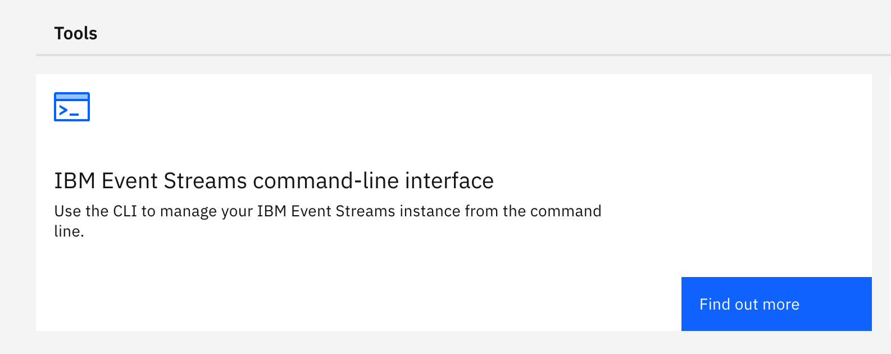

# Event Streams Lab

**Part 1**

- Deploy Event Streams using the Cloud Pak UI

**Part 2**

- Configure Event Streams for use
- Install the Event Streams CLI (es)
- Test the CLI
- Use the starter application to produce and consume events

## Deploy Event Streams

Begin the installation from the Platform UI by selecting **Integration Instances**

{style='height: auto;width: 90%;'}

Select **Create an instance**

Select the **Event Streams** tile and click **Next**

{style='height: auto;width: 90%;'}
  
Select the **Development** profile to explicitly ensure that you have an external listener and some level security enabled (you will look at this further prior to deployment)

{style='height: auto;width: 90%;'} 
  
Name this instance **es-demo** to deploy into the context of the **tools** namespace and **accept** the license.  Then scroll down ...

{style='height: auto;width: 90%;'}
  
By default this profile uses ephemeral storage, but we want to make it persistent (it's quite difficult to be highly available and resilient without persisted data) so you must now configure the storage for the brokers and the zookeepers.

Configure the broker storage as follows:

- Select **persistent-claim** from the dropdown list
- Select **ibmc-block-gold** from the dropdown list
- Assign a storage size of **4Gi** (just type this)

Configure the zookeeper storage as follows:

- Select **persistent-claim** from the dropdown list
- Select **ibmc-block-gold** from the dropdown list
- Assign a storage size of **2Gi** (just type this)

Do not click **Create** just yet.

{style='height: auto;width: 90%;'}

Before you continue, it is worth taking a look at the 'yaml' version to see how we will be accessing this Event Streams instance both from inside and outside the cluster.  Click on the `yaml` view. Look for **listeners:**. You will see you are using `tls` with `scram-sha-512` authentication and that access to the Event Streams instance will be via a route (more on all of this to follow).

```yaml
  listeners:
        - authentication:
            type: scram-sha-512
          name: external
          port: 9094
          tls: true
          type: route
        - authentication:
            type: tls
          name: tls
          port: 9093
          tls: true
          type: internal
```

Now chose **Create**

??? Question "What does the `yaml` look like for creating an equivalent cluster via the OpenShift console / `oc` CLI?"
    ```yaml
    apiVersion: eventstreams.ibm.com/v1beta2
    kind: EventStreams
    metadata:
      name: es-demo
      namespace: tools
    spec:
      adminApi: {}
      adminUI: {}
      apicurioRegistry: {}
      collector: {}
      license:
        accept: true
        use: CloudPakForIntegrationNonProduction
      requestIbmServices:
        iam: true
        monitoring: true
      restProducer: {}
      strimziOverrides:
        kafka:
          authorization:
            authorizerClass: com.ibm.eventstreams.runas.authorizer.RunAsAuthorizer
            supportsAdminApi: true
            type: custom
          config:
            default.replication.factor: 3
            inter.broker.protocol.version: '3.2'
            log.cleaner.threads: 6
            log.message.format.version: '3.2'
            min.insync.replicas: 2
            num.io.threads: 24
            num.network.threads: 9
            num.replica.fetchers: 3
            offsets.topic.replication.factor: 3
          listeners:
            - authentication:
                type: scram-sha-512
              name: external
              port: 9094
              tls: true
              type: route
            - authentication:
                type: tls
              name: tls
              port: 9093
              tls: true
              type: internal
          metricsConfig:
            type: jmxPrometheusExporter
            valueFrom:
              configMapKeyRef:
                key: kafka-metrics-config.yaml
                name: metrics-config
          replicas: 3
          storage:
            class: ibmc-block-gold
            size: 4Gi
            type: persistent-claim
        zookeeper:
          metricsConfig:
            type: jmxPrometheusExporter
            valueFrom:
              configMapKeyRef:
                key: zookeeper-metrics-config.yaml
                name: metrics-config
          replicas: 3
          storage:
            class: ibmc-block-gold
            size: 2Gi
            type: persistent-claim
        entityOperator:
          topicOperator: {}
      version: 11.0.2
    ```

Return to the **Integration Instances** screen and wait until the Event Streams instance is showing as Ready. 

!!! Information "Tip"
    If the UI shows an error early in the deployment, DON'T PANIC - this is a fault within the UI, be patient

Your Event Streams instance is now ready additional configuration to make it fully ready for use within the demo.

## Configure Event Streams

For the demo configuration there are a additional configurations to put in place. The first of these are the topics.
Open the Event Streams UI:  click on the es-demo instance in the Integration Instances view.

There are many things to explore here, but take note of one thing prior to continuing - look at the bottom of the screen to see that your Event Streams is in proper operation (ie: The system is healthy). Click on the **Create a topic** tile.

{style='height: auto;width: 90%;'}

You could opt to view all available options for creating a topic, but our requirements are rudimentary, so simply move on.

Enter the name for the topic - **cp4i-ivt-topic** and click **Next**

{style='height: auto;width: 80%;'}

Leave the number of partitions as 1 (the default), click **Next**.

{style='height: auto;width: 80%;'}

Select message retention of **1 day** (ie: how long before the messages are deleted), click **Next**.

{style='height: auto;width: 80%;'}  

Leave the replication factor as 3 (ie: The number of replicas of the topic that are available to enable high-availability, 3 is the number required to work using quorum), click **Create Topic**

A pop-up message will inform you that the request to create a topic has been made (if your Event Streams is healthy, this will appear immediately). You will see the newly create topic.

{style='height: auto;width: 90%;'}

Repeat the process above to create another topic called **cp4i-es-demo-topic**

{style='height: auto;width: 90%;'}

Next, set up the credentials for a user to be able to access the topics.
  
From the Event Streams main page select **Connect to this cluster**

{style='height: auto;width: 80%;'}
  
Take note of the Event Streams bootstrap URL
 
Click on **Generate SCRAM Credentials**
  
{style='height: auto;width: 90%;'}

Set the user name for the credentials to **ace-user**
 
Select the radio button which allows for **Produce messages, consume messages and create topics and schemas** and click Next.
 
{style='height: auto;width: 80%;'}
 
Select the radio button for **All topics** and choose **Next**
 
{style='height: auto;width: 70%;'}  
  
 Select the radio button for **All consumer groups** and choose **Next**.
 
{style='height: auto;width: 70%;'}  
  
Select the radio button for **All transaction IDs** and choose **Generate Credentials**

{style='height: auto;width: 70%;'}
  
Copy **AND SAVE** the SCRAM username and SCRAM password (you will use them later). As you will see, there also has been a secret created that contains these values in the event that you misplace the credentials.

{style='height: auto;width: 60%;'}

Additionally, download and SAVE the **PKCS12 certificate** and password, download the **PEM certificate**.
  
Depending on which typeof application you are using to access Event Streams, you will need to use one or another of these certificates (more on this later in the other labs).
  
{style='height: auto;width: 60%;'}
  
You can go to the OpenShift Console and take a look at the user that has been created by going to the IBM Event Streams operator (in Installed Operators), select the **Kafka User** tab.  
  
{style='height: auto;width: 90%;'}

!!! Information "Tip"
    As you move through each of the various labs, it will become apparent to you that there are many different ways of achieving the same results for all of the products, it is important to show you various options. How you choose to complete them depends on your preference and the preferences of your customer.

The same procedure we have just followed can be achieved using a script that utilities the Event Streams CLI (which is a plug-in to the `cloudctl` CLI). The following script achieves the same configuration that we have just performed:

```sh
#!/bin/sh
echo "Configuring Event Streams..."
###################
# INPUT VARIABLES #
###################
ES_INST_NAME='es-demo'
ES_NAMESPACE='tools'
################################
# INITIAL EVENT STREAMS CONFIG #
################################
CLUSTER_ADDRESS='https://'$(oc get route cp-console -n ibm-common-services -o jsonpath='{.status.ingress[0].host}')
ADMIN_PWD=$(oc get secret platform-auth-idp-credentials -n ibm-common-services -o jsonpath='{.data.admin_password}' | base64 --decode)
cloudctl login -a ${CLUSTER_ADDRESS} -u admin -p ${ADMIN_PWD} -n ${ES_NAMESPACE} --skip-ssl-validation
cloudctl es init -n ${ES_NAMESPACE}
cloudctl es topic-create --name cp4i-ivt-topic --partitions 1 --replication-factor 3 --config retention.ms=86400000
cloudctl es topic-create --name cp4i-es-demo-topic --partitions 1 --replication-factor 3 --config retention.ms=86400000
cloudctl es kafka-user-create --name ace-user --consumer --producer --schema-topic-create --all-topics --all-groups --all-txnids --auth-type scram-sha-512
echo "Event Streams has been configured."
```
  
However, this requires installation of the Event Streams CLI.
  
## Install Event Streams CLI
  
From the Event Streams home page, select the **Find more in the toolbox** tile
  
{style='height: auto;width: 90%;'}
  
Select the **IBM Event Streams command-line interface** tile and choose **Find out more**
  
{style='height: auto;width: 60%;'}

Download the correct version for your environment.

{style='height: auto;width: 80%;'}

From a terminal window enter:

```sh
cloudctl plug-in install ./es-plugin
```

Once the install has finished, type in :

```sh
cloudctl es
```
If you receive a response similar to the following screenshot, the install is successful.

{style='height: auto;width: 90%;'}

Next use the `es` CLI against a deployed instance of Event Streams running in the cluster.  To do this you first need to log into the `cloudctl`.

Run the following:

```sh
export CLUSTER_ADDRESS='https://'$(oc get route cp-console -n ibm-common-services -o jsonpath='{.status.ingress[0].host}')
export ADMIN_PWD=$(oc get secret platform-auth-idp-credentials -n ibm-common-services -o jsonpath='{.data.admin_password}' | base64 --decode)
cloudctl login -a ${CLUSTER_ADDRESS} -u admin -p ${ADMIN_PWD} --skip-ssl-validation
cloudctl es init
```

When prompted for the namespace enter `tools`.

{style='height: auto;width: 90%;'}

Use the `es` CLI to administer the Event Streams instance running in the `tools` namespace. Try something simple before moving on:

```
cloudctl es topics
```

You will see the topics that you created previously.

Next try:

```
cloudctl es kafka-users
```

You will see some internal users and the user that you created previously.

{style='height: auto;width: 60%;'}

Last, but not least, run a small example of producing and consuming messages from a topic.
  
## Use the starter app to produce and consume events
  
In the toolkit there is a small starter application to allow you to producee and consume messages. We will now install this.

Go back to the toolbox and select **Starter Application** and click **Get started**

{style='height: auto;width: 60%;'}

Download the JAR file for the start application from GitHub:

{style='height: auto;width: 60%;'}

{style='height: auto;width: 60%;'}

Next, generate the properties file containing the credentials to connect to the cluster and the topic to use.  Click on **Generate properties**

{style='height: auto;width: 60%;'}

Enter the following for the test application:

**name**: estest
**topic name**: (create a new topic as the previously created topics will be used in later labs) TEST

Click on **Generate and download .zip**

{style='height: auto;width: 60%;'}

Unzip the **es-properties.zip** file (unless you really like type), it is suggested that you put the previously downloaded jar file in the same place as the unzipped properties). You will see from the screenshot that you have everything in a directory named `es` including all of the previously downloaded certificates and credentials.

To start the test application enter:

```sh
java -Dproperties_path=<path-to-properties> -jar demo-all.jar
```

which in your case is: 

```sh
java -Dkafka.properties -jar demo-all.jar
```

Once you see a message with **Application started in xxx ms*** - you are ready to continue.
  
{style='height: auto;width: 90%;'}

Open a browser and navigate to **https://localhost:8080**

{style='height: auto;width: 60%;'}

Start by producing a few messages (but not yet consuming them).
Enter a message you would like to send to the topic and click **Start producing**

{style='height: auto;width: 60%;'}

This will keep producing the same message until you click **Stop producing**, so you can discontinue it after a few iterations.

Move to the consumer side of the screen and click **Start consuming**

{style='height: auto;width: 60%;'}

This will continue to consume messages until there are no more and until you click **Stop consuming**, it will simply wait for more.  If you start consuming messages later after more have been produced, it will simply pick up where it left off.

{style='height: auto;width: 60%;'}

!!! Note "One last thing ...."
    Go back to the Event Streams dashboard and select the TEST topic. Click on the **Messages** tab.
    Do you see all of the messages that you produced using the sample application?

    {style='height: auto;width: 90%;'}

    **If so, you have now completed the Event Streams lab**


??? Note "Shortcut"
    If you are familiar with deploying Event Streams, there is a `yaml` file included from the repo you cloned previously that will do the deployment steps for you.  If you are new to deploying Event Streams, follow the above detail steps using the UI method to familiarize yourself with the various components that need to be considered when creating an instance of Event Streams.
 
    Use the following command as a shortcut

    ```
    oc apply -f instances/2022.2/05-event-streams-instance.yaml
    ```

    Once Event Streams is up and running you could use the `05-es-initial-config.sh` to perform the initial configuration to define the `topics` and `user` we will use in the demonstration. 

