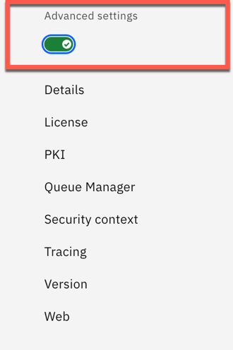
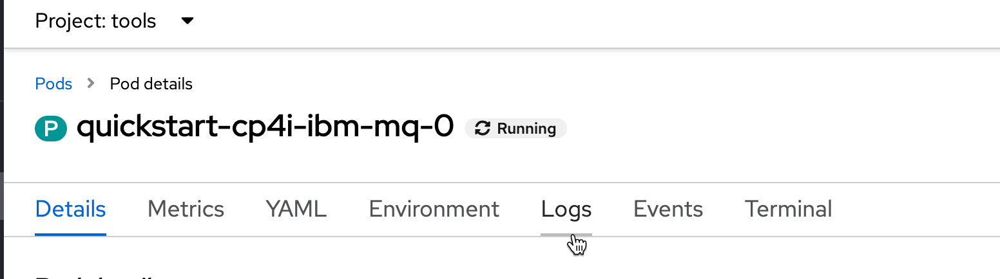
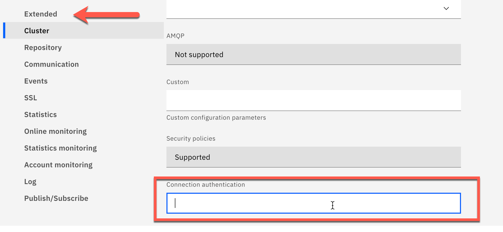
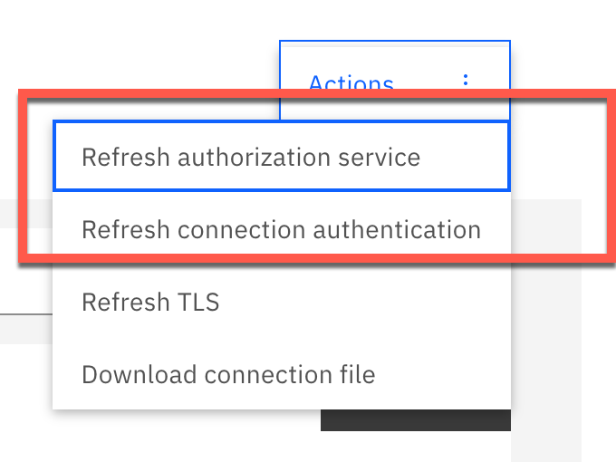
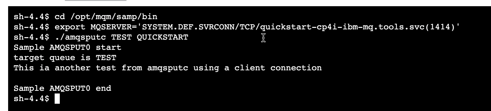

# Getting started with MQ Lab

This document explains:

- Creating a simple queue manager from the Cloud Pak UI
- Exploring the MQ Console
- Test message put and get
- Creating a ConfigMap for configuration of a queue manager using a yaml file, for the demo
- Creating a Native HA queue manager using a yaml file, for the demo


## Scenario Overview

Typically you would not create a queue manager using the UI in a real world customer deployment, it is very handy to be able to show how simple it is to do so in a demo.

To begin with you will create a very simple queue manager using the UI.  Next you will use the MQ console to edit the queue manager configuration and create a queue for testing.  Following that you will use some of the supplied MQ tools to test that you are able to put and get messages from a queue.

## Create a simple queue manager using the UI

Log on to the Platform UI (formerly known as the Platform Navigator) and select ***Integration Instances***

You will see a list of any instances of Cloud Pak capabilities already deployed.   Now create a new MQ instance (queue manager). Select ***Create an Instance***

Select ***Messaging*** as the instance you want to create. Click ***Next***

As you are creating a very basic queue manager, select the  ***Quick Start*** type of queue manager. Click ***Next***

{style='height: auto;width: 70%;'}

Using the dropdown list, select ***tools*** as the namespace to contain the queue manager (you can leave the default name) and accept the license agreement. 

Do **NOT** click Next yet. Scroll down the page 

{style='height: auto;width: 90%;'}

You must now decide the level of resiliency for the queue manager.  From the dropdown list select ***Single Instance***. This will create what is known as a single resilient queue manager (ie: a single pod which will be restarted automatically in the event of a failure).  YOU would normally back this up with persistent storage for the queue manager data and logs, but as this is a test only, leave the default ***ephemeral*** storage (ie: non-persistent).

Also, turn on the tracing for the Operations Dashboard, from the dropdown box selecting ***tools*** as the namespace of the Ops Dashboard.  You will not be sending any MQ messages that utilize the Operations Dashboard in this particular lab, this is merely so that you know where it is in the UI.

{style='height: auto;width: 90%;'}

A couple of last things for you to inspect prior to moving on. Click on the ***Advanced Settings*** button.

{style='height: auto;width: 20%;'}

In the part of the lab for the demo queue manager we will create a config map used to configure the queue manager and its' objects. In the UI this is where you can point to a config map (which may contain `mqsc` scripts or `qm.ini` overrides). You can also specifically name your queue manager here, (for the purposes of this lab QUICKSTART is fine). If you are wanting to add things such as `tls` keys and certs, this is also where you will go.

All of the basic information you require to create a queue manager is now in place (you can also choose to switch to the `yaml` view if you are interested in looking at what is populated for a basic deployment. Click ***Create***

{style='height: auto;width: 70%;'}

You are taken back to the Integration Instances view, where you will see the queue manager as `pending`.

{style='height: auto;width: 90%;'}

Return to the OpenShift Console to ***Installed Operators***

Select the ***tools*** project and the IBM MQ operator.

{style='height: auto;width: 90%;'}

Select the ***Queue Manager*** tab and wait until you see the status as running. 

!!! Note
    This should not take very long and the queue manager may already be running by the time you get there.

{style='height: auto;width: 90%;'}

Now that the queue manager is running go back to the Platform UI. Select the new queue manager in the Messaging tile.

{style='height: auto;width: 50%;'}

This will open up the MQ Console


## Explore the MQ Console

{style='height: auto;width: 80%;'}

!!! Note "Tip"
    If the console does not open correctly, it may be that the web console is not yet ready.  Try the following:
    Go to the OpenShift Console and find the MQ pod
    
    {style='height: auto;width: 80%;'}
    
    Go to the logs (for anyone who is likely to be performing any MQ troubleshooting, this is the log that shows any MQ errors if you ever need to find them).
    
    {style='height: auto;width: 60%;'}
    
    Check for the `web server started` message. If the web server is started, go back to the Platform UI and try refreshing the screen.
    
    {style='height: auto;width: 90%;'}

You now need to make some changes to the queue manager configuration. As mentioned previously, this is typically done via a config map during queue manager creation, but this gives you the additional opportunity to explore the MQ Console.

Given that you simply testing a basic queue manager, turn off all of the security related items that might hold you up. 

!!! DANGER
    This is NOT a recommended practice - MQ security can be very granular but also wide-ranging, it is recommended that you "start as you mean to continue", which means for a real customer situation ensure that, wherever possible, you set up all the MQ security that is required as part of the queue manager creation

Click on ***View Configuration***

{style='height: auto;width: 80%;'}

You are shown all properties for the queue manager (for those of you not familiar with MQ - there are many!)

Next click on **Edit**

{style='height: auto;width: 80%;'}

We will first disable the channel authentication records (in short, channel authentication sets the rules as to who can and cannot make an inbound channel connection to the queue manager).

In the Communication section, find the `CHLAUTH` records and using the dropdown list, select **Disabled**.

{style='height: auto;width: 80%;'}

Next remove the connection authentication (in short, this challenges connecting client applications to provide credentials and then authenticate those credentials with a repository).

In the extended section, scroll down to **Connection authentication** and remove the entry (just backspace it all out).

{style='height: auto;width: 70%;'}

Save the changes to the queue manager configuration.

Next, in the Actions box, refresh the **authentication service**, then refresh **connection authentication**.

!!! Note 
    For those familiar with MQ, all of this can just as easily be achieved using the terminal window of the MQ pod and `runmqsc`.

{style='height: auto;width: 40%;'}

Finally, we need to create a queue for our message testing.

Go back to the main queue manager page.

!!! Note "Tip"
    Follow the breadcrumb trail at the top of the console screen if you get lost.

You will see a list of queues (probably only one queue starting with `AMQ`), click ***Create*** to create a new queue.

{style='height: auto;width: 90%;'}

Select ***Local*** as the queue type.

{style='height: auto;width: 30%;'}

Select a name for the queue (such as `TEST`).

!!! Note 
    The queue is enabled for both put and get by default.  If you wish to change this or any other queue attribute, you can use the Custom Create option.

Click ***Create***

{style='height: auto;width: 90%;'}

Your queue manager ready for testing the ability to `put` and `get` messages.

## Test Message Put and Get

For this part of the lab you will use some of the sample programs that are delivered with MQ.  You will `put` a message on a queue both in `binding mode` (ie: via a direct connection to the queue manager) and `client mode` (ie: via an mq client connection).

Go to the OpenShift Console and back to the MQ pod.

Open the terminal.  The first test you will run is using a program called `amqsput`.  This is a sample program that allows you to connect to a queue manager and put messages onto a named queue.  You do not need to enter a queue manager name as a parameter since the program will connect to the default queue manager.

Perform the following:

```sh
Navigate to /opt/mqm/samp/bin
./amqsput TEST
```

Enter a message for the queue (put as many as you like by simply hitting enter after each message).

Hit enter twice to finish.

{style='height: auto;width: 50%;'}

The next test we will run will put a message on a queue using an mq client connection. In this case we need to set an environment variable to identify the queue manager (as you would find in a CCDT).

!!! Note "Connecting to a Queue Manager"
    How to connect to a queue manager from inside or outside of the cluster?
    The hostname used for the MQ traffic within the cluster takes the form of:
    <service>.<namespace>.svc
   From outside the cluster, the hostname can be found in the `route`
   Internally you can use port 1414 for the listener
   Externally you would use port 443

   For your test, the hostname is as follows:
   quickstart-cp4i-ibm-mq.tools.svc(1414)

Perform the following from your CLI:

Navigate to `/opt/mqm/samp/bin` (if not already there)
Set the `MQSERVER` variable - this takes the form of `<CHANNEL NAME>/TCP/<hostname><port>`

```sh
export MQSERVER='SYSTEM.DEF.SVRCONN/TCP/quickstart-cp4i-ibm-mq.tools.svc(1414)'
./amqsputc TEST QUICKSTART
```

Enter a message for the queue (put as many as you like by simply hitting enter after each message).  Hit enter twice to finish.

{style='height: auto;width: 70%;'}

Next, return to the MQ Console and check that the messages are there as expected.

If you previously `put` 2 messages on using the tools there will be 2 messages on the `TEST` queue (if not, try refreshing the display).

{style='height: auto;width: 80%;'}

Click on the `TEST` queue to see the messages, then click on one of the messages to see the message content.

{style='height: auto;width: 50%;'}

## Create ConfigMap for Demo Queue Manager

In this section you will create the queue manager and its artifacts for the demo.  You will use the provided scripts for expediency.  You are encourage you to take a look at each of the scripts before you deploying.  This will give you a greater understanding of what is being created. 

!!! Danger "Special Note:
    It is assumed that you are familiar with the concept of a `ConfigMap` for storing non-sensitive configuration data.  If the contents are sensitive, you should use a secret instead.  In the case of MQ, the `ConfigMap` is used to provide `mqsc` commands and/or `qm.ini` overrides.

```yaml
apiVersion: v1
kind: ConfigMap
metadata:
  name: mq-demo-mqsc
  namespace: tools
data:
  mq-demo-resources.mqsc: |
    ALTER QMGR CHLAUTH (DISABLED)
    ALTER AUTHINFO(SYSTEM.DEFAULT.AUTHINFO.IDPWOS)  AUTHTYPE(IDPWOS) CHCKCLNT(NONE)
    REFRESH SECURITY TYPE(CONNAUTH)
    DEFINE CHANNEL(ACE.TO.MQ) CHLTYPE(SVRCONN) TRPTYPE(TCP) MCAUSER('mqm') REPLACE
    DEFINE CHANNEL(ES.TO.MQ) CHLTYPE(SVRCONN) TRPTYPE(TCP) MCAUSER('mqm') REPLACE
    DEFINE CHANNEL(MQ.TO.ES) CHLTYPE(SVRCONN) TRPTYPE(TCP) MCAUSER('mqm') REPLACE
    DEFINE CHANNEL(CP4I.ADMIN.SVRCONN) CHLTYPE(SVRCONN) TRPTYPE(TCP) MCAUSER('mqm') SSLCAUTH(OPTIONAL) SSLCIPH(ECDHE_RSA_AES_128_CBC_SHA256) REPLACE
    DEFINE QLOCAL(CP4I.DEMO.ERROR.Q) DEFPSIST(YES) REPLACE
    DEFINE QLOCAL(CP4I.DEMO.STREAM.Q) DEFPSIST(YES) REPLACE
    DEFINE QLOCAL(CP4I.DEMO.IN.Q) DEFPSIST(YES) BOQNAME(CP4I.DEMO.ERROR.Q) BOTHRESH(1) REPLACE
    DEFINE QLOCAL(CP4I.DEMO.OUT.Q) DEFPSIST(YES) BOQNAME(CP4I.DEMO.ERROR.Q) BOTHRESH(1) REPLACE
    DEFINE QLOCAL(CP4I.DEMO.ES.TO.MQ) DEFPSIST(YES) BOQNAME(CP4I.DEMO.ERROR.Q) BOTHRESH(1) REPLACE
    DEFINE QLOCAL(CP4I.DEMO.MQ.TO.ES) DEFPSIST(YES) BOQNAME(CP4I.DEMO.ERROR.Q) BOTHRESH(1) REPLACE
    DEFINE QLOCAL(CP4I.DEMO.FILE.TO.MQ) DEFPSIST(YES) BOQNAME(CP4I.DEMO.ERROR.Q) BOTHRESH(1) REPLACE
    DEFINE QLOCAL(CP4I.DEMO.MQ.TO.FILE) DEFPSIST(YES) BOQNAME(CP4I.DEMO.ERROR.Q) BOTHRESH(1) REPLACE
    DEFINE QLOCAL(CP4I.DEMO.API.Q) BOQNAME(CP4I.DEMO.ERROR.Q) BOTHRESH(1) STREAMQ(CP4I.DEMO.STREAM.Q) REPLACE
    DEFINE QLOCAL(CP4I.DEMO.REQUEST.Q) BOQNAME(CP4I.DEMO.ERROR.Q) BOTHRESH(1) REPLACE
    DEFINE QLOCAL(CP4I.DEMO.EVENT.Q) BOQNAME(CP4I.DEMO.ERROR.Q) BOTHRESH(1) REPLACE
    DEFINE QLOCAL(CP4I.DEMO.TEMP.Q) BOQNAME(CP4I.DEMO.ERROR.Q) BOTHRESH(1) REPLACE
    DEFINE QLOCAL(CP4I.DEMO.BACKEND.Q) BOQNAME(CP4I.DEMO.ERROR.Q) BOTHRESH(1) REPLACE
```

Reviewing the `ConfigMap`, you will notice security has been disabled for simplicity, but more importantly mq streaming has been enabled in order to highlight this new feature during the demonstration.  If you have any questions regarding what any of the `mqsc` command are doing, please feel free to ask one of the instructors.

There are multiple ways to create the components of the demo, each of which you will experiment with during the labs.  Below you will use the OpenShift Console to create the `ConfigMap`.

To apply the `yaml`, you must be logged into the OpenShift UI.

Click on the little **plus sign** in the top right corner of the screen to import the `yaml`

{style='height: auto;width: 50%;'}

Copy and paste the `yaml` from above in to the **Import YAML** window and press ***Create***

{style='height: auto;width: 90%;'}

Go to `ConfigMaps` (they are found under the Workloads folder in the left hand menu) and check that the `mq-demo-mqsc` `ConfigMap` exists:

{style='height: auto;width: 60%;'}

Open the ConfigMap and check that it is appears as expected.

{style='height: auto;width: 90%;'}

You now have the config ready to be plugged into your demo queue manager.

## Create Native-HA Queue Manager for the Demo

For the demo, you will be deploying a Native-HA queue manager.  If you are unfamiliar with a NativeHA queue manager, it is the "Rolls Royce" of MQ high availability solutions, which is built into CP4I.

A Native-HA configuration provides a highly available queue manager where the recoverable MQ data (for example, the messages)  are replicated across multiple sets of storage, preventing loss from storage failures. The queue manager consists of multiple running instances, one is the leader, the others are ready to quickly take over in the event of a failure, maximizing access to the queue manager and its messages.

This is a relatively simple description of how it works, you can read about it in much more detail in the Knowledge Center.

The `yaml` requred to create the queue manager:

```yaml
apiVersion: mq.ibm.com/v1beta1
kind: QueueManager
metadata:
  name: qmgr-demo
  namespace: tools
spec:
  annotations:
    productMetric: FREE
  license:
    accept: true
    license: L-RJON-CD3JKX
    use: NonProduction
  queueManager:
    name: QMGRDEMO
    resources:
      limits:
        cpu: 500m
      requests:
        cpu: 500m
    storage:
      queueManager:
        type: persistent-claim
      defaultClass: ibmc-block-gold
    availability:
      type: NativeHA
    mqsc:
      - configMap:
          name: mq-demo-mqsc
          items:
            - mq-demo-resources.mqsc
  template:
    pod:
      containers:
        - env:
            - name: MQSNOAUT
              value: 'yes'
          name: qmgr
  version: 9.3.0.0-r1
  web:
    enabled: true
  tracing:
    enabled: true
    namespace: tools
```

!!! Note 
    This `yaml` file shows how to use annotations to let License Service know this is a Queue Manager used by ACE.  Therefor this queue won't consume VPCs.  Additionally, the instance uses Native-HA to show this functionality during the demonstration.  Further, the deployment enables tracing, but since we are using the same `tools` namespace there is no need to register again with Operations Dashboard. You are only required to register once per namespace.

Using the same method that we used to create the `ConfigMap`, apply the `yaml` to create the queue manager.  Take a look at the pods for the queue manager.  You will note that there are three of them.

{style='height: auto;width: 80%;'}

Wait until all of the queue manager pods are active (this may take a short time, while the storage is being provisioned). 

{style='height: auto;width: 60%;'}

!!! Note "You may be wondering..."
    If there is only ever one queue manager pod active at the one time, why two of the pods are showing as having 2/3 container active? This is due to the Operations Dashboard tracing sidecar containers - don't panic!  The active queue manager pod is the one with 3/3 active containers.

Feeling adventurous?  Test the workings of Native-HA: 

- `Put` a message on a queue (using your favorite method)
- `oc delete` the active MQ pod
- Watch the takeover by one of the other pods
- Log back into the MQ console (or any of your other favurite tools) and check that the message is still on the queue (where you put it prior to deleting the pod)
- Recheck the status of all three pods

***You have completed the MQ Lab***

