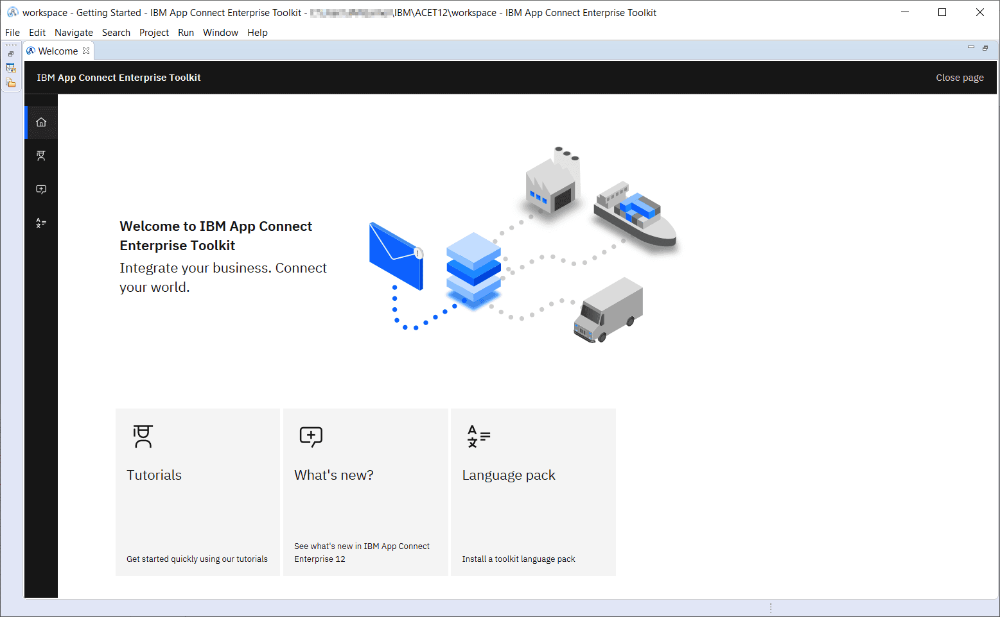
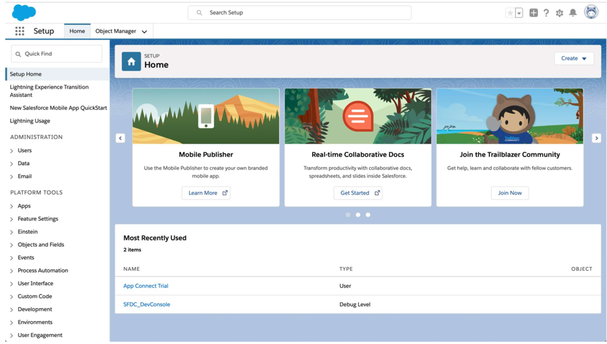
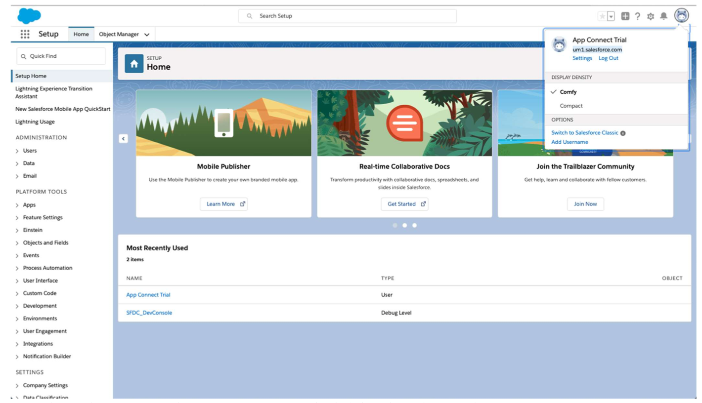
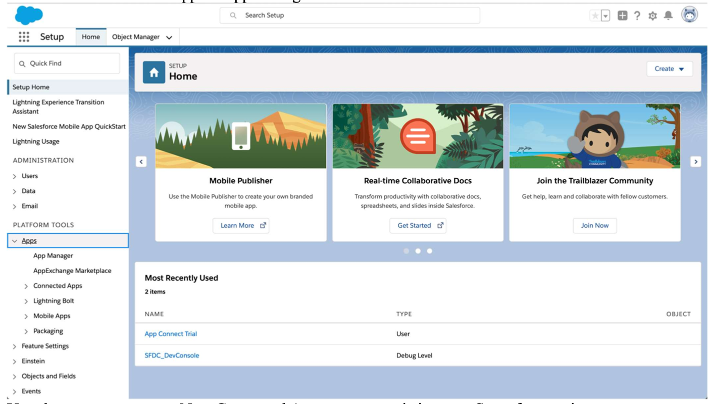
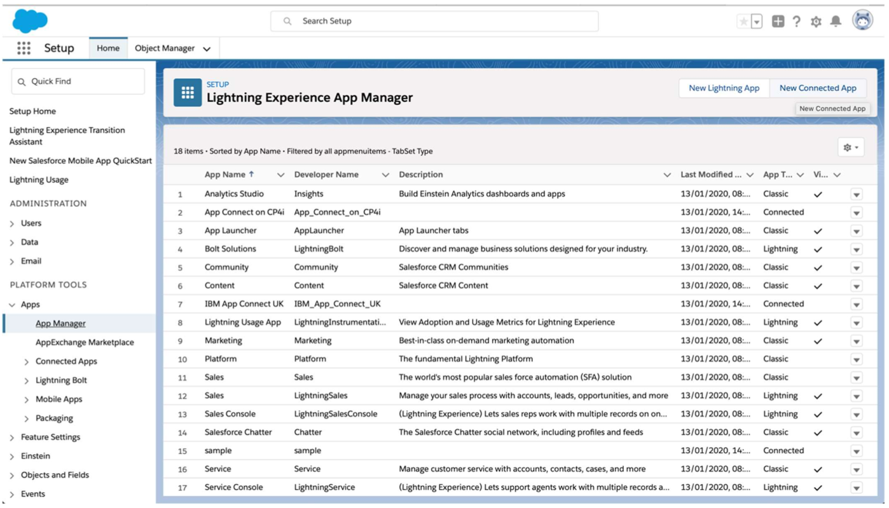
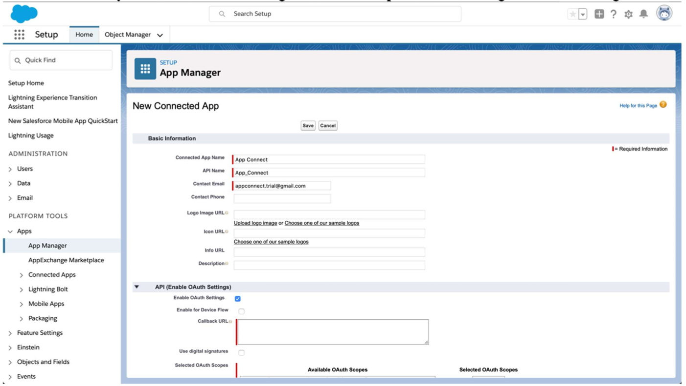
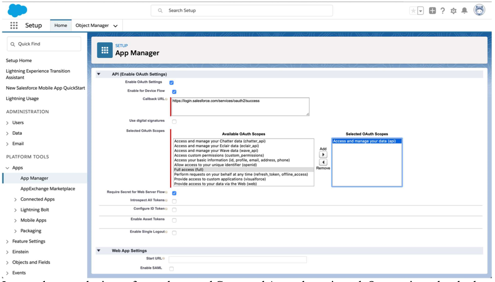
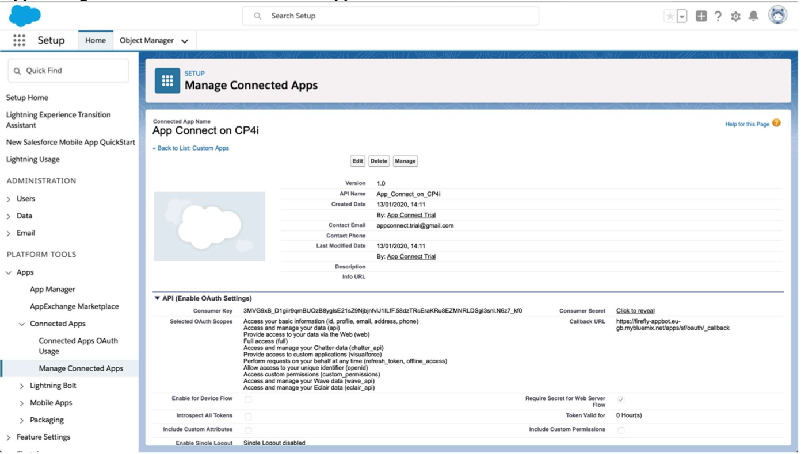
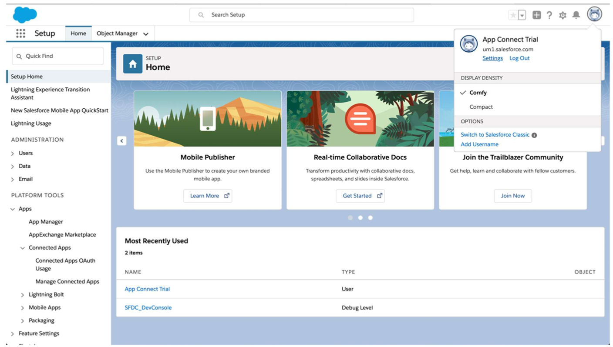
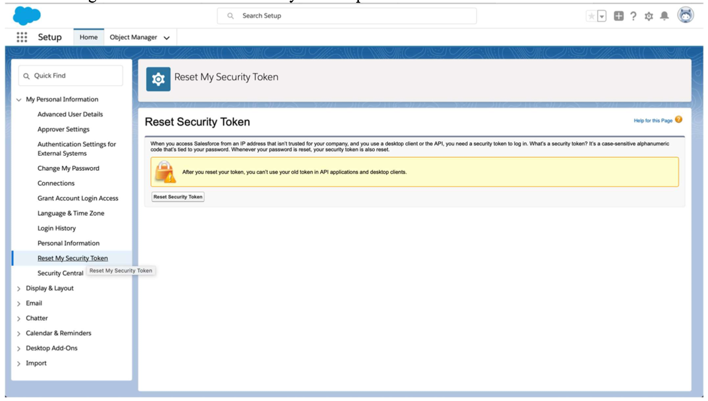

# App Connect Enterprise Developer Toolkit Installation

Use the IBM App Connect Enterprise Toolkit to build powerful integration applications, services, and APIs. Your integration solutions can then be deployed to the software run time, IBM App Connect on IBM Cloud®, containers, or a combination of environments.  IBM App Connect Enterprise for Developers is a full-function version of IBM App Connect Enterprise that you can use to evaluate the software, for an unlimited time, within the terms of the license.

To download IBM App Connect Enterprise for Developers follow [this link](https://www-01.ibm.com/marketing/iwm/iwm/web/pickUrxNew.do?source=swg-wmbfd){target="_blank"}.  You will be asked to fill out a form.  Answer the required questions and choose Linux®, macOS, or Windows as your target operating system.

!!! Information
    If the download page does not show the options for IBM App Connect Enterprise, such as `ACE-WIN64-DEVELOPER.exe`, open the link in a private browser window or clear your browser cache and try again.

Select the appropriate download option (for example, `ACE-WIN64-DEVELOPER.exe 1.26 GB`) and chose **download**.

Installing on your OS:

=== "Windows"
    - Unpack the software, which sets up IBM App Connect Enterprise Toolkit by extracting the downloaded .zip file into a local directory
    - Run the installation file that you downloaded by running ACESetup12.0.n.0.exe with the options that you require
    - For more information about installing IBM App Connect Enterprise on Windows, see [Installing IBM App Connect Enterprise on Windows](https://www.ibm.com/docs/en/app-connect/12.0?topic=software-installing-windows){target="_blank"}

=== "Linux"
    - Create or navigate to a directory where you have write access.
    - Unpack the IBM App Connect Enterprise Toolkit you downloaded into a directory where you have write access:
    ```sh
    tar -xzvf ace-12.0.n.0.tar.gz
    ```
    - Accept the license and run the installation file that you downloaded by running the command `./ace accept license for a single user installation` or `./ace make registry global accept license for a shared installation`.
    - For more information about installing IBM App Connect Enterprise on Linux, see [Installing IBM App Connect Enterprise on Linux](https://www.ibm.com/docs/en/app-connect/12.0?topic=software-installing-linux){target="_blank"}

=== "macOS"
    - Open the installation wizard by double-clicking the installation file that you downloaded
    - The installation file has a name similar to `IBM App Connect Enterprise 12.0.0.x.pkg` but it might be automatically renamed when you download it
    - Follow the instructions in the installation wizard
    - IBM App Connect Enterprise is installed as a standard mac application with the name IBM App Connect Enterprise in the /Applications folder

### Test the Installation

Start the IBM App Connect Enterprise Toolkit on your chosen platform by completing one of the following tasks:

=== "Windows"
    From the Windows Start menu, expand IBM App Connect Enterprise xx.0.0.y Developer Edition (where x denotes the version), then click IBM App Connect Enterprise Toolkit.
=== "Linux"
    From the command environment, type ./ace toolkit.
=== "macOS"
    Run the application /Applications/IBM App Connect Enterprise to start the toolkit.

IBM App Connect Enterprise Toolkit opens to display its welcome page.

{ style='height: 500px;width: auto;'}
The welcome page provides access to the Tutorials Gallery, which you can use to get started, what’s new information, and an option to install language packs.

### Salesforce Connector

If you are using a demo or working with the Tech Jam labs, you will likely be interacting with a Sales Force System of Record (SoR).  To get started you require **admin** level access to your Salesforce account.  Create your free Salesforce account to test, making certain that you create a **Developer** account rather than a Trial account. If you connect to App Connect with a Trial account, the Salesforce events do not work.

{ style='height: 500px;width: auto;'}

To get your login URL, click on your user profile. The URL text below your Account Name is your login URL.

{ style='height: 500px;width: auto;'}

Once logged into your Salesforce account, on the left-hand Finder panel go to: **PLATFORM TOOLS > Apps > App Manager**

{ style='height: 500px;width: auto;'}

Create a **New Connected App** or use an existing one. Steps for creating a new app are as follows:

{ style='height: 500px;width: auto;'}

Provide a **Connect App Name** and the API Name is automatically generated by the system. Enter a Contact email (usually admin email address).  Be certain to **Enable OAuth Settings** and follow steps below to configure OAuth setting.

{ style='height: 500px;width: auto;'}

- Click on Enable OAuth Settings to get the configuration panel
- Either click on **Enable for Device Flow** and that will auto-generate Callback URL or alternately you can provide your own fully qualified Callback URL

Next, configure scope of access for our connectors which will be the **Connected App** in this case. Connectors technically only require **data api**, you can optionally choose to enable all the scopes for this connected app.

Choose `Save`.

{ style='height: 500px;width: auto;'}

It will take several minutes for newly created Connected App to be registered. Once registered return to the App Manager, select and view the created App:

{ style='height: 500px;width: auto;'}

Use Consumer Key and Secret as Client ID and Client Secret as needed in the connector template. Next, retrieve the Security Token. For this click on your user profile and select Settings option in the profile panel.

{ style='height: 500px;width: auto;'}

Under Settings, find and click **Reset Security Token**:

{ style='height: 500px;width: auto;'}

Click on Reset Security Token Button and it will send the newly generated security token to your admin email address. Save this token, you will use this as your your credentials when making connections.

