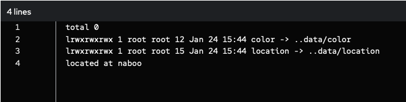
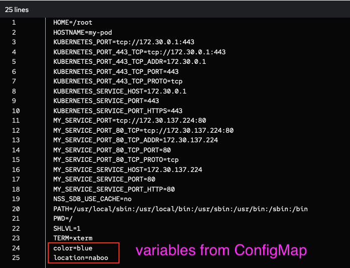

# Config Maps

ConfigMaps allow you to decouple configuration artifacts from image content to keep containerized applications portable.

An application can consume data from a ConfigMap in 3 different ways.

- As a single environment variable specific to a single key
- As a set of files, each key represented by a file on mounted volume
- As a set of environment variables from all keys

## Resources

=== "OpenShift"

    [ConfigMaps with Applications :fontawesome-solid-map:](https://docs.openshift.com/container-platform/4.16/applications/config-maps.html){ .md-button target="_blank"}

=== "Kubernetes"

    [ConfigMaps :fontawesome-solid-map:](https://kubernetes.io/docs/tasks/configure-pod-container/configure-pod-configmap/){ .md-button target="_blank"}

## References

```{ .yaml linenums="1" title="ConfigMap" .copy }
apiVersion: v1
kind: ConfigMap
metadata:
  name: my-cm
data:
  color: blue
  location: naboo
```

```{ .yaml linenums="1" title="Environment Variable Single Key" hl_lines="11-17" .copy }
apiVersion: v1
kind: Pod
metadata:
  name: my-pod
spec:
  restartPolicy: Never
  containers:
    - name: myapp
      image: busybox
      command: ["echo"]
      args: ["color is $(MY_VAR)"]
      env:
        - name: MY_VAR
          valueFrom:
            configMapKeyRef:
              name: my-cm
              key: color
```


```{ .yaml linenums="1" title="Keys Represented by a File" hl_lines="16-22" .copy }
apiVersion: v1
kind: Pod
metadata:
  name: my-pod
spec:
  restartPolicy: Never
  containers:
    - name: myapp
      image: busybox
      command:
        [
          "sh",
          "-c",
          "ls -l /etc/config; echo located at $(cat /etc/config/location)",
        ]
      volumeMounts:
        - name: config-volume
          mountPath: /etc/config
  volumes:
    - name: config-volume
      configMap:
        name: my-cm
```



```{ .yaml linenums="1" title="Environment Variables From All Keys" hl_lines="16-22" .copy }
apiVersion: v1
kind: Pod
metadata:
  name: my-pod
spec:
  restartPolicy: Never
  containers:
    - name: myapp
      image: busybox
      command: ["/bin/sh", "-c", "env | sort"]
      envFrom:
        - configMapRef:
            name: my-cm
  restartPolicy: Never
```



