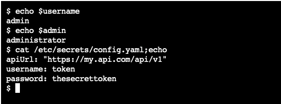

# Secrets

Kubernetes secret objects let you store and manage sensitive information, such as passwords, OAuth tokens, and ssh keys. Putting this information in a secret is safer and more flexible than putting it verbatim in a Pod definition or in a container image.

A Secret is an object that contains a small amount of sensitive data such as a password, a token, or a key. Such information might otherwise be put in a Pod specification or in an image; putting it in a Secret object allows for more control over how it is used, and reduces the risk of accidental exposure.

## Resources

=== "OpenShift"

    [Image Pull Secrets :fontawesome-solid-key:](https://docs.openshift.com/container-platform/4.16/openshift_images/managing_images/using-image-pull-secrets.html){ .md-button target="_blank"}

    [Secret Commands :fontawesome-solid-key:](https://docs.openshift.com/container-platform/4.16/cli_reference/openshift_cli/developer-cli-commands.html){ .md-button target="_blank"}

=== "Kubernetes"

    [Secrets :fontawesome-solid-key:](https://kubernetes.io/docs/concepts/configuration/secret/){ .md-button target="_blank"}

    [Secret Distribution :fontawesome-solid-key:](https://kubernetes.io/docs/tasks/inject-data-application/distribute-credentials-secure/){ .md-button target="_blank"}

## References

```{ .yaml linenums="1" title="Secret" .copy }
apiVersion: v1
kind: Secret
metadata:
  name: mysecret
type: Opaque
data:
  username: YWRtaW4=
stringData:
  admin: administrator
```

```{ .yaml linenums="1" title="Secret as Config" .copy }
apiVersion: v1
kind: Secret
metadata:
  name: mysecret-config
type: Opaque
stringData:
  config.yaml: |-
    apiUrl: "https://my.api.com/api/v1"
    username: token
    password: thesecrettoken
```

```{ .yaml linenums="1" title="Pod Definition That Consumes Both Secrets" .copy }
apiVersion: v1
kind: Pod
metadata:
  name: my-pod
spec:
  containers:
    - name: my-app
      image: bitnami/nginx
      ports:
        - containerPort: 8080
      env:
        - name: SECRET_USERNAME
          valueFrom:
            secretKeyRef:
              name: mysecret
              key: username
      envFrom:
        - secretRef:
            name: mysecret
      volumeMounts:
        - name: config
          mountPath: "/etc/secrets"
  volumes:
    - name: config
      secret:
        secretName: mysecret-config
```



=== "OpenShift"

    ```{ .bash linenums="1" title="Create These Files Needed for is Example" .copy }
    echo -n 'admin' > ./username.txt
    echo -n '1f2d1e2e67df' > ./password.txt
    ```

    ```{ .bash linenums="1" title="Creating Secret From Files" .copy }
    oc create secret generic db-user-pass --from-file=./username.txt --from-file=./password.txt
    ```

    ```{ .bash linenums="1" title="Getting Secret" .copy }
    oc get secrets
    ```

    ```{ .bash linenums="1" title="Gets the Secret's Description" .copy }
    oc describe secrets/db-user-pass
    ```

    ```{ .bash linenums="1" hl_lines="1-3 5 13" title="Terminal Output From Above Commands" .copy }
    # echo -n 'admin' > ./username.txt
    # echo -n '1f2d1e2e67df' > ./password.txt
    # oc create secret generic db-user-pass --from-file=./username.txt --from-file=./password.txt 
    secret/db-user-pass created
    # oc get secrets
    NAME                       TYPE                      DATA   AGE
    builder-dockercfg-b88ll    kubernetes.io/dockercfg   1      18h
    db-user-pass               Opaque                    2      14s
    default-dockercfg-5bs7k    kubernetes.io/dockercfg   1      18h
    deployer-dockercfg-xjhpw   kubernetes.io/dockercfg   1      18h
    mysecret                   Opaque                    2      16m
    mysecret-config            Opaque                    1      15m
    # oc describe secrets/db-user-pass
    Name:         db-user-pass
    Namespace:    debug
    Labels:       <none>
    Annotations:  <none>

    Type:  Opaque

    Data
    ====
    password.txt:  12 bytes
    username.txt:  5 bytes
    ```

=== "Kubernetes"

    ```{ .bash linenums="1" title="Create These Files Needed for is Example" .copy }
    echo -n 'admin' > ./username.txt
    echo -n '1f2d1e2e67df' > ./password.txt
    ```
    ```{ .bash linenums="1" title="Creating Secret From Files" .copy }
    kubectl create secret generic db-user-pass --from-file=./username.txt --from-file=./password.txt
    ```
    ```{ .bash linenums="1" title="Getting Secret" .copy }
    kubectl get secrets
    ```
    ```{ .bash linenums="1" title="Gets the Secret's Description" .copy }
    kubectl describe secrets/db-user-pass
    ```

    ```{ .bash linenums="1" hl_lines="1-4 7" title="Terminal Output From Above Commands" .copy }
    # echo -n 'admin' > ./username.txt
    # echo -n '1f2d1e2e67df' > ./password.txt
    # kubectl create secret generic db-user-pass --from-file=./username.txt --from-file=./password.txt secret/db-user-pass created
    # kubectl get secrets
    NAME           TYPE     DATA   AGE
    db-user-pass   Opaque   2      24s
    # work kubectl describe secrets/db-user-pass
    Name:         db-user-pass
    Namespace:    debug
    Labels:       <none>
    Annotations:  <none>

    Type:  Opaque

    Data
    ====
    password.txt:  12 bytes
    username.txt:  5 bytes
    ```
