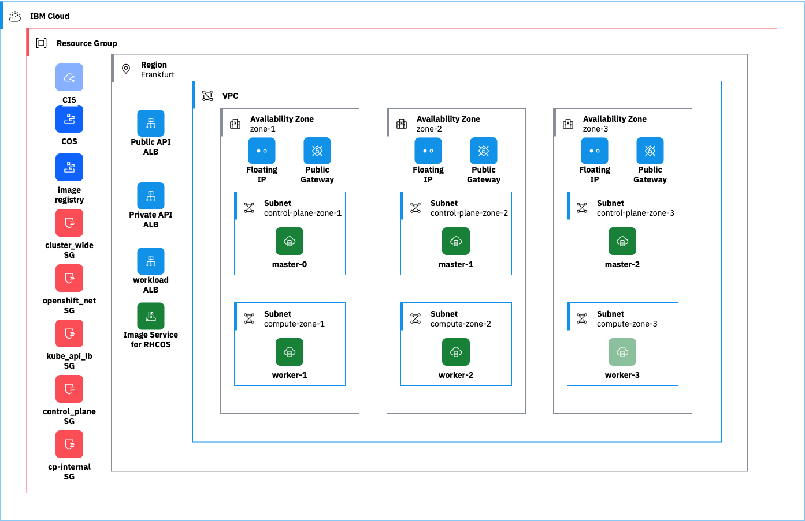

# Install the OpenShift Cluster

There are no step-by-step instructions provided here, you should use the official [Red Hat documentation](https://docs.openshift.com/container-platform/4.17/installing/installing_ibm_cloud/preparing-to-install-on-ibm-cloud.html){target="_blank"} and your experience from the prior installation labs to determine the proper steps for this installation. The installation method you need to follow is [Installing a cluster on IBM Cloud with customizations](https://docs.openshift.com/container-platform/4.17/installing/installing_ibm_cloud/installing-ibm-cloud-customizations.html).

!!! Important
    
    The section "Configuring an IBM Cloud account" in the Red Hat OpenShift documentation must be skipped. The instructors have already configured the IBM Cloud account for you.

    Some of the installation steps will require information that will be provided by the instructors, as they are specific to your cohort. You will be provided a link to a box note with the relevant information, including an API key for an IBM Cloud Service Id that has sufficient permissions to install OpenShift into a specific resource group.

The components created by the installer are depicted in the diagram below.



!!! Tip "Cleaning up"
    If you need / want to restart the cluster installation from scratch, follow the steps below.

    Set shell variables.


    ```sh
    INSTALL_DIR=<your_install_dir>
    CLUSTER_NAME=<your_cluster_name>
    ```

    Destroy the cluster.

    ```sh
    openshift-install destroy cluster --dir ${INSTALL_DIR}
    ```

    Delete the cloud credentials.

    ```sh
    ccoctl ibmcloud delete-service-id --credentials-requests-dir ${INSTALL_DIR}/creds --name ${CLUSTER_NAME}
    ```
    
    Remove the installation directory.

    ```sh
    rm -fr ${INSTALL_DIR}
    ```

    Remove the hidden files in `${HOME}`.

    ```sh
    rm ${HOME}/.openshift_install*
    ```

    Remove `install-config.yaml`

    ```sh
    rm ${HOME}/install-config.yaml
    ```
