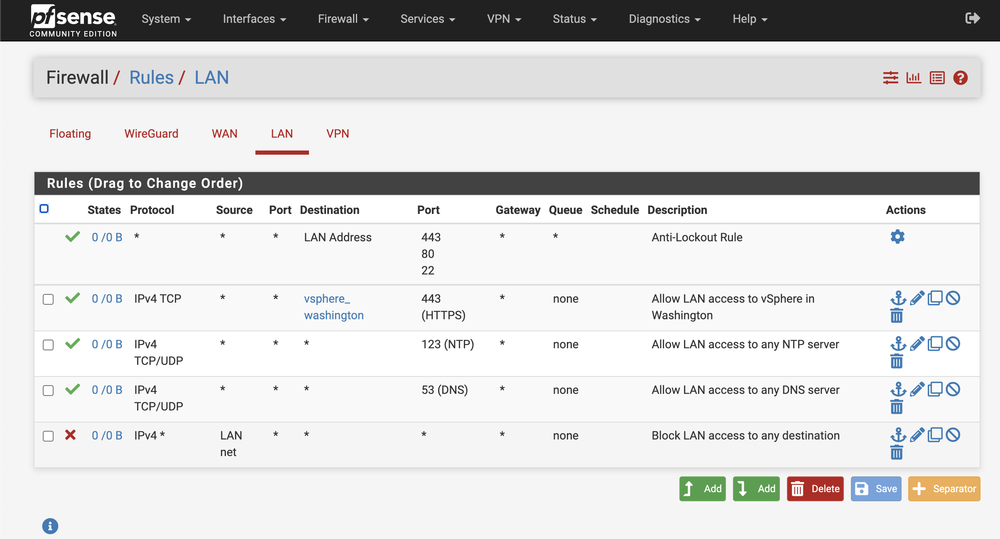

NOTE: This is an optional step if you want to have fully disconnected environment.

1. Validate that the bastion can currently access the internet.

   ```
   ping ibm.com
   ```

   The result will show that the bastion server can access the host.

   ```{.text .no-copy title="Example output"}
   [admin@bastion ~]$ ping ibm.com
   PING ibm.com (104.69.122.4) 56(84) bytes of data.
   64 bytes from a104-69-122-4.deploy.static.akamaitechnologies.com (104.69.122.4): icmp_seq=1 ttl=52 time=1.69 ms
   64 bytes from a104-69-122-4.deploy.static.akamaitechnologies.com (104.69.122.4): icmp_seq=2 ttl=52 time=1.91 ms
   64 bytes from a104-69-122-4.deploy.static.akamaitechnologies.com (104.69.122.4): icmp_seq=3 ttl=52 time=1.85 ms
   ```

2. Download the [Firewall Rules :fontawesome-regular-file-zip:](./firewall-rules/pe-bootcamp-firewall-rules.zip){ .md-button target=\_blank}. Depending on where your OCP Gym has been deployed, you will need to use the rules for either Washington or Dallas.

3. Open a browser and navigate to https://pfsense.gym.lan{: target="\_blank" .external }.

   Login as user `admin` with the password from the "Shared Reservation" section of your reservation.

4. Load the aliases and firewall rules.

   1. Navigate to **Diagnostics > Backup & Restore**.

   2. In the Restore Backup section select **Aliases** from the **Restore area** drop-down box

   3. Click the button **Choose file** in the Configuration file field

   4. Select the file and click **Open**

   5. Click **Restore Configuration** and confirm by clicking **OK**

   6. In the Restore Backup section select **Firewall Rules** from the **Restore area** drop-down box

   7. Click the button **Choose file** in the Configuration file field

   8. Select the file and click **Open**

   9. Click **Restore Configuration** and confirm by clicking **OK**

      Note that it is not necessary to reboot pfsense.

5. Check the firewall rules.

   1. Navigate to **Firewall** > **Rules**

   2. Click the **LAN** tab

   <figure markdown="span">
       <figcaption>Reference Firewall Rules for pfsense</figcaption>
       
   </figure>

6. Validate that the bastion can no longer access the internet.

   ```
   ping -w 10 ibm.com
   ```

   The result will show that the bastion server can access the host.

   ```{.text .no-copy title="Example output"}
   [admin@bastion ~]$ ping -w 10 ibm.com
   PING ibm.com (104.69.122.4) 56(84) bytes of data.

   --- ibm.com ping statistics ---
   10 packets transmitted, 0 received, 100% packet loss, time 9245ms

   ```
