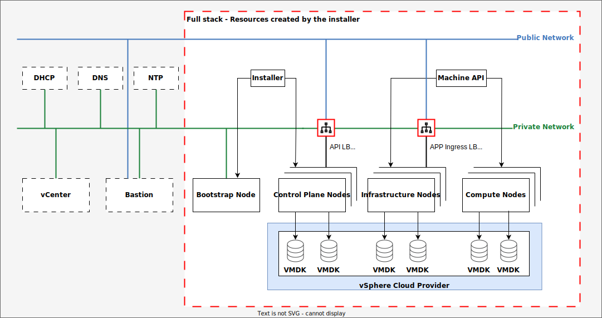

# Deploying OpenShift on VMware

In this exercise, you will learn how to deploy an OpenShift cluster on a VMware virtualized environment using Installer Provisioned Infrastructure (IPI), also known as full-stack automation. By the end, you will have gained hands-on experience in installing and configuring an OpenShift cluster ready for IBM Client Engineering Pilots.

## Outcomes

Upon completion of this exercise, you will be able to:

- *Install OpenShift on vSphere[^1]* : Deploy an OpenShift cluster using IPI, which automates the installation process from scratch.
    - Install with customization that will create the Infrastructure nodes for ODF.
- *Configure Identity Provider for htpasswd Authentication* : Set up identity provider authentication for your OpenShift cluster using htpasswd.
- *Install Red Hat OpenShift Data Foundation (ODF)* : Deploy ODF, a software-defined storage solution that supports both read-write many (RWX) and read-write once (RWO) storage classes.
- *Configure ODF Storage for Internal Image Registry* : Configure ODF to provide persistent storage for your internal image registry.
- *Enable the local image repository to support S2I images and IBM Cloudpak installations.

[^1]: Collective term for VMware's cloud computing virtualization platform which includes vCenter, ESXi and more. The term is also used in the official OpenShift documentation from Red Hat.

## Scenario

A modernization project requires containerizing existing applications using OpenShift, but the client lacks the necessary human resources to build the cluster. As part of our IBM team, you have been tasked with constructing an OpenShift cluster on their behalf.

### The required cluster configuration consists of nine nodes:

   | Node type      | vCPU | Memory in GiB | Disk size in GB | Node Count |
   |:---------------|:----:|:-------------:|:---------------:|------------|
   | Control Plane  | 16   | 64            | 200             | 3          |
   | Compute        | 16   | 64            | 200             | 3          |
   | Infrastructure | 16   | 64            | 200             | 3          |

In addition, you will need to deploy a software-defined storage (SDS) solution that meets the following requirements:

- Supports both RWX and RWO storage classes
- Meets the specifications outlined above

We have chosen Red Hat OpenShift Data Foundation (ODF) as our SDS solution. ODF is a highly scalable and flexible storage platform that supports various use cases, including persistent storage for applications and internal image registries.

For reference purposes, please recall the illustration of the IPI installation process on vSphere from DO322:

{target="_blank"}

## Provision the lab environment

1. Navigate to the [OpenShift Installation Cohort](https://techzone.ibm.com/collection/openshift-installation-cohort){target="_blank"} collection in TechZone.

2. On the left hand side click **Environments** and then click the **Reserve it** button on the **OCP Gymnasium** tile.
    
    {target="_blank"}

3. Select **Reserve now**.

4. Fill out the reservation form adding your information where relevant (use the screenshot below for guidance).

!!! Warning "Deploy with VPN"
        Be sure to deploy with the VPN Access **Enabled**.
    
{target="_blank"}

5. Click **Submit**. Provisioning approximately takes 30 minutes.

6. Once your VMware vSphere environment has been successfully provisioned, you will receive an email notification from noreply@techzone.ibm.com with your reservation details. To access your provisioned environment, click on the URL provided under Reservation ID to access your reservation details.

## OpenShift Gym Overview

### Gym Network Details

### Complete this table before continuing with the installation

| Name                                  | Value |
|---------------------------------------|-------|
| Subnet                                |       |
| Cluster Name                          |       |
| Base Domain                           |       |
| Gateway Address                       |       |
| Bastion Host                          |       |
| api.<Cluster Name\>.<Base Domain\>    |       |
| \*.apps.<Cluster Name\>.<BaseDomain\> |       |
| DHCP Assignable IP Addresses          |       |
| Redhat Pull Secret                    |       |

### Installation Details

## Verifying Environment Provisioning

To confirm that your VMware vSphere environment has been successfully provisioned, follow these steps:

1. If you want to use Guacamole (Recommended for first timers) to access your environment, click on the **Open your IBM Cloud environment** button. Next, expand the ALL CONNECTIONS section and test both Remote Desktop and SSH sessions by attempting to establish connections. If both connections are successful, it indicates that your environment has been provisioned and is ready for installation.

    > HINT: To paste in the Linux environment with your keyboard use Shift + CTRL + V

    {target="_blank"}

2. If you prefer to use WireGuard to establish a secure connection to your environment, click on the **Download WireGuard VPN** config button.
     1. Bastion's IP address: `192.168.252.2`
     2. Username: `admin`
     3. Password: Refer to the top of your reservation for this information

!!! Information "DNS and WireGuard on MacOS"
    The DNS server (192.168.253.1) configured in the WireGuard client might not be queried. The Cisco Secure Client enables the DNS Proxy and Transparent Proxy by default. Disabling the proxies is a work around, when you disable them they enable themselves automatically. It might take up to 10 tries to get them in the desired state, disabled.
