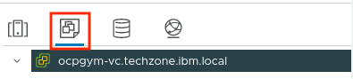
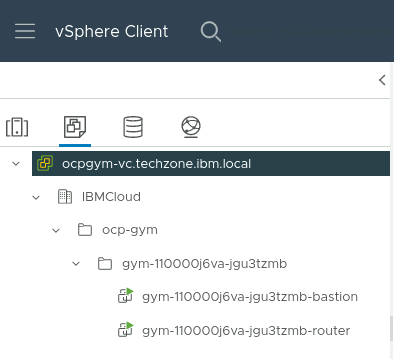
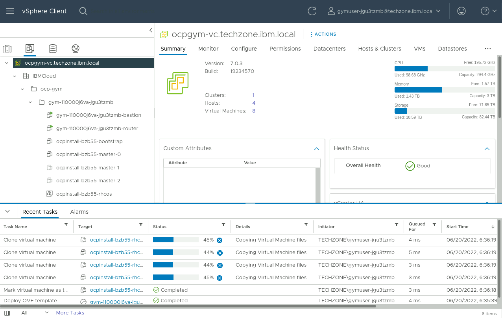
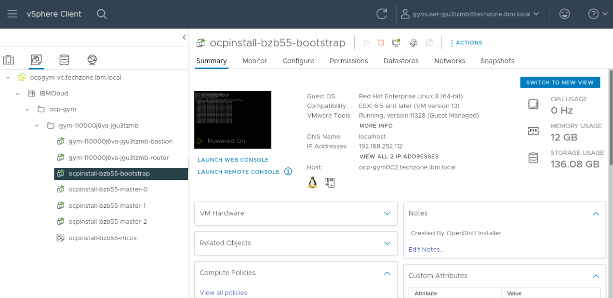
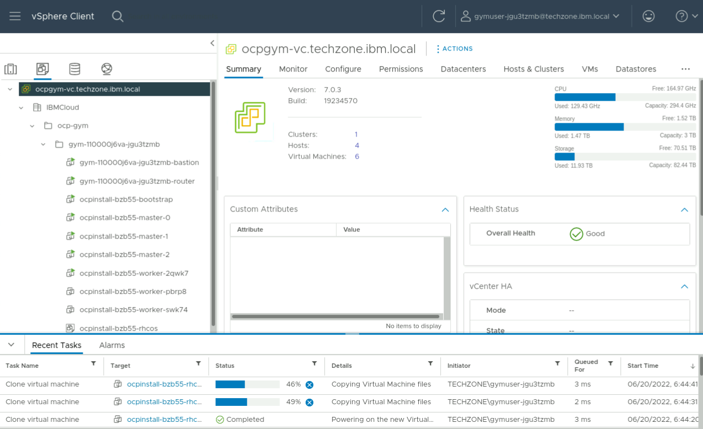
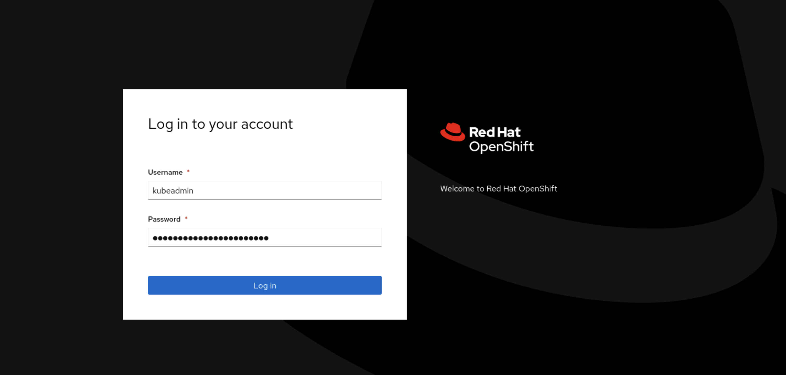
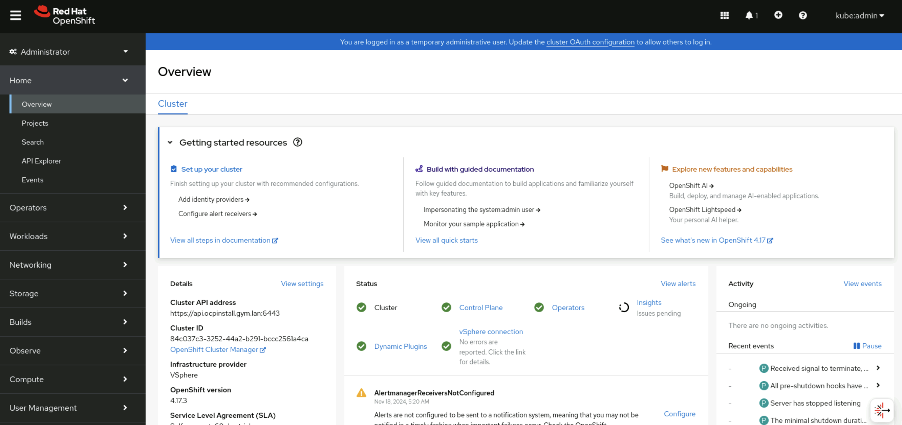
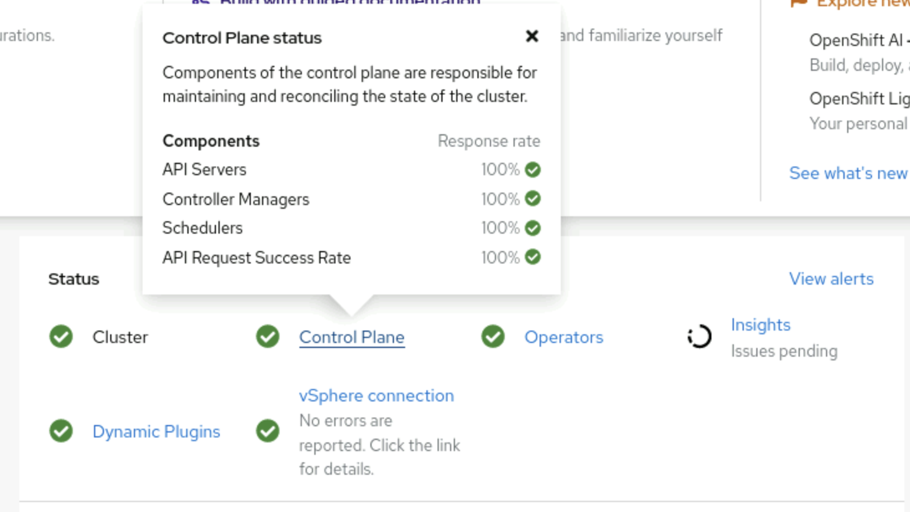

# Customize and Install the OpenShift Cluster

1. Create the installation directory (by convention named after the cluster).
    
    ```sh
    mkdir ocpinstall
    ```

2. Copy the Install Config asset into the installation directory.
    
    ```sh
    cp install-config.yaml ocpinstall
    ```

3. Create manifests.

    ```sh
    openshift-install create manifests --dir ocpinstall
    ```

4. Copy the worker MachineSet manifest to create an Infrastructure MachineSet

    ```sh
    cp ocpinstall/openshift/99_openshift-cluster-api_worker-machineset-0.yaml \
    ocpinstall/openshift/99_openshift-cluster-api_infra-machineset-0.yaml
    ```

5. Edit `ocpinstall/openshift/99_openshift-cluster-api_infra-machineset-0.yaml` and make the following changes:
    
    - Add labels to the nodes, within the `spec.template.spec.metadata.labels` section:
        - `cluster.ocs.openshift.io/openshift-storage: ''`
        - `node-role.kubernetes.io/infra: ''`
    - Add taint `node.ocs.openshift.io/storage` with value of `true` and effect `NoSchedule` to the nodes.
    - Change all values with postfix `-worker-0` to `-infra-0`.
    - Change the value of `machine.openshift.io/cluster-api-machine-role` and `machine.openshift.io/cluster-api-machine-type` to `infra`.
    - Change `memoryMiB` to `65536`.
    - Change `numCPUs` to `16`.
    - Change `numCoresPerSocket` to `2`.
    - Change `replicas` to `3`
    
    ```{.text .no-copy title="Reference infrastructure MachineSet" linenums=1 hl_lines="7 10 14 19-21"} 
    apiVersion: machine.openshift.io/v1beta1
    kind: MachineSet
    metadata:
      creationTimestamp: null
      labels:
        machine.openshift.io/cluster-api-cluster: ocpinstall-jxncd
      name: ocpinstall-jxncd-infra-0
      namespace: openshift-machine-api
    spec:
      replicas: 3
      selector:
        matchLabels:
          machine.openshift.io/cluster-api-cluster: ocpinstall-jxncd
          machine.openshift.io/cluster-api-machineset: ocpinstall-jxncd-infra-0
      template:
        metadata:
          labels:
            machine.openshift.io/cluster-api-cluster: ocpinstall-jxncd
            machine.openshift.io/cluster-api-machine-role: infra
            machine.openshift.io/cluster-api-machine-type: infra
            machine.openshift.io/cluster-api-machineset: ocpinstall-jxncd-infra-0
        spec:
          lifecycleHooks: {}
          metadata: {}
          providerSpec:
            value:
              apiVersion: machine.openshift.io/v1beta1
              credentialsSecret:
                name: vsphere-cloud-credentials
              diskGiB: 200
              kind: VSphereMachineProviderSpec
              memoryMiB: 65536
              metadata:
            creationTimestamp: null
              network:
                devices:
                - networkName: 68a787348c33043254f6e8b6-segment
              numCPUs: 32
              numCoresPerSocket: 4
              snapshot: ""
              template: ocpinstall-jxncd-rhcos-generated-region-generated-zone
              userDataSecret:
                name: worker-user-data
              workspace:
                datacenter: IBMCloud
                datastore: /IBMCloud/datastore/68a787348c33043254f6e8b6-storage
                folder: /IBMCloud/vm/ocp-gym/reservations/68a787348c33043254f6e8b6
                resourcePool: /IBMCloud/host/ocp-gym/Resources/Cluster Resource Pool/Gym
                  Member Resource Pool/68a787348c33043254f6e8b6
                server: ocpgym-vc.techzone.ibm.local
    status:
      replicas: 0
    ```

6. Create the cluster.
    
    ```sh
    openshift-install create cluster --dir ocpinstall --log-level debug
    ```

    !!! Information
        We are suggesting you use --log-level debug in order to gain some experience with what is actually happening during the IPI installation process. The default log level is info; which is more typically used once you have experience with the process. A log file named .openshift-install.log is kept in the install directory .

    Wait for the installation to complete.

    ```{.text .no-copy title="Example output"}
    #...
    INFO All cluster operators have completed progressing
    INFO Checking to see if there is a route at openshift-console/console...
    DEBUG Route found in openshift-console namespace: console
    DEBUG OpenShift console route is admitted
    INFO Install complete!
    INFO To access the cluster as the system:admin user when using 'oc', run 'export KUBECONFIG=/home/admin/ocpinstall/auth/kubeconfig'
    INFO Access the OpenShift web-console here: https://console-openshift-console.apps.ocpinstall.gym.lan
    INFO Login to the console with user: "kubeadmin", and password: "AaaJH-tkqHF-VWDvh-cPku2"
    DEBUG Time elapsed per stage:
    DEBUG               pre-bootstrap: 1m19s
    DEBUG                   bootstrap: 57s
    DEBUG                      master: 2m45s
    DEBUG          Bootstrap Complete: 16m45s
    DEBUG                         API: 54s
    DEBUG           Bootstrap Destroy: 36s
    DEBUG Cluster Operators Available: 9m47s
    DEBUG    Cluster Operators Stable: 5m32s
    INFO Time elapsed: 37m48s
    ```

    !!! Tip
        - When using WireGuard ensure your laptop does not go to sleep and that the SSH session remains open, otherwise this can interrupt the installer.
        - Consider installing and using tmux to minimize network disruptions and timeouts.

## Monitor Progress During Installation

### Monitor using the vSphere console

1. Log into the vSphere console.
    
    Use the vCenter Console URL, username and password from your reservation and log into the vSphere console.

2. Select the **VMs and Templates** section on the left-hand side of vSphere:

    {width=30%}

    Expand **IBMCloud > ocp-gym**.
    
    You will then be able to find your user's folder, where the virtual machines will appear during the installation.

    {width=30%}

    !!! Note
        You can see that there are already two virtual machines present in your folder! The first one is the VM that is your bastion, which is the one you're using now. The other is a router VM that is hosting the routing and DNS components that are needed for your cluster.

    During the installation, on the vSphere console, you will be able to see the virtual machines for your OpenShift cluster being created.

    
    
    The OpenShift installer will first create the bootstrap node and the master nodes and power them on.
    
    Clicking on one of the VMs will display further information on the right-hand side of the console.

    

    Once these are running and configured, the OpenShift installer will create, start and configure the worker nodes. Typically the workers are created 10-15 minutes after the masters.
    
    The workers will appear in the same section as the master nodes and the bootstrap node.
    

### Monitor using the OpenShift CLI

You can start following the installation progress with the CLI after the API server is available.

1. Open a new Terminal.

2. Set up `system:admin` access for the cluster.
    
    ```sh
    export KUBECONFIG=${HOME}/ocpinstall/auth/kubeconfig
    ```

3. Issue the following watch command.
    
    ```sh
    watch oc get nodes,clusteroperators,clusterversion
    ```

    !!! Tip
        - During the installation it is normal for the status field to occasionally show errors.
        - The authentication operator is usually the last one to come up, and it may take 15-20 minutes after all the other operators are available, so don't panic. The console operator is usually next to last.

## Verify Cluster Health

### Access the OpenShift Web console

1. Open [https://console-openshift-console.apps.ocpinstall.gym.lan](https://console-openshift-console.apps.ocpinstall.gym.lan){target="_blank"} in a browser and accept the self-signed certificates.

2. Log in using the credentials (available from the OpenShift installer output).

    

    The OpenShift Web console will then display:

    

3. Click on the Control Plane and Operators in the Status window.

    

### Access the Cluster Using the OpenShift CLI

1. Log in as user `kubeadmin`.

    ```sh
    oc login -u kubeadmin https://api.ocpinstall.gym.lan:6443 --insecure-skip-tls-verify=true
    ```

    ```{.text .no-copy title="Example Output"}
    WARNING: Using insecure TLS client config. Setting this option is not supported!

    Console URL: https://api.ocpinstall.gym.lan:6443/console
    Authentication required for https://api.ocpinstall.gym.lan:6443 (openshift)
    Username: kubeadmin
    Password: 
    Login successful.

    You have access to 70 projects, the list has been suppressed. You can list all projects with 'oc projects'

    Using project "default".
    ```

2. List the nodes.

    ```sh
    oc get nodes
    ```

    ```{.text .no-copy title="Example Output"}
    NAME                              STATUS   ROLES                  AGE   VERSION
    ocpinstall-ntfsr-infra-0-5bfqj    Ready    infra,worker           18m   v1.28.6+6216ea1
    ocpinstall-ntfsr-infra-0-cscfp    Ready    infra,worker           18m   v1.28.6+6216ea1
    ocpinstall-ntfsr-infra-0-p42ml    Ready    infra,worker           18m   v1.28.6+6216ea1
    ocpinstall-ntfsr-master-0         Ready    control-plane,master   32m   v1.28.6+6216ea1
    ocpinstall-ntfsr-master-1         Ready    control-plane,master   32m   v1.28.6+6216ea1
    ocpinstall-ntfsr-master-2         Ready    control-plane,master   32m   v1.28.6+6216ea1
    ocpinstall-ntfsr-worker-0-mzsp6   Ready    worker                 18m   v1.28.6+6216ea1
    ocpinstall-ntfsr-worker-0-n747f   Ready    worker                 18m   v1.28.6+6216ea1
    ocpinstall-ntfsr-worker-0-hsh87   Ready    worker                 18m   v1.28.6+6216ea1
    ```

3. Display CPU and memory usage of each node.
    
    ```sh
    oc adm top nodes
    ```
    
    ```{.text .no-copy title="Example Output"}
    NAME                              CPU(cores)   CPU%   MEMORY(bytes)   MEMORY%
    ocpinstall-ntfsr-infra-0-5bfqj    112m         0%     2071Mi          3%
    ocpinstall-ntfsr-infra-0-cscfp    109m         0%     2091Mi          3%
    ocpinstall-ntfsr-infra-0-p42ml    112m         0%     2078Mi          3%
    ocpinstall-ntfsr-master-0         511m         14%    6074Mi          40%
    ocpinstall-ntfsr-master-1         527m         15%    6393Mi          42%
    ocpinstall-ntfsr-master-2         396m         11%    4457Mi          29%
    ocpinstall-ntfsr-worker-0-mzsp6   283m         3%     4301Mi          28%
    ocpinstall-ntfsr-worker-0-n747f   408m         5%     4142Mi          27%
    ocpinstall-ntfsr-worker-0-hsh87   408m         5%     4142Mi          27% 
    ```

4. List the cluster operators.
    
    ```sh
    oc get clusteroperators
    ```

    ```{.text .no-copy title="Example Output"}
    NAME                                       VERSION   AVAILABLE   PROGRESSING   DEGRADED   SINCE   MESSAGE
    authentication                             4.17.3    True        False         False      10m     
    baremetal                                  4.17.3    True        False         False      61m     
    cloud-controller-manager                   4.17.3    True        False         False      69m     
    cloud-credential                           4.17.3    True        False         False      92m     
    cluster-autoscaler                         4.17.3    True        False         False      61m     
    config-operator                            4.17.3    True        False         False      63m     
    console                                    4.17.3    True        False         False      15m     
    control-plane-machine-set                  4.17.3    True        False         False      61m     
    csi-snapshot-controller                    4.17.3    True        False         False      63m     
    dns                                        4.17.3    True        False         False      59m     
    etcd                                       4.17.3    True        False         False      25m     
    image-registry                             4.17.3    True        False         False      52m     
    ingress                                    4.17.3    True        False         False      18m     
    insights                                   4.17.3    True        False         False      55m     
    kube-apiserver                             4.17.3    True        False         False      56m     
    kube-controller-manager                    4.17.3    True        False         False      56m     
    kube-scheduler                             4.17.3    True        False         False      56m     
    kube-storage-version-migrator              4.17.3    True        False         False      63m     
    machine-api                                4.17.3    True        False         False      18m     
    machine-approver                           4.17.3    True        False         False      61m     
    machine-config                             4.17.3    True        False         False      25m     
    marketplace                                4.17.3    True        False         False      61m     
    monitoring                                 4.17.3    True        False         False      11m     
    network                                    4.17.3    True        False         False      64m     
    node-tuning                                4.17.3    True        False         False      16m     
    openshift-apiserver                        4.17.3    True        False         False      25m     
    openshift-controller-manager               4.17.3    True        False         False      56m     
    openshift-samples                          4.17.3    True        False         False      56m     
    operator-lifecycle-manager                 4.17.3    True        False         False      61m     
    operator-lifecycle-manager-catalog         4.17.3    True        False         False      61m     
    operator-lifecycle-manager-packageserver   4.17.3    True        False         False      55m     
    service-ca                                 4.17.3    True        False         False      63m     
    storage                                    4.17.3    True        False         False      25m 
    ```

### Access Cluster Nodes

You can `ssh` into the worker and master nodes once the virtual machines have been created. The user to SSH with is named `core`. The SSH key you use will be the private half of the key pair of which the public half you provided in the `install-config.yaml` file.

1. Get the external IP addresses of the nodes.

    ```sh
    oc get nodes -o custom-columns=NAME:.metadata.name,EXTERNALIP:.status.addresses[0].address
    ```

    ```{.text .no-copy title="Example Output"}
    NAME                              EXTERNALIP
    ocpinstall-ntfsr-infra-0-5bfqj    192.168.252.139
    ocpinstall-ntfsr-infra-0-cscfp    192.168.252.135
    ocpinstall-ntfsr-infra-0-p42ml    192.168.252.137
    ocpinstall-ntfsr-master-0         192.168.252.132
    ocpinstall-ntfsr-master-1         192.168.252.134
    ocpinstall-ntfsr-master-2         192.168.252.133
    ocpinstall-ntfsr-worker-0-mzsp6   192.168.252.136
    ocpinstall-ntfsr-worker-0-n747f   192.168.252.138
    ocpinstall-ntfsr-worker-0-hsh87   192.168.252.138 
    ```

2. Log in to one of the nodes.

    ```sh
    ssh -i ~/.ssh/id_rsa core@192.168.252.132
    ```

    ```{.text .no-copy title="Example Output"}
    The authenticity of host '192.168.252.132 (192.168.252.132)' can't be established.
    ED25519 key fingerprint is SHA256:39TmjFLNRRmncEWcvEuLV75DTuFVPWQI0G5p0BHTmKA.
    This key is not known by any other names
    Are you sure you want to continue connecting (yes/no/[fingerprint])? yes
    Warning: Permanently added '192.168.252.132' (ED25519) to the list of known hosts.
    Red Hat Enterprise Linux CoreOS 417.94.202410211619-0
      Part of OpenShift 4.17, RHCOS is a Kubernetes native operating system
      managed by the Machine Config Operator (`clusteroperator/machine-config`).

    WARNING: Direct SSH access to machines is not recommended; instead,
    make configuration changes via `machineconfig` objects:
      https://docs.openshift.com/container-platform/4.17/architecture/architecture-rhcos.html

    ---
    ```

3. Check if the kubelet is active.

    ```sh
    systemctl is-active kubelet
    ```

    ```{.text .no-copy title="Example Output"}
    active
    ```

4. Log out.

    ```sh
    exit
    ```
