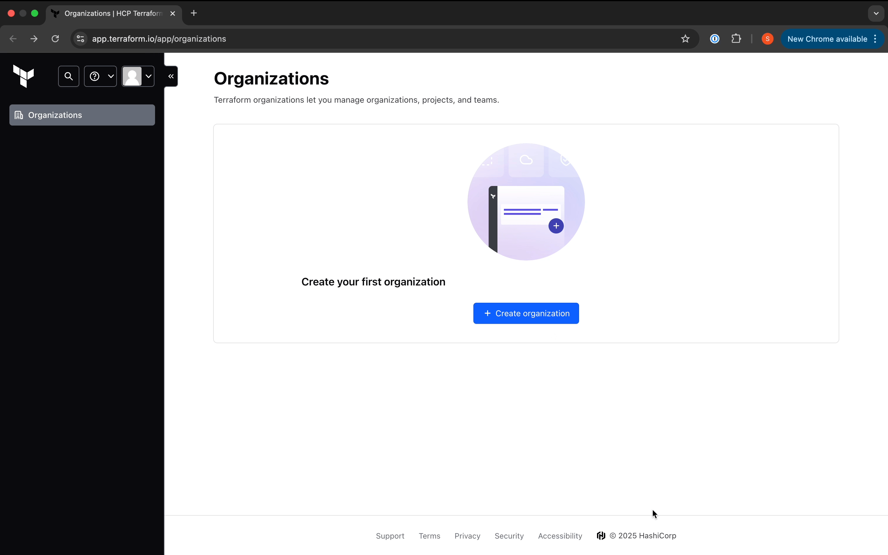

# Intro

In this lab we will be covering the basics of Terraform infrastructure management using the VSphere environment provisioned for the Bootcamp, and introduce remote state management. We will be using the [Terraform VSphere](https://registry.terraform.io/providers/hashicorp/vsphere/latest/docs) provider to manage Virtual Machines.

# Prerequisites

## Download Terraform
 
### Linux Bastion

```bash
sudo yum install -y yum-utils
sudo yum-config-manager --add-repo https://rpm.releases.hashicorp.com/RHEL/hashicorp.repo
sudo yum -y install terraform
```

### MacOS

```bash
brew tap hashicorp/tap
brew install hashicorp/tap/terraform
```

You should then be able to run the following:

```bash
terraform version
```

Output:

```bash
Terraform v1.10.5
on darwin_arm64
```

# Create your terraform module

Create a folder for your project and within it create `main.tf` , `variables.tf` and `outputs.tf` files


In `main.tf` define the following provider block:

```hcl
terraform {
  required_providers {
    vsphere = {
      source = "hashicorp/vsphere"
      version = "2.11.1"
    }
  }
}

provider "vsphere" {
  user                 = var.vsphere_user
  password             = var.vsphere_password
  vsphere_server       = var.vsphere_server
  allow_unverified_ssl = var.vsphere_allow_unverified_ssl
  api_timeout          = var.vsphere_api_timeout
}
```

Using the `terraform` command, initialise your provider and prepare your working directory.

```bash
Initializing the backend...
Initializing provider plugins...
- Finding hashicorp/vsphere versions matching "2.11.1"...
- Installing hashicorp/vsphere v2.11.1...
- Installed hashicorp/vsphere v2.11.1 (signed by HashiCorp)
Terraform has created a lock file .terraform.lock.hcl to record the provider
selections it made above. Include this file in your version control repository
so that Terraform can guarantee to make the same selections by default when
you run "terraform init" in the future.

Terraform has been successfully initialized!

You may now begin working with Terraform. Try running "terraform plan" to see
any changes that are required for your infrastructure. All Terraform commands
should now work.

If you ever set or change modules or backend configuration for Terraform,
rerun this command to reinitialize your working directory. If you forget, other
commands will detect it and remind you to do so if necessary.
```

Declare the following variables in `variables.tf`:

* vsphere_user as a *string* with a sensitive value of `true`
* vsphere_password as a *string* with a sensitive value of `true`
* vsphere_server as a *string* with a sensitive value of `true`
* vsphere_allow_unverified_ssl as a *bool* with a default value of `true` and sensitive value of `false`
* vsphere_api_timeout as a *number* with a default value of `10` and sensitive value of `false`

We can now refactor `main.tf`:

```hcl
terraform {
  required_providers {
    vsphere = {
      source = "hashicorp/vsphere"
      version = "2.11.1"
    }
  }
}

provider "vsphere" {
  user                 = var.vsphere_user
  password             = var.vsphere_password
  vsphere_server       = var.vsphere_server
  allow_unverified_ssl  = var.vsphere_allow_unverified_ssl
  api_timeout          = var.vsphere_api_timeout
}
```

Using the `terraform` command, show the changes to the Terraform Plan

Notice how terraform will now ask you to provide these values at runtime. You can store variables locally in a `terraform.tfvars` file:

```hcl
vsphere_user="user from vmware-ipi.yaml"
vsphere_password="password from vmware-ipi.yaml"
vsphere_server="ocpgym-vc.techzone.ibm.local"
```

Re-run a plan and notice that terraform will pick up those variables.

!!! note "`terraform.tfvars` file"
    Always treat your `terraform.tfvars` file as sensitive. Never commit it to git.

Add some data sources:

```hcl
data "vsphere_datacenter" "datacenter" {
  name = var.vsphere_datacenter_name
}

data "vsphere_datastore" "datastore" {
  name          = "${var.vsphere_environment_id}-storage"
  datacenter_id = data.vsphere_datacenter.datacenter.id
}

data "vsphere_compute_cluster" "cluster" {
  name          = var.vsphere_compute_cluster_name
  datacenter_id = data.vsphere_datacenter.datacenter.id
}

data "vsphere_network" "network" {
  name          = "${var.vsphere_environment_id}-segment"
  datacenter_id = data.vsphere_datacenter.datacenter.id
}
```

Set some more variables.

* vsphere_datacenter_name as a *string* with a default value of `IBMCloud`
* vsphere_environment_id as a *string* with a default value available from your `vmware-ipi.yaml` file
* vsphere_compute_cluster_name as a *string* with a default value of `ocp-gym`

Run another terraform plan. Notice how terraform will import your data sources:

```hcl
data.vsphere_datacenter.datacenter: Reading...
data.vsphere_datacenter.datacenter: Read complete after 2s [id=datacenter-1001]
data.vsphere_network.network: Reading...
data.vsphere_datastore.datastore: Reading...
data.vsphere_compute_cluster.cluster: Reading...
data.vsphere_network.network: Read complete after 1s [id=dvportgroup-119828]
data.vsphere_datastore.datastore: Read complete after 1s [id=datastore-119829]
data.vsphere_compute_cluster.cluster: Read complete after 1s [id=domain-c1006]
[id=421d2d34-adee-ff32-4276-876c43bcd39f]

No changes. Your infrastructure matches the configuration.

Terraform has compared your real infrastructure against your configuration and found no differences, so no changes are needed.
```

Let's create some resources. Start by adding the following resource block:

```hcl
locals {
  vsphere_folder = "${var.vsphere_compute_cluster_name}/${var.vsphere_environment_id}"
}

resource "vsphere_virtual_machine" "vm" {
  count                      = var.vsphere_vm_count
  name                       = "${var.vsphere_vm_name_prefix}-${count.index + 1}"
  resource_pool_id           = data.vsphere_compute_cluster.cluster.resource_pool_id
  datastore_id               = data.vsphere_datastore.datastore.id
  num_cpus                   = var.vsphere_vm_cpus
  memory                     = var.vsphere_vm_memory
  guest_id                   = var.vsphere_vm_guest_os_id
  folder                     = local.vsphere_folder
  firmware                   = var.vsphere_vm_firmware
  wait_for_guest_ip_timeout  = var.vsphere_vm_wait_for_guest_ip_timeout
  wait_for_guest_net_timeout = var.vsphere_vm_wait_for_guest_net_timeout

  network_interface {
    network_id   = data.vsphere_network.network.id
    adapter_type = var.vsphere_vm_nic_adapter_type
  }
  disk {
    label = "${var.vsphere_vm_name_prefix}-${count.index + 1}-hard-disk"
    size  = var.vsphere_vm_disk_size
  }
}
```

Add the following variables.

* vsphere_vm_count as a *number* with a default value of `2`
* vsphere_vm_name_prefix as a *string* with a default value of `terraform-lab-vm`
* vsphere_vm_cpus as a *number* with a default value of `2`
* vsphere_vm_memory as a *number* with a default value of `2048`
* vsphere_vm_firmware as a *string* with a default value of `efi`
* vsphere_vm_nic_adapter_type as a *string* with a default value of `vmxnet3`
* vsphere_vm_disk_size as a *number* with a default value of `20`
* vsphere_vm_guest_os_id as a *string* with a default value of `rhel9_64Guest`
* vsphere_vm_wait_for_guest_ip_timeout as a *number* with a default value of `0`
* vsphere_vm_wait_for_guest_net_timeout as a *number* with a default value of `0`

Run `terraform` Plan again. You will notice that terraform will figure out that some resources need to be created:

```bash
Terraform used the selected providers to generate the following execution plan. Resource actions
are indicated with the following symbols:
  + create

Terraform will perform the following actions:

  # vsphere_virtual_machine.vm[0] will be created
  + resource "vsphere_virtual_machine" "vm" {
      + annotation                              = (known after apply)
      + boot_retry_delay                        = 10000
      + change_version                          = (known after apply)
      + cpu_limit                               = -1
      + cpu_share_count                         = (known after apply)
      + cpu_share_level                         = "normal"
      + datastore_id                            = "datastore-119829"
      + default_ip_address                      = (known after apply)
      + ept_rvi_mode                            = (known after apply)
      + extra_config_reboot_required            = true
      + firmware                                = "efi"
      + folder                                  = "ocp-gym/gym-667000bg6b-56d449jt"
      + force_power_off                         = true
      + guest_id                                = "rhel9_64Guest"
      + guest_ip_addresses                      = (known after apply)
      + hardware_version                        = (known after apply)
      + host_system_id                          = (known after apply)
      + hv_mode                                 = (known after apply)
      + id                                      = (known after apply)
      + ide_controller_count                    = 2
      + imported                                = (known after apply)
      + latency_sensitivity                     = "normal"
      + memory                                  = 2048
      + memory_limit                            = -1
      + memory_share_count                      = (known after apply)
      + memory_share_level                      = "normal"
      + migrate_wait_timeout                    = 30
      + moid                                    = (known after apply)
      + name                                    = "terraform-lab-vm-1"
      + num_cores_per_socket                    = 1
      + num_cpus                                = 2
      + nvme_controller_count                   = 0
      + power_state                             = (known after apply)
      + poweron_timeout                         = 300
      + reboot_required                         = (known after apply)
      + resource_pool_id                        = "resgroup-1007"
      + run_tools_scripts_after_power_on        = true
      + run_tools_scripts_after_resume          = true
      + run_tools_scripts_before_guest_shutdown = true
      + run_tools_scripts_before_guest_standby  = true
      + sata_controller_count                   = 0
      + scsi_bus_sharing                        = "noSharing"
      + scsi_controller_count                   = 1
      + scsi_type                               = "pvscsi"
      + shutdown_wait_timeout                   = 3
      + storage_policy_id                       = (known after apply)
      + swap_placement_policy                   = "inherit"
      + sync_time_with_host                     = true
      + tools_upgrade_policy                    = "manual"
      + uuid                                    = (known after apply)
      + vapp_transport                          = (known after apply)
      + vmware_tools_status                     = (known after apply)
      + vmx_path                                = (known after apply)
      + wait_for_guest_ip_timeout               = 0
      + wait_for_guest_net_routable             = true
      + wait_for_guest_net_timeout              = 0

      + disk {
          + attach            = false
          + controller_type   = "scsi"
          + datastore_id      = "<computed>"
          + device_address    = (known after apply)
          + disk_mode         = "persistent"
          + disk_sharing      = "sharingNone"
          + eagerly_scrub     = false
          + io_limit          = -1
          + io_reservation    = 0
          + io_share_count    = 0
          + io_share_level    = "normal"
          + keep_on_remove    = false
          + key               = 0
          + label             = "terraform-lab-vm-1-hard-disk"
          + path              = (known after apply)
          + size              = 20
          + storage_policy_id = (known after apply)
          + thin_provisioned  = true
          + unit_number       = 0
          + uuid              = (known after apply)
          + write_through     = false
        }

      + network_interface {
          + adapter_type          = "vmxnet3"
          + bandwidth_limit       = -1
          + bandwidth_reservation = 0
          + bandwidth_share_count = (known after apply)
          + bandwidth_share_level = "normal"
          + device_address        = (known after apply)
          + key                   = (known after apply)
          + mac_address           = (known after apply)
          + network_id            = "dvportgroup-119828"
        }
    }

  # vsphere_virtual_machine.vm[1] will be created
  + resource "vsphere_virtual_machine" "vm" {
      + annotation                              = (known after apply)
      + boot_retry_delay                        = 10000
      + change_version                          = (known after apply)
      + cpu_limit                               = -1
      + cpu_share_count                         = (known after apply)
      + cpu_share_level                         = "normal"
      + datastore_id                            = "datastore-119829"
      + default_ip_address                      = (known after apply)
      + ept_rvi_mode                            = (known after apply)
      + extra_config_reboot_required            = true
      + firmware                                = "efi"
      + folder                                  = "ocp-gym/gym-667000bg6b-56d449jt"
      + force_power_off                         = true
      + guest_id                                = "rhel9_64Guest"
      + guest_ip_addresses                      = (known after apply)
      + hardware_version                        = (known after apply)
      + host_system_id                          = (known after apply)
      + hv_mode                                 = (known after apply)
      + id                                      = (known after apply)
      + ide_controller_count                    = 2
      + imported                                = (known after apply)
      + latency_sensitivity                     = "normal"
      + memory                                  = 2048
      + memory_limit                            = -1
      + memory_share_count                      = (known after apply)
      + memory_share_level                      = "normal"
      + migrate_wait_timeout                    = 30
      + moid                                    = (known after apply)
      + name                                    = "terraform-lab-vm-2"
      + num_cores_per_socket                    = 1
      + num_cpus                                = 2
      + nvme_controller_count                   = 0
      + power_state                             = (known after apply)
      + poweron_timeout                         = 300
      + reboot_required                         = (known after apply)
      + resource_pool_id                        = "resgroup-1007"
      + run_tools_scripts_after_power_on        = true
      + run_tools_scripts_after_resume          = true
      + run_tools_scripts_before_guest_shutdown = true
      + run_tools_scripts_before_guest_standby  = true
      + sata_controller_count                   = 0
      + scsi_bus_sharing                        = "noSharing"
      + scsi_controller_count                   = 1
      + scsi_type                               = "pvscsi"
      + shutdown_wait_timeout                   = 3
      + storage_policy_id                       = (known after apply)
      + swap_placement_policy                   = "inherit"
      + sync_time_with_host                     = true
      + tools_upgrade_policy                    = "manual"
      + uuid                                    = (known after apply)
      + vapp_transport                          = (known after apply)
      + vmware_tools_status                     = (known after apply)
      + vmx_path                                = (known after apply)
      + wait_for_guest_ip_timeout               = 0
      + wait_for_guest_net_routable             = true
      + wait_for_guest_net_timeout              = 0

      + disk {
          + attach            = false
          + controller_type   = "scsi"
          + datastore_id      = "<computed>"
          + device_address    = (known after apply)
          + disk_mode         = "persistent"
          + disk_sharing      = "sharingNone"
          + eagerly_scrub     = false
          + io_limit          = -1
          + io_reservation    = 0
          + io_share_count    = 0
          + io_share_level    = "normal"
          + keep_on_remove    = false
          + key               = 0
          + label             = "terraform-lab-vm-2-hard-disk"
          + path              = (known after apply)
          + size              = 20
          + storage_policy_id = (known after apply)
          + thin_provisioned  = true
          + unit_number       = 0
          + uuid              = (known after apply)
          + write_through     = false
        }

      + network_interface {
          + adapter_type          = "vmxnet3"
          + bandwidth_limit       = -1
          + bandwidth_reservation = 0
          + bandwidth_share_count = (known after apply)
          + bandwidth_share_level = "normal"
          + device_address        = (known after apply)
          + key                   = (known after apply)
          + mac_address           = (known after apply)
          + network_id            = "dvportgroup-119828"
        }
    }

Plan: 2 to add, 0 to change, 0 to destroy.
```

Create the resource using the `terraform` command:

```bash
sphere_virtual_machine.vm[1]: Creating...
vsphere_virtual_machine.vm[0]: Creating...
vsphere_virtual_machine.vm[1]: Still creating... [10s elapsed]
vsphere_virtual_machine.vm[0]: Still creating... [10s elapsed]
vsphere_virtual_machine.vm[0]: Creation complete after 13s [id=421d6005-105b-caf6-3c55-a39b81ec57ad]
vsphere_virtual_machine.vm[1]: Creation complete after 15s [id=421d1278-4682-8bc9-e2e1-765f6ebecd1d]

Apply complete! Resources: 2 added, 0 changed, 0 destroyed.
```

In `variables.tf` set `vsphere_vm_count` to `3`. Re-run the `terraform` command in the previous step.

```bash
Terraform used the selected providers to generate the following execution plan. Resource actions
are indicated with the following symbols:
  + create

Terraform will perform the following actions:

  # vsphere_virtual_machine.vm[2] will be created
  + resource "vsphere_virtual_machine" "vm" {
      + annotation                              = (known after apply)
      + boot_retry_delay                        = 10000
      + change_version                          = (known after apply)
      + cpu_limit                               = -1
      + cpu_share_count                         = (known after apply)
      + cpu_share_level                         = "normal"
      + datastore_id                            = "datastore-119829"
      + default_ip_address                      = (known after apply)
      + ept_rvi_mode                            = (known after apply)
      + extra_config_reboot_required            = true
      + firmware                                = "efi"
      + folder                                  = "ocp-gym/gym-667000bg6b-56d449jt"
      + force_power_off                         = true
      + guest_id                                = "rhel9_64Guest"
      + guest_ip_addresses                      = (known after apply)
      + hardware_version                        = (known after apply)
      + host_system_id                          = (known after apply)
      + hv_mode                                 = (known after apply)
      + id                                      = (known after apply)
      + ide_controller_count                    = 2
      + imported                                = (known after apply)
      + latency_sensitivity                     = "normal"
      + memory                                  = 2048
      + memory_limit                            = -1
      + memory_share_count                      = (known after apply)
      + memory_share_level                      = "normal"
      + migrate_wait_timeout                    = 30
      + moid                                    = (known after apply)
      + name                                    = "terraform-lab-vm-3"
      + num_cores_per_socket                    = 1
      + num_cpus                                = 2
      + nvme_controller_count                   = 0
      + power_state                             = (known after apply)
      + poweron_timeout                         = 300
      + reboot_required                         = (known after apply)
      + resource_pool_id                        = "resgroup-1007"
      + run_tools_scripts_after_power_on        = true
      + run_tools_scripts_after_resume          = true
      + run_tools_scripts_before_guest_shutdown = true
      + run_tools_scripts_before_guest_standby  = true
      + sata_controller_count                   = 0
      + scsi_bus_sharing                        = "noSharing"
      + scsi_controller_count                   = 1
      + scsi_type                               = "pvscsi"
      + shutdown_wait_timeout                   = 3
      + storage_policy_id                       = (known after apply)
      + swap_placement_policy                   = "inherit"
      + sync_time_with_host                     = true
      + tools_upgrade_policy                    = "manual"
      + uuid                                    = (known after apply)
      + vapp_transport                          = (known after apply)
      + vmware_tools_status                     = (known after apply)
      + vmx_path                                = (known after apply)
      + wait_for_guest_ip_timeout               = 0
      + wait_for_guest_net_routable             = true
      + wait_for_guest_net_timeout              = 0

      + disk {
          + attach            = false
          + controller_type   = "scsi"
          + datastore_id      = "<computed>"
          + device_address    = (known after apply)
          + disk_mode         = "persistent"
          + disk_sharing      = "sharingNone"
          + eagerly_scrub     = false
          + io_limit          = -1
          + io_reservation    = 0
          + io_share_count    = 0
          + io_share_level    = "normal"
          + keep_on_remove    = false
          + key               = 0
          + label             = "terraform-lab-vm-3-hard-disk"
          + path              = (known after apply)
          + size              = 20
          + storage_policy_id = (known after apply)
          + thin_provisioned  = true
          + unit_number       = 0
          + uuid              = (known after apply)
          + write_through     = false
        }

      + network_interface {
          + adapter_type          = "vmxnet3"
          + bandwidth_limit       = -1
          + bandwidth_reservation = 0
          + bandwidth_share_count = (known after apply)
          + bandwidth_share_level = "normal"
          + device_address        = (known after apply)
          + key                   = (known after apply)
          + mac_address           = (known after apply)
          + network_id            = "dvportgroup-119828"
        }
    }

Plan: 1 to add, 0 to change, 0 to destroy.

Changes to Outputs:
  + vsphere_vm_id    = [
      + (known after apply),
      + (known after apply),
      + (known after apply),
    ]
  + vsphere_vm_power_state = [
      + (known after apply),
      + (known after apply),
      + (known after apply),
    ]
```

Apply those changes using `terraform`:

```bash
Apply complete! Resources: 1 added, 0 changed, 0 destroyed.

Outputs:

vsphere_vm_id = [
  "421d3b40-1360-ecb9-275f-80ed5d6283f0",
  "421daa51-c028-0aac-2a44-9edf8f31cbae",
  "421d7dc4-7c03-591b-cba4-089c9bc5f3cf",
]
vsphere_vm_power_state = [
  "on",
  "on",
  "on",
]
```

Notice how terraform creates a `terraform.tfstate` file:

```bash
cat terraform.tfstate
```

```json
{
  "version": 4,
  "terraform_version": "1.10.5",
  "serial": 70,
  "lineage": "2400f423-b4ee-7989-967a-643388b55c23",
  "outputs": {
    "vsphere_vm_id": {
      "value": [
        "421d72a8-5be5-71da-6aa6-57295cc9e008",
        "421d4bb3-9566-b7e6-6a46-f0c780253eca",
  ...
```

Terraform uses this state to keep track of what resources it is managing and their configuration. By having this file on your machine terraform is able manage these resources, however no one else will be able to do so.

## Setting up Remote State

Remote state enables you to securely share state between team members. There are various way to do so - for this lab we will be using Terraform cloud. 

Navigate to: [Terraform Cloud](https://app.terraform.io/session)

If you do not have a free account, create one. Create an organisation:



Create an API Key for Terraform:


Create a `~/.terraformrc` file to store your credentials:

```bash
touch ~/.terraformrc
```

```hcl
credentials "app.terraform.io" {
	token = "mhVn15hHLylFvQ.atlasv1.jAH..."
}
```

Add a remote provider to your terraform module. In `main.tf`, reconfigure the `terraform` block:

```hcl
terraform {
	backend "remote" {
		organization = "terraform-vpshere-lab"
		workspaces {
			name = "rhel-vm-deployment"
		}
	}
}
```

Re initialise the module. Terraform will be aware of the new remote provider:

```bash
Initializing the backend...
Do you want to copy existing state to the new backend?
  Pre-existing state was found while migrating the previous "local" backend to the
  newly configured "remote" backend. No existing state was found in the newly
  configured "remote" backend. Do you want to copy this state to the new "remote"
  backend? Enter "yes" to copy and "no" to start with an empty state.

  Enter a value: yes


Successfully configured the backend "remote"! Terraform will automatically
use this backend unless the backend configuration changes.
Initializing provider plugins...
- Reusing previous version of hashicorp/vsphere from the dependency lock file
- Using previously-installed hashicorp/vsphere v2.11.1

Terraform has been successfully initialized!

You may now begin working with Terraform. Try running "terraform plan" to see
any changes that are required for your infrastructure. All Terraform commands
should now work.

If you ever set or change modules or backend configuration for Terraform,
rerun this command to reinitialize your working directory. If you forget, other
commands will detect it and remind you to do so if necessary.
```

Navigate back to Terraform Cloud. Notice how a new workspace has been created containing the resources managed by Terraform:


On Terraform Cloud you can safely collaborate with others on a Terraform project, controlling who has access to manage resources with Terraform. 

## Clean up

Use the appropriate `terraform` command to clean up all deployed resources.

!!! success "You have successfully completed the Terraform VSphere Lab!"

!!! danger "Extra Challenge :fire:"
    You might have noticed that the RHEL VMs we have created are not able to connect to the network. As an extra challenge configure network connectivity in the RHEL VM, and save it as a templates. You can consider manually creating a template to deploy your VM. You could look at [using Packer to manage your templates](https://developer.hashicorp.com/terraform/tutorials/virtual-machine/vsphere-provider).